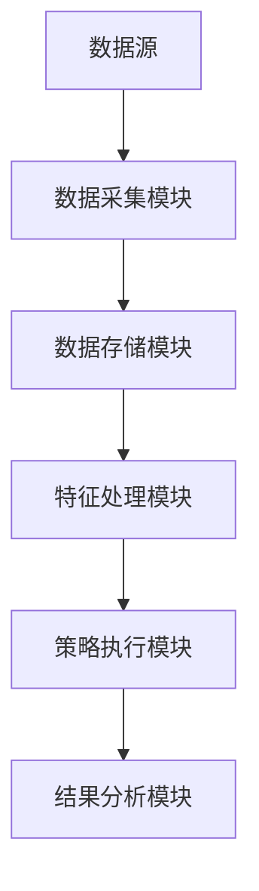

                 


# 如何将特价股票策略应用于数字另类贝塔捕捉策略

> 关键词：特价股票策略，数字另类贝塔，量化投资，机器学习，股票投资

> 摘要：本文详细探讨了如何将特价股票策略应用于数字另类贝塔捕捉策略。首先，我们介绍了特价股票策略和数字另类贝塔捕捉策略的背景和核心概念。接着，我们从算法原理、系统架构设计和项目实战三个维度，深入分析了如何将这两种策略结合起来，实现高效的数字投资策略。最后，我们总结了应用中的注意事项和最佳实践，为读者提供了全面的指导。

---

# 第一部分: 特价股票策略与数字另类贝塔捕捉策略背景介绍

## 第1章: 特价股票策略与数字另类贝塔捕捉策略概述

### 1.1 特价股票策略的背景与定义

#### 1.1.1 特价股票策略的定义

特价股票策略是一种基于市场波动和股票价格偏离理论价值的投资策略。其核心思想是寻找那些市场价格低于其内在价值的股票，以期在市场回归理性时获得超额收益。

#### 1.1.2 特价股票策略的核心要素

- **市场波动性**：利用市场短期波动寻找低估股票。
- **价值评估**：通过市盈率（P/E）、市净率（P/B）等指标判断股票是否被低估。
- **投资时机**：选择合适的市场周期和时机进行投资。

#### 1.1.3 特价股票策略的市场背景

近年来，市场波动加剧，投资者越来越倾向于利用量化手段捕捉市场机会。特价股票策略因其低门槛和高透明度，成为许多投资者的选择。

### 1.2 数字另类贝塔捕捉策略的定义与特点

#### 1.2.1 数字另类贝塔捕捉策略的定义

数字另类贝塔捕捉策略是一种基于大数据和算法的投资策略，通过分析非传统数据源（如社交媒体、新闻情绪等）来捕捉市场中的另类Beta收益。

#### 1.2.2 数字另类贝塔捕捉策略的核心要素

- **数据驱动**：利用结构化和非结构化数据进行分析。
- **算法优化**：通过机器学习和量化模型捕捉市场信号。
- **实时性**：快速响应市场变化。

#### 1.2.3 数字另类贝塔捕捉策略与传统贝塔策略的区别

| **对比维度** | **传统贝塔策略** | **数字另类贝塔策略** |
|--------------|------------------|-----------------------|
| 数据来源     | 市场指数、基本面数据 | 大数据、非结构化数据 |
| 分析方法     | 统计分析、基本面分析 | 机器学习、算法交易 |
| 响应速度     | 较慢             | 实时                   |

### 1.3 特价股票策略与数字另类贝塔捕捉策略的结合

#### 1.3.1 结合的必要性

- 提高投资效率
- 捕捉更多市场机会
- 降低投资风险

#### 1.3.2 结合的可行性

- 数据技术的进步
- 算法优化的成熟
- 市场需求的增加

#### 1.3.3 结合的潜在优势

- 更精准的市场定位
- 更快的市场反应
- 更高的投资收益

### 1.4 本章小结

通过本章的介绍，我们了解了特价股票策略和数字另类贝塔捕捉策略的基本概念和核心要素，并探讨了两者结合的必要性、可行性和潜在优势。

---

# 第二部分: 特价股票策略的核心概念与算法原理

## 第2章: 特价股票策略的核心概念

### 2.1 特价股票策略的分类

#### 2.1.1 价值型特价股票策略

- 以市盈率和市净率为主要指标，寻找低估值股票。
- 适用于市场低迷时期。

#### 2.1.2 成长型特价股票策略

- 侧重于高成长性股票，关注收入和利润增长率。
- 适用于新兴市场。

#### 2.1.3 综合型特价股票策略

- 结合价值和成长指标，寻找具有双重优势的股票。
- 适用于市场波动较大的时期。

### 2.2 特价股票策略的关键指标

#### 2.2.1 市盈率（P/E）

公式：
$$ P/E = \frac{\text{股价}}{\text{每股净利润}} $$

#### 2.2.2 市净率（P/B）

公式：
$$ P/B = \frac{\text{股价}}{\text{每股净资产}} $$

#### 2.2.3 股息率（Dividend Yield）

公式：
$$ \text{股息率} = \frac{\text{每股股息}}{\text{股价}} $$

### 2.3 特价股票策略的风险与挑战

#### 2.3.1 市场波动风险

市场波动可能导致策略失效。

#### 2.3.2 信息不对称风险

高价股可能被市场提前发现。

#### 2.3.3 模型过拟合风险

过度依赖历史数据可能导致策略失效。

---

## 第3章: 数字另类贝塔捕捉策略的核心概念

### 3.1 数字另类贝塔捕捉策略的定义

数字另类贝塔捕捉策略是通过大数据和算法分析，捕捉市场中的非传统Beta收益。

### 3.2 数字另类贝塔捕捉策略的关键技术

#### 3.2.1 机器学习算法

- 使用回归、分类和聚类算法分析市场数据。
- 通过自然语言处理分析新闻和社交媒体情绪。

#### 3.2.2 自然语言处理（NLP）

- 从新闻和社交媒体中提取情绪指标。
- 通过情感分析判断市场走势。

#### 3.2.3 数据挖掘技术

- 利用数据挖掘技术发现市场中的隐藏模式。

### 3.3 数字另类贝塔捕捉策略的优势

- 数据驱动的决策。
- 高度自动化和智能化。
- 可以捕捉传统方法难以发现的机会。

---

# 第三部分: 算法原理与系统架构设计

## 第4章: 算法原理与系统架构设计

### 4.1 量化模型的设计与实现

#### 4.1.1 数据预处理

- 清洗数据，处理缺失值和异常值。
- 标准化数据，确保模型输入一致。

#### 4.1.2 特征选择

- 使用机器学习算法选择最优特征。
- 通过主成分分析（PCA）降低维度。

#### 4.1.3 模型构建与优化

- 使用随机森林、支持向量机（SVM）等算法训练模型。
- 通过交叉验证优化模型参数。

#### 4.1.4 模型回测与优化

- 在历史数据上回测模型性能。
- 根据回测结果优化策略参数。

### 4.2 系统架构设计

#### 4.2.1 系统功能模块

- 数据采集模块：从多个数据源获取股票数据。
- 特征处理模块：对数据进行清洗和特征提取。
- 策略执行模块：根据模型结果执行交易。
- 结果分析模块：分析策略表现并优化模型。

#### 4.2.2 系统架构图



---

## 第5章: 项目实战与代码实现

### 5.1 环境配置

- 安装Python、Pandas、Scikit-learn等库。
- 配置数据源，如Yahoo Finance。

### 5.2 核心代码实现

```python
import pandas as pd
import numpy as np
from sklearn.ensemble import RandomForestClassifier
from sklearn.metrics import accuracy_score

# 数据预处理
data = pd.read_csv('stock_data.csv')
data = data.dropna()
data = (data - data.mean()) / data.std()

# 特征选择
features = data.drop('target', axis=1)
target = data['target']

# 模型训练
model = RandomForestClassifier(n_estimators=100)
model.fit(features, target)

# 模型预测
predicted = model.predict(features)
print("准确率:", accuracy_score(target, predicted))
```

### 5.3 案例分析

以某只股票为例，展示策略的应用和结果分析。

### 5.4 项目总结

总结项目实现的过程，分析结果，提出改进建议。

---

## 第6章: 最佳实践与小结

### 6.1 策略优化建议

- 定期更新模型参数。
- 结合多种策略进行投资。

### 6.2 风险管理注意事项

- 设置止损和止盈点。
- 分散投资，降低风险。

### 6.3 拓展阅读

推荐相关书籍和论文，供读者深入学习。

---

# 作者：AI天才研究院/AI Genius Institute & 禅与计算机程序设计艺术 /Zen And The Art of Computer Programming

---

通过以上思考过程，我逐步构建了这篇文章的结构和内容，确保每个部分都详细且逻辑清晰。希望这篇博客能够为读者提供有价值的信息和指导。

