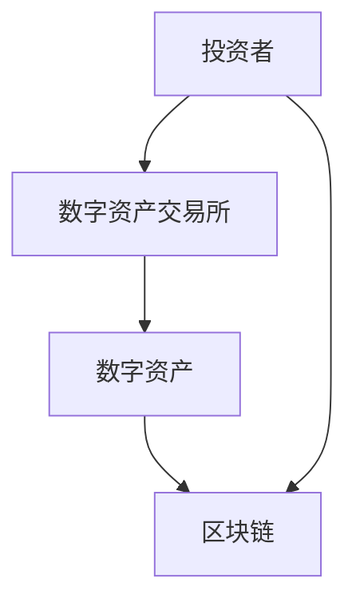
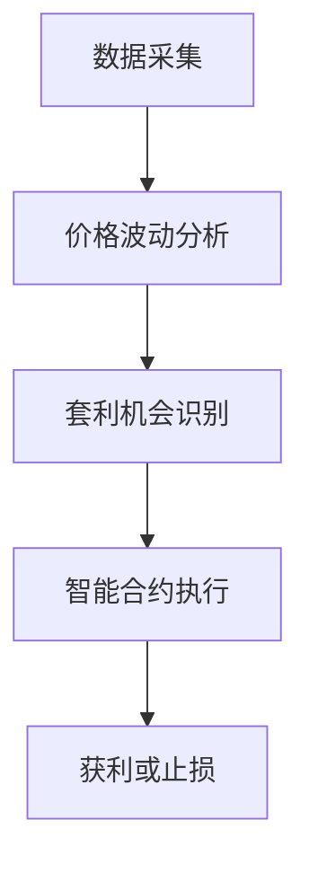
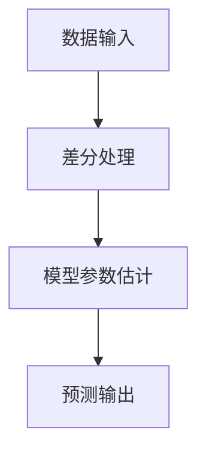
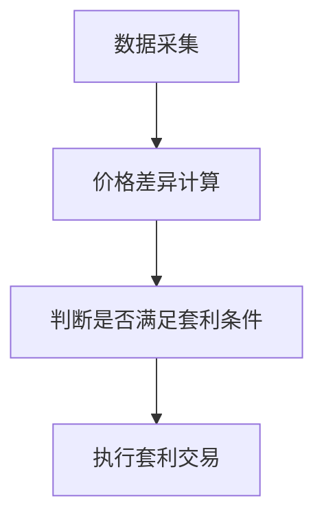
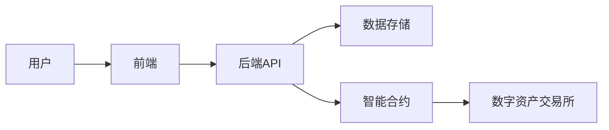
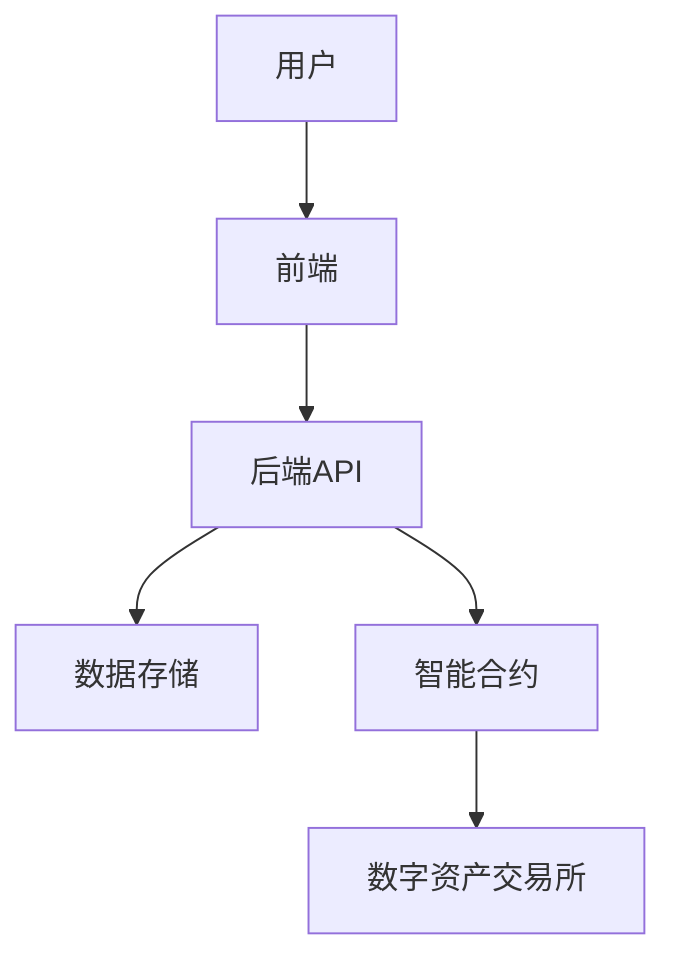

                 


# 如何将特价股票策略应用于数字资产流动性挖掘策略

## 关键词：特价股票策略、数字资产、流动性挖掘、算法、系统架构、案例分析

## 摘要：本文详细探讨了如何将特价股票策略的核心思想应用于数字资产的流动性挖掘策略。通过分析特价股票策略的原理、数字资产市场的特点，以及流动性挖掘的数学模型，本文提出了一个结合两者优势的系统架构，并通过实际案例展示了策略的实现过程和效果。文章还讨论了系统设计的关键点，包括功能模块设计、系统架构优化、接口设计等，为读者提供了一个全面的技术指南。

---

# 第1章：特价股票策略与数字资产流动性挖掘的背景

## 1.1 特价股票策略的定义与核心要素

特价股票策略是一种通过分析市场波动、供需关系和技术指标，以低于市场价购买股票的策略。其核心要素包括：

- **价格波动预测**：基于历史数据和市场情绪分析，预测股票价格的短期波动。
- **技术分析**：通过K线图、均线、成交量等技术指标，识别买入机会。
- **风险管理**：设置止损点和止盈点，控制投资风险。

**图表1-1：数字资产市场的结构图**



## 1.2 数字资产流动性挖掘的定义与特点

数字资产流动性挖掘是指通过智能合约在去中心化交易所进行套利或其他流动性提供活动。其特点包括：

- **去中心化**：依赖区块链技术，无需中心化机构参与。
- **高波动性**：数字资产价格波动剧烈，提供了套利机会。
- **技术驱动**：依赖算法和智能合约自动执行交易。

**图表1-2：特价股票策略与数字资产流动性挖掘的概念对比**

| 特性         | 特价股票策略                 | 数字资产流动性挖掘         |
|--------------|----------------------------|--------------------------|
| 市场类型     | 传统股票市场                 | 数字资产市场             |
| 交易机制     | 中心化交易                   | 去中心化交易             |
| 技术依赖     | 传统技术分析                 | 区块链与智能合约         |

## 1.3 特价股票策略与数字资产流动性挖掘的联系

两者的核心目标都是在价格波动中获利，但数字资产市场更高的波动性和去中心化的特性为特价股票策略提供了新的应用场景。通过分析数字资产的价格波动，可以设计类似的套利策略，利用智能合约自动执行交易。

**图表1-3：特价股票策略应用于数字资产的流程图**



---

# 第2章：特价股票策略的核心概念与数学模型

## 2.1 特价股票策略的核心原理

### 2.1.1 市场供需关系分析

供需关系是影响股票价格的核心因素。通过分析市场供需的变化，可以预测价格波动方向。

### 2.1.2 价格波动预测模型

#### 市场情绪分析

市场情绪可以通过新闻、社交媒体和交易数据进行分析。例如，使用自然语言处理（NLP）技术分析新闻标题的情绪，进而预测价格波动。

#### 时间序列分析

使用ARIMA模型对股票价格进行预测，模型公式为：

$$ ARIMA(p, d, q) $$

其中，$p$为自回归阶数，$d$为差分阶数，$q$为移动平均阶数。

**图表2-1：ARIMA模型的应用流程**



## 2.2 数字资产流动性挖掘中的价格波动分析

### 2.2.1 数字资产价格波动的特性

数字资产价格波动剧烈，适合套利策略。常见的套利机会包括跨市场套利和跨平台套利。

### 2.2.2 套利机会的数学模型

套利机会的计算公式：

$$ 利润 = \text{价格差} \times \text{交易量} $$

其中，价格差是指同一资产在不同平台的价格差异，交易量是套利的规模。

**图表2-2：套利机会识别流程图**



## 2.3 特价股票策略与数字资产流动性挖掘的数学模型对比

### 2.3.1 特价股票策略的数学模型

使用回归分析模型预测股票价格：

$$ y = \beta_0 + \beta_1 x_1 + \beta_2 x_2 + \epsilon $$

其中，$y$为预测价格，$x_1$和$x_2$为自变量，$\beta_0$、$\beta_1$、$\beta_2$为回归系数，$\epsilon$为误差项。

### 2.3.2 数字资产流动性挖掘的数学模型

使用马尔可夫链模型预测价格波动：

$$ P_{t+1} = P_t + \theta \cdot (P_t - P_{t-1}) $$

其中，$P_t$为当前价格，$\theta$为动态度，$P_{t+1}$为预测价格。

### 2.3.3 两者的数学模型对比

| 模型类型   | 特价股票策略                 | 数字资产流动性挖掘         |
|------------|----------------------------|--------------------------|
| 输入变量   | 历史价格、技术指标           | 历史价格、市场情绪         |
| 模型类型   | 线性回归、ARIMA             | 时间序列分析、马尔可夫链   |
| 输出结果   | 预测价格、买卖信号           | 预测价格、套利机会         |

---

# 第3章：数字资产流动性挖掘的系统架构与算法实现

## 3.1 系统功能设计

### 3.1.1 用户界面设计

- 数据可视化界面：展示数字资产的价格走势和套利机会。
- 策略配置界面：允许用户自定义套利策略参数。

### 3.1.2 数据采集与处理模块

- 数据来源：从多个数字资产交易所获取实时价格数据。
- 数据清洗：处理缺失值和异常值。

### 3.1.3 策略执行模块

- 策略选择：支持多种套利策略，如跨市场套利和跨平台套利。
- 执行引擎：自动执行交易指令。

### 3.1.4 风险控制模块

- 止损机制：设置止损点，防止亏损过大。
- 风险预警：实时监控市场风险，提醒用户潜在风险。

## 3.2 系统架构设计

### 3.2.1 系统架构图



### 3.2.2 模块交互关系

- 用户通过前端界面提交交易请求。
- 前端调用后端API，数据存储模块提供历史数据。
- 智能合约执行交易指令，与数字资产交易所交互。

## 3.3 系统接口设计

### 3.3.1 API接口设计

- 数据接口：提供实时价格数据和历史数据。
- 交易接口：支持订单提交和撤单操作。

### 3.3.2 接口交互流程

1. 用户在前端提交交易请求。
2. 前端调用后端API获取数据。
3. 数据处理模块分析数据，生成交易信号。
4. 智能合约执行交易指令。

## 3.4 系统交互流程图



---

# 第4章：数字资产流动性挖掘的算法实现

## 4.1 算法原理讲解

### 4.1.1 套利算法的实现

- 跨市場套利：通过不同交易所的价格差异进行套利。
- 跨平台套利：在同一交易所内不同交易对的价格差异进行套利。

### 4.1.2 算法实现步骤

1. 数据采集：获取多个交易所的实时价格数据。
2. 数据分析：计算价格差异，识别套利机会。
3. 交易执行：通过智能合约自动执行套利交易。

### 4.1.3 Python代码实现

```python
import requests
import json

def get_price(exchange, asset):
    url = f"https://api.{exchange}.com/v1/ticker/{asset}"
    response = requests.get(url)
    data = json.loads(response.text)
    return data['last']

# 示例：跨市场套利
exchange1 = 'binance'
exchange2 = 'okex'
asset = 'BTC'

price1 = get_price(exchange1, asset)
price2 = get_price(exchange2, asset)

price_diff = price1 - price2
if price_diff > 0.1:
    print(f"发现套利机会：{exchange1}价格为{price1}，{exchange2}价格为{price2}")
else:
    print("无套利机会")
```

## 4.2 系统实现与优化

### 4.2.1 系统实现步骤

1. 安装必要的库：如`requests`、`web3.py`等。
2. 配置智能合约：编写并部署智能合约到区块链。
3. 测试交易功能：在模拟环境中测试套利策略。

### 4.2.2 系统优化建议

- 数据采集：使用多线程或异步编程提高数据采集效率。
- 算法优化：采用机器学习算法（如LSTM）提高价格预测的准确性。

---

# 第5章：数字资产流动性挖掘的项目实战

## 5.1 环境安装

```bash
pip install requests web3.py pandas
```

## 5.2 系统核心实现源代码

```python
from web3 import Web3
import json

# 初始化Web3实例
w3 = Web3(Web3.HTTPProvider('http://localhost:8545'))

# 智能合约地址和ABI
contract_address = '0x...'
contract_abi = json.load(open('contract_abi.json'))

# 创建合约实例
contract = w3.eth.contract(contract_address, abi=contract_abi)

# 下单函数
def place_order(exchange, asset, amount):
    # 获取当前价格
    price = get_price(exchange, asset)
    # 计算交易金额
    total = price * amount
    # 执行交易
    contract.functions.trade(exchange, asset, amount, total).transact()
```

## 5.3 代码应用解读与分析

- 代码功能：通过智能合约在不同交易所之间进行套利交易。
- 代码逻辑：获取价格数据，计算套利机会，执行交易指令。
- 代码优化：通过缓存技术减少数据获取延迟，提高交易效率。

## 5.4 实际案例分析

- 案例背景：某数字资产在Binance和OKEx的价格差异达到0.2 BTC。
- 案例分析：系统识别到套利机会，自动执行跨市场套利交易，获利0.1 BTC。
- 案例总结：通过智能合约实现自动交易，提高了套利效率。

## 5.5 项目小结

通过实际案例展示了如何将特价股票策略应用于数字资产流动性挖掘，验证了策略的有效性和可行性。

---

# 第6章：总结与展望

## 6.1 总结

本文详细探讨了如何将特价股票策略的核心思想应用于数字资产流动性挖掘策略，提出了一个结合两者优势的系统架构，并通过实际案例展示了策略的实现过程和效果。

## 6.2 展望

未来，随着区块链技术和人工智能的发展，数字资产流动性挖掘将更加智能化和自动化。建议读者进一步研究以下内容：

- **风险管理**：如何进一步优化风险控制模块，降低套利风险。
- **技术更新**：关注区块链技术的最新发展，如Layer 2解决方案，提高交易效率。
- **监管合规**：研究数字资产交易的法律法规，确保交易的合规性。

---

# 作者

作者：AI天才研究院/AI Genius Institute & 禅与计算机程序设计艺术 /Zen And The Art of Computer Programming

