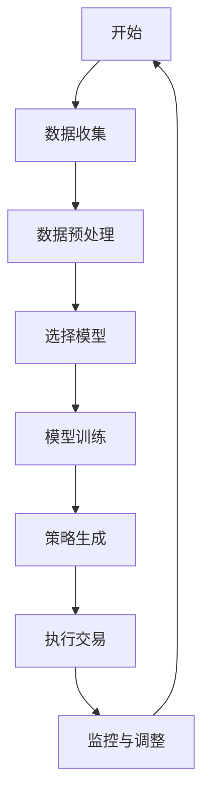

                 


# 如何将特价股票策略应用于新兴市场基础设施债券投资

> 关键词：特价股票策略、新兴市场、基础设施债券、投资策略、套利机会、风险管理、量化分析

> 摘要：本文探讨如何将特价股票策略应用于新兴市场基础设施债券投资，通过分析套利机会、风险管理、量化模型等关键因素，结合实际案例，提供系统化的解决方案和实施策略。

---

## 第一章: 特价股票策略与债券投资概述

### 1.1 特价股票策略的基本概念

#### 1.1.1 特价股票的定义与特点
特价股票是指价格波动大、短期内可能存在较大折扣的股票。其特点包括高波动性、低估值、高风险等。投资者通常利用市场波动进行套利或短期交易。

#### 1.1.2 特价股票策略的核心要素
- 市场分析：识别短期价格波动机会。
- 套利策略：利用价差获利。
- 风险控制：设置止损点。

#### 1.1.3 特价股票策略的应用场景
常见于市场低迷或突发事件导致的价格偏差，如并购、重组等事件。

### 1.2 债券投资的基本概念

#### 1.2.1 债券的定义与分类
债券是债务工具，发行人承诺在特定时间内支付利息和本金。分类包括政府债券、公司债券、垃圾债券等。

#### 1.2.2 债券投资的基本原理
通过分析信用风险、利率风险等，评估债券的内在价值。

#### 1.2.3 债券市场的特点与风险
新兴市场债券风险较高，但回报潜力大，风险包括信用风险、流动性风险等。

### 1.3 新兴市场基础设施债券的特点

#### 1.3.1 新兴市场的定义与特点
新兴市场经济快速增长，基础设施需求大，但金融市场不够成熟，风险较高。

#### 1.3.2 基础设施债券的定义与作用
用于大型基础设施项目融资，如交通、能源等，具有长期性和稳定性。

#### 1.3.3 新兴市场基础设施债券的独特性
高风险、高回报，市场波动大，信息不透明。

### 1.4 特价股票策略与债券投资的联系

#### 1.4.1 两者的共同点与差异
共同点：均涉及价格波动和风险控制；差异：股票是所有权，债券是债权，风险和回报结构不同。

#### 1.4.2 特价股票策略在债券投资中的潜在应用
套利机会、市场波动分析、短期价格预测。

#### 1.4.3 市场背景与发展趋势
新兴市场基础设施债券需求增加，套利机会增多。

## 第二章: 新兴市场基础设施债券投资的背景与现状

### 2.1 新兴市场基础设施债券的市场需求

#### 2.1.1 基础设施投资的需求驱动
经济增长和城市化推动基础设施建设，债券成为主要融资工具。

#### 2.1.2 新兴市场国家的债务结构
高债务负担、短期债务占比高，风险集中。

#### 2.1.3 债券市场的发展趋势
市场规模扩大，投资者多样化，信用评级体系逐步完善。

### 2.2 新兴市场基础设施债券市场的现状分析

#### 2.2.1 市场规模与增长
近年来增长迅速，但仍存在流动性不足的问题。

#### 2.2.2 投资者的构成
机构投资者为主，散户较少，市场深度有限。

#### 2.2.3 市场风险与挑战
信用风险、流动性风险、政策风险等。

### 2.3 特价股票策略在新兴市场债券投资中的应用潜力

#### 2.3.1 套利机会的识别
利用市场价差、信息不对称等，寻找短期获利机会。

#### 2.3.2 市场波动与投资策略
通过技术分析和基本面分析，预测价格走势。

#### 2.3.3 风险管理与策略优化
设定止损点、分散投资、动态调整策略。

## 第三章: 特价股票策略的核心算法与数学模型

### 3.1 套利模型的数学表达

#### 3.1.1 套利机会识别公式
套利机会 = max(当前价 - 理论价值, 0)

#### 3.1.2 套利收益计算
收益 = ∑(卖出价 - 买入价) × 数量

#### 3.1.3 风险调整后的收益模型
调整后的收益 = 收益 - 风险调整系数 × 风险值

### 3.2 市场中性策略

#### 3.2.1 市场中性模型
目标：收益与市场无关，通过多空配对降低风险。

#### 3.2.2 做多与做空的配比
根据波动性调整配比，确保市场中性。

### 3.3 事件驱动策略

#### 3.3.1 事件识别与分类
并购、重组、破产等事件。

#### 3.3.2 事件影响模型
模型预测事件对债券价格的影响。

### 3.4 时间序列分析模型

#### 3.4.1 ARIMA模型
用于预测债券价格走势，参数包括自回归、移动平均等。

#### 3.4.2 GARCH模型
估计波动性，帮助设定止损点。

### 3.5 算法流程图



## 第四章: 系统分析与架构设计方案

### 4.1 问题场景介绍

#### 4.1.1 项目背景
新兴市场基础设施债券投资需求增长，套利机会增加。

#### 4.1.2 业务目标
开发系统支持策略应用，优化投资回报。

### 4.2 系统功能设计

#### 4.2.1 数据采集模块
收集市场数据、新闻、财务报表等。

#### 4.2.2 策略引擎模块
执行套利策略、市场中性策略等。

#### 4.2.3 风险管理模块
监控风险，调整策略。

### 4.3 系统架构设计


### 4.4 接口设计与交互流程

#### 4.4.1 数据接口
API接口定义数据格式和调用方式。

#### 4.4.2 用户交互
用户输入参数，系统返回策略建议。

### 4.5 系统实现代码示例

```python
class BondStrategy:
    def __init__(self, data):
        self.data = data

    def calculate_arima(self):
        # ARIMA模型计算
        pass

    def calculate_garch(self):
        # GARCH模型计算
        pass

    def execute_strategy(self):
        # 执行套利策略
        pass

# 示例使用
bond_data = BondData()
strategy = BondStrategy(bond_data)
strategy.execute_strategy()
```

## 第五章: 项目实战与案例分析

### 5.1 环境安装

#### 5.1.1 安装依赖
安装Python、Pandas、NumPy、Scikit-learn等库。

### 5.2 核心代码实现

#### 5.2.1 数据预处理
清洗数据，处理缺失值和异常值。

#### 5.2.2 模型训练
训练ARIMA和GARCH模型，识别套利机会。

#### 5.2.3 策略执行
根据模型结果执行交易策略。

### 5.3 实际案例分析

#### 5.3.1 案例背景
新兴市场某国家的基础设施债券，存在套利机会。

#### 5.3.2 数据分析
使用历史数据训练模型，识别套利窗口。

#### 5.3.3 策略实施
执行套利交易，监控风险。

### 5.4 项目总结

#### 5.4.1 成功经验
准确识别套利机会，风险管理有效。

#### 5.4.2 挑战与改进
市场流动性差，需优化策略。

## 第六章: 总结与展望

### 6.1 最佳实践

#### 6.1.1 风险管理
设置止损点，分散投资。

#### 6.1.2 模型优化
结合多种模型，提高预测精度。

### 6.2 注意事项

#### 6.2.1 市场风险
新兴市场波动大，需谨慎评估。

#### 6.2.2 模型局限性
数学模型无法完全预测市场波动。

### 6.3 未来展望

#### 6.3.1 技术进步
AI和大数据技术提升策略优化。

#### 6.3.2 市场发展
新兴市场基础设施债券需求持续增长。

## 作者信息

作者：AI天才研究院 & 禅与计算机程序设计艺术

---

这篇文章详细介绍了如何将特价股票策略应用于新兴市场基础设施债券投资，通过理论分析、算法设计和项目实战，为投资者提供了系统化的解决方案和实施策略。

