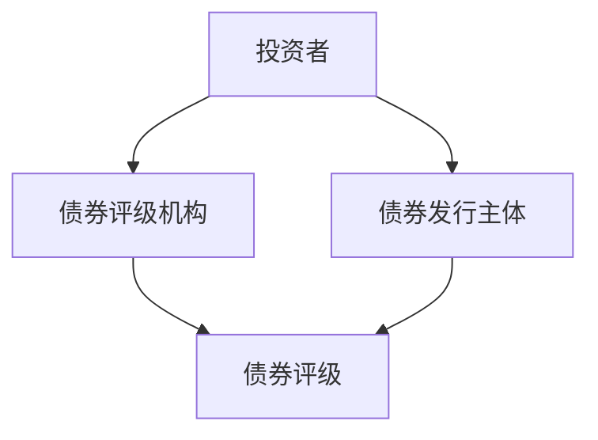
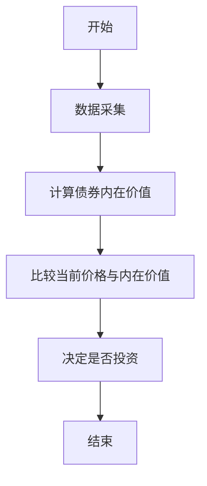
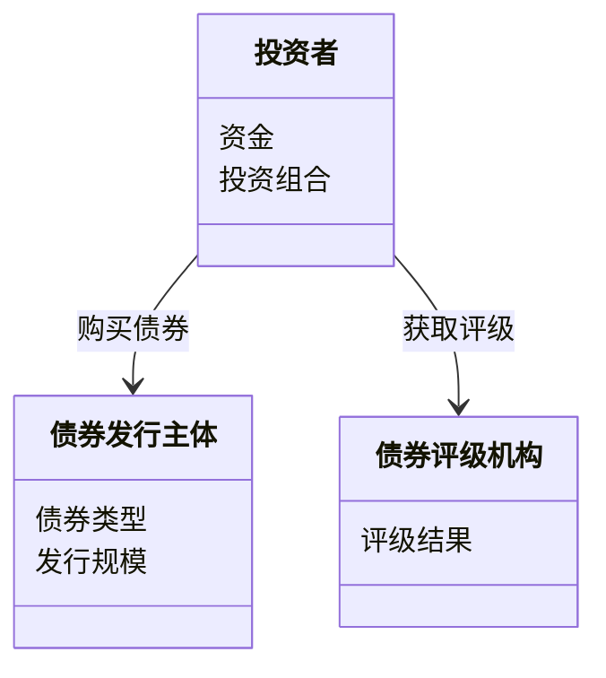
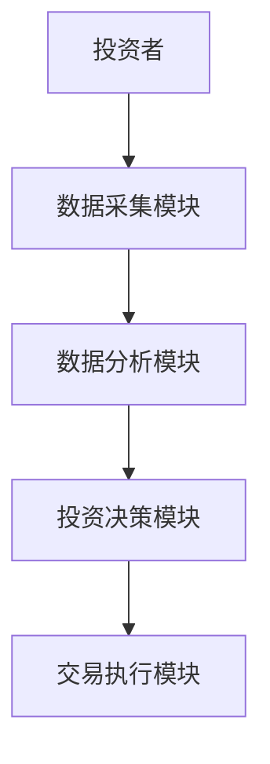
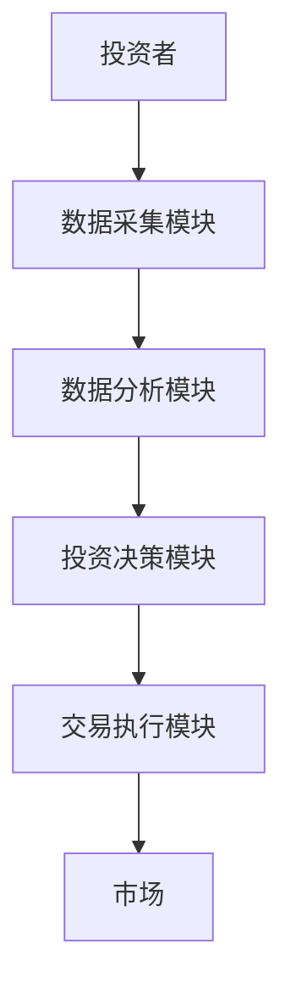

                 


# 如何将特价股票策略应用于新兴市场数字公共基础设施债券投资

> 关键词：特价股票策略，新兴市场，数字公共基础设施，债券投资，算法交易

> 摘要：本文详细探讨了如何将特价股票策略应用于新兴市场数字公共基础设施债券投资。通过分析债券的基本特征、市场波动和投资策略，结合数学模型和算法实现，构建了一个投资决策支持系统，指导读者在新兴市场中利用特价策略进行债券投资，提升投资回报。

---

## 第一部分：特价股票策略与新兴市场数字公共基础设施债券投资背景

### 第1章：特价股票策略概述

#### 1.1 特价股票策略的定义与特点

##### 1.1.1 特价股票的定义
特价股票是指市场价格低于其内在价值的股票，通常由于市场波动或信息不对称导致的价格低估。

##### 1.1.2 特价股票策略的核心特点
- **低估值**：市场价格低于公允价值。
- **高回报潜力**：潜在的上涨空间。
- **逆向投资**：在市场低谷时买入，市场高点时卖出。

##### 1.1.3 特价股票策略的适用场景
- 市场低迷期。
- 个股或板块被市场错估的情况。

#### 1.2 特价股票策略的历史与发展

##### 1.2.1 特价股票策略的起源
起源于价值投资理念，强调寻找被市场低估的投资标的。

##### 1.2.2 特价股票策略在不同市场周期的表现
- 在市场低谷期表现优异。
- 在市场高峰期可能表现不佳。

##### 1.2.3 特价股票策略的演变与创新
结合技术分析和大数据分析，形成多策略投资组合。

### 第2章：新兴市场数字公共基础设施债券概述

#### 2.1 新兴市场的定义与特点

##### 2.1.1 新兴市场的经济特征
- 经济快速增长。
- 市场流动性相对较低。

##### 2.1.2 新兴市场的金融体系特点
- 市场波动较大。
- 信息透明度相对较低。

##### 2.1.3 新兴市场数字公共基础设施的现状
- 数字化转型需求迫切。
- 基础设施投资需求旺盛。

#### 2.2 数字公共基础设施债券的定义与分类

##### 2.2.1 数字公共基础设施债券的定义
用于支持数字基础设施建设的债券，如5G网络、数据中心等。

##### 2.2.2 数字公共基础设施债券的分类
- 按发行主体：政府债券、企业债券。
- 按期限：短期债券、长期债券。

#### 2.3 数字公共基础设施债券的发行主体与用途

##### 2.3.1 发行主体
- 政府机构。
- 通信公司。
- 数据中心运营商。

##### 2.3.2 债券用途
- 基础设施建设。
- 技术研发。
- 项目融资。

### 第3章：特价股票策略与数字公共基础设施债券的结合

#### 3.1 特价股票策略在债券投资中的应用潜力

##### 3.1.1 特价股票策略的核心逻辑在债券投资中的适用性
- 寻找低估债券，提高投资回报。
- 通过市场波动获利。

##### 3.1.2 数字公共基础设施债券的市场波动特性
- 市场波动大，存在低估机会。
- 受政策和技术影响较大。

##### 3.1.3 特价股票策略在债券投资中的创新应用
- 将债券视为“股票”，寻找价值低估的债券。
- 结合债券评级和市场估值进行投资决策。

## 第二部分：核心概念与联系

### 第4章：核心概念与联系

#### 4.1 核心概念原理

##### 4.1.1 债券评级
债券评级反映了债券的信用风险，是评估债券价值的重要指标。

##### 4.1.2 市场流动性
流动性影响债券的价格和交易成本，流动性差的债券可能被低估。

#### 4.2 核心概念属性特征对比表格

| 特性       | 债券评级 | 市场流动性 | 债券价格 | 投资策略 |
|------------|----------|------------|----------|----------|
| 低估值     | 高       | 低         | 低       | 适用     |
| 高风险     | 低       | 高         | 高       | 不适用   |

#### 4.3 ER实体关系图



## 第三部分：算法原理讲解

### 第5章：算法原理讲解

#### 5.1 算法流程图



#### 5.2 数学模型与公式

债券内在价值公式：
$$ V = \frac{C}{(1 + r)^n} $$
其中：
- \( C \) 是债券的面值。
- \( r \) 是市场利率。
- \( n \) 是债券期限。

#### 5.3 Python实现代码

```python
def calculate_bond_value(face_value, market_rate, years):
    return face_value / (1 + market_rate) ** years

# 示例
face_value = 1000
market_rate = 0.05
years = 10
intrinsic_value = calculate_bond_value(face_value, market_rate, years)
print(f"债券的内在价值为：{intrinsic_value}")
```

## 第四部分：系统分析与架构设计

### 第6章：系统分析与架构设计

#### 6.1 问题场景介绍

#### 6.2 项目介绍

#### 6.3 系统功能设计

##### 6.3.1 领域模型类图



#### 6.4 系统架构设计

##### 6.4.1 系统架构图



#### 6.5 系统接口设计

##### 6.5.1 接口描述
- 数据采集模块接口：从市场获取债券数据。
- 数据分析模块接口：分析债券价值。
- 投资决策模块接口：生成投资建议。
- 交易执行模块接口：执行交易指令。

#### 6.6 系统交互流程图



## 第五部分：项目实战

### 第7章：项目实战

#### 7.1 环境安装

##### 7.1.1 安装Python和必要的库
```bash
pip install pandas numpy matplotlib
```

#### 7.2 系统核心实现

##### 7.2.1 数据采集模块
```python
import pandas as pd

def fetch_bond_data():
    # 示例代码，从数据源获取债券数据
    data = pd.DataFrame({'债券代码': ['B1', 'B2', 'B3'], '当前价格': [90, 100, 85]})
    return data

# 示例
bond_data = fetch_bond_data()
print(bond_data)
```

##### 7.2.2 数据分析模块
```python
import numpy as np

def calculate_intrinsic_value(data, market_rate):
    data['内在价值'] = data['当前价格'] / (1 + market_rate) ** data['期限']
    return data

# 示例
market_rate = 0.05
bond_data = fetch_bond_data()
bond_data = calculate_intrinsic_value(bond_data, market_rate)
print(bond_data)
```

##### 7.2.3 投资决策模块
```python
def generate_recommendation(data):
    recommendation = []
    for bond in data.iterrows():
        if bond['内在价值'] > bond['当前价格']:
            recommendation.append(bond['债券代码'])
    return recommendation

# 示例
recommendations = generate_recommendation(bond_data)
print(f"推荐投资的债券为：{recommendations}")
```

##### 7.2.4 交易执行模块
```python
def execute_trade(bond_code, action):
    # 示例代码，执行买入或卖出操作
    print(f"执行{action}操作，债券代码：{bond_code}")

# 示例
for code in recommendations:
    execute_trade(code, '买入')
```

#### 7.3 项目小结
通过项目实战，读者可以理解如何将特价股票策略应用于债券投资，并实际操作相关算法。

## 第六部分：最佳实践、小结、注意事项、拓展阅读

### 第8章：最佳实践

#### 8.1 数据来源选择
建议使用多个数据源，提高数据准确性。

#### 8.2 模型参数调整
根据市场变化，动态调整模型参数。

#### 8.3 风险控制
设置止损点，控制投资风险。

### 8.4 小结

通过本文的详细讲解，读者可以系统地了解如何将特价股票策略应用于新兴市场数字公共基础设施债券投资，并通过实际案例和系统架构设计提升投资效果。

### 8.5 注意事项

- 定期评估模型表现。
- 关注市场变化和政策调整。
- 保持投资组合的分散性。

### 8.6 拓展阅读

- 《投资学基础》
- 《算法交易与量化投资》
- 《新兴市场投资策略》

---

# 作者：AI天才研究院/AI Genius Institute & 禅与计算机程序设计艺术 /Zen And The Art of Computer Programming

