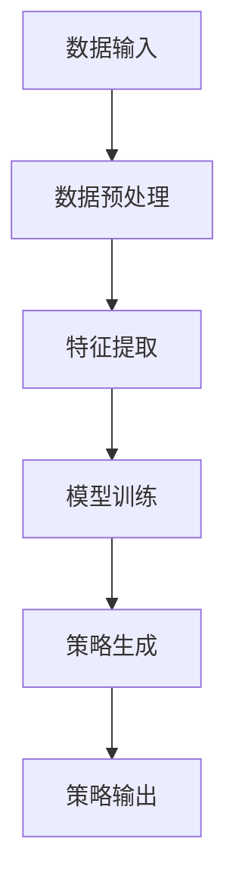

                 


```markdown
# 如何将特价股票策略应用于新兴市场数字公共服务代币投资

> 关键词：特价股票策略，新兴市场，数字公共服务代币，投资策略，量化分析，风险管理

> 摘要：本文详细探讨了如何将特价股票策略应用于新兴市场数字公共服务代币投资。通过分析特价股票策略的核心原理、数学模型和算法流程，结合新兴市场数字代币投资的特点和风险，提出了一个完整的系统架构与实现方案。文章还提供了具体的项目实战案例，展示了如何通过Python代码实现策略，并通过回测分析验证其有效性。最后，本文总结了策略的应用过程，并展望了未来的发展方向。

---

# 第一部分: 特价股票策略与新兴市场数字代币投资概述

## 第1章: 特价股票策略与新兴市场数字代币投资概述

### 1.1 数字代币投资的背景与现状

#### 1.1.1 数字代币的定义与特点
数字代币是一种基于区块链技术的数字化资产，具有去中心化、透明性和不可篡改的特点。新兴市场中的数字代币投资近年来快速增长，但由于市场波动大、监管不完善，投资风险较高。

#### 1.1.2 新兴市场的数字代币投资环境
新兴市场通常具有较高的经济增长潜力，但也伴随着较大的市场波动和政策不确定性。数字代币在新兴市场的普及和应用为投资者提供了新的机会，但也带来了更多的挑战。

#### 1.1.3 特价股票策略的基本概念
特价股票策略是一种基于价格波动和技术分析的投资策略，旨在通过识别股票价格的短期波动来获取超额收益。该策略通常结合了多种技术指标和市场数据，适用于高频交易和短期投资。

### 1.2 特价股票策略的核心原理

#### 1.2.1 特价股票策略的定义
特价股票策略是一种基于价格波动和市场情绪的量化投资策略，旨在通过高频交易和算法交易捕捉市场中的短期价格波动。

#### 1.2.2 特价股票策略的核心要素
- 数据采集与处理：包括市场数据、新闻数据、社交媒体数据等。
- 指标设计：如移动平均线、相对强弱指数（RSI）、布林带等。
- 策略执行：通过算法交易系统快速下单和撤单。

#### 1.2.3 特价股票策略与传统股票投资的区别
- 传统股票投资注重长期价值，而特价股票策略注重短期价格波动。
- 传统股票投资依赖基本面分析，而特价股票策略依赖技术分析和量化模型。

### 1.3 新兴市场数字代币投资的特点

#### 1.3.1 新兴市场的特点
- 市场波动大：新兴市场的经济基础较弱，容易受到外部环境的影响。
- 政策不确定性：新兴市场的政策法规不完善，容易受到政策变化的影响。
- 市场流动性低：新兴市场的交易量相对较小，市场深度不足。

#### 1.3.2 数字代币在新兴市场的应用
- 支付与结算：数字代币可以作为新兴市场的支付工具，降低交易成本。
- 金融服务：数字代币可以为新兴市场中的中小企业提供融资渠道。
- 投资工具：数字代币为投资者提供了新的投资机会。

#### 1.3.3 新兴市场数字代币投资的风险与机遇
- 风险：市场波动大、政策风险高、流动性不足。
- 机遇：新兴市场增长潜力大，数字代币的应用前景广阔。

### 1.4 本章小结
本章介绍了数字代币投资的背景与现状，分析了特价股票策略的核心原理，并探讨了新兴市场数字代币投资的特点和风险。通过这些分析，为后续策略的应用奠定了基础。

---

# 第二部分: 特价股票策略的核心原理与数学模型

## 第2章: 特价股票策略的核心原理

### 2.1 特价股票策略的数学模型

#### 2.1.1 特价股票策略的数学表达式
特价股票策略的收益可以表示为：
$$ \text{收益} = \sum_{i=1}^{n} (p_i - p_{i-1}) \times q_i $$
其中，\( p_i \) 是第 \( i \) 个时间点的价格，\( q_i \) 是第 \( i \) 个时间点的交易量。

#### 2.1.2 特价股票策略的优化模型
为了提高策略的收益，可以通过优化模型来调整交易参数，例如：
$$ \max \sum_{i=1}^{n} (p_i - p_{i-1}) \times q_i $$
受制于：
$$ \sum_{i=1}^{n} q_i \leq Q $$
其中，\( Q \) 是总交易量。

#### 2.1.3 特价股票策略的评估指标
常用的评估指标包括：
- 净收益（Net Profit）
- 收益率（Return Rate）
- 风险调整后收益（Risk-Adjusted Return）

### 2.2 特价股票策略的算法流程

#### 2.2.1 算法流程图


#### 2.2.2 特价股票策略的Python实现
```python
import pandas as pd
import numpy as np

# 数据预处理
data = pd.read_csv('market_data.csv')
data = data.dropna()

# 特征提取
features = data[['open', 'high', 'low', 'close', 'volume']]
target = data['label']

# 模型训练
from sklearn.model

