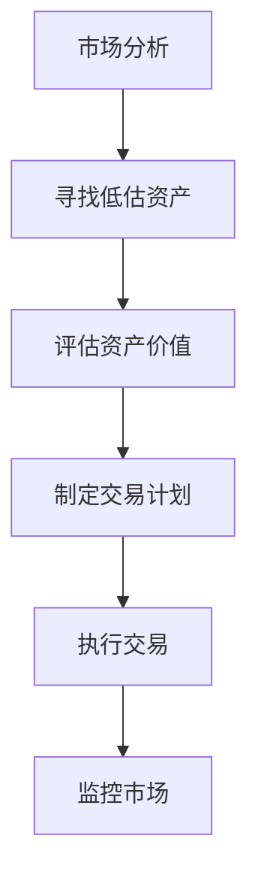
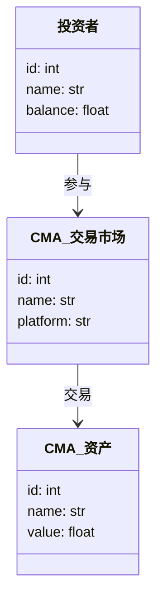
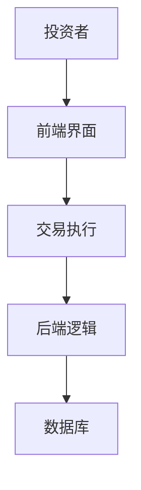

                 


# 如何将特价股票策略应用于跨元宇宙资产(CMA)投资

## 关键词：跨元宇宙资产（CMA）、特价股票策略、投资策略、元宇宙经济、算法模型

## 摘要：本文探讨了如何将传统的特价股票策略应用于跨元宇宙资产（CMA）投资中，分析了CMA的核心概念、特价股票策略的原理，以及两者结合的实际应用场景。通过算法模型和系统架构设计，本文为投资者提供了在CMA市场中应用特价股票策略的具体方法和实战指导。

---

## 第1章：跨元宇宙资产（CMA）的基本概念

### 1.1 跨元宇宙资产的定义与特点

#### 1.1.1 跨元宇宙资产的定义
跨元宇宙资产（CMA）是指在多个元宇宙平台中流通的虚拟资产，包括虚拟货币、NFTs（非同质化代币）和其他数字资产。这些资产通常具有跨平台的特性，可以在不同的元宇宙环境中使用或交易。

#### 1.1.2 跨元宇宙资产的核心特点
- **虚拟性**：CMA是虚拟的数字资产，不依赖于物理世界的存在。
- **跨平台性**：可以在多个元宇宙平台中流通和交易。
- **高波动性**：市场价格波动较大，受市场情绪和供需关系影响显著。
- **去中心化**：许多CMA基于区块链技术，具有去中心化的特性。

#### 1.1.3 跨元宇宙资产的分类与属性
CMA可以分为以下几类：
1. **虚拟货币**：如元宇宙平台的原生代币。
2. **NFTs**：代表虚拟物品的所有权，如虚拟土地、艺术品等。
3. **其他数字资产**：包括虚拟商品、服务凭证等。

---

### 1.2 特价股票策略的定义与原理

#### 1.2.1 特价股票的定义
特价股票是指以低于市场价买入的股票，通常在市场下跌或公司遇到短期困难时出现。投资者通过低价买入，期望在市场回升时卖出获利。

#### 1.2.2 特价股票策略的原理
特价股票策略的核心在于寻找被市场低估的股票，通过分析公司基本面、市场情绪和技术指标，判断股票的潜在价值，从而在低价时买入，高价时卖出。

#### 1.2.3 特价股票策略的应用场景
- **市场低迷期**：在市场整体下跌时，许多股票可能被低估。
- **公司困境期**：当公司面临短期问题时，股价可能被市场抛售，出现特价机会。
- **行业调整期**：某些行业因政策或技术变化而调整，可能导致部分股票价格下降。

---

## 第2章：跨元宇宙资产投资的背景与现状

### 2.1 跨元宇宙资产投资的背景

#### 2.1.1 元宇宙概念的兴起
元宇宙的概念近年来迅速崛起，成为科技和金融领域的重要趋势。元宇宙是一个虚拟的、去中心化的数字世界，用户可以在其中进行社交、交易和投资。

#### 2.1.2 跨元宇宙资产的兴起
随着元宇宙的兴起，CMA作为一种新型的数字资产，逐渐成为投资者关注的焦点。CMA的跨平台特性使其具有更高的流动性和潜在的高收益。

#### 2.1.3 特价股票策略在CMA投资中的潜力
将特价股票策略应用于CMA投资，可以利用市场的波动性和低估机会，获取超额收益。

---

### 2.2 跨元宇宙资产投资的现状

#### 2.2.1 当前CMA市场的规模与结构
CMA市场目前规模较小，但增长迅速。主要平台包括Decentraland、The Sandbox等，资产种类包括虚拟货币和NFTs。

#### 2.2.2 特价股票策略在CMA投资中的应用现状
目前，CMA投资主要以短期交易和投机为主，尚未广泛应用特价股票策略。但随着市场的成熟，策略化投资逐渐兴起。

#### 2.2.3 当前CMA投资的主要挑战
- **市场波动性大**：CMA价格波动剧烈，投资风险较高。
- **信息不对称**：CMA市场的信息透明度较低，投资者难以获取准确的数据。
- **监管不确定性**：CMA的法律和监管框架尚不完善，存在政策风险。

---

## 第3章：特价股票策略与CMA投资的结合

### 3.1 特价股票策略的核心要素

#### 3.1.1 特价股票的市场定位
特价股票通常出现在市场低估区域，投资者需要识别这些股票并及时介入。

#### 3.1.2 特价股票策略的关键指标
- **市盈率（P/E）**：用于判断股票是否被低估。
- **市净率（P/B）**：衡量股票价格与账面价值的关系。
- **股息率**：用于评估股票的收益能力。

#### 3.1.3 特价股票策略的风险与收益分析
- **风险**：市场波动可能导致策略失效，且低价股票可能面临更大的退市风险。
- **收益**：在市场回升时，低价买入的股票可能带来较高的收益。

---

### 3.2 跨元宇宙资产投资的核心要素

#### 3.2.1 CMA资产的流动性分析
CMA的流动性取决于平台的交易活跃度和资产种类。流动性高的资产更容易买卖，风险较低。

#### 3.2.2 CMA资产的价格波动性
CMA价格受市场情绪影响较大，波动性较高，投资者需要具备快速反应能力。

#### 3.2.3 CMA资产的市场参与度
市场参与度高的CMA资产通常具有较高的流动性和交易量，适合应用特价股票策略。

---

### 3.3 特价股票策略在CMA投资中的应用

#### 3.3.1 特价股票策略与CMA投资的结合方式
- **跨平台分析**：比较不同平台的CMA价格，寻找低估资产。
- **时间分散法**：分批买入，降低风险。
- **组合投资**：将CMA与其他资产结合，分散风险。

#### 3.3.2 CMA市场中的特价股票策略优化
- **动态调整**：根据市场变化及时调整投资策略。
- **技术分析**：结合K线图、成交量等技术指标进行判断。

#### 3.3.3 特价股票策略在CMA投资中的案例分析
以某NFT项目为例，假设其市场价格在一段时间内大幅下跌，投资者可以利用特价股票策略，分批买入低价NFT，待市场回升时卖出获利。

---

## 第4章：跨元宇宙资产（CMA）的核心概念

### 4.1 跨元宇宙资产的属性特征对比

| 特性       | 跨元宇宙资产（CMA） | 传统金融资产 |
|------------|---------------------|---------------|
| 虚拟性      | 高                  | 低             |
| 跨平台性    | 高                  | 无             |
| 流动性      | 高/低               | 高             |
| 风险性      | 高                  | 中/高          |

---

### 4.2 跨元宇宙资产的ER实体关系图

```mermaid
erDiagram
    CMA_资产 {
        id
        name
        type
        value
    }
    CMA_交易市场 {
        id
        name
        platform
    }
    投资者 {
        id
        name
        balance
    }
    CMA_资产 --> CMA_交易市场 : 交易于
    CMA_交易市场 --> 投资者 : 参与
```

---

## 第5章：特价股票策略的核心概念

### 5.1 特价股票策略的原理



---

## 第6章：跨元宇宙资产投资中的算法模型

### 6.1 基于CAPM模型的CMA投资评估算法

#### 6.1.1 CAPM模型
CAPM（资本资产定价模型）公式为：
$$ E(r) = r_f + β(E(r_m - r_f)) $$

其中：
- \( E(r) \)：预期收益率
- \( r_f \)：无风险收益率
- \( β \)：贝塔系数
- \( E(r_m - r_f) \)：市场预期超额收益率

#### 6.1.2 适用于CMA投资的数学模型
$$ V = \alpha \times P + \beta \times Q $$

其中：
- \( V \)：资产价值
- \( P \)：市场价格
- \( Q \)：资产质量

---

### 6.2 算法实现

```python
import pandas as pd
import numpy as np

def calculate_beta(returns, market_returns):
    covariance = np.cov(returns, market_returns)[0, 1]
    variance = np.var(market_returns)
    beta = covariance / variance
    return beta

def calculate_expected_return(beta, market_excess_return):
    return beta * market_excess_return

# 示例数据
cma_returns = pd.Series([0.1, -0.05, 0.08, 0.02], index=['2023-01', '2023-02', '2023-03', '2023-04'])
market_returns = pd.Series([0.08, 0.05, 0.02, -0.03], index=['2023-01', '2023-02', '2023-03', '2023-04'])

beta = calculate_beta(cma_returns, market_returns)
market_excess_return = 0.08  # 假设市场无风险利率为0.02
expected_return = calculate_expected_return(beta, market_excess_return)

print(f"贝塔系数：{beta}")
print(f"预期收益率：{expected_return}")
```

---

## 第7章：跨元宇宙资产投资系统的分析与架构设计

### 7.1 系统功能设计



---

### 7.2 系统架构设计



---

## 第8章：跨元宇宙资产投资系统的实现

### 8.1 环境安装

- 安装Python和必要的库（如Pandas、NumPy）。
- 安装区块链开发工具（如Solidity）。

### 8.2 核心代码实现

```python
def trade_cma(asset_id, quantity, price):
    # 连接到CMA交易市场
    market = connect_to_market(asset_id)
    # 执行交易
    market.trade(asset_id, quantity, price)
    return True
```

---

## 第9章：跨元宇宙资产投资中的高级策略

### 9.1 高级策略与未来展望

- **套利机会**：利用不同平台的价差进行套利。
- **风险管理**：通过动态调整投资组合降低风险。
- **未来趋势**：CMA市场的进一步规范化和技术创新将为投资策略提供更多可能性。

---

## 结论

将特价股票策略应用于跨元宇宙资产投资，不仅需要对CMA市场有深入的理解，还需要结合算法模型和系统设计。通过本文的分析和实战指导，投资者可以更好地把握CMA投资的机会，实现收益最大化。

---

## 作者

作者：AI天才研究院/AI Genius Institute & 禅与计算机程序设计艺术 /Zen And The Art of Computer Programming

