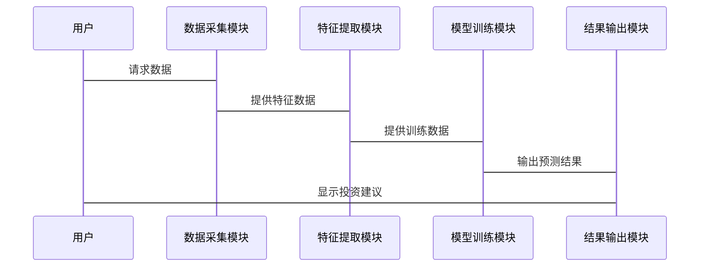

                 


# 如何将特价股票策略应用于非同质化代币(NFT)投资

> 关键词：特价股票策略, NFT投资, 投资策略, 技术分析, 数学模型

> 摘要：本文将详细介绍如何将特价股票策略应用于非同质化代币(NFT)投资。首先，我们将探讨特价股票策略的核心概念与NFT投资的基本原理，分析两者的结合点。接着，我们将深入研究NFT市场中的套利机会，构建基于特价股票策略的数学模型，并通过算法实现这些模型。最后，我们将通过实际案例分析，展示如何在NFT投资中应用这些策略，并总结最佳实践与注意事项。

---

# 第一部分: 特价股票策略与NFT投资的结合

## 第1章: 特价股票策略与NFT投资的背景介绍

### 1.1 特价股票策略的基本概念
#### 1.1.1 什么是特价股票策略
特价股票策略是一种基于市场分析和价格波动的投资策略，旨在通过识别短期价格波动和套利机会来实现超额收益。其核心在于利用市场的短期不均衡，快速捕捉价格差。

#### 1.1.2 特价股票策略的核心要素
- 市场分析：包括技术分析和基本面分析。
- 价格波动：利用短期价格波动进行套利。
- 套利机会：通过价格差实现盈利。

#### 1.1.3 特价股票策略的应用场景
- 股票市场：通过技术指标寻找买卖信号。
- 期货市场：利用价差进行套利。
- 加密货币市场：基于波动性进行投资。

### 1.2 NFT投资的基本概念
#### 1.2.1 什么是NFT
NFT（Non-Fungible Token，非同质化代币）是一种基于区块链技术的数字资产，具有唯一性和不可分割性。每个NFT都代表特定的数字资产或权利，具有明确的所有权和使用权限。

#### 1.2.2 NFT的特性与优势
- 不可替代性：每个NFT都是独一无二的。
- 可追溯性：区块链技术确保NFT的来源和交易历史可追踪。
- 去中心化：NFT的交易和所有权不受中心化机构控制。

#### 1.2.3 NFT投资的现状与趋势
- 市场增长迅速：NFT市场近年来发展迅猛。
- 投资方式多样化：包括购买数字艺术品、虚拟土地等。
- 风险与收益并存：NFT投资具有高波动性和高风险。

### 1.3 特价股票策略与NFT投资的结合
#### 1.3.1 结合的背景与动机
随着NFT市场的兴起，投资者开始寻找新的投资策略。特价股票策略作为一种成熟的投资方法，其技术分析和套利思路可以借鉴到NFT投资中。

#### 1.3.2 结合的可行性分析
- NFT市场的价格波动与股票市场有相似之处。
- 技术分析工具可以应用于NFT价格预测。
- 套利机会在NFT市场中同样存在。

#### 1.3.3 结合的核心目标
通过将特价股票策略的核心思想应用到NFT投资中，寻找套利机会，优化投资组合，实现超额收益。

---

## 第2章: 特价股票策略与NFT投资的核心概念与联系

### 2.1 特价股票策略的原理
#### 2.1.1 市场分析与趋势预测
- 技术分析：通过K线图、均线、MACD等指标预测价格走势。
- 基本面分析：分析公司财务状况、行业趋势等。

#### 2.1.2 技术指标与套利机会
- 常用技术指标：如RSI、MACD、布林带等。
- 套利机会：通过价差在不同市场间获利。

#### 2.1.3 特价股票策略的数学模型
- 时间序列分析：用于预测价格走势。
- 相关系数分析：用于判断资产之间的相关性。

### 2.2 NFT投资的核心原理
#### 2.2.1 NFT价格波动的影响因素
- 市场供需：市场热度、交易量影响价格。
- 创作者影响力：知名创作者的作品价格更高。
- 市场情绪：投资者情绪波动影响价格。

#### 2.2.2 NFT市场的供需关系
- 供给：NFT的发行量和创作者数量。
- 需求：市场需求和购买力。
- 平衡点：市场供需的动态平衡。

#### 2.2.3 NFT投资的风险与收益
- 风险：市场波动、流动性不足、技术风险。
- 收益：短期套利收益和长期增值收益。

### 2.3 特价股票策略与NFT投资的联系
#### 2.3.1 市场波动的相似性
- 两者都存在价格波动和市场趋势。
- 都可以通过技术分析预测价格走势。

#### 2.3.2 技术分析的可迁移性
- 技术指标（如MACD、RSI）可以应用于NFT价格预测。
- 市场情绪分析可以用于判断NFT的投资价值。

#### 2.3.3 投资策略的互补性
- 特价股票策略的短期套利思路可以应用于NFT市场。
- NFT市场的独特性为投资策略提供了新的机会。

---

## 第3章: 特价股票策略在NFT投资中的应用

### 3.1 NFT市场的套利机会
#### 3.1.1 套利的基本概念
套利是指利用不同市场或资产之间的价格差异，通过同时买低卖高或卖高买低来获利。

#### 3.1.2 NFT市场中的套利策略
- 跨平台套利：在不同NFT交易平台之间寻找价格差异。
- 时间套利：利用NFT价格的短期波动进行买卖。

#### 3.1.3 套利的风险与控制
- 市场风险：价格波动可能导致套利失败。
- 流动性风险：NFT市场的流动性可能不足。
- 技术风险：区块链技术问题可能影响交易。

### 3.2 特价股票策略的NFT投资模型
#### 3.2.1 模型的设计思路
- 基于技术分析的NFT价格预测模型。
- 基于市场趋势的NFT投资决策模型。

#### 3.2.2 模型的输入与输出
- 输入：NFT的历史价格数据、交易量、市场情绪等。
- 输出：NFT的短期价格预测、投资建议。

#### 3.2.3 模型的验证与优化
- 回测：通过历史数据验证模型的有效性。
- 参数优化：调整模型参数以提高预测精度。

### 3.3 特价股票策略在NFT投资中的具体应用
#### 3.3.1 基于技术指标的NFT价格预测
- 使用MACD、RSI等指标预测NFT价格走势。
- 通过技术分析识别买卖信号。

#### 3.3.2 基于市场趋势的NFT投资决策
- 分析市场整体趋势，判断NFT市场的投资价值。
- 根据市场周期调整投资策略。

#### 3.3.3 基于套利机会的NFT投资策略
- 寻找跨平台的价格差异，进行套利交易。
- 利用NFT市场的短期波动进行快速买卖。

---

## 第4章: NFT投资中的数学模型与算法原理

### 4.1 特价股票策略的数学模型
#### 4.1.1 移动平均收敛散度（MACD）模型
MACD是一种技术分析指标，用于判断价格趋势的变化。其计算公式如下：
$$ MACD = \text{短期均线} - \text{长期均线} $$

#### 4.1.2 相关系数分析模型
相关系数用于衡量两个资产之间的相关性，计算公式如下：
$$ \rho = \frac{\sum (x_i - \bar{x})(y_i - \bar{y})}{\sqrt{\sum (x_i - \bar{x})^2 \sum (y_i - \bar{y})^2}} $$

#### 4.1.3 时间序列分析模型
时间序列分析用于预测未来的NFT价格，常用ARIMA模型：
$$ ARIMA(p, d, q) $$

### 4.2 NFT投资的数学模型
#### 4.2.1 NFT价格波动模型
NFT价格波动模型用于预测价格的短期波动，可以基于历史价格数据构建。

#### 4.2.2 NFT市场供需模型
供需模型用于分析NFT市场的供需关系，预测价格走势。

#### 4.2.3 NFT投资风险评估模型
风险评估模型用于衡量NFT投资的风险，可以基于波动率和相关性进行评估。

### 4.3 算法原理与实现
#### 4.3.1 算法流程图（Mermaid）


#### 4.3.2 算法实现代码示例
```python
import pandas as pd
import numpy as np
from sklearn.linear_model import LinearRegression

# 数据采集
data = pd.read_csv('nft_prices.csv')

# 特征提取
X = data[['price', 'volume']]
y = data['next_price']

# 模型训练
model = LinearRegression()
model.fit(X, y)

# 预测结果
predicted_price = model.predict(X)
print(predicted_price)
```

---

## 第5章: 系统分析与架构设计方案

### 5.1 问题场景介绍
NFT市场的价格波动复杂，投资者需要一个高效的投资决策系统。

### 5.2 系统功能设计
- 数据采集模块：采集NFT交易数据。
- 特征提取模块：提取技术指标和市场数据。
- 模型训练模块：基于历史数据训练预测模型。
- 结果输出模块：生成投资建议和套利机会。

### 5.3 系统架构设计（Mermaid）


### 5.4 系统交互设计（Mermaid）


---

## 第6章: 项目实战

### 6.1 环境安装
- Python 3.8+
- 数据处理库：Pandas、NumPy
- 可视化库：Matplotlib、Seaborn
- 机器学习库：Scikit-learn

### 6.2 核心实现代码
```python
import pandas as pd
import numpy as np
from sklearn.model_selection import train_test_split
from sklearn.metrics import mean_squared_error

# 数据预处理
data = pd.read_csv('nft_prices.csv')
X = data[['price', 'volume', 'market_cap']]
y = data['label']

# 划分训练集和测试集
X_train, X_test, y_train, y_test = train_test_split(X, y, test_size=0.2)

# 模型训练
model = LinearRegression()
model.fit(X_train, y_train)

# 模型评估
predicted_y = model.predict(X_test)
mse = mean_squared_error(y_test, predicted_y)
print('均方误差:', mse)
```

### 6.3 代码应用解读与分析
- 数据预处理：清洗和转换数据，提取特征。
- 模型训练：基于历史数据训练模型。
- 模型评估：评估模型的准确性和可靠性。

### 6.4 实际案例分析
通过实际案例分析，展示如何应用特价股票策略进行NFT投资，包括数据采集、模型训练和结果输出。

### 6.5 项目小结
总结项目实现的关键点和经验教训，提出改进建议。

---

## 第7章: 总结与展望

### 7.1 最佳实践 tips
- 定期更新模型，适应市场变化。
- 注意NFT市场的独特性，避免盲目套用股票策略。
- 控制风险，合理分配投资比例。

### 7.2 小结
本文详细探讨了如何将特价股票策略应用于NFT投资，通过数学模型和算法实现，为投资者提供了新的思路。

### 7.3 注意事项
- NFT市场的波动性较大，投资需谨慎。
- 模型仅供参考，实际操作需结合市场实际情况。

### 7.4 拓展阅读
推荐相关书籍和资源，帮助读者进一步学习。

---

作者：AI天才研究院/AI Genius Institute & 禅与计算机程序设计艺术 /Zen And The Art of Computer Programming

