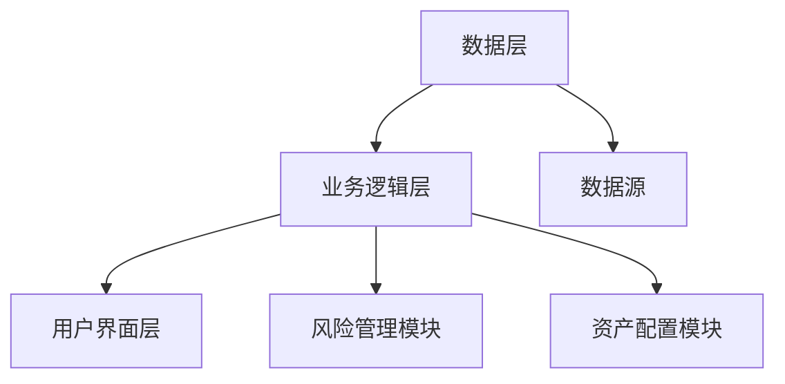
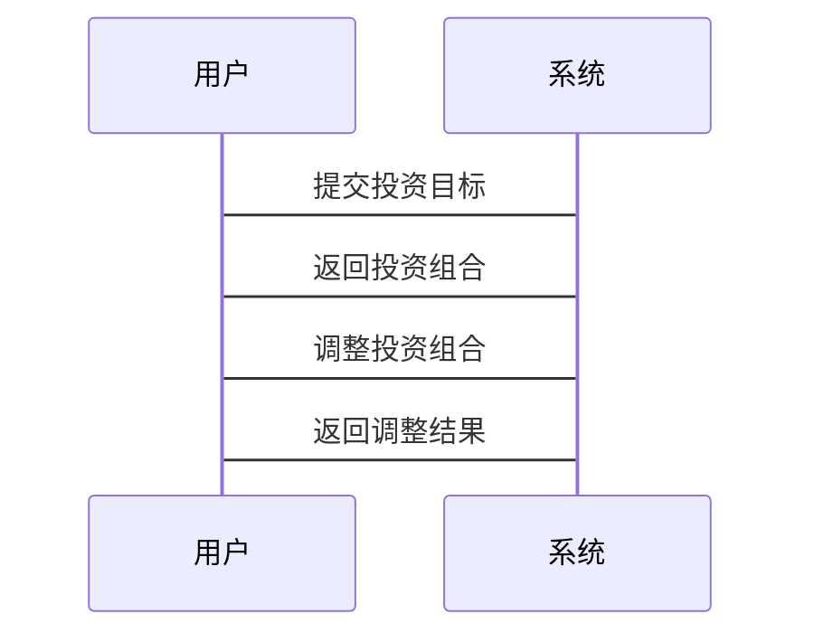

                 


# 如何将特价股票策略应用于风险平价投资

> 关键词：特价股票策略、风险平价投资、资产配置、量化投资、风险管理、投资组合优化

> 摘要：本文探讨了如何将特价股票策略应用于风险平价投资，通过分析特价股票策略的核心要素和风险平价投资的基本原理，提出了一种将两者结合的创新方法。本文详细讲解了如何在风险平价框架下应用特价股票策略，包括策略选择、风险控制和绩效评估等方面，并通过实际案例分析和系统设计，展示了如何构建有效的投资组合。

---

# 正文

## 第一部分: 特价股票策略的背景与基础

### 第1章: 特价股票策略概述

#### 1.1 特价股票策略的基本概念
特价股票策略是一种基于市场波动和价格异常的投资策略，旨在通过识别市场中的短期价格偏离来获取超额收益。以下是特价股票策略的核心要素：

- **市场周期分析**：识别市场的牛熊周期，判断是否处于低价区。
- **估值分析**：通过市盈率、市净率等指标判断股票是否被低估。
- **情绪分析**：利用市场情绪指标（如VIX指数）判断市场波动性。

#### 1.2 特价股票策略的分类
特价股票策略可以根据不同的标准进行分类，以下是几种常见的分类方式：

- **按市场周期分类**：牛市策略、熊市策略、震荡市策略。
- **按投资目标分类**：短期交易、中期投资、长期持有。
- **按风险偏好分类**：保守型策略、平衡型策略、激进型策略。

#### 1.3 特价股票策略的核心要素
- **市场分析**：通过技术分析和基本面分析判断市场的短期走势。
- **股票筛选**：利用量化指标筛选出具有投资价值的股票。
- **入场时机**：选择最佳的买入时机，避免市场风险。

#### 1.4 特价股票策略的优势与局限
- **优势**：
  - 短期收益潜力大。
  - 灵活性高，可以根据市场变化快速调整。
- **局限**：
  - 风险较高，容易受到市场波动影响。
  - 需要频繁监控和调整，操作成本较高。

---

## 第二部分: 风险平价投资的原理与方法

### 第2章: 风险平价投资概述

#### 2.1 风险平价投资的基本概念
风险平价投资是一种基于风险贡献的资产配置方法，旨在将投资组合的风险在不同资产之间平均分配。以下是风险平价投资的核心原理：

- **风险贡献**：计算每种资产对整体组合风险的贡献程度。
- **资产配置**：根据风险贡献调整资产权重，确保每种资产的风险贡献相等。
- **风险调整后的收益**：在风险平价框架下，计算每种资产的风险调整后的收益。

#### 2.2 风险平价投资的核心原理
- **风险贡献计算**：通过资产的波动率和相关性计算每种资产的风险贡献。
- **资产配置优化**：使用优化算法调整资产权重，使风险贡献均匀分布。
- **风险调整后的收益评估**：在风险平价框架下，评估每种资产的风险调整后的收益。

#### 2.3 风险平价投资的实施步骤
1. **确定投资目标**：明确投资目标和风险承受能力。
2. **选择资产类别**：根据市场情况选择合适的资产类别。
3. **计算风险权重**：根据资产的风险贡献计算风险权重。
4. **调整投资组合**：根据风险权重调整投资组合。

#### 2.4 风险平价投资的优缺点
- **优点**：
  - 风险分散能力强，能够有效降低组合风险。
  - 适应性强，适合不同市场环境。
- **缺点**：
  - 需要较高的计算和监控成本。
  - 可能忽视资产的长期收益潜力。

---

## 第三部分: 特价股票策略与风险平价投资的结合

### 第3章: 特价股票策略在风险平价投资中的应用

#### 3.1 特价股票策略与风险平价投资的结合思路
- **策略选择**：在风险平价框架下选择适合的特价股票策略。
- **风险控制**：通过风险平价方法控制特价股票策略的风险。
- **绩效评估**：在风险平价框架下评估特价股票策略的绩效。

#### 3.2 特价股票策略在风险平价投资中的具体实施
- **确定投资目标**：明确投资目标和风险承受能力。
- **选择资产类别**：根据市场情况选择合适的资产类别。
- **计算风险权重**：根据资产的风险贡献计算风险权重。
- **调整投资组合**：根据风险权重调整投资组合。

#### 3.3 特价股票策略在风险平价投资中的风险控制
- **风险分散**：通过多样化资产配置降低风险。
- **风险对冲**：利用衍生工具对冲市场风险。
- **风险监控**：定期监控市场变化和组合风险。

#### 3.4 特价股票策略在风险平价投资中的绩效评估
- **绩效指标选择**：选择适合的绩效指标，如夏普比率、索特比率等。
- **绩效计算方法**：在风险平价框架下计算绩效。
- **绩效优化策略**：通过优化资产配置和风险控制提高绩效。

#### 3.5 本章小结

---

## 第四部分: 系统分析与架构设计

### 第4章: 系统分析与架构设计方案

#### 4.1 问题场景介绍
- **目标**：构建一个基于风险平价的投资系统，应用特价股票策略。
- **用户角色**：投资者、投资经理、数据分析师。
- **需求描述**：需要一个能够实时监控市场、自动调整投资组合的系统。

#### 4.2 系统功能设计
- **领域模型**：设计一个包含市场数据、资产配置、风险评估等功能的领域模型。
- **系统架构设计**：使用分层架构，包括数据层、业务逻辑层和用户界面层。

#### 4.3 系统架构设计


#### 4.4 系统接口设计
- **数据接口**：与数据源对接，获取实时市场数据。
- **用户接口**：提供用户友好的操作界面，方便用户查看和调整投资组合。

#### 4.5 系统交互设计


---

## 第五部分: 项目实战

### 第5章: 项目实战

#### 5.1 环境安装
- **工具**：Python、Pandas、NumPy、Matplotlib、Scipy。
- **数据源**：Yahoo Finance、Alpha Vantage。

#### 5.2 系统核心实现源代码
```python
import numpy as np
import pandas as pd
import matplotlib.pyplot as plt
from scipy.optimize import minimize

# 示例数据
data = pd.DataFrame({
    '股票A': [1, 2, 3, 4, 5],
    '股票B': [5, 4, 3, 2, 1]
})

# 计算波动率
def calculate_volatility(weights, returns):
    return np.sqrt(np.dot(weights.T, np.dot(returns.cov(), weights)))

# 风险平价优化
def risk_parity_optimization(returns):
    n = returns.shape[1]
    def objective(weights):
        return np.sum(np.log(np.array([calculate_volatility(weights, returns) for _ in range(n)])))
    constraints = [{'type': 'eq', 'fun': lambda w: sum(w) - 1}]
    bounds = [(0, 1) for _ in range(n)]
    result = minimize(objective, np.ones(n)/n, bounds=bounds, constraints=constraints)
    return result.x

# 示例应用
returns = data.pct_change().dropna()
weights = risk_parity_optimization(returns)
print("风险平价权重:", weights)
```

#### 5.3 代码应用解读与分析
- **数据处理**：加载和处理市场数据，计算股票的收益率。
- **风险平价优化**：使用优化算法计算风险平价权重。
- **结果分析**：分析优化结果，调整投资组合。

#### 5.4 实际案例分析
- **案例背景**：假设市场中有两只股票，A和B。
- **优化过程**：计算两只股票的风险平价权重，构建投资组合。
- **结果展示**：展示优化后的投资组合及其风险收益特征。

#### 5.5 项目小结

---

## 第六部分: 最佳实践与总结

### 第6章: 最佳实践与总结

#### 6.1 最佳实践 tips
- **风险控制**：定期监控市场变化，及时调整投资组合。
- **策略优化**：根据市场环境调整策略参数，提高策略的有效性。
- **技术实现**：使用高效的技术工具，提高系统的运行效率。

#### 6.2 小结
本文详细讲解了如何将特价股票策略应用于风险平价投资，通过系统的分析和实际案例的展示，展示了如何在风险平价框架下应用特价股票策略，构建有效的投资组合。

#### 6.3 注意事项
- **风险提示**：投资有风险，需谨慎操作。
- **数据来源**：确保数据来源可靠，避免数据偏差。
- **系统维护**：定期维护系统，确保其正常运行。

#### 6.4 拓展阅读
- **参考文献**：推荐相关书籍和论文，供读者深入学习。
- **未来研究方向**：探讨更多策略与风险平价投资的结合方式，进一步优化投资组合。

---

## 作者：AI天才研究院/AI Genius Institute & 禅与计算机程序设计艺术 /Zen And The Art of Computer Programming

