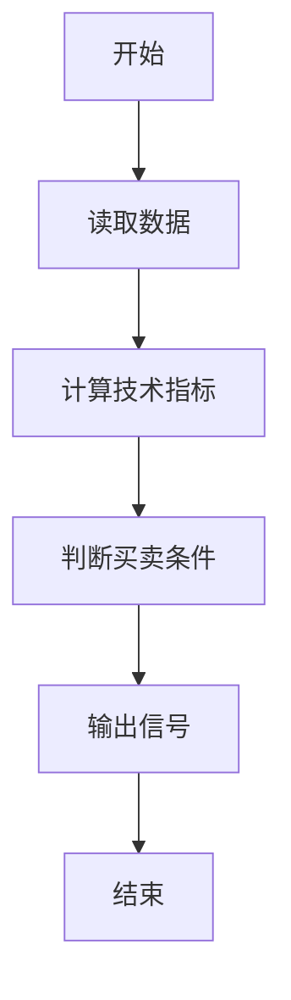
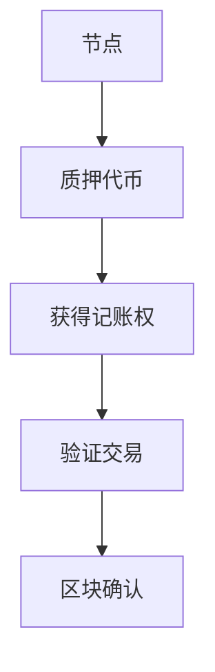
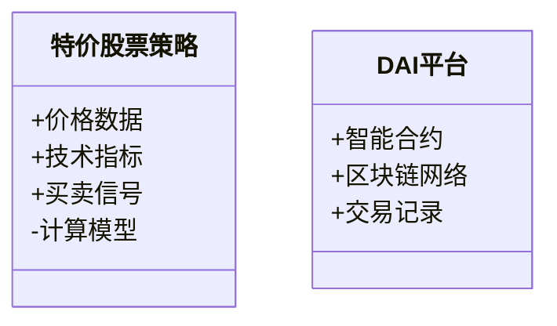
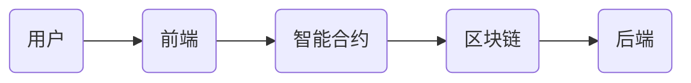

                 


# 如何将特价股票策略融入去中心化自治投资(DAI)

> 关键词：特价股票策略，去中心化自治投资，DAI，量化交易，智能合约，区块链

> 摘要：本文详细探讨了如何将特价股票策略与去中心化自治投资（DAI）相结合，通过分析特价股票策略的核心原理和DAI的去中心化特性，提出了一种基于智能合约的自动化投资方案。文章从背景介绍、核心概念、算法原理、系统设计到实战应用，逐步展开，为读者提供了从理论到实践的完整指导。

---

# 第一部分: 特价股票策略与去中心化自治投资（DAI）基础

## 第1章: 特价股票策略概述

### 1.1 特价股票的定义与特点

#### 1.1.1 特价股票的定义
特价股票是指在特定市场条件下，价格低于其内在价值的股票。这类股票通常被市场低估，具有较高的投资回报潜力。特价股票的核心在于“便宜”，即其市场价格低于其真实价值。

#### 1.1.2 特价股票的核心特点
1. **低估性**：市场价格低于内在价值。
2. **波动性**：价格波动较大，存在快速回升的可能性。
3. **周期性**：通常出现在市场低迷或特定行业不景气时。

#### 1.1.3 特价股票的市场定位
特价股票主要集中在中小盘股或周期性行业，如能源、材料和金融等。这些行业的股票价格受市场波动影响较大，但具备较高的反弹潜力。

### 1.2 特价股票策略的分类

#### 1.2.1 市场套利策略
利用市场价差进行套利，例如跨市场套利或跨期套利。

#### 1.2.2 事件驱动策略
基于公司特定事件（如并购、重组）进行投资。

#### 1.2.3 技术分析策略
通过技术指标（如均线、MACD）寻找买入机会。

---

## 第2章: 去中心化自治投资（DAI）概述

### 2.1 DAI的定义与特点

#### 2.1.1 DAI的定义
DAI（Decentralized Autonomous Investment）是一种基于区块链技术的去中心化投资平台，通过智能合约实现自动化的投资策略执行。

#### 2.1.2 DAI的核心特点
1. **去中心化**：无须中心机构，交易通过区块链进行。
2. **自动化**：智能合约自动执行投资策略。
3. **透明性**：所有交易记录在区块链上，公开透明。

### 2.2 DAI的优势与挑战

#### 2.2.1 DAI的优势
1. **透明性**：所有交易可追溯。
2. **效率高**：智能合约自动执行，减少人工干预。
3. **安全性**：区块链技术确保数据安全。

#### 2.2.2 DAI面临的挑战
1. **监管问题**：去中心化平台如何应对各国金融监管。
2. **技术复杂性**：智能合约的编写和维护需要专业技能。
3. **市场接受度**：投资者对新技术的接受需要时间。

---

# 第二部分: 特价股票策略与DAI的核心概念与联系

## 第3章: 特价股票策略与DAI的核心概念

### 3.1 特价股票策略的数学模型

#### 3.1.1 特价股票策略的基本公式
$$ \text{买入价} = \text{内在价值} \times (1 - \alpha) $$
其中，$\alpha$为折扣率，通常介于0到1之间。

#### 3.1.2 特价股票策略的数学模型
$$ \text{收益} = \text{卖出价} - \text{买入价} $$
$$ \text{收益比率} = \frac{\text{收益}}{\text{买入价}} $$

#### 3.1.3 特价股票策略的优化算法
1. **筛选算法**：通过技术指标筛选潜在股票。
2. **风险控制**：设置止损和止盈点。

### 3.2 DAI的核心原理

#### 3.2.1 DAI的共识机制
DAI采用Proof of Stake（PoS）机制，通过质押代币获得记账权。

#### 3.2.2 DAI的智能合约
智能合约自动执行投资策略，例如自动购买和卖出股票。

#### 3.2.3 DAI的去中心化特性
DAI通过区块链技术实现去中心化，无须信任第三方机构。

## 第4章: 特价股票策略与DAI的联系

### 4.1 特价股票策略在DAI中的应用

#### 4.1.1 自动化投资
通过智能合约自动执行特价股票的买卖策略。

#### 4.1.2 去中心化交易
在DAI平台上进行去中心化交易，避免传统交易所的高费用和低效率。

### 4.2 特价股票策略与DAI的对比分析

#### 4.2.1 优缺点对比
| 特性 | 特价股票策略 | DAI |
|------|--------------|-----|
| 优势 | 高收益潜力 | 自动化、透明 |
| 劣势 | 市场波动大 | 技术复杂 |

#### 4.2.2 联系与区别
- **联系**：DAI为特价股票策略提供了一个自动化执行的平台。
- **区别**：DAI强调去中心化，而特价股票策略注重低价买入。

#### 4.2.3 未来发展趋势
随着区块链技术的发展，DAI将更广泛地应用于量化交易和自动化投资。

---

# 第三部分: 特价股票策略与DAI的算法原理

## 第5章: 特价股票策略的算法原理

### 5.1 特价股票策略的算法流程

#### 5.1.1 特价股票策略的输入与输出
- **输入**：股票价格数据、技术指标。
- **输出**：买卖信号。

#### 5.1.2 特价股票策略的核心算法


### 5.2 DAI的共识机制

#### 5.2.1 DAI的共识机制


---

## 第6章: DAI的智能合约实现

### 6.1 智能合约的核心功能

#### 6.1.1 自动化交易
智能合约自动执行买卖指令。

#### 6.1.2 风险控制
设置止损和止盈点，确保资金安全。

### 6.2 智能合约的代码实现

```python
# 智能合约示例代码
def buy_stock():
    if current_price < target_price:
        execute_buy()
    else:
        do_nothing()

def sell_stock():
    if current_price > target_price:
        execute_sell()
    else:
        do_nothing()
```

---

# 第四部分: 系统分析与架构设计

## 第7章: 系统功能设计

### 7.1 领域模型设计



---

## 第8章: 系统架构设计

### 8.1 系统架构图



---

# 第五部分: 项目实战

## 第9章: 项目实战

### 9.1 环境安装

1. 安装区块链节点。
2. 配置智能合约环境。

### 9.2 核心代码实现

```python
# 智能合约实现
def main():
    while True:
        check_price()
        execute_strategy()
```

### 9.3 案例分析

#### 9.3.1 案例1
某股票价格从10元跌至8元，触发买入信号，最终回升至12元，收益率为40%。

#### 9.3.2 案例2
某股票价格波动剧烈，智能合约自动执行止损，避免重大损失。

### 9.4 项目总结

通过DAI平台实现特价股票策略，能够提高交易效率和透明度，同时降低交易成本。

---

# 第六部分: 总结与展望

## 第10章: 总结与展望

### 10.1 最佳实践

1. **风险管理**：设置合理的止损和止盈点。
2. **技术选型**：选择合适的区块链平台和智能合约语言。

### 10.2 小结

本文详细探讨了如何将特价股票策略与DAI相结合，提出了基于智能合约的自动化投资方案。

### 10.3 注意事项

1. **市场风险**：投资需谨慎，市场波动可能带来损失。
2. **技术风险**：智能合约的编写需确保安全性。

### 10.4 拓展阅读

1. 区块链技术入门与应用。
2. 智能合约开发指南。

---

作者：AI天才研究院 & 禅与计算机程序设计艺术

