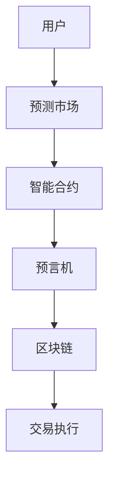
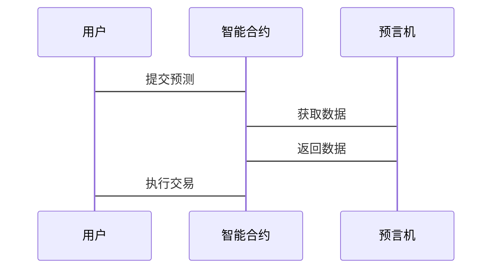

                 


# 如何将特价股票策略融入去中心化预测市场投资

> **关键词**：特价股票策略、去中心化预测市场、区块链技术、智能合约、投资策略优化

> **摘要**：本文详细探讨如何将特价股票策略与去中心化预测市场相结合，通过分析其核心概念、算法原理和系统架构，提供从理论到实践的全面指导，帮助投资者优化投资策略，降低风险，提升收益。

---

# 第一部分: 特价股票策略与去中心化预测市场的背景介绍

## 第1章: 特价股票策略与去中心化预测市场的背景介绍

### 1.1 特价股票策略的基本概念

#### 1.1.1 特价股票的定义与特点
特价股票指的是在特定市场条件下，价格低于其内在价值的股票。其特点是价格波动大、风险高、收益潜力大。投资者通常利用市场波动，通过低价买入高价卖出的策略获利。

#### 1.1.2 特价股票策略的核心要素
- **市场分析**：通过技术分析和基本面分析识别市场趋势。
- **风险管理**：设定止损点和止盈点，控制风险。
- **交易时机**：在市场低谷时买入，市场高峰时卖出。

#### 1.1.3 特价股票策略的市场背景
近年来，随着市场波动加剧，投资者 increasingly seek ways to exploit market inefficiencies. 特价股票策略因其高收益潜力，吸引了大量投资者，但也面临高风险和复杂性。

### 1.2 去中心化预测市场的基本概念

#### 1.2.1 去中心化预测市场的定义
去中心化预测市场是一种基于区块链技术的市场，允许用户进行预测并获得奖励。其特点是没有中心化机构控制，依赖智能合约实现自动执行。

#### 1.2.2 去中心化预测市场的核心机制
- **智能合约**：自动执行交易和支付。
- **代币经济**：使用代币作为激励，参与者通过准确预测获得奖励。
- **去中心化预言机**：提供实时市场数据。

#### 1.2.3 去中心化预测市场的优势与挑战
优势包括透明性、抗审查性和高效性；挑战包括技术复杂性和监管不确定性。

### 1.3 特价股票策略与去中心化预测市场的融合

#### 1.3.1 融合的背景与动机
随着区块链技术的发展，去中心化预测市场为特价股票策略提供了新的应用场景。

#### 1.3.2 融合的核心目标
通过去中心化预测市场，投资者可以更高效地执行特价股票策略，利用市场数据和预测机制优化投资决策。

#### 1.3.3 融合的实现路径
- 利用智能合约实现自动交易。
- 通过去中心化预言机获取实时市场数据。
- 通过代币激励机制激励参与者提供准确预测。

### 1.4 本章小结
本章介绍了特价股票策略和去中心化预测市场的基本概念，并探讨了它们的融合背景、目标和实现路径。

---

# 第二部分: 特价股票策略与去中心化预测市场的核心概念

## 第2章: 特价股票策略的核心原理

### 2.1 特价股票策略的数学模型

#### 2.1.1 特价股票的定价模型
常用模型包括：
- **均值回归模型**：假设价格回归均值。
- **随机游走模型**：价格变化无规律。

#### 2.1.2 特价股票的收益预测公式
收益预测公式：
$$ \text{收益} = \text{卖出价} - \text{买入价} $$

#### 2.1.3 特价股票的市场波动分析
通过波动率指标（如标准差）衡量市场波动，指导交易策略。

### 2.2 去中心化预测市场的机制分析

#### 2.2.1 去中心化预测市场的基本流程
1. 预测市场参与者提交预测。
2. 智能合约根据预测结果分配代币奖励。

#### 2.2.2 去中心化预测市场的参与者角色
- **预测者**：提交市场预测。
- **智能合约**：执行交易和支付。
- **预言机**：提供实时数据。

#### 2.2.3 去中心化预测市场的激励机制
通过代币奖励激励预测者提供准确数据，提高市场预测的准确性。

### 2.3 特价股票策略与去中心化预测市场的结合点

#### 2.3.1 特价股票价格预测的去中心化实现
利用去中心化预测市场预测特价股票价格，实现自动交易。

#### 2.3.2 去中心化预测市场对特价股票策略的支持
提供实时数据和自动交易机制，提升策略执行效率。

#### 2.3.3 特价股票策略在去中心化预测市场中的应用
通过智能合约自动执行特价股票策略，降低人为干预风险。

### 2.4 本章小结
本章详细分析了特价股票策略和去中心化预测市场的核心机制，并探讨了它们的结合点。

---

# 第三部分: 特价股票策略与去中心化预测市场的算法原理

## 第3章: 特价股票策略的算法实现

### 3.1 特价股票价格预测算法

#### 3.1.1 时间序列分析算法
使用ARIMA模型预测股票价格：
$$ ARIMA(p, d, q) $$

#### 3.1.2 机器学习算法在特价股票预测中的应用
- 使用LSTM神经网络预测价格走势。

#### 3.1.3 深度学习算法在特价股票预测中的应用
- 使用卷积神经网络（CNN）分析市场情绪。

### 3.2 去中心化预测市场的算法实现

#### 3.2.1 去中心化预测市场的共识算法
使用工作量证明（PoW）或权益证明（PoS）机制。

#### 3.2.2 去中心化预测市场的智能合约算法
智能合约代码示例（Solidity）：
```solidity
function predictPrice(uint256 price) {
    // 实现价格预测逻辑
}
```

#### 3.2.3 去中心化预测市场的数据处理算法
使用数据挖掘技术分析历史数据，优化预测模型。

### 3.3 特价股票策略与去中心化预测市场的算法融合

#### 3.3.1 算法融合的实现思路
- 结合时间序列分析和智能合约实现自动交易。

#### 3.3.2 算法融合的具体步骤
1. 数据采集：获取历史股价数据。
2. 模型训练：训练预测模型。
3. 智能合约部署：部署到区块链平台。
4. 自动交易：根据预测结果执行交易。

#### 3.3.3 算法融合的优化策略
- 使用多种算法结合提高预测准确性。
- 定期更新模型参数适应市场变化。

### 3.4 本章小结
本章详细讲解了特价股票策略和去中心化预测市场的算法实现，并探讨了它们的融合策略。

---

# 第四部分: 特价股票策略与去中心化预测市场的系统架构

## 第4章: 特价股票策略与去中心化预测市场的系统设计

### 4.1 系统功能设计

#### 4.1.1 特价股票数据采集模块
- 数据源：股票交易所API。
- 数据处理：清洗和转换数据。

#### 4.1.2 去中心化预测市场模块
- 智能合约实现预测和支付。
- 预言机提供实时数据。

#### 4.1.3 策略执行与优化模块
- 执行策略：根据预测结果自动交易。
- 策略优化：根据市场反馈调整模型参数。

### 4.2 系统架构设计

#### 4.2.1 分层架构设计
- 数据层：存储市场数据。
- 业务逻辑层：实现预测和交易逻辑。
- 表现层：用户交互界面。

#### 4.2.2 系统架构图（Mermaid）


### 4.3 系统接口设计

#### 4.3.1 接口描述
- API接口用于数据获取和交易执行。

#### 4.3.2 接口实现
- 使用RESTful API设计接口。

### 4.4 系统交互流程图（Mermaid）


### 4.5 本章小结
本章详细设计了系统架构，包括功能模块、架构图和交互流程，为系统实现提供了指导。

---

# 第五部分: 特价股票策略与去中心化预测市场的项目实战

## 第5章: 特价股票策略与去中心化预测市场的项目实战

### 5.1 项目环境配置

#### 5.1.1 系统环境
- 操作系统：Linux/Windows/MacOS。
- 开发工具：Visual Studio Code，Solidity编译器。

#### 5.1.2 区块链平台
- Ethereum网络。
- MetaMask钱包配置。

### 5.2 系统核心代码实现

#### 5.2.1 智能合约代码
```solidity
// SPDX-License-Identifier: MIT
pragma solidity ^0.8.0;

contract StockPredictor {
    // 预言机接口
    interface Oracle {
        function getPrice(uint256 timestamp) external returns (uint256);
    }

    // 预测市场逻辑
    function predictPrice(address oracle, uint256 timestamp) public {
        uint256 price = Oracle(oracle).getPrice(timestamp);
        // 根据价格执行预测逻辑
    }
}
```

#### 5.2.2 数据处理代码
```python
import pandas as pd
from sklearn.model_selection import train_test_split
from sklearn.linear_model import LinearRegression

# 数据加载与处理
data = pd.read_csv('stock_prices.csv')
X = data[['open', 'high', 'low', 'volume']]
y = data['close']
X_train, X_test, y_train, y_test = train_test_split(X, y, test_size=0.2)
model = LinearRegression()
model.fit(X_train, y_train)
```

### 5.3 项目案例分析与解读

#### 5.3.1 案例分析
案例：预测某科技股的价格走势。

#### 5.3.2 案例解读
- 数据采集：获取过去一年的股价数据。
- 模型训练：使用线性回归模型预测未来价格。
- 自动交易：通过智能合约执行买卖操作。

### 5.4 项目小结
本章通过实际案例展示了如何将特价股票策略与去中心化预测市场相结合，实现自动化的投资策略。

---

# 第六部分: 特价股票策略与去中心化预测市场的最佳实践

## 第6章: 最佳实践、小结、注意事项和拓展阅读

### 6.1 最佳实践

#### 6.1.1 风险管理
- 设定止损点，避免重大损失。
- 分散投资，降低风险。

#### 6.1.2 技术实现
- 定期更新模型，适应市场变化。
- 确保智能合约的安全性。

#### 6.1.3 法律合规
- 遵守相关法律法规，确保交易合法性。

### 6.2 小结
本文详细探讨了如何将特价股票策略融入去中心化预测市场，通过算法和系统架构的设计，提供了一种高效的投资策略。

### 6.3 注意事项

#### 6.3.1 风险提示
- 市场波动可能导致策略失效。
- 智能合约漏洞可能引发损失。

#### 6.3.2 技术挑战
- 预言机数据延迟可能影响交易决策。
- 智能合约开发和部署复杂。

#### 6.3.3 法律风险
- 不同地区的法律法规差异可能影响策略实施。

### 6.4 拓展阅读

#### 6.4.1 推荐书籍
- 《区块链技术与应用》
- 《量化交易实战》

#### 6.4.2 推荐在线资源
- 加密货币论坛：Reddit、Bitcointalk。
- 区块链开发博客：Solidity官方博客。

### 6.5 本章小结
本章总结了最佳实践，强调了风险管理的重要性，并提供了拓展阅读资源。

---

# 作者

**作者：AI天才研究院/AI Genius Institute & 禅与计算机程序设计艺术 /Zen And The Art of Computer Programming**

---

这篇文章详细探讨了如何将特价股票策略融入去中心化预测市场投资，通过理论分析和实战案例，为投资者提供了优化投资策略的指导。希望对读者有所帮助！

