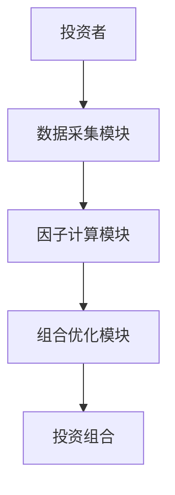

                 


# 如何将特价股票策略融入因子投资

> 关键词：特价股票策略，因子投资，价值投资，投资组合优化，量化投资，股票筛选

> 摘要：本文详细探讨了如何将特价股票策略融入因子投资中，从背景介绍、核心概念、算法原理到系统架构和项目实战，层层剖析，最终总结了最佳实践经验和未来研究方向。

---

# 第一部分: 特价股票策略与因子投资概述

## 第1章: 特价股票策略概述

### 1.1 特价股票策略的定义与特点

#### 1.1.1 特价股票的定义
特价股票是指市场价格低于其内在价值的股票。这种股票通常被认为具有较高的安全边际，适合长期投资者在市场低迷时期买入。

#### 1.1.2 特价股票的核心特点
- **低估值**：市场价格低于内在价值。
- **高安全边际**：买入价格远低于内在价值，降低投资风险。
- **逆周期性**：通常在市场下跌或低迷时期更容易找到特价股票。

#### 1.1.3 特价股票与价值投资的区别
- **价值投资**：寻找被市场低估的股票，注重长期基本面。
- **特价股票策略**：更注重短期价格折扣，强调买入价格低于内在价值。

### 1.2 特价股票策略的历史与发展

#### 1.2.1 特价股票策略的起源
特价股票策略起源于价值投资理念，早期投资者如本杰明·格雷厄姆是该策略的倡导者。

#### 1.2.2 特价股票策略在现代投资中的应用
现代投资者通过量化方法筛选特价股票，结合技术分析和基本面分析。

#### 1.2.3 特价股票策略的优缺点分析
- **优点**：风险较低，收益潜力大。
- **缺点**：需要长期持有，流动性较差。

---

## 第2章: 因子投资概述

### 2.1 因子投资的定义与特点

#### 2.1.1 因子投资的定义
因子投资是一种通过筛选具有特定特征的股票来构建投资组合的方法，注重因子的统计显著性和可解释性。

#### 2.1.2 因子投资的核心特点
- **可量化**：通过数学模型筛选股票。
- **可扩展**：适用于大规模投资组合。
- **可解释**：因子具有明确的经济含义。

### 2.2 因子投资的主要类型

#### 2.2.1 价值因子
- **定义**：衡量股票的低估值程度。
- **指标**：市盈率（P/E）、市净率（P/B）。

#### 2.2.2 动量因子
- **定义**：股票价格的动量效应，即近期表现好的股票未来表现也会较好。
- **指标**：过去12个月的收益。

#### 2.2.3 成长因子
- **定义**：衡量股票的盈利能力增长潜力。
- **指标**：净利润增长率、营收增长率。

#### 2.2.4 其他常见因子
- **质量因子**：衡量公司的财务健康状况。
- **流动性因子**：衡量股票的交易活跃度。

### 2.3 因子投资的优势

#### 2.3.1 统计显著性
因子投资通过统计方法筛选因子，具有较强的可预测性。

#### 2.3.2 可扩展性
适用于大规模投资组合的构建。

#### 2.3.3 稀疏性
因子投资通过筛选少量因子来构建组合，降低组合复杂性。

---

## 第3章: 特价股票策略与因子投资的结合

### 3.1 特价股票策略在因子投资中的应用

#### 3.1.1 特价股票策略作为因子的可行性
特价股票策略可以作为因子投资中的一个因子，用于筛选具有低估值特性的股票。

#### 3.1.2 特价股票策略与其他因子的协同作用
通过结合其他因子（如动量因子、成长因子），进一步优化投资组合。

### 3.2 特价股票策略融入因子投资的背景

#### 3.2.1 特价股票策略的局限性
- **流动性风险**：特价股票往往流动性较差。
- **短期波动**：市场波动可能导致价格回升，影响收益。

#### 3.2.2 因子投资的优势
- **分散风险**：通过因子筛选构建多样化组合。
- **增强收益**：通过因子的协同作用提升收益。

#### 3.2.3 两者的结合对投资绩效的提升
通过结合特价股票策略和因子投资，可以在控制风险的同时，提升收益潜力。

---

# 第二部分: 特价股票策略融入因子投资的核心概念

## 第4章: 特价股票策略与因子投资的核心概念

### 4.1 特价股票策略的核心要素

#### 4.1.1 特价股票的筛选标准
- **市盈率（P/E）**：低于行业平均水平。
- **市净率（P/B）**：低于行业平均水平。
- **股息率**：高于行业平均水平。

#### 4.1.2 特价股票的估值方法
- **内在价值计算**：使用DCF模型等方法估算股票的内在价值。
- **折扣率**：计算股票价格与内在价值的折扣率。

#### 4.1.3 特价股票的风险因素
- **市场风险**：市场波动可能导致价格回升。
- **流动性风险**：特价股票流动性较差，可能难以快速变现。

### 4.2 因子投资的核心要素

#### 4.2.1 因子的定义与分类
- **常见因子**：价值、动量、成长、质量等。
- **因子的量化方法**：通过指标标准化和加权构建因子。

#### 4.2.2 因子的量化方法
- **标准化**：对指标进行z-score标准化。
- **加权**：使用等权或市值加权。

#### 4.2.3 因子投资的组合构建方法
- **单因子策略**：仅基于一个因子筛选股票。
- **多因子策略**：结合多个因子构建组合。

### 4.3 特价股票策略与因子投资的联系与区别

#### 4.3.1 联系
- **共同目标**：追求超额收益。
- **协同作用**：特价股票策略作为因子之一，增强投资组合的收益潜力。

#### 4.3.2 区别
- **策略重点**：特价股票策略注重价格折扣，因子投资注重因子的统计显著性。
- **应用范围**：特价股票策略适用于长期投资，因子投资适用于多样化组合构建。

#### 4.3.3 综合应用的优势
- **风险分散**：通过因子筛选降低投资风险。
- **收益增强**：通过因子的协同作用提升收益潜力。

---

## 第5章: 特价股票策略与因子投资的核心概念对比

### 5.1 特价股票策略与因子投资的核心概念对比

| **核心概念** | **特价股票策略** | **因子投资** |
|--------------|------------------|--------------|
| **目标**     | 寻找低价股票     | 通过因子筛选构建投资组合 |
| **筛选标准** | 价格折扣         | 统计显著性因子 |
| **风险控制** | 降低投资风险     | 通过分散化降低风险 |
| **收益潜力** | 追求超额收益     | 追求超额收益 |

### 5.2 特价股票策略与因子投资的ER实体关系图

```mermaid
erDiagram
    customer[投资者] --> holds[持有]
    holds --> stock[股票]
    stock --> has[具有]
    has --> factor[因子]
    factor --> belongsTo[属于]
    belongsTo --> strategy[策略]
```

---

## 第6章: 特价股票策略融入因子投资的算法原理

### 6.1 特价股票策略融入因子投资的数学模型

#### 6.1.1 单因子模型
- **CAPM模型**：
  $$ E(R_i) = R_f + \beta_i (R_m - R_f) $$
  其中，$\beta_i$ 是股票i的beta系数，衡量其系统性风险。

#### 6.1.2 多因子模型
- **Fama-French三因子模型**：
  $$ E(R_i) = \alpha + \beta_1 SML + \beta_2 SMB + \beta_3 HML + \epsilon $$
  其中，SML是规模因子，SMB是小市值因子，HML是价值因子。

#### 6.1.3 特价股票策略的数学表达
- **特价股票筛选**：
  $$ \text{价格折扣率} = \frac{\text{内在价值}}{\text{市场价格}} - 1 $$

---

## 第7章: 特价股票策略融入因子投资的系统架构设计

### 7.1 系统功能设计

#### 7.1.1 数据采集模块
- **数据源**：股票价格、财务数据、市场数据。
- **数据清洗**：处理缺失值、异常值。

#### 7.1.2 因子计算模块
- **因子筛选**：计算市盈率、市净率等指标。
- **因子组合**：构建多因子模型。

#### 7.1.3 组合优化模块
- **风险调整**：使用均值-方差优化模型。
- **组合构建**：根据优化结果构建投资组合。

### 7.2 系统架构设计



---

## 第8章: 特价股票策略融入因子投资的项目实战

### 8.1 环境安装

```bash
pip install pandas numpy matplotlib
```

### 8.2 核心实现代码

```python
import pandas as pd
import numpy as np

# 数据获取
data = pd.read_csv('stock_data.csv')

# 计算因子
data['PE'] = data['Price'] / data['Earnings']
data['PB'] = data['Price'] / data['Book Value']

# 特价股票筛选
data['Discount'] = (data['Intrinsic Value'] / data['Price']) - 1
selected_stocks = data[data['Discount'] > 0.2]

# 因子组合
selected_factors = selected_stocks[['PE', 'PB', 'Discount']].mean()

print(selected_factors)
```

---

## 第9章: 特价股票策略融入因子投资的最佳实践

### 9.1 小结

- 特价股票策略与因子投资的结合可以在控制风险的同时提升收益潜力。
- 通过量化方法筛选特价股票，可以降低投资风险并提高收益潜力。

### 9.2 注意事项

- **市场风险**：特价股票策略在市场低迷时期表现较好，但在市场上涨时期可能表现不佳。
- **流动性风险**：特价股票流动性较差，可能难以快速变现。
- **因子选择**：需要根据市场环境动态调整因子选择。

### 9.3 拓展阅读

- 《投资学基础》
- 《因子投资策略》
- 《量化投资入门》

---

# 作者：AI天才研究院 & 禅与计算机程序设计艺术

---

本文详细探讨了如何将特价股票策略融入因子投资中，从背景介绍、核心概念、算法原理到系统架构和项目实战，层层剖析，最终总结了最佳实践经验和未来研究方向。通过本文的分析，读者可以更好地理解如何在实际投资中结合这两种策略，提升投资绩效。

