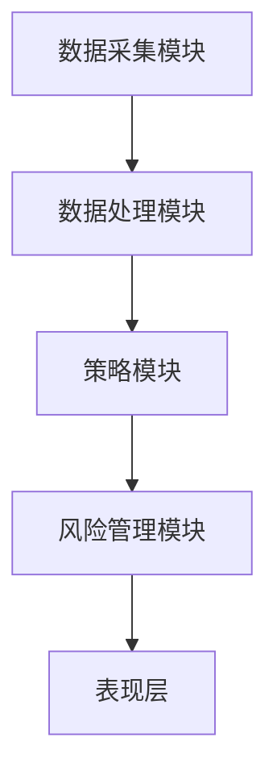
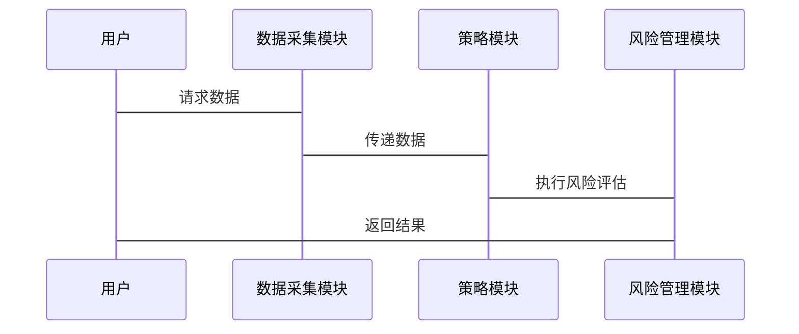

                 

好的，现在让我们按照步骤来逐步构建文章的结构。这将帮助我们确保内容全面、逻辑清晰，并且符合用户的要求。

### 第一部分：背景介绍与核心概念

**第1章：特价股票策略概述**

#### 1.1 特价股票策略的定义与特点

- **1.1.1 特价股票的定义**：介绍什么是特价股票，通常指价格低于市场价的股票，可能包括折扣、促销等。
- **1.1.2 特价股票策略的核心特点**：如价格优势、高流动性、低门槛等。
- **1.1.3 特价股票策略的优势与局限性**：优势如高收益潜力，局限性如市场波动大、信息不对称等。

#### 1.2 数字资产与对冲的基本概念

- **1.2.1 数字资产的定义与分类**：数字资产包括比特币、以太坊等，分类如加密货币、代币等。
- **1.2.2 对冲的基本原理**：通过做空或买保险来降低风险。
- **1.2.3 数字资产对冲的优势与挑战**：优势如分散风险，挑战如监管不确定性、技术复杂性等。

**第2章：特价股票策略与对冲组合的关系**

#### 2.1 特价股票策略在对冲组合中的角色

- **2.1.1 特价股票策略如何降低风险**：通过多样化投资降低市场波动带来的风险。
- **2.1.2 特价股票策略如何提升收益**：利用低价买入高价卖出的策略赚取利润。
- **2.1.3 特价股票策略与其他对冲策略的协同作用**：如与期货、期权等结合，提升整体收益。

#### 2.2 数字资产对冲组合的构建逻辑

- **2.2.1 对冲组合的目标设定**：如风险厌恶型、风险中性型等。
- **2.2.2 对冲组合的资产配置**：如何分配不同资产的比例，如股票、债券、数字资产等。
- **2.2.3 对冲组合的风险管理**：使用止损、止盈等工具控制风险。

### 第二部分：数学模型与算法原理

**第3章：特价股票策略的数学模型**

#### 3.1 特价股票策略的数学表达

- **3.1.1 特价股票的收益模型**：预期收益的计算公式，如CAPM模型的应用。
- **3.1.2 特价股票的风险模型**：如方差、标准差的计算。
- **3.1.3 特价股票策略的优化模型**：使用均值-方差模型优化投资组合。

#### 3.2 数学模型的公式推导

- **3.2.1 收益与风险的数学表达**：如收益向量和协方差矩阵。
- **3.2.2 优化问题的数学公式**：如最小化风险函数，在收益约束下。
- **3.2.3 模型的假设与限制条件**：如假设资产独立，无交易成本等。

**第4章：对冲组合的优化算法**

#### 4.1 均值-方差优化算法

- **4.1.1 算法的基本原理**：通过优化方差和收益的权衡找到最优组合。
- **4.1.2 算法的数学推导**：使用拉格朗日乘数法求解优化问题。
- **4.1.3 算法的实现步骤**：数据处理、模型构建、求解优化问题。

#### 4.2 其他优化算法

- **4.2.1 贝叶斯优化算法**：基于概率模型的优化方法。
- **4.2.2 遗传算法**：模拟自然选择的过程来寻找最优解。
- **4.2.3 其他优化方法的比较**：如比较梯度下降、模拟退火等方法的优缺点。

### 第三部分：系统分析与架构设计

**第5章：系统分析与需求定义**

#### 5.1 系统目标与范围

- **5.1.1 系统的目标**：构建一个智能化的对冲组合管理系统。
- **5.1.2 系统的范围**：包括数据采集、策略执行、风险监控等模块。
- **5.1.3 系统的约束条件**：如数据源的限制、计算资源的限制等。

#### 5.2 功能需求分析

- **5.2.1 数据采集模块**：实时采集股票和数字资产的价格数据。
- **5.2.2 策略执行模块**：根据策略生成买卖信号并执行交易。
- **5.2.3 风险管理模块**：监控风险指标并执行止损等操作。

**第6章：系统架构设计**

#### 6.1 系统架构概述

- **6.1.1 分层架构设计**：数据层、业务逻辑层、表现层的划分。
- **6.1.2 模块划分**：数据采集模块、策略模块、风险管理模块等。

#### 6.2 系统架构图（Mermaid）

#### 6.3 接口设计与交互流程

- **6.3.1 数据接口设计**：数据格式、API接口设计。
- **6.3.2 系统交互流程图（Mermaid）**

### 第四部分：项目实战与应用案例

**第7章：项目实战**

#### 7.1 环境安装与配置

- **7.1.1 安装Python与相关库**：如numpy、pandas、scipy等。
- **7.1.2 数据源获取**：如通过Yahoo Finance获取股票数据，通过CoinMarketCap获取数字资产数据。

#### 7.2 核心代码实现

- **7.2.1 数据预处理代码**：清洗数据、处理缺失值等。
- **7.2.2 策略回测代码**：实现特价股票策略的回测，计算收益和风险指标。
- **7.2.3 风险管理代码**：实现止损、止盈机制，监控VaR等风险指标。

#### 7.3 实际案例分析与解读

- **7.3.1 特价股票选择案例**：如何选择具有潜力的特价股票。
- **7.3.2 对冲组合构建案例**：构建一个包含特价股票和数字资产的对冲组合，并分析其表现。
- **7.3.3 回测结果解读**：分析回测结果，评估策略的有效性，并进行参数调整。

### 第五部分：最佳实践与小结

**第8章：最佳实践与小结**

#### 8.1 实施策略的关键成功因素

- **8.1.1 数据质量的重要性**：确保数据的准确性和及时性。
- **8.1.2 策略优化的必要性**：根据市场变化持续优化策略。
- **8.1.3 风险管理的重要性**：严格的风险控制是策略成功的关键。

#### 8.2 可能的风险与挑战

- **8.2.1 市场风险**：市场剧烈波动可能影响策略效果。
- **8.2.2 操作风险**：系统故障或人为错误可能导致损失。
- **8.2.3 监管风险**：政策变化可能影响策略的实施。

#### 8.3 未来的发展方向

- **8.3.1 结合AI技术**：利用机器学习算法优化策略。
- **8.3.2 扩展到更多资产类别**：如房地产、黄金等。
- **8.3.3 提升系统智能化水平**：实现自动化决策和自适应调整。

### 附录：进一步学习与资源

- 推荐的书籍、在线课程、工具和资源，帮助读者深入学习和实践。

### 作者信息

**作者：AI天才研究院/AI Genius Institute & 禅与计算机程序设计艺术 /Zen And The Art of Computer Programming**

---

通过以上结构，我们可以系统地介绍如何将特价股票策略融入多元化数字资产对冲组合，从理论到实践，从分析到实现，全面覆盖相关内容。每一部分都详细展开，确保读者能够逐步理解和掌握这一复杂而有趣的主题。

