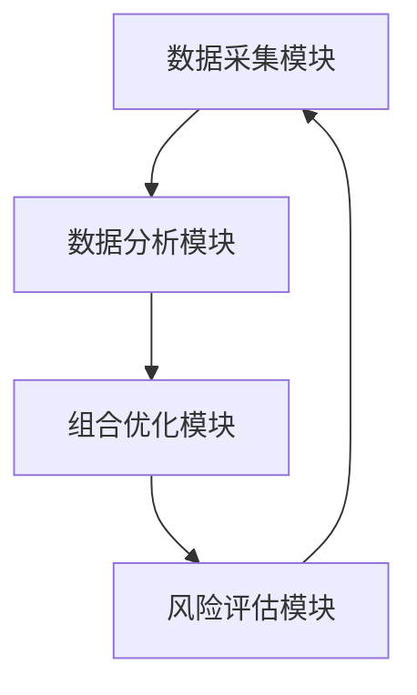

                 


# 如何将特价股票策略融入多元化数字资产风险平价组合

> 关键词：特价股票策略, 数字资产, 风险平价组合, 投资组合优化, 量化投资

> 摘要：本文详细探讨了如何将特价股票策略与数字资产风险平价组合相结合，以构建一个高效、稳健的投资组合。通过分析两者的原理、算法、系统架构和实际案例，本文为投资者提供了理论支持和实践指导。

---

# 第一章: 特价股票策略与数字资产风险平价组合的背景概述

## 1.1 特价股票策略的定义与特点
### 1.1.1 特价股票的定义
特价股票是指价格低于其内在价值或市场公允价值的股票，通常出现在市场下跌周期或公司基本面暂时不佳的情况下。投资者可以通过挖掘这些被低估的股票，抓住市场的短期波动机会。

### 1.1.2 特价股票策略的核心特征
- **短期性**：抓住市场波动，快速获利。
- **低风险**：通过价值回归实现收益。
- **高收益潜力**：低价买入，高价卖出。

### 1.1.3 特价股票策略的优劣势分析
- **优势**：收益潜力大，风险相对较低。
- **劣势**：需要精准判断市场波动，对投资者的市场敏感性要求较高。

## 1.2 数字资产风险平价组合的定义与特点
### 1.2.1 数字资产的定义
数字资产是指以区块链技术为基础，具有去中心化、不可篡改和可追踪性特征的虚拟资产，如比特币、以太坊等。

### 1.2.2 风险平价组合的定义
风险平价组合是一种投资组合，通过调整各资产的风险贡献，使每种资产对组合的风险贡献相等。这种组合在不同市场环境下具有较好的风险收益比。

### 1.2.3 数字资产风险平价组合的优势
- **分散风险**：通过多样化数字资产降低投资组合的整体风险。
- **收益稳定**：在不同市场环境下保持稳健收益。

## 1.3 特价股票策略与数字资产风险平价组合的结合
### 1.3.1 结合的背景与动机
随着市场的波动加剧，投资者需要一种既能抓住短期机会，又能保持长期稳健的投资策略。

### 1.3.2 结合的目标与意义
通过结合特价股票策略和数字资产风险平价组合，投资者可以在捕捉市场短期波动的同时，保持投资组合的长期稳定性。

### 1.3.3 结合的实现路径
- **量化分析**：利用量化方法对市场数据进行分析。
- **组合优化**：通过算法优化投资组合的风险收益比。

## 1.4 本章小结
本章介绍了特价股票策略和数字资产风险平价组合的基本概念和特点，分析了两者结合的背景和意义，为后续的深入探讨奠定了基础。

---

# 第二章: 特价股票策略与数字资产风险平价组合的核心概念

## 2.1 特价股票策略的核心原理
### 2.1.1 市场有效性与特价股票的机会
市场短期波动往往导致股票价格偏离其内在价值，投资者可以通过分析市场无效性来寻找特价股票。

### 2.1.2 技术分析与基本面分析在特价股票中的应用
- **技术分析**：通过K线图、成交量等技术指标判断买入时机。
- **基本面分析**：分析公司财务状况，判断其内在价值。

### 2.1.3 特价股票策略的风险与收益分析
- **风险**：市场波动可能导致股票价格继续下跌。
- **收益**：价值回归带来的股价上涨。

## 2.2 数字资产风险平价组合的核心原理
### 2.2.1 风险平价的定义与计算方法
风险平价是一种投资组合优化方法，通过调整各资产的风险权重，使每种资产对组合的风险贡献相等。

### 2.2.2 数字资产的风险特征分析
- **波动性**：数字资产价格波动较大。
- **相关性**：不同数字资产之间的相关性较低。

### 2.2.3 数字资产风险平价组合的构建步骤
1. 收集各数字资产的历史价格数据。
2. 计算各资产的风险贡献。
3. 调整权重，使各资产的风险贡献相等。
4. 构建投资组合。

## 2.3 特价股票策略与数字资产风险平价组合的联系
### 2.3.1 理论上的协同效应
- 特价股票策略提供短期收益机会，风险平价组合提供长期稳定性。

### 2.3.2 实践中的互补性
- 特价股票策略可以用于捕捉短期收益，风险平价组合用于分散长期风险。

### 2.3.3 组合优化的潜力
通过结合两者，可以在不同市场环境下实现收益与风险的最优平衡。

## 2.4 本章小结
本章深入探讨了特价股票策略和数字资产风险平价组合的核心原理，分析了两者在理论和实践中的联系，为后续的算法设计奠定了基础。

---

# 第三章: 特价股票策略与数字资产风险平价组合的数学模型与算法原理

## 3.1 数学模型的建立
### 3.1.1 特价股票收益模型
$$ R = \sum_{i=1}^{n} w_i R_i $$
其中，$R$ 是组合收益，$w_i$ 是权重，$R_i$ 是各资产的收益。

### 3.1.2 数字资产风险平价模型
$$ w_i = \frac{\sigma_i}{\sum_{j=1}^{m} \sigma_j} $$
其中，$\sigma_i$ 是第i个资产的风险贡献，$\sum_{j=1}^{m} \sigma_j$ 是总风险。

### 3.1.3 组合优化的数学表达
$$ \min \sum_{i=1}^{n} w_i^2 $$
$$ \text{subject to } \sum_{i=1}^{n} w_i = 1 $$

## 3.2 风险平价算法的实现
### 3.2.1 风险平价的计算步骤
1. 收集各资产的历史数据。
2. 计算各资产的波动率。
3. 计算各资产的风险贡献权重。
4. 构建风险平价组合。

### 3.2.2 基于Python的风险平价算法实现
```python
import numpy as np

def risk_parity(weights, covariance_matrix):
    # 计算组合风险
    portfolio_variance = np.dot(weights.T, np.dot(covariance_matrix, weights))
    # 计算各资产的风险贡献
    risk_contribution = weights * np.dot(covariance_matrix, weights)
    return portfolio_variance, risk_contribution

def optimize_risk_parity(n_assets, covariance_matrix):
    # 初始化权重
    initial_weights = np.array([1.0/n_assets]*n_assets)
    # 使用优化算法求解风险平价组合
    result = minimize(lambda w: risk_parity(w, covariance_matrix)[0], initial_weights, 
                      constraints={'type': 'eq', 'fun': lambda w: sum(w) - 1})
    return result.x
```

### 3.2.3 算法的优化与改进
通过引入更多的优化方法，如遗传算法或粒子群优化，可以进一步提高算法的效率和准确性。

## 3.3 算法原理的详细讲解
### 3.3.1 数学推导与公式解析
通过数学推导，我们可以得出风险平价组合的权重公式：
$$ w_i = \frac{\sigma_i}{\sum_{j=1}^{m} \sigma_j} $$

### 3.3.2 通过实例理解算法
假设我们有两只资产，A和B，其波动率分别为0.2和0.3，那么它们的风险贡献权重分别为：
$$ w_A = \frac{0.2}{0.2+0.3} = 0.4 $$
$$ w_B = \frac{0.3}{0.2+0.3} = 0.6 $$

### 3.3.3 算法的优缺点分析
- **优点**：分散风险，提高组合稳定性。
- **缺点**：需要准确的波动率估计，可能在极端市场条件下表现不佳。

## 3.4 本章小结
本章通过数学模型和算法实现，详细讲解了如何将特价股票策略与数字资产风险平价组合结合起来，为后续的系统设计和项目实现奠定了理论基础。

---

# 第四章: 特价股票策略与数字资产风险平价组合的系统架构设计

## 4.1 系统功能模块划分
### 4.1.1 数据采集模块
负责收集股票和数字资产的历史数据。

### 4.1.2 数据分析模块
对数据进行清洗、分析和建模。

### 4.1.3 组合优化模块
根据模型结果优化投资组合。

### 4.1.4 风险评估模块
评估组合的风险并进行调整。

## 4.2 系统架构设计
### 4.2.1 模块之间的关系
- 数据采集模块向数据分析模块提供数据。
- 数据分析模块为组合优化模块提供模型结果。
- 风险评估模块对组合进行实时监控和调整。

### 4.2.2 系统架构图


### 4.2.3 系统接口设计
- 数据接口：用于数据的输入和输出。
- 模型接口：用于算法的调用和参数传递。

## 4.3 本章小结
本章通过系统架构设计，详细描述了如何将特价股票策略与数字资产风险平价组合结合到一个完整的系统中，为后续的项目实现提供了指导。

---

# 第五章: 特价股票策略与数字资产风险平价组合的项目实战

## 5.1 环境安装与配置
### 5.1.1 安装Python环境
使用Anaconda安装Python 3.8及以上版本。

### 5.1.2 安装必要的库
安装numpy、pandas、scipy等库。

## 5.2 系统核心实现源代码
```python
import numpy as np
import pandas as pd

# 数据预处理
def preprocess_data(data):
    # 假设data是一个数据框
    data.dropna(inplace=True)
    return data

# 风险平价组合优化
def optimize_risk_parity(n_assets, covariance_matrix):
    initial_weights = np.array([1.0/n_assets]*n_assets)
    result = minimize(lambda w: np.dot(w.T, np.dot(covariance_matrix, w)), initial_weights, 
                     constraints={'type': 'eq', 'fun': lambda w: sum(w) - 1})
    return result.x

# 投资组合优化
def optimize_portfolio(data):
    n_assets = data.shape[1]
    covariance_matrix = data.cov()
    weights = optimize_risk_parity(n_assets, covariance_matrix)
    return weights
```

## 5.3 代码应用解读与分析
### 5.3.1 数据预处理
对数据进行清洗，去除缺失值。

### 5.3.2 风险平价组合优化
通过优化算法求解风险平价组合的权重。

## 5.4 实际案例分析
### 5.4.1 案例背景
假设我们有三只数字资产，A、B、C，其历史数据如下：

| 日期 | A | B | C |
|------|---|---|---|
| 2023-01-01 | 10 | 20 | 30 |
| 2023-01-02 | 11 | 21 | 31 |
| ... | ... | ... | ... |

### 5.4.2 案例分析与实现
1. 数据预处理。
2. 计算协方差矩阵。
3. 优化风险平价组合。
4. 计算组合收益与风险。

## 5.5 项目小结
通过实际案例分析，我们验证了理论模型的有效性，并展示了如何将理论应用于实际投资中。

---

# 第六章: 总结与展望

## 6.1 本章总结
本文详细探讨了如何将特价股票策略与数字资产风险平价组合相结合，构建一个高效、稳健的投资组合。通过理论分析、算法实现和实际案例，展示了两者结合的潜力和优势。

## 6.2 未来展望
未来，随着市场的不断发展，我们需要进一步优化算法，引入更多的数字资产，提升投资组合的收益与风险比。

---

# 第七章: 附录

## 7.1 进一步学习资源
### 1. 书籍推荐
- 《投资学》
- 《量化投资入门》

### 2. 工具指南
- Python编程指南
- 数学建模工具

## 7.2 参考文献
- 数字资产相关文献
- 风险平价组合相关文献

---

作者：AI天才研究院 & 禅与计算机程序设计艺术

