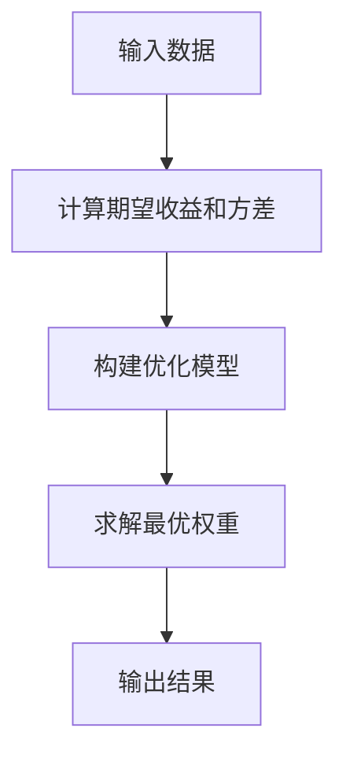
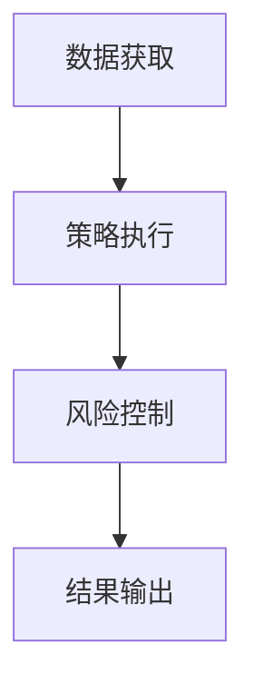

                 


# 如何将特价股票策略融入指数增强型投资

> 关键词：指数增强型投资，特价股票策略，投资优化，数学模型，机器学习

> 摘要：本文详细探讨了如何将特价股票策略与指数增强型投资相结合，通过数学建模和算法优化，提出了一种新的投资策略。文章从背景介绍、核心概念、算法原理、系统架构到项目实战，全面分析了这一策略的实现路径，并给出了具体的Python代码示例和投资系统的架构设计。

---

## 第一部分: 特价股票策略与指数增强型投资背景介绍

### 第1章: 特价股票策略概述

#### 1.1 特价股票策略的定义与背景

##### 1.1.1 特价股票的定义与特点
特价股票是指在特定市场条件下，价格被低估的股票。其特点包括：

- **低估性**：市场价格低于内在价值。
- **波动性**：价格波动较大，存在短期套利机会。
- **周期性**：通常出现在市场下跌周期或公司困境时期。

##### 1.1.2 特价股票策略的背景与应用
特价股票策略是一种主动投资策略，旨在通过挖掘市场低估的机会获取超额收益。其应用背景包括：

- **市场周期性波动**：在市场低迷时，许多优质股票可能被低估。
- **投资者情绪影响**：市场恐慌可能导致股票价格偏离基本面。
- **套利机会**：短期价格波动为投资者提供了介入和退出的机会。

##### 1.1.3 特价股票策略的核心要素
包括以下几点：

- **基本面分析**：评估公司的财务状况和内在价值。
- **市场情绪分析**：利用技术分析和市场情绪指标。
- **交易策略**：确定介入和退出的时机。

#### 1.2 特价股票策略的背景与应用

##### 1.2.1 特价股票策略的背景
随着金融市场的发展，投资者对超额收益的需求日益增加。特价股票策略作为一种主动投资策略，逐渐受到关注。

##### 1.2.2 特价股票策略的应用场景
包括市场低迷、行业调整、公司困境等时期。

##### 1.2.3 特价股票策略的核心要素
包括基本面分析、市场情绪分析、交易策略等。

---

### 第2章: 指数增强型投资概述

#### 2.1 指数增强型投资的定义与目标

##### 2.1.1 指数投资的基本概念
指数投资是一种被动投资策略，旨在通过跟踪市场指数获得市场平均收益。

##### 2.1.2 指数增强型投资的目标与优势
指数增强型投资的目标是在跟踪指数的基础上，通过主动管理获得超额收益。其优势包括：

- **分散风险**：通过分散投资降低个股风险。
- **透明度高**：指数构成清晰，易于理解。
- **成本低**：被动投资管理费用较低。

##### 2.1.3 指数增强型投资的实现方式
包括因子投资、动量策略、均值-方差优化等。

---

### 第3章: 特价股票策略与指数增强型投资的结合

#### 3.1 结合的背景与意义

##### 3.1.1 特价股票策略在投资中的作用
通过挖掘低估股票，提升投资组合的收益。

##### 3.1.2 指数增强型投资的需求与挑战
指数增强型投资需要通过主动管理获取超额收益。

##### 3.1.3 两者结合的潜在优势
结合两者的优点，提升投资组合的风险调整后收益。

#### 3.2 结合的核心概念与联系

##### 3.2.1 特价股票策略与指数增强型投资的相互作用
通过表格对比分析：

| 特性        | 特价股票策略                | 指数增强型投资               |
|-------------|-----------------------------|------------------------------|
| 投资目标     | 获取超额收益                | 跟踪指数并获取超额收益        |
| 风险         | 较高                       | 较低                        |
| 持有期       | 短期至中期                 | 长期                       |

##### 3.2.2 数据特征与模型关系的对比表格
分析特价股票策略和指数增强型投资在数据特征上的差异：

| 数据特征     | 特价股票策略                | 指数增强型投资               |
|--------------|-----------------------------|------------------------------|
| 关注点       | 股价低估、基本面良好        | 指数成分股、因子暴露          |
| 数据来源     | 股价、财务数据              | 指数数据、因子数据            |
| 模型复杂度   | 中等                       | 较低                        |

##### 3.2.3 系统架构的ER实体关系图
使用mermaid绘制系统架构图：

```mermaid
erDiagram
    investor {
        inv_id : integer
        inv_strategy : string
        inv_portfolio : string
    }
    stock_market {
        stock_id : integer
        stock_price : float
        stock基本面 : string
    }
    investment_system :{
        invest_id : integer
        invest_amount : float
        invest_date : date
    }
    investor -- stock_market : "交易"
    investor -- investment_system : "管理"
    stock_market -- investment_system : "数据输入"
```

---

## 第二部分: 算法原理与数学模型

### 第4章: 特价股票策略的优化算法

#### 4.1 均值-方差优化算法

##### 4.1.1 算法原理与流程图
使用mermaid绘制均值-方差优化流程图：



##### 4.1.2 数学模型与公式
均值-方差优化的数学模型如下：

$$
\min \quad \sigma^2 \\
\text{s.t.} \quad \mathbf{w}^T \mathbf{r} = \mu \\
\mathbf{w}^T \mathbf{w} = 1 \\
$$

其中：
- $\mathbf{w}$ 是权重向量。
- $\mathbf{r}$ 是期望收益向量。
- $\mu$ 是目标收益。
- $\sigma^2$ 是方差。

##### 4.1.3 优化算法的Python实现
以下是Python代码示例：

```python
import numpy as np
from scipy.optimize import minimize

def optimize_weights(r, mu):
    n = len(r)
    def objective(w):
        return np.dot(w.T, w)
    constraints = [
        {'type': 'eq', 'fun': lambda w: np.dot(w, r) - mu},
        {'type': 'eq', 'fun': lambda w: np.sum(w) - 1}
    ]
    result = minimize(objective, np.ones(n)/n, method='SLSQP', constraints=constraints)
    return result.x

# 示例数据
r = np.array([0.1, 0.12, 0.08])
mu = 0.1
weights = optimize_weights(r, mu)
print(weights)
```

---

### 第5章: 机器学习模型的应用

#### 5.1 机器学习在特价股票策略中的作用

##### 5.1.1 常见算法（如随机森林、神经网络）的实现
使用随机森林进行股票筛选的示例代码：

```python
from sklearn.ensemble import RandomForestClassifier

# 示例数据
X = np.array([[2, 3], [5, 8], [1, 1]])
y = np.array([0, 1, 0])

model = RandomForestClassifier(n_estimators=10)
model.fit(X, y)
```

---

## 第三部分: 系统分析与架构设计

### 第6章: 投资系统架构设计

#### 6.1 问题场景与需求分析

##### 6.1.1 投资目标与约束条件
包括收益目标、风险承受能力、交易成本等。

##### 6.1.2 数据来源与处理需求
包括股票数据、市场数据、因子数据等。

##### 6.1.3 

---

### 第7章: 系统功能设计与实现

#### 7.1 系统功能设计

##### 7.1.1 系统功能模块划分
包括数据获取、策略执行、风险控制等。

##### 7.1.2 系统功能流程图
使用mermaid绘制系统功能流程图：



---

## 第四部分: 项目实战

### 第8章: 项目实战

#### 8.1 环境搭建

##### 8.1.1 安装必要的Python库
包括numpy、pandas、scikit-learn等。

#### 8.2 系统核心实现

##### 8.2.1 核心代码实现
包括策略执行、风险控制等模块的实现。

##### 8.2.2 代码解读与分析
详细解读代码功能和实现逻辑。

#### 8.3 实际案例分析

##### 8.3.1 案例背景与数据准备
分析一个具体的案例，准备相关数据。

##### 8.3.2 策略实现与结果展示
展示策略的实现过程和结果。

##### 8.3.3 结果分析与经验总结
对结果进行分析，总结经验教训。

#### 8.4 项目小结

##### 8.4.1 项目总结
总结项目的实现过程和成果。

##### 8.4.2 经验教训
总结在项目中遇到的问题和解决方法。

---

## 第五部分: 最佳实践与小结

### 第9章: 最佳实践

#### 9.1 风险管理

##### 9.1.1 风险管理的重要性
强调风险管理在投资中的关键作用。

##### 9.1.2 风险控制的具体措施
包括止损、分散投资等。

#### 9.2 投资者心理因素

##### 9.2.1 心理因素对投资决策的影响
分析贪婪、恐惧等心理对投资的影响。

##### 9.2.2 心理控制的具体方法
包括心理调节、纪律性等。

#### 9.3 法律合规性

##### 9.3.1 投资行为的法律合规性
强调合规性的重要性。

##### 9.3.2 风险提示与合规建议
提供合规建议和风险提示。

---

### 第10章: 小结与展望

#### 10.1 本文总结
总结全文的主要内容和结论。

#### 10.2 未来展望
展望未来的研究方向和应用前景。

---

## 参考文献

- 文献1：《指数投资与主动管理》
- 文献2：《机器学习在金融中的应用》
- 文献3：《风险管理与投资组合优化》

---

## 作者

作者：AI天才研究院/AI Genius Institute & 禅与计算机程序设计艺术/Zen And The Art of Computer Programming

---

通过以上结构，文章内容将系统地介绍如何将特价股票策略融入指数增强型投资，从理论到实践，全面分析其实现路径和应用前景。

