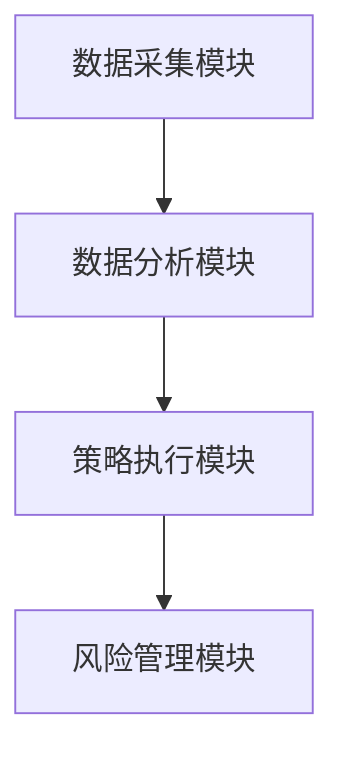

                 


# 如何将特价股票策略融入整体投资组合

---

## 关键词：
特价股票、投资组合、风险管理、技术分析、数学模型

---

## 摘要：
本文详细探讨了如何将特价股票策略融入整体投资组合，从基本概念到数学模型，再到系统架构设计和实战案例，全面解析了特价股票策略的实施方法。文章首先介绍了特价股票的基本概念和投资组合的整体策略，然后分析了特价股票策略的核心原理和数学模型，接着详细讲解了系统的架构设计，最后通过实际案例分析了策略的实施过程和注意事项。

---

## 正文：

---

## 第一部分: 特价股票策略与投资组合概述

### 第1章: 特价股票策略的基本概念

#### 1.1 特价股票的定义与特点

##### 1.1.1 什么是特价股票
特价股票是指在特定市场条件下，价格低于其内在价值的股票。这类股票通常被市场低估，具有较高的投资潜力。特价股票的核心特征包括低估值、高成长性和潜在的上涨空间。

##### 1.1.2 特价股票的市场定位
特价股票通常出现在市场低迷或行业调整期，投资者可以通过分析公司的基本面和市场趋势，找到被低估的股票进行投资。

##### 1.1.3 特价股票与普通股票的区别
与普通股票相比，特价股票具有以下区别：
- 价格低于内在价值
- 风险较高，但潜在收益也较大
- 更依赖于市场周期和公司基本面分析

#### 1.2 投资组合的基本概念

##### 1.2.1 投资组合的定义
投资组合是指投资者持有的多种资产（如股票、债券、基金等）的组合。通过分散投资，投资组合可以降低单一资产的风险，同时优化收益。

##### 1.2.2 投资组合的分类
投资组合可以分为以下几类：
- 按资产类型：股票型、债券型、混合型等
- 按风险水平：保守型、平衡型、激进型等
- 按投资策略：价值型、成长型、指数型等

##### 1.2.3 投资组合的目标与风险
投资组合的目标通常包括：
- 实现资产增值
- 降低投资风险
- 优化资产配置

投资组合的风险主要体现在市场波动、资产流动性不足和组合内资产的相关性等方面。

#### 1.3 特价股票策略在投资组合中的作用

##### 1.3.1 特价股票策略的潜在收益
通过投资特价股票，投资者可以在市场低估时买入，待市场恢复时卖出，获得超额收益。

##### 1.3.2 特价股票策略的风险分析
特价股票的风险主要体现在市场波动、公司基本面变化和流动性不足等方面。

##### 1.3.3 特价股票策略与其他投资策略的对比
与成长型股票相比，特价股票更注重估值；与防御型股票相比，特价股票更注重周期性机会。

---

### 第2章: 特价股票策略的核心原理

#### 2.1 特价股票的市场分析

##### 2.1.1 市场周期与特价股票的机会
市场周期包括牛市和熊市。在熊市中，许多优质股票被低估，为特价股票策略提供了机会。

##### 2.1.2 市场情绪对特价股票的影响
市场情绪通常会影响股票价格。在市场恐慌时，特价股票可能会被进一步低估，为投资者提供买入机会。

##### 2.1.3 市场数据与特价股票的关系
通过分析市场数据（如市盈率、市净率等），投资者可以识别出被低估的特价股票。

#### 2.2 投资组合的构建原理

##### 2.2.1 投资组合的资产配置
资产配置是投资组合的核心，通常包括股票、债券、现金等资产。

##### 2.2.2 投资组合的风险分散策略
通过分散投资，可以降低单一资产的风险。特价股票在投资组合中的权重应根据整体风险承受能力来确定。

##### 2.2.3 投资组合的收益最大化方法
通过优化资产配置和策略选择，可以在控制风险的前提下实现收益最大化。

#### 2.3 特价股票策略与投资组合的结合

##### 2.3.1 特价股票在投资组合中的权重分配
根据市场环境和投资目标，确定特价股票在组合中的权重。

##### 2.3.2 特价股票策略对投资组合风险的影响
通过引入特价股票，可以在市场低估时增加收益，同时分散风险。

##### 2.3.3 投资组合对特价股票策略的优化作用
投资组合可以通过动态调整资产配置，优化特价股票策略的实施效果。

---

### 第3章: 特价股票策略的数学模型与公式

#### 3.1 特价股票的估值模型

##### 3.1.1 市盈率模型
市盈率（P/E）= 股票价格 / 每股收益

##### 3.1.2 市净率模型
市净率（P/B）= 股票价格 / 每股净资产

##### 3.1.3 股息率模型
股息率 = 每股股息 / 股票价格

#### 3.2 投资组合的收益与风险模型

##### 3.2.1 单一资产的收益与风险
收益 = 收益率 × 投资金额
风险 = 方差（收益率）

##### 3.2.2 投资组合的收益与风险
投资组合的收益 = 各资产收益率的加权平均
投资组合的风险 = 方差（组合收益率）

##### 3.2.3 马科维茨的有效前沿理论
马科维茨的有效前沿理论指出，投资组合的最优配置是在相同风险下收益最大化，或相同收益下风险最小化。

#### 3.3 特价股票策略的数学公式

##### 3.3.1 特价股票的预期收益公式
预期收益 = 市场预期收益率 × 股票贝塔系数 + 无风险利率 × （1 - 贝塔系数）

##### 3.3.2 投资组合的风险调整收益公式
风险调整收益 = 投资组合收益 - 风险-free 利率

##### 3.3.3 特价股票策略的优化公式
通过优化模型（如均值-方差优化）确定特价股票在投资组合中的最优权重。

---

### 第4章: 特价股票策略的系统架构设计

#### 4.1 系统功能设计

##### 4.1.1 数据采集模块
从股票市场获取实时数据，包括价格、成交量等。

##### 4.1.2 数据分析模块
使用技术分析和基本面分析对股票进行评估。

##### 4.1.3 策略执行模块
根据分析结果执行买卖指令。

##### 4.1.4 风险管理模块
监控投资组合的风险，并进行动态调整。

#### 4.2 系统架构图


#### 4.3 系统接口设计

##### 4.3.1 数据接口的设计
通过API获取股票数据。

##### 4.3.2 策略接口的设计
定义策略执行的规则和条件。

##### 4.3.3 风险管理接口的设计
实时监控投资组合的风险指标。

#### 4.4 本章小结

---

### 第5章: 特价股票策略的项目实战

#### 5.1 环境安装与配置

##### 5.1.1 数据库安装
安装MySQL或其他数据库系统。

##### 5.1.2 分析工具安装
安装Python、Pandas、NumPy等工具。

##### 5.1.3 系统环境配置
配置网络、权限等。

#### 5.2 系统核心实现

##### 5.2.1 数据采集与处理
使用API获取股票数据，并进行清洗和整理。

##### 5.2.2 策略开发与测试
开发特价股票筛选模型，并进行回测。

##### 5.2.3 风险管理与监控
实时监控投资组合的风险，并进行动态调整。

#### 5.3 代码实现与解读

##### 5.3.1 数据采集代码
```python
import pandas as pd
import requests

def get_stock_data(ticker):
    url = f"https://api.example.com/stock/{ticker}"
    response = requests.get(url)
    data = response.json()
    df = pd.DataFrame(data)
    return df
```

##### 5.3.2 策略执行代码
```python
def execute_strategy(ticker, data):
    # 计算市盈率和市净率
    pe = data['price'] / data['eps']
    pb = data['price'] / data['book_value']
    if pe < 15 and pb < 2:
        return True  # 买入信号
    else:
        return False  # 不买入
```

##### 5.3.3 风险管理代码
```python
def manage_risk(portfolio, data):
    # 计算投资组合风险
    risk = portfolio.variance
    if risk > 0.05:
        # 降低风险
        portfolio.rebalance()
    return portfolio
```

#### 5.4 实际案例分析

##### 5.4.1 案例背景介绍
假设在2022年熊市期间，投资者发现某公司股票价格被低估，市盈率和市净率均低于行业平均水平。

##### 5.4.2 案例分析过程
通过技术分析和基本面分析，确定该股票为特价股票，纳入投资组合。

##### 5.4.3 案例结果与总结
投资组合在市场恢复后获得超额收益，验证了特价股票策略的有效性。

#### 5.5 本章小结

---

## 第六部分: 特价股票策略的最佳实践与注意事项

### 6.1 最佳实践 tips

#### 6.1.1 数据选择与处理的技巧
优先选择流动性高、数据完整的股票。

#### 6.1.2 策略开发与优化的建议
结合技术分析和基本面分析，优化策略模型。

#### 6.1.3 风险管理与监控
实时监控投资组合的风险，及时调整策略。

### 6.2 心理因素与投资决策

#### 6.2.1 投资者心理对策略的影响
避免贪婪和恐惧，保持理性决策。

#### 6.2.2 理性与感性决策的平衡
在策略实施中，保持理性分析，同时关注市场情绪。

### 6.3 小结

---

## 作者：
AI天才研究院/AI Genius Institute  
禅与计算机程序设计艺术/Zen And The Art of Computer Programming

