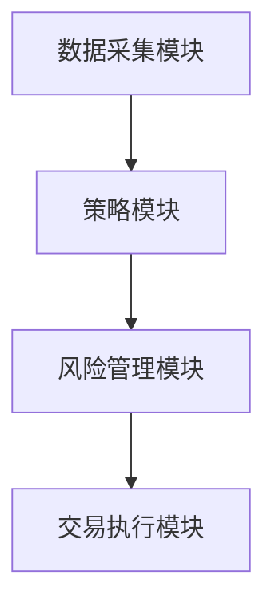

                 

# 如何将特价股票策略融入智能Beta投资

## 关键词：
- 特价股票策略
- 智能Beta投资
- 量化投资
- 算法交易
- 风险管理

## 摘要：
本文将详细介绍如何将特价股票策略融入智能Beta投资。首先，我们从特价股票策略和智能Beta投资的基本概念出发，探讨其在投资组合中的应用前景。接着，深入分析特价股票的识别与筛选方法，以及智能Beta投资的量化方法和风险管理策略。随后，我们结合实际案例，展示如何将特价股票策略与智能Beta投资相结合，构建高效的量化投资模型。最后，通过系统架构设计和项目实战，总结出一套完整的智能Beta投资策略，并提出未来的研究方向。

---

# 第1章: 特价股票策略与智能Beta投资概述

## 1.1 特价股票策略的定义与特点

### 1.1.1 特价股票的定义
特价股票是指那些市场价格低于其内在价值的股票。通常，这些股票可能因为市场波动、公司短期问题或市场参与者情绪影响而被低估。特价股票的核心特征是“价值被市场暂时忽视”，因此具有较高的投资潜力。

### 1.1.2 特价股票的核心特点
- **低估性**：市场价格低于内在价值。
- **周期性**：通常出现在市场低迷或特定行业周期性低谷。
- **高波动性**：价格波动较大，但具备长期上升潜力。

### 1.1.3 特价股票与传统投资的区别
| 方面 | 特价股票策略 | 传统投资策略 |
|------|--------------|--------------|
| 投资目标 | 短期价值修复 | 长期资产配置 |
| 风险承受 | 较高 | 较低 |
| 操作频率 | 灵活 | 稳定 |

---

## 1.2 智能Beta投资的定义与原理

### 1.2.1 智能Beta投资的定义
智能Beta投资是一种结合量化分析和主动管理的投资策略，旨在通过算法优化投资组合的Beta收益（系统性收益）。与传统被动投资（如指数基金）不同，智能Beta投资通过动态调整持仓，捕捉市场机会，同时控制风险。

### 1.2.2 智能Beta投资的核心原理
- **量化分析**：利用数学模型和算法，分析市场数据，发现投资机会。
- **动态调整**：根据市场变化，实时优化投资组合。
- **风险管理**：通过量化手段，实时监控和控制风险。

### 1.2.3 智能Beta投资与传统Beta投资的对比
| 方面 | 智能Beta投资 | 传统Beta投资 |
|------|--------------|--------------|
| 策略灵活性 | 高 | 低 |
| 风险管理 | 动态 | 静态 |
| 成本 | 较低 | 较高 |

---

## 1.3 特价股票策略在智能Beta投资中的应用前景

### 1.3.1 特价股票策略的潜在应用场景
- **市场低迷期**：通过识别低估股票，捕捉反弹机会。
- **行业周期低谷**：投资于特定行业的低估股票，等待周期反转。
- **短期套利机会**：利用市场短期波动，快速买卖低估股票。

### 1.3.2 智能Beta投资的优势与挑战
- **优势**：
  - 数据处理能力强。
  - 策略执行效率高。
  - 风险控制能力强。
- **挑战**：
  - 市场波动可能导致策略失效。
  - 算法优化难度大。
  - 成本控制要求高。

### 1.3.3 特价股票策略与智能Beta投资的结合机会
通过智能Beta投资的量化能力，可以将特价股票策略转化为可执行的投资策略，同时利用智能Beta的投资框架，优化组合管理，降低风险。

---

## 1.4 本章小结
本章介绍了特价股票策略和智能Beta投资的基本概念、特点和应用场景，并探讨了两者的结合机会。智能Beta投资为特价股票策略提供了量化和动态优化的平台，而特价股票策略则为智能Beta投资提供了丰富的投资标的。

---

# 第2章: 特价股票策略的核心概念与分析

## 2.1 特价股票的识别与筛选

### 2.1.1 特价股票的识别标准
- **市盈率（P/E）**：低于行业平均水平。
- **市净率（P/B）**：低于行业平均水平。
- **股息率**：高于行业平均水平。

### 2.1.2 市盈率、市净率等指标的分析
- **市盈率（P/E）**：衡量股票的相对估值，P/E越低，可能低估。
- **市净率（P/B）**：衡量资产的实际价值，P/B越低，可能低估。
- **股息率**：衡量分红能力，高股息率可能表明公司盈利稳定。

### 2.1.3 特价股票筛选模型的构建
- **数据采集**：收集历史价格、财务数据、行业指标。
- **指标计算**：计算P/E、P/B等指标。
- **筛选条件**：设定多维度筛选条件，如P/E < 行业平均且P/B < 行业平均。

---

## 2.2 特价股票策略的核心要素

### 2.2.1 时间周期的选择
- **短期策略**：适用于市场波动较大时，寻找短期低估机会。
- **长期策略**：适用于市场低迷时，寻找长期低估股票。

### 2.2.2 风险控制的策略
- **止损策略**：设定止损点，避免损失扩大。
- **分散投资**：通过投资多个低估股票，降低风险。

### 2.2.3 特价股票的组合优化
- **组合构建**：根据风险偏好，构建不同风险级别的股票组合。
- **动态调整**：定期评估组合表现，进行优化。

---

## 2.3 特价股票策略与市场周期的关系

### 2.3.1 特价股票在熊市中的表现
- 熊市中，股票价格普遍下跌，许多股票可能被低估。
- 特价股票策略在熊市中可能表现较好。

### 2.3.2 特价股票在牛市中的表现
- 牛市中，股票价格普遍上涨，低估股票可能被市场重新定价。
- 特价股票策略可能表现较弱。

### 2.3.3 市场周期对策略的影响
- **牛市**：策略表现可能受限。
- **熊市**：策略表现可能较好。
- **震荡市**：策略需要灵活调整。

---

## 2.4 本章小结
本章详细分析了特价股票的识别与筛选方法，探讨了策略的核心要素和市场周期对策略的影响。通过合理的筛选和组合优化，可以提高特价股票策略的有效性。

---

# 第3章: 智能Beta投资的原理与方法

## 3.1 智能Beta投资的定义与特点

### 3.1.1 智能Beta投资的定义
智能Beta投资是一种结合量化分析和动态调整的投资策略，旨在通过算法优化投资组合的Beta收益，同时控制风险。

### 3.1.2 智能Beta投资的核心特点
- **量化分析**：利用数学模型和算法进行投资决策。
- **动态调整**：根据市场变化，实时优化投资组合。
- **风险管理**：通过量化手段，实时监控和控制风险。

---

## 3.2 智能Beta投资的量化方法

### 3.2.1 数据采集与处理
- **数据来源**：市场数据、财务数据、新闻数据。
- **数据清洗**：去除无效数据，处理异常值。

### 3.2.2 量化模型的构建
- **模型选择**：根据目标选择合适模型，如回归模型、因子模型。
- **参数优化**：通过历史数据优化模型参数。
- **模型验证**：通过回测验证模型的有效性。

### 3.2.3 量化指标的优化
- **因子选择**：选择影响股票收益的关键因子。
- **因子权重**：根据因子的重要性，分配权重。
- **因子调整**：根据市场变化，动态调整因子权重。

---

## 3.3 智能Beta投资的风险管理策略

### 3.3.1 风险管理的定义与目标
- **风险管理**：通过量化手段，控制投资组合的风险。
- **目标**：将风险控制在可接受范围内，同时追求超额收益。

### 3.3.2 风险管理的量化方法
- **VaR（在险价值）**：衡量投资组合的最大潜在损失。
- **波动率**：衡量投资组合的波动性。
- **相关性分析**：分析不同资产的相关性，分散风险。

### 3.3.3 风险管理在智能Beta投资中的应用
- **动态调整**：根据风险指标，动态调整投资组合。
- **风险对冲**：利用衍生品对冲部分风险。

---

## 3.4 本章小结
本章详细介绍了智能Beta投资的原理和量化方法，探讨了风险管理策略。通过量化分析和动态调整，可以有效优化投资组合的收益和风险。

---

# 第4章: 特价股票策略与智能Beta投资的结合

## 4.1 特价股票策略在智能Beta投资中的应用

### 4.1.1 特价股票策略的智能化改造
- **自动化筛选**：利用算法自动筛选低估股票。
- **动态调整**：根据市场变化，动态调整持仓。

### 4.1.2 智能Beta投资中的策略优化
- **因子模型**：将特价股票策略融入因子模型，优化投资组合。
- **组合优化**：通过量化方法，优化特价股票组合。

### 4.1.3 特价股票策略与智能Beta投资的协同效应
- **收益增强**：通过智能Beta投资优化组合，提高收益。
- **风险控制**：通过智能Beta投资的动态调整，降低风险。

---

## 4.2 特价股票策略与智能Beta投资的融合模型

### 4.2.1 模型构建的基本思路
- **数据采集**：收集历史价格、财务数据、行业指标。
- **因子筛选**：筛选影响特价股票收益的关键因子。
- **模型构建**：构建量化模型，优化投资组合。

### 4.2.2 模型的输入与输出
- **输入**：市场数据、财务数据、因子权重。
- **输出**：投资组合配置、风险指标。

### 4.2.3 模型的验证与优化
- **回测**：通过历史数据验证模型的有效性。
- **参数优化**：根据回测结果，优化模型参数。
- **实时调整**：根据市场变化，实时优化模型。

---

## 4.3 特价股票策略在智能Beta投资中的风险管理

### 4.3.1 风险管理的定义与目标
- **风险管理**：通过量化手段，控制投资组合的风险。
- **目标**：将风险控制在可接受范围内，同时追求超额收益。

### 4.3.2 风险管理的量化方法
- **VaR（在险价值）**：衡量投资组合的最大潜在损失。
- **波动率**：衡量投资组合的波动性。
- **相关性分析**：分析不同资产的相关性，分散风险。

### 4.3.3 风险管理在智能Beta投资中的应用
- **动态调整**：根据风险指标，动态调整投资组合。
- **风险对冲**：利用衍生品对冲部分风险。

---

## 4.4 本章小结
本章详细探讨了特价股票策略与智能Beta投资的结合，介绍了融合模型的构建和风险管理策略。通过智能化改造和动态调整，可以有效优化投资组合的收益和风险。

---

# 第5章: 系统设计与实现

## 5.1 系统架构设计

### 5.1.1 系统功能模块
- **数据采集模块**：收集市场数据、财务数据。
- **策略模块**：实现特价股票筛选和投资组合优化。
- **风险管理模块**：监控和控制风险。
- **交易执行模块**：执行交易指令。

### 5.1.2 系统架构图

---

## 5.2 系统实现

### 5.2.1 数据采集与处理
- **数据源**：股票市场数据、财务数据。
- **数据清洗**：去除无效数据，处理异常值。

### 5.2.2 策略实现
- **特价股票筛选**：基于P/E、P/B等指标，筛选低估股票。
- **投资组合优化**：利用量化模型，优化投资组合。

### 5.2.3 风险管理实现
- **风险监控**：实时监控VaR、波动率等风险指标。
- **风险对冲**：利用衍生品对冲部分风险。

---

## 5.3 系统优化

### 5.3.1 性能优化
- **数据处理效率**：优化数据采集和处理流程。
- **算法优化**：优化策略算法，提高执行效率。

### 5.3.2 系统稳定性
- **容错设计**：设计容错机制，防止系统崩溃。
- **备份与恢复**：建立数据备份和系统恢复机制。

---

## 5.4 本章小结
本章详细介绍了系统设计与实现，包括架构设计、功能模块实现和系统优化。通过高效的系统设计，可以确保智能Beta投资策略的顺利执行。

---

# 第6章: 实际案例分析

## 6.1 案例背景介绍
- **市场环境**：假设当前市场处于熊市，许多股票被低估。
- **投资目标**：寻找低估股票，构建智能Beta投资组合。

---

## 6.2 案例分析

### 6.2.1 数据采集与筛选
- **数据采集**：收集过去一年的股票数据。
- **筛选条件**：P/E < 行业平均，P/B < 行业平均。

### 6.2.2 投资组合构建
- **组合构成**：筛选出10只低估股票，构建投资组合。
- **权重分配**：根据股票的低估程度，分配权重。

### 6.2.3 风险管理
- **VaR计算**：计算投资组合的VaR，设定止损点。
- **风险对冲**：利用股指期货对冲部分系统性风险。

---

## 6.3 实例分析与结果解读
- **回测结果**：投资组合在回测期内表现优于市场指数。
- **风险控制**：VaR在可接受范围内，风险得到有效控制。

---

## 6.4 本章小结
本章通过实际案例分析，验证了特价股票策略与智能Beta投资结合的有效性。通过合理的数据筛选和组合优化，可以构建出表现优异的投资组合。

---

# 第7章: 总结与展望

## 7.1 本章总结
本文详细介绍了如何将特价股票策略融入智能Beta投资，探讨了策略的结合方式和系统设计。通过智能化改造和动态调整，可以有效优化投资组合的收益和风险。

---

## 7.2 未来展望
- **算法优化**：进一步优化策略算法，提高执行效率。
- **风险管理**：探索更多风险管理方法，降低投资风险。
- **市场拓展**：将策略应用于更多市场和资产类别。

---

# 作者：AI天才研究院/AI Genius Institute & 禅与计算机程序设计艺术 /Zen And The Art of Computer Programming

