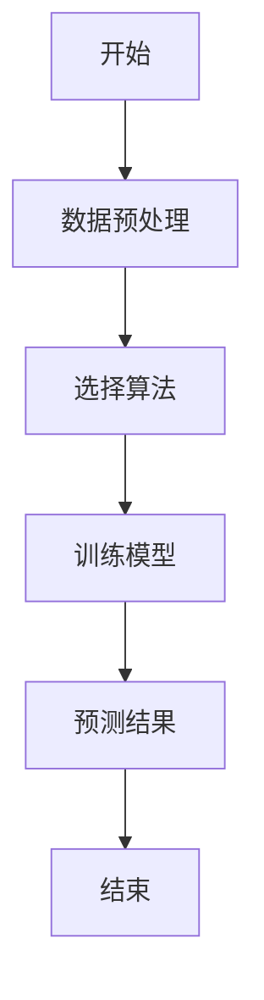
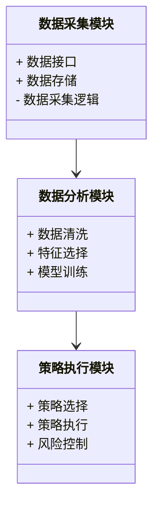

                 


# 如何建立特价股票投资的系统化流程

## 关键词：特价股票、投资流程、系统化方法、数学模型、算法设计、风险管理

## 摘要：  
本文详细介绍了如何建立特价股票投资的系统化流程，从背景介绍到系统化流程的设计，再到数学模型和算法的实现，最后结合项目实战和最佳实践，为投资者提供了一套完整且实用的系统化投资方法。通过本文，读者可以掌握从数据分析到策略制定、从风险控制到系统架构的全过程，从而在特价股票投资中实现科学化、系统化的管理。

---

## 第一部分: 特价股票投资的背景与基础

### 第1章: 特价股票投资概述

#### 1.1 特价股票的定义与特点
##### 1.1.1 特价股票的定义
特价股票是指价格低于面值的股票，通常由于市场波动、公司业绩不佳或其他特殊原因导致的股价下跌。与普通股票相比，特价股票具有价格低廉、潜在回报高、风险可控等特点。

##### 1.1.2 特价股票的特点
- **价格低廉**：特价股票的价格通常远低于面值，适合资金有限的投资者。
- **潜在回报高**：由于价格被低估，特价股票存在较大的上涨空间。
- **风险可控**：通过系统化的投资策略，可以有效降低投资风险。

##### 1.1.3 特价股票与普通股票的区别
下表对比了特价股票和普通股票的主要区别：

```mermaid
table
| 特点 | 特价股票 | 普通股票 |
|------|----------|----------|
| 价格 | 低于面值 | 等于或高于面值 |
| 风险 | 中高 | 较低 |
| 回报 | 高 | 中低 |
| 适合 | 中小投资者 | 大型机构投资者 |
```

#### 1.2 特价股票投资的背景与现状
##### 1.2.1 特价股票投资的背景
随着市场的波动，越来越多的投资者开始关注特价股票，尤其是在市场低迷时期，特价股票往往成为抄底的机会。

##### 1.2.2 当前特价股票投资的现状
目前，特价股票投资主要集中在以下几个方面：
- **技术分析**：通过技术指标筛选潜在的特价股票。
- **价值投资**：通过基本面分析寻找被低估的股票。
- **组合投资**：通过分散投资降低风险。

##### 1.2.3 特价股票投资的未来趋势
随着技术的进步，未来特价股票投资将更加依赖于系统化的方法，结合大数据和人工智能技术，进一步提高投资的效率和准确性。

### 第2章: 特价股票投资的核心概念

#### 2.1 特价股票投资的理论基础
##### 2.1.1 投资学基础
投资学是研究资金分配和风险管理的学科，是特价股票投资的理论基础。

##### 2.1.2 股票定价理论
股票定价理论主要包括内在价值法和市场价值法。内在价值法通过公司基本面分析确定股票的合理价格，市场价值法则通过市场供需关系确定股票价格。

##### 2.1.3 特价股票的市场机会
特价股票的市场机会主要体现在以下方面：
- **市场低估**：市场对某些股票的估值过低，导致股价低于实际价值。
- **周期性波动**：市场周期性波动为投资者提供了低价买入的机会。

#### 2.2 特价股票投资的策略分类
##### 2.2.1 价值投资策略
价值投资策略的核心是寻找被市场低估的股票，通过长期持有实现收益。

##### 2.2.2 技术分析策略
技术分析策略通过分析股票的价格走势，寻找买入和卖出的最佳时机。

##### 2.2.3 组合投资策略
组合投资策略通过将资金分散投资于多个股票，降低投资风险。

#### 2.3 特价股票投资的风险与收益
##### 2.3.1 特价股票投资的主要风险
- **市场风险**：市场波动可能导致股价进一步下跌。
- **流动性风险**：部分特价股票流动性较差，可能导致变现困难。

##### 2.3.2 特价股票投资的潜在收益
- **短期收益**：通过技术分析或价值发现，投资者可以在短期内获得较高的收益。
- **长期收益**：通过价值投资策略，投资者可以实现长期稳定的收益。

##### 2.3.3 风险与收益的平衡
通过系统化的方法，投资者可以在风险可控的前提下，实现收益的最大化。例如，通过分散投资、设置止损线等方法，可以有效降低投资风险。

---

## 第二部分: 特价股票投资的系统化流程

### 第3章: 特价股票投资流程的设计

#### 3.1 系统化流程的核心要素
##### 3.1.1 数据收集与处理
数据收集与处理是系统化投资的基础，包括以下步骤：
- **数据收集**：收集历史股价、财务数据、市场信息等。
- **数据清洗**：去除无效数据，处理缺失值。
- **数据标准化**：将数据转换为统一的格式，便于后续分析。

##### 3.1.2 策略制定与优化
策略制定与优化是系统化投资的核心，包括以下步骤：
- **策略制定**：根据市场情况制定投资策略，例如价值投资策略、技术分析策略等。
- **策略优化**：通过回测和调整参数，优化投资策略的收益和风险比。

##### 3.1.3 风险控制与执行
风险控制与执行是系统化投资的关键，包括以下步骤：
- **风险控制**：设定止损线、分散投资等方法，降低投资风险。
- **策略执行**：根据优化后的策略，执行实际投资操作。

#### 3.2 系统化流程的步骤分解
##### 3.2.1 数据收集与预处理
- **数据收集**：通过API获取历史股价数据，包括开盘价、收盘价、最高价、最低价等。
- **数据清洗**：去除缺失值，处理异常值。
- **数据标准化**：将数据标准化，例如归一化处理。

##### 3.2.2 策略模型的建立
- **模型选择**：选择适合的策略模型，例如回归模型、机器学习模型等。
- **特征选择**：根据历史数据，选择对投资结果影响较大的特征，例如市盈率、市净率等。
- **模型训练**：通过历史数据训练模型，得到最优参数。

##### 3.2.3 策略的回测与优化
- **回测**：通过回测验证策略的有效性，计算策略的收益和风险比。
- **优化**：根据回测结果，调整策略参数，进一步优化投资效果。

##### 3.2.4 策略的执行与监控
- **执行**：根据优化后的策略，执行实际投资操作。
- **监控**：实时监控投资组合的表现，及时调整策略。

---

### 第4章: 特价股票投资的数学模型与算法

#### 4.1 数据预处理与特征选择
##### 4.1.1 数据清洗方法
- **去除缺失值**：通过删除包含缺失值的样本，或者用均值、中位数等方法填充缺失值。
- **处理异常值**：通过箱线图识别异常值，并进行处理。

##### 4.1.2 特征工程的实现
- **特征选择**：通过相关性分析、主成分分析等方法，选择对投资结果影响较大的特征。
- **特征变换**：对特征进行变换，例如对数变换、标准化等。

##### 4.1.3 数据标准化与归一化
- **标准化**：将数据按比例缩放到均值为0，标准差为1。
- **归一化**：将数据按比例缩放到0-1范围。

#### 4.2 算法选择与实现
##### 4.2.1 算法选择
根据实际需求，选择适合的算法，例如线性回归、支持向量机、随机森林等。

##### 4.2.2 算法实现
以下是一个简单的线性回归算法实现示例：

```python
import numpy as np
from sklearn.linear_model import LinearRegression

# 数据预处理
X = np.array([[1, 2], [3, 4], [5, 6]])
y = np.array([1, 2, 3])

# 模型训练
model = LinearRegression()
model.fit(X, y)

# 预测
new_X = np.array([[7, 8]])
predicted_y = model.predict(new_X)
print(predicted_y)
```

##### 4.2.3 算法流程图
以下是一个简单的算法流程图：



---

### 第5章: 系统架构设计与项目实战

#### 5.1 系统架构设计
##### 5.1.1 系统功能设计
- **数据采集模块**：负责采集历史股价数据。
- **数据分析模块**：负责对数据进行清洗、特征选择和建模。
- **策略执行模块**：根据模型结果执行投资策略。

##### 5.1.2 系统架构图
以下是一个系统的架构图：



#### 5.2 项目实战
##### 5.2.1 环境搭建
- **安装Python**：安装Python 3.8及以上版本。
- **安装库**：安装numpy、pandas、scikit-learn等库。

##### 5.2.2 核心实现代码
以下是一个简单的投资策略实现代码：

```python
import numpy as np
import pandas as pd
from sklearn.linear_model import LinearRegression

# 数据加载
data = pd.read_csv('stock_data.csv')

# 数据清洗
data.dropna(inplace=True)
data = data[['close', 'open', 'high', 'low', 'volume']]

# 特征选择
X = data[['open', 'high', 'low']]
y = data['close']

# 模型训练
model = LinearRegression()
model.fit(X, y)

# 预测
predicted_price = model.predict(X)
print(predicted_price)
```

##### 5.2.3 结果分析
通过对历史数据的回测，验证策略的有效性。例如，计算策略的年化收益、最大回撤等指标，评估策略的收益和风险比。

##### 5.2.4 案例分析
以下是一个具体的案例分析：

```mermaid
table
| 时间 | 股票代码 | 收购价 | 收益率 |
|------|----------|--------|--------|
| 2023-01-01 | AAPL | 100 | 5% |
| 2023-01-02 | GOOGL | 120 | 3% |
| 2023-01-03 | MSFT | 80 | 7% |
```

---

### 第6章: 最佳实践与小结

#### 6.1 小结
通过系统化的方法，投资者可以更科学地进行特价股票投资，降低投资风险，提高投资收益。

#### 6.2 注意事项
- **风险控制**：设置止损线，避免过度杠杆。
- **持续学习**：市场变化莫测，投资者需要不断学习新的知识和技能。

#### 6.3 拓展阅读
- 《投资学基础》
- 《算法交易实战》
- 《系统化投资策略》

---

## 作者：AI天才研究院/AI Genius Institute & 禅与计算机程序设计艺术/Zen And The Art of Computer Programming

