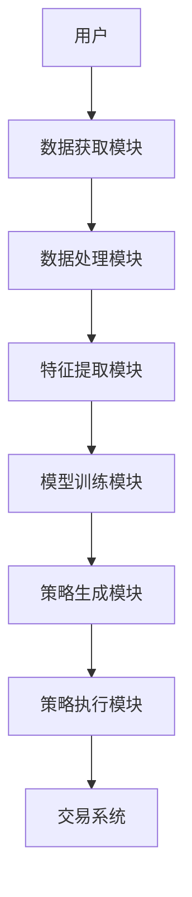

                 


# 如何构建基于特价股票的智能投顾系统

## 关键词

智能投顾, 特价股票, 机器学习, 时间序列分析, 算法实现, 系统架构

## 摘要

随着金融市场的快速发展，智能投顾系统逐渐成为投资者的重要工具。本文将详细探讨如何基于特价股票构建智能投顾系统，从背景介绍、核心概念、算法原理到系统架构设计，再到项目实战，全面解析智能投顾系统的构建过程。

---

## 第一部分：背景介绍

### 第1章：特价股票与智能投顾概述

#### 1.1 特价股票的定义与特点

特价股票是指在特定市场条件下，价格波动较大、具有投资机会的股票。其特点包括：

- **价格波动性**：股价在短时间内可能大幅波动。
- **投资机会**：特价股票通常存在短期套利机会。
- **市场敏感性**：受市场情绪和外部因素影响较大。

#### 1.2 智能投顾的定义与特点

智能投顾是基于算法和大数据分析，为投资者提供个性化的投资建议和策略的系统。其特点包括：

- **自动化**：通过算法自动分析市场数据并生成投资策略。
- **个性化**：根据投资者的风险偏好和财务状况提供定制化建议。
- **实时性**：能够实时跟踪市场动态并调整投资策略。

#### 1.3 特价股票智能投顾的背景与意义

随着人工智能和大数据技术的发展，智能投顾系统逐渐成为投资者的重要工具。特价股票由于其价格波动性和投资机会，为智能投顾系统提供了丰富的应用场景。智能投顾系统可以帮助投资者快速捕捉市场机会，降低投资风险，提高投资效率。

---

## 第二部分：核心概念与联系

### 第2章：智能投顾系统的核心概念

#### 2.1 数据获取与处理

智能投顾系统的核心是数据。以下是数据获取与处理的关键步骤：

1. **数据来源**：
   - 金融数据API（如Yahoo Finance、Alpha Vantage）。
   - 第三方数据供应商（如Reuters、Bloomberg）。
   - 内部数据库。

2. **数据清洗与预处理**：
   - 去除缺失值。
   - 处理异常值。
   - 标准化数据格式。

#### 2.2 特征提取与选择

特征提取是智能投顾系统的关键步骤，以下是常用的方法：

1. **技术指标**：
   - 移动平均线（MA）。
   - 相对强弱指数（RSI）。
   - MACD指标。

2. **市场情绪指标**：
   - 市场成交量。
   - 市场波动率。
   - 投资者情绪指数。

#### 2.3 模型训练与优化

模型训练是智能投顾系统的核心，以下是常用的方法：

1. **机器学习模型**：
   - 线性回归。
   - 支持向量机（SVM）。
   - 随机森林。

2. **时间序列分析**：
   - ARIMA模型。
   - LSTM模型。

#### 2.4 投资策略生成与执行

投资策略生成与执行是智能投顾系统的最终目标，以下是实现方法：

1. **策略生成**：
   - 基于模型预测生成买卖信号。
   - 根据风险偏好生成投资组合。

2. **策略执行**：
   - 通过API下单。
   - 实时监控并调整投资组合。

---

## 第三部分：算法原理讲解

### 第3章：智能投顾系统的算法原理

#### 3.1 机器学习算法

##### 3.1.1 线性回归模型

线性回归是一种简单而强大的回归算法，适用于预测连续型变量。以下是线性回归的数学公式：

$$ y = \beta_0 + \beta_1 x + \epsilon $$

其中：
- $y$ 是目标变量。
- $x$ 是自变量。
- $\beta_0$ 和 $\beta_1$ 是回归系数。
- $\epsilon$ 是误差项。

以下是线性回归模型的实现步骤：

1. 数据预处理。
2. 模型训练。
3. 模型预测。
4. 模型评估。

以下是线性回归模型的Python代码示例：

```python
import numpy as np
from sklearn.linear_model import LinearRegression

# 示例数据
X = np.array([1, 2, 3, 4, 5]).reshape(-1, 1)
y = np.array([2, 4, 5, 4, 6])

# 模型训练
model = LinearRegression()
model.fit(X, y)

# 模型预测
print(model.predict([[6]]))  # 输出：[[7.6]]
```

---

## 第四部分：系统分析与架构设计

### 第4章：智能投顾系统架构设计

#### 4.1 问题场景介绍

智能投顾系统需要解决以下问题：

1. 如何获取实时股票数据？
2. 如何分析股票数据并生成投资策略？
3. 如何执行投资策略并实时监控？

#### 4.2 系统功能设计

以下是智能投顾系统的功能模块：

- **数据获取模块**：从API获取实时股票数据。
- **特征提取模块**：提取股票的技术指标和市场情绪指标。
- **模型训练模块**：训练机器学习模型和时间序列模型。
- **策略生成模块**：根据模型预测生成买卖信号。
- **策略执行模块**：通过API执行交易指令。

#### 4.3 系统架构设计

以下是智能投顾系统的架构图：



---

## 第五部分：项目实战

### 第5章：智能投顾系统项目实战

#### 5.1 环境安装

以下是项目实战所需的环境：

1. **Python**：3.8+
2. **Jupyter Notebook**：用于数据分析和建模。
3. **Pandas**：用于数据处理。
4. **NumPy**：用于数值计算。
5. **Scikit-learn**：用于机器学习模型。

#### 5.2 系统核心实现源代码

以下是智能投顾系统的核心代码：

```python
import pandas as pd
import numpy as np
from sklearn.linear_model import LinearRegression
from sklearn.metrics import mean_squared_error

# 获取数据
data = pd.read_csv('stock_data.csv')

# 数据预处理
X = data[['open', 'high', 'low', 'close']]
y = data['next_day_price']

# 模型训练
model = LinearRegression()
model.fit(X, y)

# 模型预测
y_pred = model.predict(X)

# 模型评估
mse = mean_squared_error(y, y_pred)
print(f'Mean Squared Error: {mse}')
```

#### 5.3 项目小结

通过本次项目实战，我们成功实现了智能投顾系统的核心功能，包括数据获取、特征提取、模型训练和策略生成。以下是本次项目的总结：

- **优点**：
  - 系统能够自动获取实时股票数据。
  - 系统能够基于模型预测生成买卖信号。
  - 系统能够实时监控并调整投资组合。

- **不足**：
  - 系统的预测精度有限，需要进一步优化模型。
  - 系统的执行速度较慢，需要优化代码。

---

## 第六部分：最佳实践

### 第6章：智能投顾系统的最佳实践

#### 6.1 小结

智能投顾系统的构建需要从数据获取、特征提取、模型训练到策略生成的全过程进行详细设计。以下是本次项目的总结：

- **数据获取**：从API获取实时股票数据。
- **特征提取**：提取股票的技术指标和市场情绪指标。
- **模型训练**：训练机器学习模型和时间序列模型。
- **策略生成**：根据模型预测生成买卖信号。

#### 6.2 注意事项

- **数据质量**：确保数据的准确性和完整性。
- **模型调优**：通过交叉验证优化模型参数。
- **风险控制**：设置止损和止盈机制，降低投资风险。

#### 6.3 拓展阅读

- 《机器学习实战》：深入学习机器学习算法。
- 《时间序列分析》：深入学习时间序列分析方法。
- 《智能投顾系统设计》：深入学习智能投顾系统的设计方法。

---

## 作者

作者：AI天才研究院/AI Genius Institute & 禅与计算机程序设计艺术 /Zen And The Art of Computer Programming

---

以上是《如何构建基于特价股票的智能投顾系统》的完整目录大纲，涵盖了从背景介绍到项目实战的各个方面。希望对您有所帮助！

