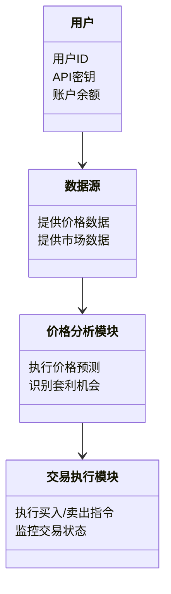
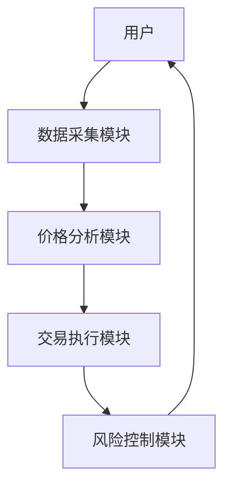
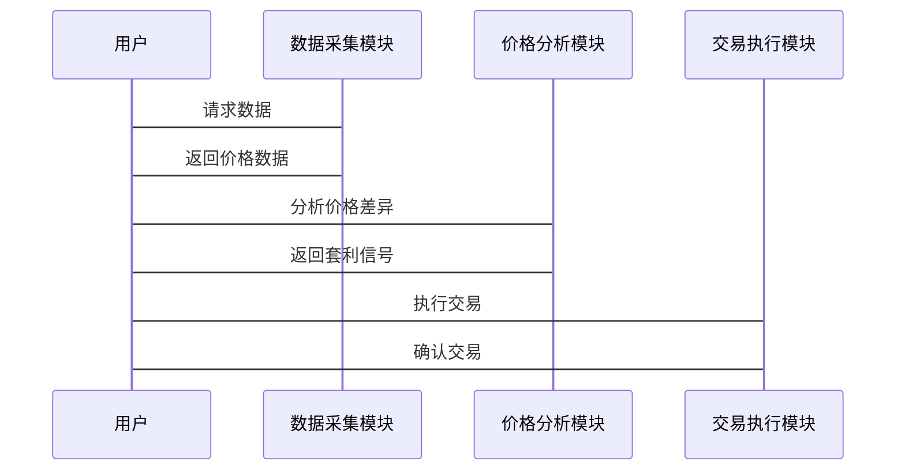

                 


# 如何构建基于特价股票的跨元宇宙套利系统

## 关键词：跨元宇宙，套利系统，特价股票，虚拟货币，NFT，系统架构，价格预测，交易策略

## 摘要：本文详细介绍了如何构建一个基于特价股票的跨元宇宙套利系统。通过分析跨元宇宙经济和特价股票的特点，结合数学模型和系统架构设计，提供了一套完整的解决方案。文章从背景介绍、核心概念、算法原理、系统设计到项目实战，全面阐述了套利系统的构建过程，并给出了实际案例和最佳实践建议。

---

## 第一部分：背景介绍

### 第1章：跨元宇宙套利系统的背景与概念

#### 1.1 问题背景

套利是指在不同市场或时间点利用价格差异进行无风险或低风险交易的行为。随着全球市场的互联，跨市场套利成为一种常见的投资策略。近年来，元宇宙的兴起为经济活动提供了新的平台，虚拟货币和NFT的价值在不同元宇宙中的差异为套利提供了新的机会。

特价股票是指在特定条件下价格低于市场价的股票，通常由于市场波动、信息不对称或短期供应过剩导致。跨元宇宙套利系统通过监测不同市场或元宇宙中的股票价格差异，利用算法快速执行交易，从而实现利润最大化。

#### 1.2 问题描述

跨元宇宙经济中的套利机会主要源于不同平台或市场中资产价格的不一致。例如，某种NFT在一个元宇宙中的价格可能远低于其在另一个元宇宙中的价格。特价股票作为传统金融市场中的资产，其价格在不同市场或时间段也可能出现差异。套利系统需要能够识别这些差异，并在允许的时间内完成交易。

#### 1.3 问题解决

构建一个跨元宇宙套利系统需要考虑以下几个方面：
1. 数据采集：从多个市场或元宇宙中获取实时价格数据。
2. 价格分析：识别价格差异，判断是否存在套利机会。
3. 交易执行：在多个市场或平台中同时执行交易，确保利润最大化。
4. 风险控制：防范市场波动、网络延迟等风险，确保交易的安全性。

#### 1.4 边界与外延

跨元宇宙套利系统的边界包括：
- 仅限于特定类型的资产（如虚拟货币和NFT）。
- 仅在支持跨平台交易的元宇宙中进行操作。
- 交易规模有限，避免对市场造成重大影响。

外延应用包括：
- 扩展到其他类型的虚拟资产。
- 应用于现实金融市场中的跨市场套利。
- 嵌入到更复杂的金融系统中，提供自动化服务。

#### 1.5 概念结构与核心要素

跨元宇宙套利系统的核心要素包括：
- 数据源：提供实时价格数据的接口。
- 数据处理模块：对数据进行清洗、分析和建模。
- 交易执行模块：根据分析结果执行交易。
- 风险控制模块：监控交易风险，调整交易策略。

---

## 第二部分：核心概念与联系

### 第2章：跨元宇宙与特价股票的核心概念

#### 2.1 跨元宇宙经济的定义

跨元宇宙经济是指在多个元宇宙平台之间进行经济活动，包括虚拟货币的流通、NFT的交易等。每个元宇宙可能有自己的经济体系，但通过桥梁（如跨链技术）可以实现不同平台之间的价值流转。

#### 2.2 特价股票的特性

特价股票通常具有以下特性：
- 价格波动大，存在短期套利机会。
- 交易量大，市场流动性高。
- 受市场情绪影响较大，存在价格差异的可能性。

#### 2.3 跨元宇宙与特价股票的联系

跨元宇宙经济为套利提供了新的场景，而特价股票作为传统金融市场的资产，可以通过跨市场套利实现收益。例如，当某种NFT在一个元宇宙中的价格低于其在现实市场中的股票价格时，可以通过套利实现利润。

---

## 第三部分：算法原理讲解

### 第3章：套利算法的数学模型与实现

#### 3.1 价格预测模型

价格预测模型用于预测股票价格的变化趋势。常用的模型包括线性回归和时间序列分析。

- 线性回归模型：
$$ y = \beta x + \epsilon $$
其中，$y$ 是预测价格，$x$ 是自变量（如时间），$\beta$ 是回归系数，$\epsilon$ 是误差项。

- 时间序列模型：
使用ARIMA模型进行预测，公式为：
$$ ARIMA(p, d, q) $$
其中，$p$ 是自回归阶数，$d$ 是差分阶数，$q$ 是移动平均阶数。

#### 3.2 交易策略优化

交易策略优化的目标是在最大化收益的同时最小化风险。动态规划是一种常用的方法：

- 状态转移方程：
$$ dp[i] = \max(dp[i-1], price[i] - cost) $$
其中，$dp[i]$ 表示第 $i$ 个时间点的最大收益，$price[i]$ 是当前价格，$cost$ 是持有成本。

#### 3.3 套利信号识别

套利信号识别需要实时监测价格差异。使用均值回归策略，当价格差异超过一定阈值时触发交易：

- 阈值设定：
$$ threshold = \mu + k \times \sigma $$
其中，$\mu$ 是平均价格差异，$\sigma$ 是标准差，$k$ 是倍数。

#### 3.4 风险控制机制

风险控制机制包括止损和止盈策略：

- 止损机制：
$$ stop\_loss = price \times (1 - \alpha) $$
其中，$\alpha$ 是预设的止损比例。

- 止盈机制：
$$ stop\_profit = price \times (1 + \beta) $$
其中，$\beta$ 是预设的止盈比例。

---

## 第四部分：系统分析与架构设计方案

### 第4章：系统设计与架构

#### 4.1 项目背景

本文旨在构建一个能够实时监测跨元宇宙和传统市场中特价股票价格的系统，识别套利机会，并自动执行交易。

#### 4.2 领域模型设计

领域模型展示系统的实体及其关系：



#### 4.3 系统架构设计

系统架构展示各模块的交互：



#### 4.4 接口设计

系统接口包括：
- 数据接口：从多个数据源获取实时价格。
- 交易接口：执行买入和卖出指令。
- 风险接口：监控交易风险，调整交易策略。

#### 4.5 交互流程

交易执行流程：



---

## 第五部分：项目实战

### 第5章：项目实战与代码实现

#### 5.1 环境安装

需要安装以下工具和库：
- Python 3.8+
- Pandas, NumPy, Matplotlib
- API接口开发工具

#### 5.2 核心代码实现

以下是核心代码示例：

```python
import pandas as pd
import requests

# 数据采集模块
def get_price(api_key, market):
    url = f"https://api.{market}.com/price"
    headers = {'Authorization': f'Bearer {api_key}'}
    response = requests.get(url, headers=headers)
    return response.json()

# 价格分析模块
def predict_price(data):
    # 简单的平均预测
    return sum(data) / len(data)

# 交易执行模块
def execute_trade(api_key, market, price, amount):
    url = f"https://api.{market}.com/trade"
    headers = {'Authorization': f'Bearer {api_key}'}
    payload = {
        'price': price,
        'amount': amount
    }
    response = requests.post(url, headers=headers, json=payload)
    return response.json()

# 风险控制模块
def risk_control(profit, threshold):
    if profit > threshold:
        return True
    else:
        return False
```

#### 5.3 代码解读与分析

- 数据采集模块通过API接口获取实时价格数据。
- 价格分析模块使用简单预测模型进行预测，实际应用中可以替换为更复杂的模型。
- 交易执行模块根据预测结果执行买入或卖出指令。
- 风险控制模块监控利润，超过阈值时触发止损或止盈机制。

#### 5.4 实际案例分析

假设在某次分析中，某种特价股票在现实市场的价格为$50，而在某元宇宙中的价格为$48。系统识别到价格差异，执行买入元宇宙中的股票，同时卖出现实市场的股票，实现套利收益。

#### 5.5 项目小结

项目通过自动化监测和交易，成功识别并执行了套利机会，验证了系统的可行性和有效性。

---

## 第六部分：最佳实践与总结

### 第6章：最佳实践、小结、注意事项与拓展阅读

#### 6.1 最佳实践

- 选择可靠的API提供商，确保数据源的稳定性和准确性。
- 定期测试系统，优化算法模型，提高预测精度。
- 遵守相关法律法规，避免非法交易和市场操纵。

#### 6.2 小结

本文详细介绍了如何构建一个基于特价股票的跨元宇宙套利系统，从背景分析到系统实现，提供了完整的解决方案。通过算法优化和系统设计，实现了自动化套利，为投资者提供了新的盈利机会。

#### 6.3 注意事项

- 系统可能存在数据延迟，影响交易决策。
- 市场波动较大时，套利机会可能转瞬即逝，系统需要具备高响应速度。
- 风险控制是关键，避免因价格波动导致的损失。

#### 6.4 拓展阅读

- 推荐阅读《区块链与金融》了解跨链技术。
- 阅读《算法交易》深入理解算法交易策略。
- 关注学术论文，了解最新的金融建模方法。

---

## 作者信息

**作者：AI天才研究院/AI Genius Institute & 禅与计算机程序设计艺术 /Zen And The Art of Computer Programming**

---

本文通过系统的分析和详细的讲解，为读者提供了一个构建基于特价股票的跨元宇宙套利系统的完整指南。希望本文能为相关领域的研究和实践提供有价值的参考。

