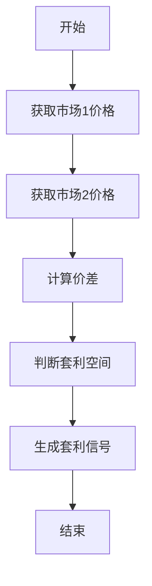
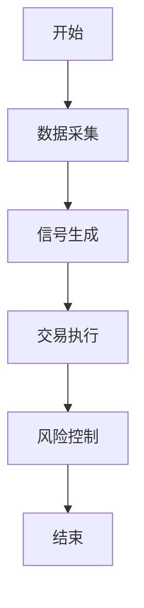
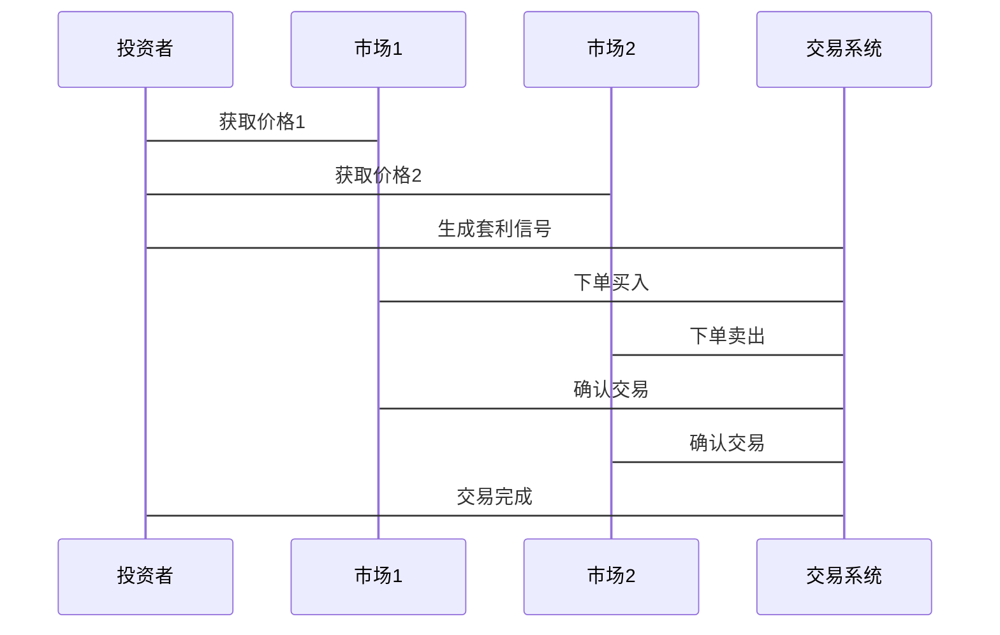

                 


```markdown
# 如何构建基于特价股票的跨市场套利系统

> 关键词：跨市场套利、特价股票、算法交易、金融编程、量化投资

> 摘要：本文详细介绍了如何构建基于特价股票的跨市场套利系统，从跨市场套利的背景与核心概念，到套利机会识别的算法原理，再到系统架构设计与项目实战，逐步深入讲解了构建套利系统的每一个细节。通过本文，读者将能够掌握跨市场套利的核心原理，理解特价股票在套利中的应用，学会使用算法和系统架构设计来实现跨市场套利，并通过实际案例分析和代码实现，掌握套利系统的开发与优化技巧。

---

## 第一部分: 跨市場套利系统背景与核心概念

### 第1章: 跨市場套利概述

#### 1.1 跨市場套利的定义与背景
- 1.1.1 跨市場套利的定义
  - 套利的定义：利用不同市场或资产之间的价格差异，通过同时买入低价资产和卖出高价资产，从中获利。
  - 跨市場套利的定义：在多个市场或资产之间进行套利交易，利用价格差异实现无风险或低风险收益。
- 1.1.2 跨市場套利的背景与重要性
  - 全球化市场的兴起：不同市场的价格差异为跨市场套利提供了机会。
  - 量化交易的发展：技术进步使得跨市场套利的实现更加高效和精确。
  - 套利在市场中的作用：套利有助于价格的收敛，促进市场的公平与效率。
- 1.1.3 跨市場套利的基本原理
  - 无风险套利的定义：在理想情况下，套利者在两个市场之间进行买卖操作，无论价格如何变化，都能保证无风险收益。
  - 跨市場套利的实现步骤：
    1. 寻找价格差异。
    2. 判断是否存在套利空间。
    3. 执行买卖操作。
    4. 通过价格收敛获利。
  - 套利的边界与限制：
    - 市场流动性不足。
    - 交易成本（佣金、滑点等）。
    - 市场干预（如税费、监管等）。

#### 1.2 特价股票的定义与特点
- 1.2.1 特价股票的定义
  - 特价股票：指在某一市场中价格低于其他市场相同资产的股票。
  - 为什么会出现特价股票？市场信息不对称、市场分割、短期市场波动等。
- 1.2.2 特价股票的市场特征
  - 价格波动性大。
  - 市场流动性可能较低。
  - 套利机会短暂。
- 1.2.3 特价股票与套利机会的关系
  - 特价股票是跨市场套利的主要目标。
  - 通过比较不同市场的股票价格，寻找套利机会。

#### 1.3 跨市場套利的核心概念
- 1.3.1 套利的基本原理
  - 套利的动机：通过价格差异获利。
  - 套利的风险：价格收敛的风险。
- 1.3.2 跨市場套利的类型
  - 股票套利。
  - 外汇套利。
  - 商品套利。
- 1.3.3 跨市場套利的边界与外延
  - 套利的无风险性。
  - 套利的市场依赖性。
  - 套利的监管环境。

#### 1.4 本章小结
- 通过本章，我们了解了跨市场套利的基本概念、原理和核心要素，以及特价股票在套利中的重要性。

---

### 第2章: 跨市場套利的核心概念与联系

#### 2.1 跨市場套利的核心原理
- 2.1.1 套利的无风险性
  - 理论上，套利应是无风险的。
  - 实际中，套利可能面临市场流动性不足、价格波动等风险。
- 2.1.2 市场价差的形成
  - 价格差异的成因：信息不对称、市场分割、短期波动等。
  - 价格差异的类型：短期价差、长期价差。
- 2.1.3 套利机会的识别
  - 价差的计算方法。
  - 套利空间的判断标准。

#### 2.2 核心概念的属性特征对比
- 2.2.1 市场价差与套利机会的关系
  - 正价差与反价差。
  - 套利机会的判断标准。
- 2.2.2 特价股票与套利收益的关系
  - 特价股票是套利的主要目标。
  - 通过比较不同市场的股票价格，寻找套利机会。
- 2.2.3 市场流动性与套利可行性的关系
  - 流动性高的市场更容易实现套利。
  - 流动性低的市场可能导致套利成本增加。

#### 2.3 跨市場套利的ER实体关系图
```mermaid
erDiagram
    actor 投资者
    actor 市场1
    actor 市场2
    actor 交易系统
    投资者 --> 市场1: 下单
    投资者 --> 市场2: 下单
    市场1 --> 交易系统: 价格反馈
    市场2 --> 交易系统: 价格反馈
    交易系统 --> 投资者: 套利信号
```

#### 2.4 本章小结
- 通过本章，我们深入探讨了跨市场套利的核心概念及其之间的关系，为后续的算法设计和系统实现奠定了基础。

---

## 第二部分: 跨市場套利的算法原理

### 第3章: 跨市場套利的算法原理

#### 3.1 跨市場套利的算法概述
- 3.1.1 套利机会的识别算法
  - 基于价差的套利机会识别。
  - 基于波动率的套利机会识别。
- 3.1.2 套利信号的生成算法
  - 基于价差的套利信号生成。
  - 基于统计套利的信号生成。
- 3.1.3 套利执行的优化算法
  - 最小化交易成本。
  - 优化执行时间。

#### 3.2 套利机会识别的数学模型
- 3.2.1 价格差计算公式
  $$ \text{价差} = \text{价格}_1 - \text{价格}_2 $$
- 3.2.2 套利空间判断公式
  $$ \text{套利空间} = \max(\text{价差}, 0) $$

#### 3.3 套利信号生成的流程图


#### 3.4 算法实现的Python代码
```python
def calculate_spread(price1, price2):
    return abs(price1 - price2)

def generate_arbitrage_signal(price1, price2, threshold):
    if calculate_spread(price1, price2) > threshold:
        return True
    else:
        return False
```

#### 3.5 本章小结
- 通过本章，我们了解了跨市场套利的算法原理，包括套利机会识别、信号生成和执行优化的算法设计。

---

## 第三部分: 跨市場套利的系统分析与架构设计

### 第4章: 跨市場套利的系统分析与架构设计

#### 4.1 系统功能设计
- 4.1.1 系统功能模块划分
  - 数据采集模块。
  - 信号生成模块。
  - 交易执行模块。
  - 风险控制模块。
- 4.1.2 系统功能流程图


#### 4.2 系统架构设计
- 4.2.1 系统架构图
```mermaid
container 跨市場套利系统 {
    component 数据采集模块 {
        --> 接收市场数据
    }
    component 信号生成模块 {
        --> 接收市场数据
        --> 生成套利信号
    }
    component 交易执行模块 {
        --> 接收套利信号
        --> 执行交易
    }
    component 风险控制模块 {
        --> 监控交易过程
        --> 控制风险
    }
}
```

#### 4.3 系统接口设计
- 4.3.1 系统接口定义
  - 数据接口：市场数据的获取和传输。
  - 交易接口：交易指令的发送和执行。
  - 风险控制接口：风险监控和干预。

#### 4.4 系统交互流程图


#### 4.5 本章小结
- 通过本章，我们了解了跨市场套利系统的功能设计、架构设计和交互流程，为后续的系统实现奠定了基础。

---

## 第四部分: 跨市場套利的项目实战

### 第5章: 跨市場套利的项目实战

#### 5.1 项目环境安装与配置
- 5.1.1 开发环境搭建
  - 安装Python编程环境。
  - 安装必要的库（如pandas、numpy、requests等）。
- 5.1.2 数据源配置
  - 数据接口的选择与配置。
  - 数据获取的频率和方式。

#### 5.2 系统核心实现
- 5.2.1 数据采集模块实现
  ```python
  import requests

  def get_market_price(market):
      url = f"https://api.{market}.com/price"
      response = requests.get(url)
      return response.json()['price']
  ```
- 5.2.2 信号生成模块实现
  ```python
  def generate_arbitrage_signal(price1, price2, threshold):
      spread = abs(price1 - price2)
      if spread > threshold:
          return True
      else:
          return False
  ```
- 5.2.3 交易执行模块实现
  ```python
  def execute_trade(action):
      if action == 'buy':
          print("买入操作")
      elif action == 'sell':
          print("卖出操作")
  ```

#### 5.3 实际案例分析
- 5.3.1 案例背景
  - 假设市场1的股票价格为100，市场2的股票价格为98。
  - 套利阈值为2。
- 5.3.2 套利信号生成
  - spread = 2 > threshold（假设threshold为2）。
  - 生成买入市场2、卖出市场1的信号。
- 5.3.3 交易执行
  - 执行买入市场2的操作。
  - 执行卖出市场1的操作。
- 5.3.4 结果分析
  - 套利收益为2。

#### 5.4 项目小结
- 通过本章，我们通过实际案例分析，了解了跨市场套利系统的实现过程和实际效果。

---

## 第五部分: 总结与展望

### 第6章: 总结与展望

#### 6.1 本项目的核心成果
- 成功构建了跨市场套利系统。
- 实现了套利机会识别、信号生成和交易执行的自动化。

#### 6.2 项目总结
- 项目的主要挑战。
- 项目的成功经验。
- 项目的关键收获。

#### 6.3 未来展望
- 系统优化方向。
- 新技术的应用。
- 市场扩展的可能性。

#### 6.4 最佳实践 tips
- 交易成本的控制。
- 风险管理的重要性。
- 数据源的可靠性和实时性。

#### 6.5 小结
- 通过本章，我们回顾了跨市场套利系统的实现过程，并展望了未来的发展方向。

---

## 附录

### 附录A: 常用工具与库
- Python编程语言。
- 常用库：pandas、numpy、requests、websocket-client等。

### 附录B: 参考文献
- 常用金融编程书籍。
- 相关学术论文。

### 附录C: 术语表
- 定义书中的核心术语。

---

## 作者

作者：AI天才研究院/AI Genius Institute & 禅与计算机程序设计艺术 /Zen And The Art of Computer Programming
```

