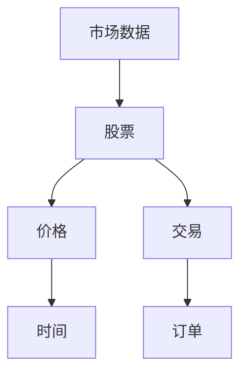
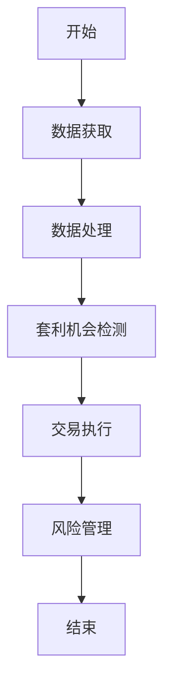
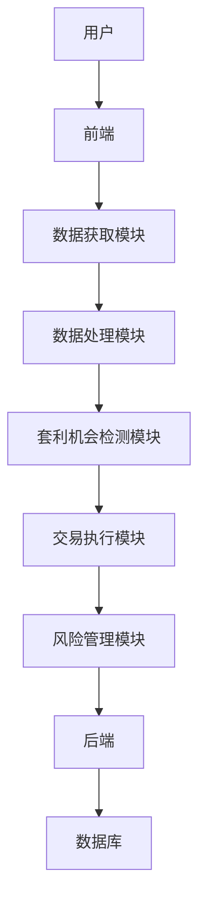

                 


# 如何构建基于特价股票的跨时区套利系统

> **关键词**：特价股票、跨时区套利、算法原理、系统架构、Python实现、风险管理  
> **摘要**：本文详细介绍了如何构建一个基于特价股票的跨时区套利系统。从背景概念、核心原理、系统设计到实战实现，结合丰富的案例和代码示例，帮助读者系统地理解套利机制、掌握实现方法，并提供优化和风险管理的建议。

---

## 第一部分: 特价股票与跨时区套利概述

### 第1章: 特价股票与跨时区套利的背景与概念

#### 1.1 套利的定义与基本原理

套利（Arbitrage）是指利用同一资产在不同市场或不同时间点的价格差异，通过同时买进和卖出该资产来获取无风险收益的交易策略。套利的核心在于发现价格差异并迅速行动，以捕捉短期利润。

套利的基本原理基于市场效率的不足。在理论上，市场是有效的，即同一资产在不同市场上的价格应相等，但由于信息不对称、交易延迟、市场深度不足等因素，价格差异往往存在。

套利的分类多种多样，主要包括：

- **跨市场套利**：利用同一资产在不同市场（如纽约和伦敦）的价格差异进行套利。
- **跨期套利**：利用同一资产在不同时间点（如期货和现货）的价格差异进行套利。
- **跨币种套利**：利用同一资产在不同货币下的价格差异进行套利。
- **统计套利**：基于统计模型和数学算法进行套利，通常用于高频交易。

#### 1.2 跨时区套利的背景与现状

跨时区套利是一种典型的跨市场套利形式，其核心在于利用不同市场的时间差和价格差异。随着全球化的推进，许多公司在不同市场上市，导致同一资产在不同市场的价格可能不同，为套利提供了机会。

当前，跨时区套利的现状如下：

- **技术进步**：高频交易技术的发展使得套利机会能够被快速捕捉和执行。
- **市场分割**：不同市场的监管差异、交易时间差异导致价格差异。
- **信息延迟**：由于时区差异，市场参与者无法同时获取所有市场的最新信息，导致价格差异的存在。

#### 1.3 特价股票的特性与机会

特价股票通常指的是价格低于市场公允价值的股票。这类股票可能由于市场情绪、短期波动或其他因素导致价格被低估。跨时区套利的核心在于发现这些特价股票，并在合适的时间窗口内进行交易，以获取利润。

特价股票的特性包括：

- **价格低估**：股票价格低于其内在价值。
- **市场流动性**：交易量较大，能够快速买卖。
- **时间窗口**：套利机会存在的时间窗口较短。

#### 1.4 跨时区套利的核心概念

跨时区套利的核心概念包括：

- **时间差**：不同市场的交易时间差异，使得同一资产的价格在不同时间点上存在差异。
- **价格差异**：同一资产在不同市场上的价格差异。
- **对冲机制**：通过在不同市场同时买卖同一资产，以对冲价格波动风险。

---

## 第二部分: 跨时区套利系统的核心概念与原理

### 第2章: 跨时区套利系统的概念模型

#### 2.1 跨时区套利系统的概念结构

跨时区套利系统的概念结构包括以下几个核心要素：

- **数据源**：获取不同市场的实时数据，包括股票价格、交易量等。
- **套利策略**：基于数据源的分析，制定套利策略。
- **交易执行**：根据套利策略，执行交易。
- **风险管理**：监控交易风险，确保套利系统的稳定性。

#### 2.2 跨时区套利系统的核心要素

跨时区套利系统的核心要素包括：

- **数据获取模块**：实时获取不同市场的股票数据。
- **套利机会检测模块**：分析数据，检测套利机会。
- **交易执行模块**：根据套利机会，执行交易。
- **风险管理模块**：监控交易风险，调整策略。

#### 2.3 跨时区套利系统的ER实体关系图

跨时区套利系统的ER实体关系图如下：



---

## 第三部分: 跨时区套利系统的算法原理

### 第3章: 跨时区套利算法的原理与实现

#### 3.1 跨时区套利算法的核心原理

跨时区套利算法的核心原理包括以下几个方面：

- **时间差套利的数学模型**：基于不同市场的交易时间差异，计算同一资产在不同时间点的价格差异。
- **价格差套利的数学模型**：基于不同市场的价格差异，计算套利机会。
- **对冲机制的实现原理**：通过在不同市场同时买卖同一资产，对冲价格波动风险。

#### 3.2 跨时区套利算法的流程图

跨时区套利算法的流程图如下：



#### 3.3 跨时区套利算法的Python实现

以下是一个简单的跨时区套利算法的Python实现示例：

```python
import pandas as pd
import numpy as np

# 假设我们有两个市场的数据：市场A和市场B
market_a = pd.Series([100, 101, 102], index=[0, 1, 2])
market_b = pd.Series([98, 99, 100], index=[0, 1, 2])

# 计算价格差异
price_diff = market_a - market_b

# 寻找套利机会
for i in range(len(price_diff)):
    if price_diff[i] > 0:
        print(f"在时间点{i}，市场A价格为{market_a[i]}，市场B价格为{market_b[i]}，存在套利机会。")
```

---

## 第四部分: 跨时区套利系统的系统分析与架构设计

### 第4章: 跨时区套利系统的系统分析与架构设计

#### 4.1 项目背景与需求分析

跨时区套利系统的开发背景包括：

- **市场需求**：投资者希望通过跨时区套利获取利润。
- **技术需求**：系统需要实时获取数据、分析数据、执行交易。
- **性能需求**：系统需要高效运行，确保交易的及时性。

#### 4.2 系统功能设计

跨时区套利系统的功能设计包括：

- **数据获取模块**：实时获取不同市场的股票数据。
- **数据处理模块**：对数据进行清洗、转换和分析。
- **套利机会检测模块**：基于数据分析，检测套利机会。
- **交易执行模块**：根据套利机会，执行交易。
- **风险管理模块**：监控交易风险，调整策略。

#### 4.3 系统架构设计

跨时区套利系统的架构设计如下：



---

## 第五部分: 跨时区套利系统的项目实战

### 第5章: 跨时区套利系统的项目实战

#### 5.1 环境安装与配置

以下是一个简单的跨时区套利系统的环境安装与配置示例：

- **Python版本**：Python 3.8+
- **依赖库**：Pandas、NumPy、Matplotlib

安装依赖：

```bash
pip install pandas numpy matplotlib
```

#### 5.2 核心代码实现

以下是一个简单的跨时区套利系统的Python代码实现：

```python
import pandas as pd
import numpy as np
import matplotlib.pyplot as plt

# 假设我们有两个市场的数据：市场A和市场B
market_a = pd.Series([100, 101, 102], index=[0, 1, 2])
market_b = pd.Series([98, 99, 100], index=[0, 1, 2])

# 绘制价格走势图
market_a.plot(label='Market A')
market_b.plot(label='Market B')
plt.legend()
plt.show()

# 计算价差
price_diff = market_a - market_b
print("价格差异:", price_diff)

# 寻找套利机会
for i in range(len(price_diff)):
    if price_diff[i] > 0:
        print(f"在时间点{i}，市场A价格为{market_a[i]}，市场B价格为{market_b[i]}，存在套利机会。")
```

#### 5.3 代码解读与分析

上述代码实现了以下功能：

- **数据获取**：从市场A和市场B获取股票数据。
- **数据可视化**：绘制价格走势图，帮助分析价格趋势。
- **价差计算**：计算市场A和市场B的价格差异。
- **套利机会检测**：寻找价差为正的机会，并输出结果。

#### 5.4 案例分析与详细解读

假设我们有两个市场的股票数据如下：

| 时间点 | 市场A价格 | 市场B价格 |
|--------|----------|----------|
| 0      | 100      | 98       |
| 1      | 101      | 99       |
| 2      | 102      | 100      |

根据上述数据，我们可以看到，在时间点0，市场A的价格为100，市场B的价格为98，存在套利机会。具体操作如下：

- 在市场B以98的价格买入股票。
- 在市场A以100的价格卖出股票。
- 利润为2。

#### 5.5 项目小结

通过上述案例分析，我们可以看到，跨时区套利系统的核心在于快速捕捉价格差异，并在合适的时间窗口内进行交易。同时，系统需要具备高效的数据处理能力和风险控制能力。

---

## 第六部分: 跨时区套利系统的优化与风险管理

### 第6章: 跨时区套利系统的优化与风险管理

#### 6.1 系统优化

跨时区套利系统的优化包括以下几个方面：

- **数据获取优化**：使用高效的API获取数据。
- **算法优化**：优化套利算法的计算效率。
- **系统性能优化**：优化系统的响应速度和稳定性。

#### 6.2 风险管理

跨时区套利系统中的风险管理包括：

- **市场风险**：由于市场价格波动导致的损失。
- **流动性风险**：由于市场流动性不足导致的无法及时买卖资产的风险。
- **操作风险**：由于系统故障或人为错误导致的损失。

#### 6.3 套利机会的发现与利用

套利机会的发现与利用包括：

- **数据挖掘**：通过数据分析发现价格差异。
- **算法优化**：优化套利算法，提高套利效率。
- **市场监控**：实时监控市场动态，及时发现套利机会。

#### 6.4 系统监控与维护

跨时区套利系统的监控与维护包括：

- **实时监控**：实时监控系统运行状态。
- **日志记录**：记录系统运行日志，便于故障排查。
- **定期维护**：定期维护系统，确保系统稳定运行。

---

## 第七部分: 总结与展望

### 第7章: 总结与展望

#### 7.1 总结

本文详细介绍了如何构建一个基于特价股票的跨时区套利系统。从背景概念、核心原理、系统设计到实战实现，结合丰富的案例和代码示例，帮助读者系统地理解套利机制、掌握实现方法，并提供优化和风险管理的建议。

#### 7.2 未来展望

随着技术的不断发展，跨时区套利系统将更加智能化和自动化。未来的研究方向包括：

- **人工智能套利**：利用人工智能技术进行套利机会的发现和交易。
- **大数据套利**：利用大数据技术进行套利机会的发现和交易。
- **高频交易**：利用高频交易技术进行套利。

---

## 作者信息

**作者**：AI天才研究院/AI Genius Institute & 禅与计算机程序设计艺术/Zen And The Art of Computer Programming

---

**摘要**：本文详细介绍了如何构建一个基于特价股票的跨时区套利系统。从背景概念、核心原理、系统设计到实战实现，结合丰富的案例和代码示例，帮助读者系统地理解套利机制、掌握实现方法，并提供优化和风险管理的建议。

通过本文的学习，读者将能够：

- 理解跨时区套利的核心概念和原理。
- 掌握跨时区套利系统的实现方法。
- 学会如何进行套利机会的发现和利用。
- 了解跨时区套利系统中的优化和风险管理方法。

希望本文能够为读者在跨时区套利领域的研究和实践提供有价值的参考和指导。

