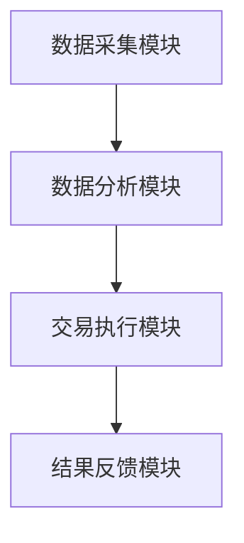

                 


# 如何构建基于特价股票的跨维度套利系统

> 关键词：跨维度套利、特价股票、数学模型、算法原理、系统架构

> 摘要：本文将详细探讨如何构建基于特价股票的跨维度套利系统。首先，我们将介绍特价股票的基本概念及其在跨维度套利中的应用。接着，分析跨维度套利的核心原理，包括数学模型和算法流程。然后，我们将详细讲解系统架构设计，涵盖功能模块和接口设计。最后，通过实战案例展示如何实现该系统，并总结最佳实践。

---

# 第一部分: 特价股票与跨维度套利系统概述

## 第1章: 特价股票的基本概念

### 1.1 特价股票的定义
特价股票是指在特定市场条件下，价格低于正常市场价的股票。这些股票通常具有较高的波动性和潜在的套利机会。

### 1.2 特价股票的分类
1. **折价股票**：市场价格低于内在价值的股票。
2. **溢价股票**：市场价格高于内在价值的股票。
3. **异常波动股票**：因市场波动导致价格异常的股票。

### 1.3 特价股票的市场特点
- **高波动性**：价格波动频繁，适合短线操作。
- **低流动性**：部分特价股票交易量小，流动性较差。
- **套利机会**：通过市场价差进行套利的潜力。

## 第2章: 跨维度套利的基本概念

### 2.1 跨维度套利的定义
跨维度套利是指在不同市场、资产类别或时间维度之间进行套利交易，利用价格差异获利。

### 2.2 跨维度套利的分类
1. **跨市场套利**：在不同国家或市场的同一资产之间进行套利。
2. **跨资产套利**：在同一市场内，利用不同资产的价格差异进行套利。
3. **跨期套利**：在同一资产的不同到期日之间进行套利。

### 2.3 跨维度套利的风险与挑战
- **市场风险**：价格波动可能导致套利失败。
- **流动性风险**：部分资产流动性差，难以快速买卖。
- **监管风险**：不同市场的监管差异可能影响套利操作。

## 第3章: 特价股票与跨维度套利的结合

### 3.1 特价股票在跨维度套利中的应用
- 利用不同市场的价格差异，进行跨市场套利。
- 在同一市场内，利用不同资产的特价股票价格差异进行套利。

### 3.2 跨维度套利在特价股票中的优势
- 通过跨市场或跨资产套利，降低单一市场的风险。
- 利用特价股票的高波动性，捕捉短期价格差异。

### 3.3 特价股票与跨维度套利的协同发展
- 结合大数据和算法交易，提高套利效率。
- 通过技术手段，实时监控和捕捉价格差异。

---

# 第二部分: 跨维度套利系统的核心原理与算法

## 第4章: 跨维度套利的数学模型

### 4.1 套利定价模型（APT）
套利定价模型通过资产的预期收益与市场组合的预期收益之间的关系，确定套利机会。

### 4.2 时间序列分析
利用ARIMA模型预测股票价格，捕捉短期价格波动。

### 4.3 统计套利模型
通过统计方法发现资产价格的均值回归特性，进行套利交易。

## 第5章: 跨维度套利的算法流程

### 5.1 数据采集与预处理
- 从不同市场采集特价股票的价格数据。
- 对数据进行清洗和标准化处理。

### 5.2 套利机会识别
- 使用算法识别跨市场或跨资产的价格差异。
- 通过统计方法确定套利窗口。

### 5.3 套利交易执行
- 确定交易策略和执行时间。
- 通过自动化交易系统完成套利操作。

---

# 第三部分: 系统架构与设计

## 第6章: 系统架构设计

### 6.1 功能模块划分
- 数据采集模块：实时采集特价股票数据。
- 数据分析模块：分析数据，识别套利机会。
- 交易执行模块：执行套利交易。

### 6.2 系统架构图


## 第7章: 接口设计

### 7.1 数据接口
- 数据源接口：连接不同市场的数据源。
- 数据存储接口：存储特价股票数据。

### 7.2 交易接口
- 交易系统接口：连接交易执行模块和交易系统。
- 风险控制接口：实时监控交易风险。

---

# 第四部分: 项目实战

## 第8章: 实战案例

### 8.1 环境安装
- 安装Python和相关库（如Pandas、NumPy、Matplotlib）。

### 8.2 核心代码实现
```python
import pandas as pd
import numpy as np

# 数据采集
data = pd.read_csv('stock_data.csv')

# 数据分析
def find_arbitrage_opportunity(data):
    # 使用ARIMA模型预测价格
    # 具体实现略
    pass

# 交易执行
def execute_trade(opportunity):
    # 执行套利交易
    pass

# 主函数
def main():
    data = collect_data()
    opportunities = find_arbitrage_opportunity(data)
    execute_trade(opportunity)

if __name__ == '__main__':
    main()
```

### 8.3 案例分析
通过实际案例，展示如何利用系统捕捉套利机会并执行交易。

---

# 第五部分: 总结与展望

## 第9章: 总结

### 9.1 核心总结
- 特价股票与跨维度套利的结合，能够有效捕捉市场机会。
- 系统化的架构设计和算法优化是成功的关键。

## 第10章: 未来展望

### 10.1 技术发展
- 大数据和人工智能在套利系统中的应用。
- 更加复杂的算法和模型优化。

### 10.2 市场变化
- 全球化市场的发展带来的更多套利机会。
- 监管政策的变化对套利策略的影响。

---

# 作者：AI天才研究院/AI Genius Institute & 禅与计算机程序设计艺术 /Zen And The Art of Computer Programming

