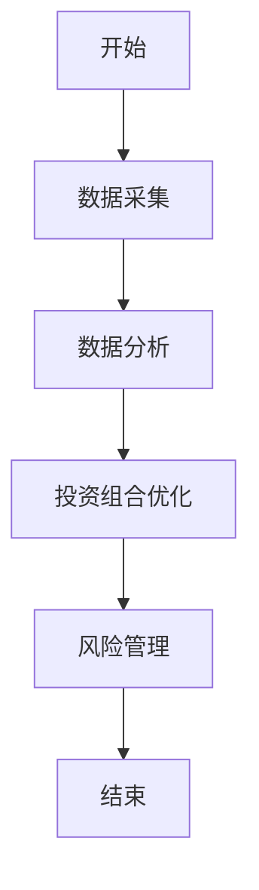

                 


# 如何构建格雷厄姆特价股票投资组合

> 关键词：价值投资，格雷厄姆，特价股票，投资组合，风险管理

> 摘要：本文系统地介绍如何构建基于格雷厄姆价值投资理念的特价股票投资组合。首先，我们将探讨价值投资的核心理念和格雷厄姆的投资策略。接着，详细分析特价股票的筛选标准，包括基本面分析和财务指标评估。然后，介绍投资组合的构建策略，包括资产配置、风险控制和再平衡。最后，通过实际案例分析和项目实现，展示如何在实践中应用这些理论。我们还将讨论投资心理和纪律性在投资过程中的重要性，确保读者能够全面理解和掌握格雷厄姆特价股票投资组合的构建方法。

---

## 第1章: 价值投资与格雷厄姆投资理念

### 1.1 价值投资的定义与核心理念

价值投资是一种投资策略，强调以低于其内在价值的价格购买优质的股票。其核心理念是通过深入分析公司的基本面，寻找市场先生的错误定价，从而在长期获得超额收益。格雷厄姆是价值投资的鼻祖，他提出的“安全边际”和“内在价值”概念为价值投资奠定了理论基础。

#### 1.1.1 价值投资的基本概念

- **内在价值**：股票的内在价值是其未来现金流的现值，反映了公司的真实价值。
- **市场价值**：市场价值是股票在市场上的价格，可能高于或低于内在价值。
- **安全边际**：安全边际是内在价值与市场价格之间的差距，确保投资者在买入时有一定的安全空间，降低投资风险。

#### 1.1.2 格雷厄姆的价值投资理论

格雷厄姆的投资理论强调买入低估的股票并长期持有。他认为，市场先生是情绪化的，而投资者可以通过分析找到那些被市场低估的股票。以下是格雷厄姆投资策略的几个关键点：

- **买入便宜的股票**：寻找那些市场价格远低于内在价值的股票。
- **注重安全边际**：确保买入价格与内在价值之间有足够的安全空间。
- **分散投资**：通过分散投资降低风险，避免将所有资金投入到单一股票。

#### 1.1.3 特价股票的定义与特点

特价股票是指市场价格显著低于内在价值的股票。其特点包括：

- **低市盈率（P/E）**：市盈率低于行业平均水平，表明股票价格可能被低估。
- **低市净率（P/B）**：市净率低于1，表明股价低于每股净资产。
- **高股息率**：公司支付的股息相对于股价较高，可能表明公司具有较高的盈利能力和稳定的股息支付能力。

---

### 1.2 格雷厄姆的投资策略

格雷厄姆的投资策略以稳健和保守著称，他强调通过基本面分析寻找低估的股票，并长期持有。以下是格雷厄姆投资策略的关键点：

#### 1.2.1 格雷厄姆的投资方法

- **买入并持有**：格雷厄姆主张买入低估的股票后长期持有，除非其内在价值发生了显著变化。
- **分散投资**：通过投资多只股票分散风险，避免将所有资金投入到单一股票。
- **注重安全边际**：确保买入价格与内在价值之间有足够的安全空间。

#### 1.2.2 投资组合的构建原则

- **资产配置**：根据投资者的风险承受能力和投资目标，合理配置股票、债券等资产。
- **行业分散**：选择不同行业的股票，避免过度集中于某一行业。
- **地域分散**：投资于不同地区的股票，降低地域风险。

#### 1.2.3 风险控制与安全边际

- **安全边际**：买入价格低于内在价值，确保在市场波动中能够获利。
- **止损策略**：设定止损点，避免亏损过大。

---

## 第2章: 特价股票的筛选标准

### 2.1 格雷厄姆选股模型

格雷厄姆选股模型是基于基本面分析的选股方法，强调寻找那些市场价格低于内在价值的股票。以下是格雷厄姆选股模型的关键指标：

#### 2.1.1 市盈率（P/E）分析

市盈率是股价与每股收益的比率，用于衡量股票的估值。格雷厄姆认为，市盈率低于15的股票可能具有投资价值。

- **公式**：市盈率 = 股价 / 每股收益
- **分析**：市盈率越低，可能表明股票越被低估。

#### 2.1.2 市净率（P/B）分析

市净率是股价与每股净资产的比率，用于衡量股票相对于其净资产的估值。格雷厄姆认为，市净率低于1的股票可能具有投资价值。

- **公式**：市净率 = 股价 / 每股净资产
- **分析**：市净率越低，可能表明股票越被低估。

#### 2.1.3 股息率与股息支付率

股息率是股价与股息的比率，用于衡量股票的分红能力。格雷厄姆认为，高股息率的股票可能具有投资价值。

- **公式**：股息率 = 股息 / 股价
- **分析**：股息率越高，可能表明股票的分红能力越强。

#### 2.1.4 财务指标分析

格雷厄姆强调通过财务指标分析公司的基本面，包括盈利能力、偿债能力、运营效率等。以下是关键财务指标：

- **盈利能力**：净利润率、ROE（净资产收益率）等。
- **偿债能力**：资产负债率、流动比率等。
- **运营效率**：存货周转率、应收账款周转率等。

---

### 2.2 公司基本面分析

基本面分析是寻找特价股票的核心方法，通过分析公司的财务报表和行业地位，评估其内在价值。

#### 2.2.1 财务报表分析

财务报表包括资产负债表、利润表和现金流量表。以下是关键分析点：

- **资产负债表**：评估公司的资产、负债和所有者权益。
- **利润表**：评估公司的收入、成本和利润。
- **现金流量表**：评估公司的现金流情况。

#### 2.2.2 盈利能力指标

盈利能力指标包括净利润率、ROE等，用于评估公司的盈利能力。

- **公式**：净利润率 = 净利润 / 收入
- **分析**：净利润率越高，公司盈利能力越强。

#### 2.2.3 偿债能力与运营效率

偿债能力指标包括资产负债率、流动比率等，用于评估公司的偿债能力。运营效率指标包括存货周转率、应收账款周转率等，用于评估公司的运营效率。

---

### 2.3 投资组合的构建与优化

#### 2.3.1 资产配置

资产配置是投资组合构建的基础，根据投资者的风险承受能力和投资目标，合理配置股票、债券等资产。

- **股票配置**：建议配置60%-70%的股票，选择低估的股票。
- **债券配置**：建议配置20%-30%的债券，用于降低风险。
- **现金配置**：建议配置10%的现金，用于把握市场机会。

#### 2.3.2 风险控制与再平衡

风险控制是投资组合管理的重要环节，通过设定止损点和定期再平衡，降低投资风险。

- **止损策略**：设定止损点，避免亏损过大。
- **再平衡**：定期调整投资组合，保持资产配置合理。

---

### 2.4 格雷厄姆投资理念的数学模型

#### 2.4.1 格雷厄姆的内在价值计算公式

格雷厄姆提出内在价值的计算公式：

$$
内在价值 = \sum_{t=1}^{\infty} \frac{CF_t}{(1 + r)^t}
$$

其中，\( CF_t \) 是第 \( t \) 年的现金流，\( r \) 是折现率。

#### 2.4.2 安全边际的数学表达

安全边际是买入价格与内在价值之间的差距：

$$
安全边际 = 内在价值 - 股票价格
$$

---

## 第3章: 投资组合的构建与优化

### 3.1 投资组合的构建策略

#### 3.1.1 资产配置的基本原则

资产配置是投资组合构建的基础，根据投资者的风险承受能力和投资目标，合理配置股票、债券等资产。

- **股票配置**：建议配置60%-70%的股票，选择低估的股票。
- **债券配置**：建议配置20%-30%的债券，用于降低风险。
- **现金配置**：建议配置10%的现金，用于把握市场机会。

#### 3.1.2 股票与债券的配比

股票与债券的配比需要根据投资者的风险偏好和市场环境动态调整。

---

### 3.2 投资组合的优化方法

#### 3.2.1 现代投资组合理论（MPT）

现代投资组合理论（MPT）由哈里·马科维茨提出，通过优化投资组合的风险和收益，实现最优资产配置。

- **公式**：通过数学优化模型，找到最优资产配置。

$$
\min_w \sigma^2(w) \quad \text{subject to} \quad \mu^T w = \mu_r, \quad w^T 1 = 1
$$

其中，\( \sigma^2(w) \) 是投资组合的方差，\( \mu \) 是收益向量，\( \mu_r \) 是目标收益。

---

## 第4章: 投资组合管理系统的设计与实现

### 4.1 系统功能设计

#### 4.1.1 系统功能模块划分

- **数据采集模块**：采集股票数据。
- **数据分析模块**：分析股票数据，筛选低估股票。
- **投资组合优化模块**：优化投资组合，生成投资组合。
- **风险管理模块**：监控市场风险，调整投资组合。

#### 4.1.2 系统功能流程图



---

## 第5章: 项目实战

### 5.1 实战案例分析

#### 5.1.1 案例背景介绍

假设我们有10只股票，我们需要从中选择低估的股票构建投资组合。

---

### 5.2 项目实现

#### 5.2.1 环境安装与配置

安装Python、Pandas、NumPy等库。

---

### 5.3 代码实现

```python
import pandas as pd
import numpy as np

# 数据加载
data = pd.read_csv('stock_data.csv')

# 计算内在价值
def calculate_intrinsic_value(stock):
    # 假设现金流和折现率已知
    cash_flows = stock['cash_flows']
    discount_rate = stock['discount_rate']
    return np.npv(discount_rate, cash_flows)

# 筛选低估股票
data['intrinsic_value'] = data.apply(calculate_intrinsic_value, axis=1)
data['price'] = data['price']
data['margin_of_safety'] = data['intrinsic_value'] - data['price']

# 选择margin_of_safety为正的股票
selected_stocks = data[data['margin_of_safety'] > 0]
```

---

## 第6章: 总结与展望

### 6.1 全书总结

本文系统地介绍了如何构建格雷厄姆特价股票投资组合，从理论到实践，帮助读者掌握价值投资的核心理念和实战技巧。

### 6.2 未来展望

随着市场的变化，价值投资策略需要不断调整。未来，我们可以结合更多的数据分析工具和算法优化投资组合。

---

## 作者

作者：AI天才研究院/AI Genius Institute & 禅与计算机程序设计艺术 /Zen And The Art of Computer Programming

