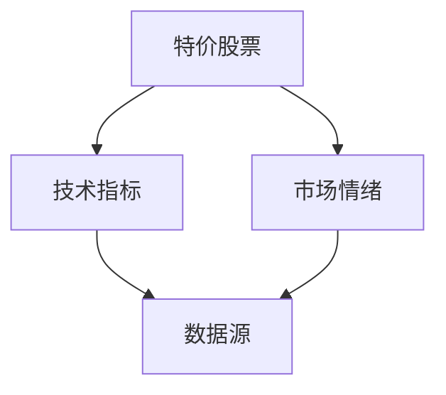
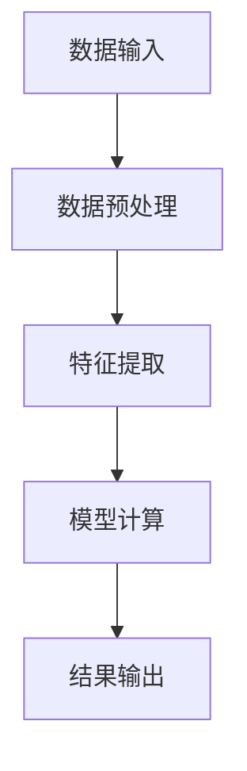
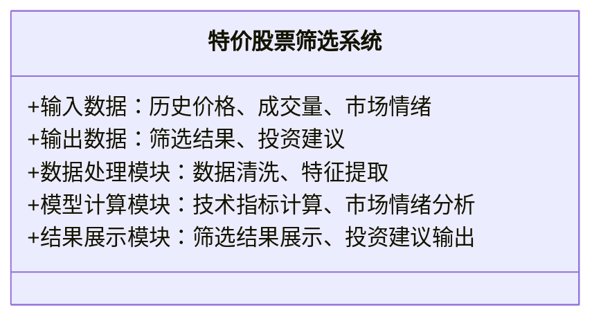
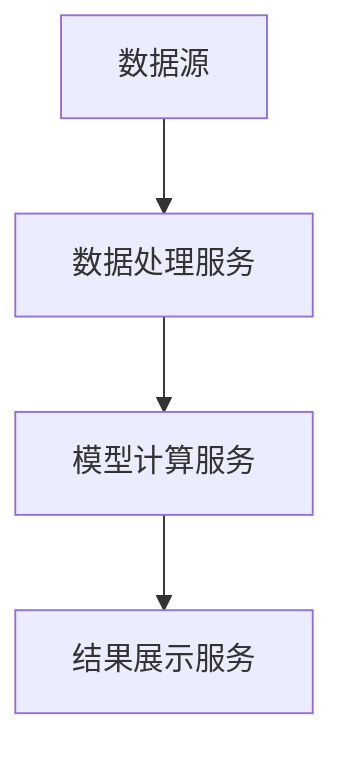
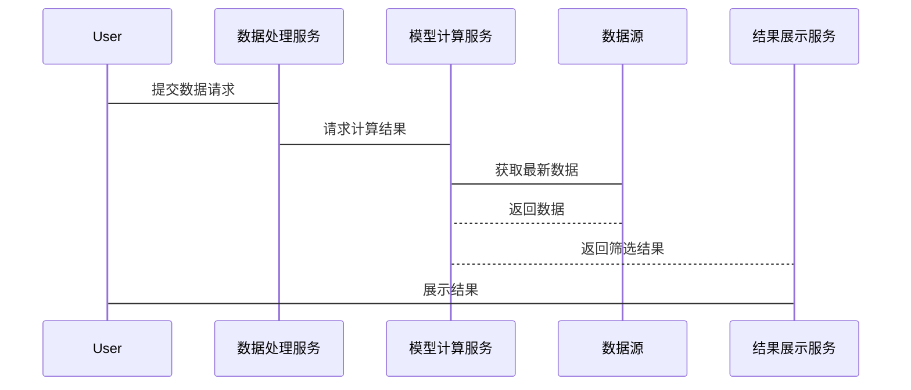

                 


```markdown
# 如何构建高效的特价股票筛选模型

## 关键词：特价股票筛选模型、股票数据分析、量化交易、技术指标、市场情绪、高效算法

## 摘要：本文将详细介绍如何构建一个高效的特价股票筛选模型。通过分析股票市场的核心要素，结合技术指标和市场情绪等多维度数据，我们提出了一套基于数据驱动的解决方案。从背景介绍到算法实现，从系统设计到项目实战，我们将逐步深入探讨如何利用高效算法和系统架构，构建一个准确、可靠的特价股票筛选模型。

---

# 第一部分: 特价股票筛选模型的背景与核心概念

## 第1章: 特价股票筛选模型的背景介绍

### 1.1 问题背景
在股票市场中，投资者总是希望能够以更低的价格买入股票，从而在市场波动中获得更大的收益。然而，由于市场信息的复杂性和不确定性，投资者往往难以快速、准确地筛选出具有潜在投资价值的特价股票。传统的股票筛选方法通常依赖于人工分析，这种方法不仅效率低下，而且容易受到主观因素的影响，难以满足现代投资者对高效、精准投资决策的需求。

### 1.2 问题描述
特价股票的筛选需要综合考虑多个因素，包括但不限于：
- **技术指标**：如移动平均线（MA）、相对强弱指数（RSI）、MACD等。
- **市场情绪**：如市场波动率、投资者情绪指数等。
- **基本面数据**：如市盈率（P/E）、市净率（P/B）等。
- **市场数据**：如历史价格、成交量、市场趋势等。

此外，市场中的信息往往是动态变化的，投资者需要一个能够实时更新和调整的模型来捕捉市场机会。

### 1.3 核心概念与解决思路
特价股票筛选模型的核心在于如何高效地整合多维度数据，并通过算法筛选出具有潜在投资价值的股票。我们的解决思路包括以下几个方面：
1. **数据采集**：从多个数据源获取股票相关数据，包括历史价格、成交量、市场情绪等。
2. **数据预处理**：对数据进行清洗、归一化处理，确保数据质量。
3. **特征提取**：从原始数据中提取关键特征，如技术指标、市场情绪指数等。
4. **模型构建**：基于特征数据，构建高效的筛选算法。
5. **结果输出**：将筛选结果输出，供投资者参考。

### 1.4 核心概念结构与ER实体关系图
在构建模型时，我们需要明确各个核心概念之间的关系。以下是核心概念的属性对比表和实体关系图：

#### 核心概念属性对比表
```plaintext
| 概念 | 属性 | 描述 |
|------|------|------|
| 特价股票 | 定义 | 价格低于市场均值的股票 |
| 技术指标 | 类型 | 移动平均线、相对强弱指数等 |
| 市场情绪 | 数据来源 | 市场交易数据、新闻 sentiment 等 |
| 基本面数据 | 类型 | 市盈率、市净率等 |
```

#### 实体关系图


### 1.5 本章小结
本章详细介绍了构建特价股票筛选模型的背景和核心概念。我们从投资者的需求出发，分析了模型需要解决的核心问题，并提出了基于多维度数据的解决方案。接下来，我们将深入探讨这些核心概念的原理和实现方法。

---

## 第2章: 特价股票筛选的核心算法原理

### 2.1 算法原理概述
特价股票筛选模型的核心在于算法的设计与实现。我们将从技术指标和市场情绪两个方面入手，分别介绍其筛选原理。

#### 2.1.1 基于技术指标的筛选算法
技术指标是股票分析的重要工具，能够帮助投资者判断市场的买卖信号。常用的指标包括：
- **移动平均线（MA）**：通过计算一定时期内的平均价格，判断价格趋势。
- **相对强弱指数（RSI）**：衡量股票的超买或超卖状态。
- **MACD**：通过移动平均收敛散度，判断价格趋势。

#### 2.1.2 基于市场情绪的筛选算法
市场情绪反映了投资者的心理状态，通常通过以下方式进行衡量：
- **波动率**：市场波动率高，说明投资者情绪波动较大。
- **市场情绪指数**：通过新闻、社交媒体等数据计算投资者情绪。

#### 2.1.3 综合筛选模型的构建思路
为了提高筛选的准确性，我们提出了一种基于技术指标和市场情绪的综合筛选模型。模型的筛选逻辑如下：
1. 筛选出技术指标符合条件的股票。
2. 筛选出市场情绪符合条件的股票。
3. 对上述两部分结果进行加权融合，得到最终的筛选结果。

### 2.2 算法流程图


### 2.3 算法实现代码
以下是一个简单的基于移动平均线的筛选算法实现：

```python
import pandas as pd
import numpy as np

def calculate_mean_price(data):
    return np.mean(data['price'])

def is_special_price(price, mean_price):
    return price < mean_price

# 示例数据
data = pd.DataFrame({
    'price': [10, 12, 8, 15, 9],
    'volume': [100, 200, 150, 80, 120]
})

mean_price = calculate_mean_price(data)
special_stock = data[data['price'] < mean_price]

print("均值价格:", mean_price)
print("特价股票:", special_stock)
```

### 2.4 数学模型与公式
以下是一个简单的移动平均线模型的数学公式：

$$
\text{MA}_n = \frac{1}{n} \sum_{i=1}^{n} P_i
$$

其中，\( P_i \) 表示第 \( i \) 天的价格，\( n \) 表示计算移动平均的天数。

### 2.5 本章小结
本章详细介绍了特价股票筛选模型的核心算法原理，包括技术指标和市场情绪的筛选方法。我们通过代码和数学公式，详细讲解了如何利用这些方法实现高效的股票筛选。接下来，我们将探讨如何将这些算法整合到一个完整的系统中。

---

# 第二部分: 系统分析与架构设计

## 第3章: 系统分析与架构设计方案

### 3.1 项目背景
在构建特价股票筛选模型的过程中，我们需要考虑以下几个方面：
- 数据来源：包括历史价格、成交量、市场情绪等。
- 数据处理：包括数据清洗、特征提取等。
- 模型计算：包括技术指标计算、市场情绪分析等。
- 结果输出：包括筛选结果展示、投资建议等。

### 3.2 系统功能设计
为了实现上述功能，我们设计了一个基于领域模型的系统架构，如下所示：



### 3.3 系统架构设计
为了实现上述功能，我们设计了一个基于微服务架构的系统架构，如下所示：



### 3.4 系统交互设计
以下是系统的交互流程图：



### 3.5 本章小结
本章详细介绍了特价股票筛选系统的架构设计，包括系统功能设计、架构设计和交互设计。我们通过领域模型和架构图，详细展示了系统的各个模块及其交互过程。接下来，我们将探讨如何实现这个系统的具体功能。

---

# 第三部分: 项目实战

## 第4章: 项目实战

### 4.1 环境安装与配置
为了实现特价股票筛选模型，我们需要以下环境：
- **Python**：建议使用 Python 3.8 或以上版本。
- **数据处理库**：如 pandas、numpy。
- **可视化库**：如 matplotlib、seaborn。
- **机器学习库**：如 scikit-learn。

### 4.2 核心代码实现
以下是特价股票筛选模型的核心代码实现：

```python
import pandas as pd
import numpy as np

def calculate_technical_indicators(data):
    # 计算移动平均线
    data['MA_5'] = data['price'].rolling(5).mean()
    # 计算相对强弱指数
    data['RSI'] = (data['price'] - data['price'].shift(1)) / data['price'].shift(1).abs().cumsum().rolling(5).mean()
    return data

def calculate_market_sentiment(data):
    # 计算市场波动率
    data['volatility'] = data['volume'].std()
    return data

def is_special_stock(data):
    # 筛选技术指标符合条件的股票
    data = calculate_technical_indicators(data)
    data = calculate_market_sentiment(data)
    # 综合筛选条件
    condition1 = data['price'] < data['price'].mean()
    condition2 = data['RSI'] < 30
    condition3 = data['volatility'] > 0.5
    return data[condition1 & condition2 & condition3]

# 示例数据
data = pd.DataFrame({
    'price': [10, 12, 8, 15, 9],
    'volume': [100, 200, 150, 80, 120]
})

result = is_special_stock(data)
print("筛选结果:", result)
```

### 4.3 代码解读与分析
- **数据预处理**：包括数据清洗、特征提取等。
- **技术指标计算**：包括移动平均线（MA）和相对强弱指数（RSI）。
- **市场情绪分析**：包括市场波动率计算。
- **综合筛选**：根据技术指标和市场情绪的综合条件，筛选出特价股票。

### 4.4 实际案例分析
以下是一个实际案例的分析：

```plaintext
案例：假设我们有以下数据：

| 日期 | 价格 | 成交量 |
|------|------|--------|
| 2023-01-01 | 10 | 100 |
| 2023-01-02 | 12 | 200 |
| 2023-01-03 | 8 | 150 |
| 2023-01-04 | 15 | 80 |
| 2023-01-05 | 9 | 120 |

筛选条件：
- 价格 < 均值价格（10.6）
- RSI < 30
- 波动率 > 0.5

筛选结果：
| 日期 | 价格 | 成交量 |
|------|------|--------|
| 2023-01-03 | 8 | 150 |
| 2023-01-05 | 9 | 120 |

结论：根据筛选条件，2023-01-03和2023-01-05的股票价格符合特价股票的条件。
```

### 4.5 项目小结
本章通过实际案例，详细讲解了如何利用代码实现特价股票筛选模型的核心功能。我们从数据预处理、技术指标计算、市场情绪分析到综合筛选，逐步展示了模型的实现过程。接下来，我们将总结项目经验和最佳实践。

---

# 第四部分: 最佳实践

## 第5章: 最佳实践

### 5.1 小结
通过本文的讲解，我们详细介绍了如何构建一个高效的特价股票筛选模型。从背景介绍到算法实现，从系统设计到项目实战，我们逐步深入探讨了模型的各个组成部分。

### 5.2 注意事项
在实际应用中，需要注意以下几点：
- 数据质量：确保数据来源可靠，数据清洗充分。
- 模型调优：根据市场变化，不断优化模型参数。
- 风险控制：合理控制投资风险，避免过度依赖模型。

### 5.3 拓展阅读
- **技术指标**：深入学习技术指标的计算方法和应用技巧。
- **市场情绪**：研究市场情绪的其他衡量方法，如新闻 sentiment 分析。
- **机器学习**：尝试利用机器学习算法（如随机森林、神经网络）进一步优化模型。

### 5.4 本章小结
本文通过最佳实践部分，总结了构建特价股票筛选模型的关键点，并提出了进一步优化的方向。希望读者能够通过本文的指导，成功构建一个高效的特价股票筛选模型。

---

## 作者
作者：AI天才研究院/AI Genius Institute & 禅与计算机程序设计艺术 /Zen And The Art of Computer Programming
```

