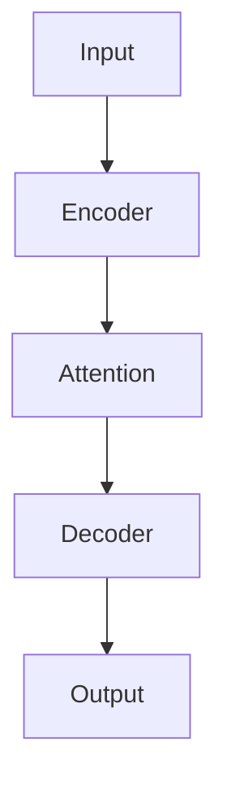
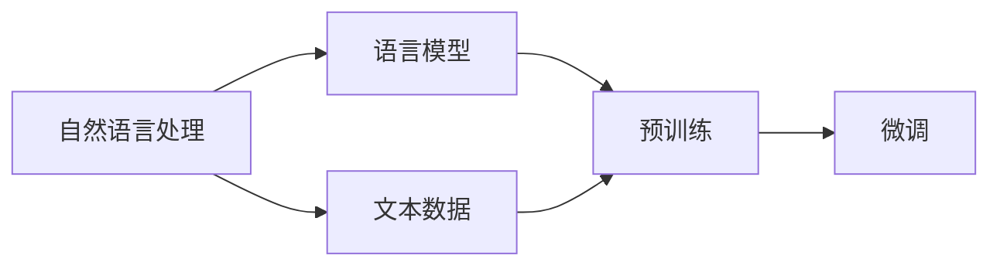
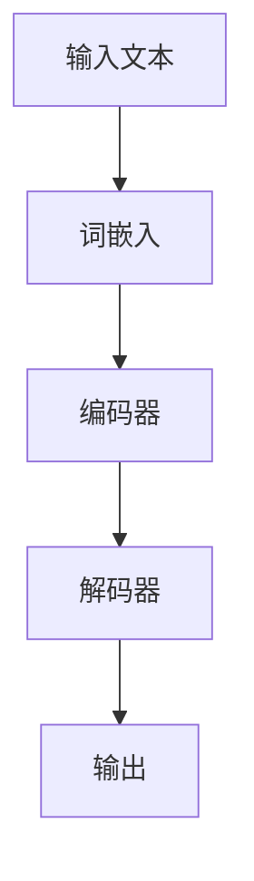
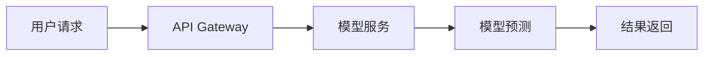

                 


# 如何评估企业的AI驱动的自然语言处理技术

> 关键词：企业AI，自然语言处理，评估方法，技术实现，应用案例

> 摘要：本文详细介绍了如何评估企业中AI驱动的自然语言处理技术。从背景介绍、核心概念、算法原理、系统架构到项目实战，全面分析了企业级NLP技术的关键评估维度和方法。通过具体案例分析，展示了如何将理论应用于实际项目，并总结了最佳实践和未来发展方向。

---

# 第一部分: 企业AI驱动的自然语言处理技术背景

# 第1章: 企业AI驱动的自然语言处理技术概述

## 1.1 问题背景与定义

企业AI驱动的自然语言处理（NLP）技术是当前人工智能领域的重要研究方向之一。随着深度学习技术的快速发展，NLP技术在企业中的应用越来越广泛，涵盖了自然语言理解（NLU）、自然语言生成（NLG）、机器翻译、情感分析等多个领域。然而，企业在引入和实施AI驱动的NLP技术时，常常面临技术选型、性能评估、成本效益分析等挑战。因此，如何科学、系统地评估企业的AI驱动NLP技术，成为企业技术决策者和开发者关注的核心问题。

### 1.1.1 企业AI驱动的NLP技术背景

AI驱动的NLP技术不同于传统的基于规则的NLP方法，其核心是通过深度学习模型（如Transformer、BERT等）来实现对自然语言的智能理解和生成。企业AI驱动的NLP技术的应用场景包括智能客服、智能问答系统、舆情分析、文本分类、信息提取等。这些技术能够显著提升企业的智能化水平，但同时也对企业的技术能力和资源提出了更高的要求。

### 1.1.2 问题描述与目标

企业在引入AI驱动的NLP技术时，需要考虑以下几个关键问题：
1. **技术可行性**：选择适合企业需求的NLP模型和算法。
2. **性能评估**：确保模型在实际场景中的表现达到预期。
3. **成本效益**：在有限的预算内实现最优的技术方案。
4. **可扩展性**：确保技术方案能够适应企业未来的发展需求。

本章的目标是帮助企业技术决策者和开发者明确AI驱动NLP技术的核心概念和关键问题，为后续的技术评估奠定基础。

### 1.1.3 技术边界与外延

AI驱动的NLP技术的核心在于通过深度学习模型实现对自然语言的理解和生成。然而，其技术边界包括但不限于：
- **数据来源**：企业内部数据（如客户咨询、交易记录）和外部数据（如社交媒体、新闻资讯）。
- **模型训练**：预训练模型（如BERT）的微调与定制化训练。
- **部署环境**：云端、边缘计算环境或本地部署。
- **性能指标**：准确率、召回率、F1分数、响应时间等。

### 1.1.4 核心概念结构与要素

AI驱动的NLP技术的核心要素包括：
1. **数据**：高质量的训练数据是模型性能的基础。
2. **模型**：选择适合任务的深度学习模型（如Transformer、LSTM）。
3. **算法**：包括文本预处理、特征提取、模型训练等步骤。
4. **工具与平台**：如TensorFlow、PyTorch等深度学习框架，以及云平台（如AWS、Azure）。
5. **应用场景**：如智能客服、舆情分析、文本分类等。

## 1.2 传统NLP与AI驱动NLP的对比

传统NLP方法依赖于规则和统计模型，而AI驱动的NLP技术基于深度学习模型。两者的区别主要体现在以下几个方面：
1. **技术原理**：传统NLP依赖于手动编写规则和特征提取，而AI驱动的NLP通过大量数据训练模型，实现对语言的智能理解。
2. **性能**：AI驱动的NLP技术在处理复杂语义任务时表现更优，但需要大量的计算资源。
3. **可扩展性**：AI驱动的NLP技术能够更好地适应企业的多样化需求，而传统方法在面对复杂场景时往往力不从心。

---

# 第2章: 核心概念与联系

## 2.1 NLP技术的核心原理

AI驱动的NLP技术的核心在于模型的训练和优化。以下通过一个简单的文本分类案例，展示模型的基本原理。

### 2.1.1 词嵌入算法

词嵌入（Word Embedding）是将单词映射为低维向量的技术，常用的方法包括Word2Vec、GloVe和FastText。以下是Word2Vec的实现示例：

```python
from gensim.models import Word2Vec
model = Word2Vec(sentences, vector_size=100, window=5, min_count=1, workers=4)
```

### 2.1.2 Transformer模型的解码过程

Transformer模型由编码器和解码器组成，其核心思想是通过自注意力机制捕捉文本中的语义信息。以下是一个简化的Transformer解码过程：



### 2.1.3 注意力机制的数学表达

注意力机制的数学表达如下：

$$
\text{Attention}(Q, K, V) = \text{softmax}\left(\frac{QK^T}{\sqrt{d_k}}\right)V
$$

其中，$Q$、$K$、$V$分别是查询、键和值矩阵，$d_k$是键的维度。

## 2.2 核心概念对比表

以下是传统NLP与AI驱动NLP的核心要素对比：

| 对比维度       | 传统NLP                 | AI驱动NLP                 |
|----------------|-------------------------|---------------------------|
| 技术原理       | 基于规则和统计模型       | 基于深度学习模型           |
| 数据需求       | 数据量小，依赖特征工程   | 数据量大，依赖大量标注数据 |
| 处理能力       | 适用于简单任务（如分词） | 适用于复杂任务（如语义理解） |
| 可解释性       | 高                     | 低                       |

## 2.3 实体关系图

以下是NLP技术的核心实体关系图：



## 2.4 本章小结

本章通过对比传统NLP与AI驱动NLP的核心概念，详细介绍了AI驱动NLP技术的基本原理和关键要素。理解这些核心概念是后续技术评估的基础。

---

# 第3章: 算法原理与数学模型

## 3.1 算法原理

AI驱动的NLP技术的核心在于模型的训练和优化。以下通过一个简单的文本分类案例，展示模型的基本原理。

### 3.1.1 词嵌入算法

词嵌入（Word Embedding）是将单词映射为低维向量的技术，常用的方法包括Word2Vec、GloVe和FastText。以下是Word2Vec的实现示例：

```python
from gensim.models import Word2Vec
model = Word2Vec(sentences, vector_size=100, window=5, min_count=1, workers=4)
```

### 3.1.2 Transformer模型的解码过程

Transformer模型由编码器和解码器组成，其核心思想是通过自注意力机制捕捉文本中的语义信息。以下是一个简化的Transformer解码过程：


### 3.1.3 注意力机制的数学表达

注意力机制的数学表达如下：

$$
\text{Attention}(Q, K, V) = \text{softmax}\left(\frac{QK^T}{\sqrt{d_k}}\right)V
$$

其中，$Q$、$K$、$V$分别是查询、键和值矩阵，$d_k$是键的维度。

## 3.2 算法流程图

以下是NLP技术的算法流程图：



## 3.3 本章小结

本章详细介绍了AI驱动NLP技术的核心算法原理，包括词嵌入、Transformer模型和注意力机制的数学表达。理解这些原理是评估企业NLP技术的关键。

---

# 第4章: 系统分析与架构设计

## 4.1 系统分析

AI驱动的NLP技术需要一个高效、稳定的系统架构。以下是一个典型的企业NLP系统的架构设计：

### 4.1.1 需求分析

企业在引入AI驱动的NLP技术时，需要考虑以下需求：
1. **功能需求**：如文本分类、实体识别、情感分析。
2. **性能需求**：如响应时间、吞吐量。
3. **扩展性需求**：如数据量的扩展、功能的扩展。

### 4.1.2 功能设计

以下是企业NLP系统的功能模块设计：

| 功能模块       | 描述                     |
|----------------|-------------------------|
| 文本预处理     | 数据清洗、分词、停用词处理 |
| 模型训练       | 基于标注数据的模型训练   |
| 模型部署       | 模型的服务化部署         |
| 接口调用       | 对外提供API接口          |

### 4.1.3 架构设计

以下是企业NLP系统的架构设计图：



---

# 第5章: 项目实战

## 5.1 环境配置

以下是NLP项目开发的环境配置示例：

```bash
# 安装依赖
pip install tensorflow
pip install numpy
pip install gensim
```

## 5.2 核心代码实现

以下是文本分类任务的核心代码实现：

```python
import tensorflow as tf
from tensorflow.keras import layers

model = tf.keras.Sequential()
model.add(layers.Embedding(input_dim=10000, output_dim=16))
model.add(layers.GlobalAveragePooling1D())
model.add(layers.Dense(1, activation='sigmoid'))
model.compile(optimizer='adam', loss='binary_crossentropy', metrics=['accuracy'])
```

## 5.3 案例分析

以下是一个具体的NLP项目案例：

### 案例背景

某企业希望通过NLP技术实现客户咨询的分类，以便更好地分配客服资源。

### 数据准备

数据包括客户咨询文本和标签（如咨询类型）。

### 模型训练

使用预训练的BERT模型进行微调，实现文本分类任务。

### 模型部署

将模型部署到企业的云平台上，提供API接口供其他系统调用。

## 5.4 本章小结

本章通过一个具体的项目案例，展示了企业AI驱动NLP技术的开发流程和实现细节。

---

# 第6章: 最佳实践与小结

## 6.1 最佳实践

企业在引入AI驱动的NLP技术时，需要注意以下几点：
1. **数据质量**：确保训练数据的多样性和代表性。
2. **模型选择**：根据具体任务选择适合的模型和算法。
3. **性能优化**：通过模型压缩、并行计算等技术优化模型性能。
4. **可扩展性**：确保技术方案能够适应企业的未来发展需求。

## 6.2 小结

本文从背景介绍、核心概念、算法原理、系统架构到项目实战，全面分析了企业AI驱动NLP技术的关键评估维度和方法。通过具体案例分析，展示了如何将理论应用于实际项目，并总结了最佳实践和未来发展方向。

## 6.3 注意事项

企业在引入AI驱动的NLP技术时，需要注意数据隐私和模型安全问题，确保符合相关法律法规。

## 6.4 拓展阅读

1. **深度学习经典书籍**：《深度学习》（Deep Learning）—— Ian Goodfellow
2. **NLP经典论文**：《Attention Is All You Need》—— Vaswani et al.

---

# 结语

企业AI驱动的自然语言处理技术是人工智能领域的核心方向之一，其在企业中的应用前景广阔。通过科学的评估方法和系统的实施策略，企业可以充分发挥AI驱动NLP技术的潜力，提升智能化水平和竞争力。

---

# 作者：AI天才研究院/AI Genius Institute & 禅与计算机程序设计艺术 /Zen And The Art of Computer Programming

