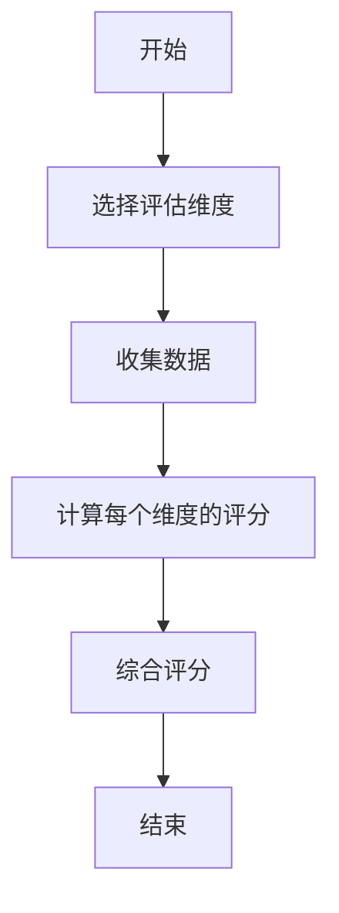
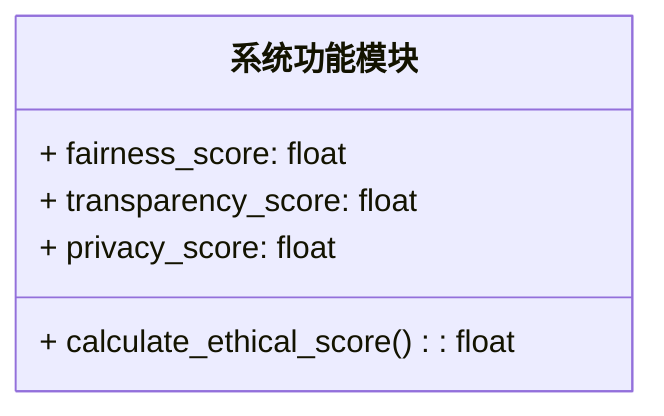
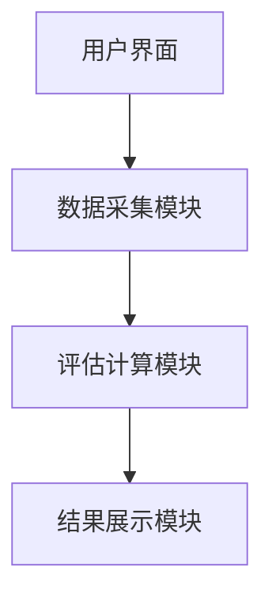
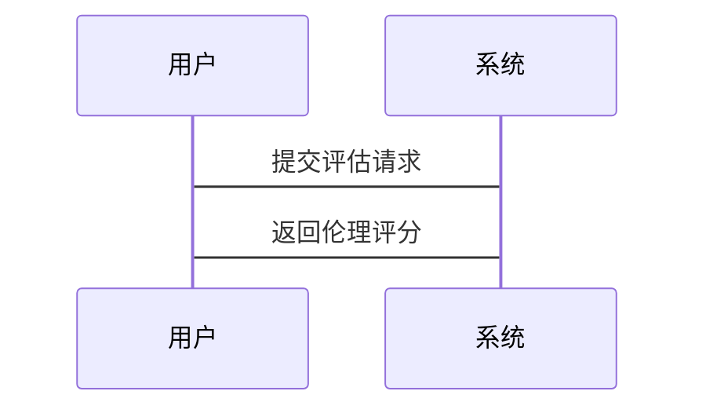

                 


# 如何评估企业的人工智能伦理标准

---

## 关键词：人工智能伦理、企业评估、伦理标准、技术伦理、AI治理、企业责任

---

## 摘要

人工智能技术的快速发展为企业带来了前所未有的机遇，但同时也引发了诸多伦理问题。如何评估和制定符合伦理标准的人工智能系统，成为企业面临的重要挑战。本文从人工智能伦理的核心概念、算法原理、系统架构等多个维度，详细分析了企业评估人工智能伦理标准的关键步骤和方法，并通过实际案例和代码实现，为企业提供实用的指导。

---

## 第1章：人工智能的现状与伦理问题

### 1.1 人工智能的发展现状

人工智能（Artificial Intelligence, AI）技术近年来取得了显著进展，广泛应用于医疗、金融、交通、教育等多个领域。从智能客服到自动驾驶，从个性化推荐到智能风控，人工智能正在改变我们的生活方式和商业模式。

#### 1.1.1 人工智能技术的演进历程

人工智能的发展可以分为以下几个阶段：
1. **符号逻辑阶段（1950s-1970s）**：基于规则的专家系统。
2. **知识工程阶段（1980s-1990s）**：知识表示和推理技术的成熟。
3. **机器学习阶段（2000s-2010s）**：基于数据的算法驱动。
4. **深度学习阶段（2010s至今）**：神经网络和大数据技术的结合。

#### 1.1.2 当前人工智能技术的主要应用领域

- **医疗领域**：疾病诊断、药物研发。
- **金融领域**：风险管理、智能投顾。
- **交通领域**：自动驾驶、智能调度。
- **教育领域**：个性化学习、智能辅导。

#### 1.1.3 人工智能技术对企业的影响

人工智能技术不仅提高了企业的运营效率，还为企业创造了新的商业模式。然而，技术的快速发展也带来了伦理问题的挑战。

### 1.2 人工智能伦理问题的背景

随着人工智能技术的普及，伦理问题日益凸显。例如，算法偏见、数据隐私、责任归属等问题引发了社会的广泛关注。

#### 1.2.1 人工智能带来的伦理挑战

- **算法偏见**：算法在训练数据中可能引入偏见，导致不公平的决策。
- **数据隐私**：用户数据的收集和使用可能侵犯个人隐私。
- **责任归属**：当人工智能系统出现问题时，责任归属尚不明确。

#### 1.2.2 企业责任与伦理标准

企业作为人工智能技术的主要应用者，有责任确保其技术符合伦理标准。伦理标准不仅是对社会负责的表现，也是企业可持续发展的基础。

#### 1.2.3 企业为何需要关注人工智能伦理标准

- **合规性**：遵守相关法律法规。
- **信任建设**：赢得客户和合作伙伴的信任。
- **风险管理**：降低因伦理问题引发的法律和声誉风险。

---

## 第2章：人工智能伦理的核心概念

### 2.1 人工智能伦理的定义与维度

人工智能伦理是指在人工智能技术的设计、开发和应用过程中，确保技术符合道德和伦理准则。

#### 2.1.1 人工智能伦理的定义

人工智能伦理关注技术对人类社会的影响，强调技术的公平性、透明性和责任归属。

#### 2.1.2 人工智能伦理的主要维度

- **透明性**：用户能够理解人工智能系统的决策过程。
- **公平性**：算法不应歧视特定群体。
- **隐私保护**：保护用户的个人数据不被滥用。
- **责任归属**：明确人工智能系统出现问题时的责任方。

### 2.2 人工智能伦理的基本原则

人工智能伦理的核心原则包括透明性、公平性、隐私保护和责任归属。

#### 2.2.1 透明性原则

人工智能系统的决策过程应当透明，避免“黑箱”操作。

#### 2.2.2 公平性原则

算法设计应当避免对特定群体的歧视。

#### 2.2.3 隐私保护原则

用户数据应当得到充分保护，防止未经授权的使用。

#### 2.2.4 责任归属原则

当人工智能系统出现问题时，应当明确责任归属。

### 2.3 人工智能伦理与企业治理的关系

人工智能伦理是企业治理的重要组成部分，直接影响企业的声誉和可持续发展。

#### 2.3.1 企业治理中的伦理框架

企业需要建立伦理框架，确保人工智能技术的合规性。

#### 2.3.2 人工智能伦理对企业决策的影响

伦理标准影响企业的技术研发和产品设计。

#### 2.3.3 伦理标准在企业治理中的具体应用

企业需要在技术研发、数据使用、产品推广等环节中考虑伦理问题。

---

## 第3章：人工智能伦理评估的算法原理

### 3.1 算法原理概述

人工智能伦理评估算法用于量化人工智能系统的伦理风险。

#### 3.1.1 伦理评估的基本原理

通过分析算法的决策过程和数据来源，评估其对伦理标准的符合程度。

#### 3.1.2 伦理评分模型的构建

基于多个伦理维度，构建评分模型，量化系统的伦理风险。

### 3.2 算法实现步骤

使用Mermaid绘制算法流程图，展示伦理评估的步骤。



#### 3.2.1 伦理评分模型

伦理评分模型的公式如下：

$$
\text{伦理评分} = \frac{1}{1 + e^{-x}}
$$

其中，$x$ 是评估指标的加权和。

### 3.3 算法实现代码

以下是Python代码实现伦理评估算法的核心部分：

```python
import numpy as np

def calculate_ethical_score(fairness_score, transparency_score, privacy_score):
    x = fairness_score * 0.4 + transparency_score * 0.3 + privacy_score * 0.3
    ethical_score = 1 / (1 + np.exp(-x))
    return ethical_score

# 示例数据
fairness_score = 0.8
transparency_score = 0.7
privacy_score = 0.9

score = calculate_ethical_score(fairness_score, transparency_score, privacy_score)
print("伦理评分:", score)
```

---

## 第4章：人工智能伦理评估的系统架构

### 4.1 系统功能设计

人工智能伦理评估系统需要具备数据采集、评估计算和结果展示等功能。

#### 4.1.1 领域模型设计

使用Mermaid类图展示系统功能模块之间的关系。



#### 4.1.2 系统架构设计

使用Mermaid架构图展示系统的整体架构。



#### 4.1.3 接口设计

系统需要提供API接口，供其他系统调用评估结果。

#### 4.1.4 交互流程

使用Mermaid序列图展示用户与系统的交互流程。



---

## 第5章：项目实战

### 5.1 环境安装

安装所需的Python库，如numpy、pandas等。

### 5.2 核心代码实现

实现伦理评估算法的核心代码，并进行测试。

### 5.3 案例分析

通过实际案例分析，验证算法的有效性和准确性。

### 5.4 项目小结

总结项目实施的经验和教训，提出改进建议。

---

## 第6章：最佳实践与注意事项

### 6.1 最佳实践

- 定期审查伦理标准，确保符合最新法规。
- 建立多部门协作机制，确保伦理问题得到及时解决。

### 6.2 小结

人工智能伦理评估是企业可持续发展的重要保障。企业需要从技术、法律和社会三个维度综合考虑，确保人工智能技术的健康发展。

### 6.3 注意事项

- 数据隐私保护是伦理评估的核心内容之一。
- 算法透明性是赢得用户信任的关键。

### 6.4 拓展阅读

推荐相关书籍和论文，帮助读者深入理解人工智能伦理问题。

---

## 作者

作者：AI天才研究院/AI Genius Institute & 禅与计算机程序设计艺术/Zen And The Art of Computer Programming

---

通过以上步骤，企业可以系统性地评估和制定人工智能伦理标准，确保技术的健康发展。希望本文能够为企业提供有价值的指导和启发。

