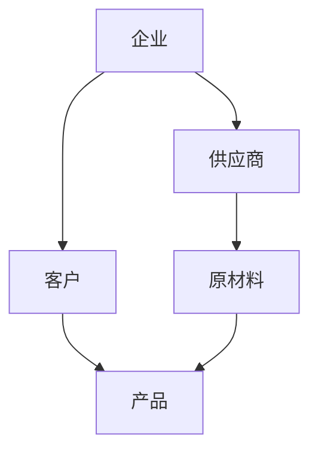
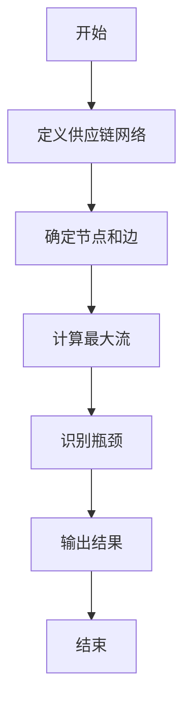
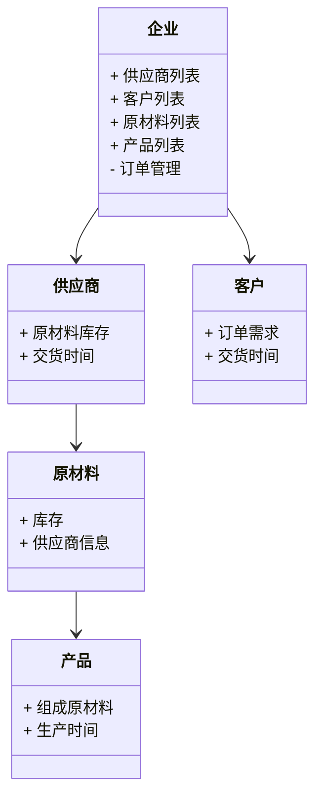

                 


# 如何评估企业的供应链弹性

## 关键词：供应链弹性、供应链风险管理、供应链优化、供应链韧性、供应链系统设计

## 摘要：供应链弹性是企业在面对外部干扰和不确定性时维持或快速恢复供应链稳定性的能力。本文从供应链弹性的核心概念、数学模型、系统架构、项目实战等多个维度，详细分析了如何评估企业的供应链弹性，并通过实际案例和最佳实践，为企业提供可行的解决方案。

---

## 第一部分: 供应链弹性评估的背景与概念

### 第1章: 供应链弹性的定义与重要性

#### 1.1 供应链弹性的定义
- 供应链弹性是指企业在面对突发事件（如自然灾害、疫情、地缘政治冲突等）时，能够快速调整供应链策略，维持业务连续性，并从中断中恢复的能力。
- 供应链弹性不仅仅是应对危机的能力，还包括在正常情况下优化供应链以适应变化。

#### 1.2 供应链弹性的背景与问题背景
- 近年来，全球供应链面临前所未有的挑战，如2020年的新冠疫情导致的全球供应链中断，暴露出企业对供应链弹性的忽视。
- 供应链中断对企业的影响包括：交货延迟、成本增加、客户满意度下降、品牌声誉受损等。
- 供应链弹性评估的必要性：企业需要通过评估供应链弹性，识别风险点，并制定应对策略。

#### 1.3 供应链弹性的边界与外延
- 供应链弹性评估的适用范围：从原材料采购到产品交付的全链条。
- 供应链弹性与其他供应链管理概念的区分：
  - 与供应链可靠性：可靠性关注日常运营的稳定性，弹性关注应对突发中断的能力。
  - 与供应链灵活性：灵活性关注适应市场变化的能力，弹性关注应对危机的能力。

---

### 第2章: 供应链弹性评估的核心要素

#### 2.1 供应链弹性的核心要素
- **韧性（Resilience）**：企业在面对中断时的承受能力。
- **恢复力（Recoverability）**：企业在中断后快速恢复的能力。
- **适应性（Adaptability）**：企业在变化环境中调整供应链的能力。

#### 2.2 核心概念的对比分析
- **供应链弹性与可靠性的对比**：
  - 可靠性关注日常运营的稳定性，弹性关注应对突发中断的能力。
  - 可靠性是弹性的一部分，但弹性还包括恢复和适应能力。
- **供应链弹性与灵活性的对比**：
  - 灵活性关注适应市场变化的能力，弹性关注应对危机的能力。
  - 灵活性是长期优化，弹性是应对短期危机。

#### 2.3 供应链弹性评估的ER实体关系图


---

## 第二部分: 供应链弹性评估的算法原理

### 第3章: 供应链弹性评估的数学模型与公式

#### 3.1 供应链弹性评估的数学模型
- **供应链弹性指数计算公式**：
  $$ E = \frac{S}{T} $$
  其中，$S$ 表示供应链的弹性系数，$T$ 表示供应链的弹性阈值。

#### 3.2 网络流模型在供应链弹性评估中的应用
- 网络流模型的基本原理：
  - 通过构建供应链网络的节点和边，计算关键路径和瓶颈。
  - 利用最大流算法确定供应链的最大容量和中断风险。

#### 3.3 算法流程图


#### 3.4 Python实现
```python
import networkx as nx
from networkx.algorithms.flow import max_flow

# 定义供应链网络
G = nx.DiGraph()
G.add_nodes_from(['A', 'B', 'C', 'D'])
G.add_edges_from([('A', 'B'), ('B', 'C'), ('C', 'D')])

# 设置容量
G['A']['B']['capacity'] = 10
G['B']['C']['capacity'] = 15
G['C']['D']['capacity'] = 20

# 计算最大流
flow_value = max_flow(G, 'A', 'D')
print(f"最大流为：{flow_value}")
```

---

## 第三部分: 供应链弹性评估的系统分析与架构设计

### 第4章: 供应链弹性评估的系统分析

#### 4.1 系统功能设计
- **需求分析**：
  - 支持多级供应商和客户。
  - 支持多种原材料和产品的流动。
  - 支持实时监控和风险预警。
- **领域模型类图**：


#### 4.2 系统架构设计
- **分层架构**：
  - 数据层：存储供应链数据。
  - 业务逻辑层：处理供应链弹性评估的计算。
  - 表现层：展示结果和风险预警。
- **系统架构图**：


#### 4.3 系统接口设计
- **API接口**：
  - GET /supply-chain/network 返回供应链网络结构。
  - POST /supply-chain/flow 计算最大流。

#### 4.4 系统交互设计


---

## 第四部分: 供应链弹性评估的项目实战

### 第5章: 项目实战

#### 5.1 环境安装
- 安装Python和NetworkX库：
  ```bash
  pip install networkx
  ```

#### 5.2 核心代码实现
```python
import networkx as nx
from networkx.algorithms.flow import max_flow

# 定义供应链网络
G = nx.DiGraph()
G.add_nodes_from(['A', 'B', 'C', 'D'])
G.add_edges_from([('A', 'B'), ('B', 'C'), ('C', 'D')])

# 设置容量
G['A']['B']['capacity'] = 10
G['B']['C']['capacity'] = 15
G['C']['D']['capacity'] = 20

# 计算最大流
flow_value = max_flow(G, 'A', 'D')
print(f"最大流为：{flow_value}")
```

#### 5.3 代码解读
- **代码功能**：计算供应链网络中的最大流，识别瓶颈。
- **关键点**：
  - 网络流模型的应用。
  - 计算结果的解释。

#### 5.4 实际案例分析
- 案例背景：某汽车制造商的供应链中断。
- 案例分析：通过网络流模型识别瓶颈供应商，并制定替代方案。

---

## 第五部分: 总结与最佳实践

### 第6章: 总结与最佳实践

#### 6.1 小结
- 供应链弹性是企业在复杂环境中生存和发展的关键能力。
- 通过数学模型和系统架构设计，企业可以有效评估和优化供应链弹性。

#### 6.2 注意事项
- 数据的准确性和完整性是供应链弹性评估的基础。
- 模型的选择和参数设置需要根据实际情况调整。

#### 6.3 未来趋势
- 数字化和智能化是供应链弹性评估的未来发展方向。
- AI和大数据技术将进一步提升供应链弹性的评估和优化能力。

#### 6.4 拓展阅读
- 推荐书籍：《供应链风险管理》、《供应链优化算法》
- 推荐工具：NetworkX、Gurobipy

---

## 作者：AI天才研究院/AI Genius Institute & 禅与计算机程序设计艺术 /Zen And The Art of Computer Programming

---

以上就是《如何评估企业的供应链弹性》的完整思考过程和文章内容。

