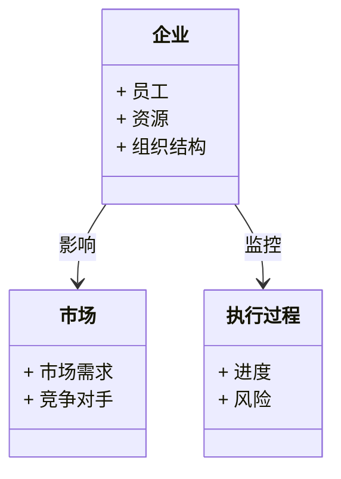
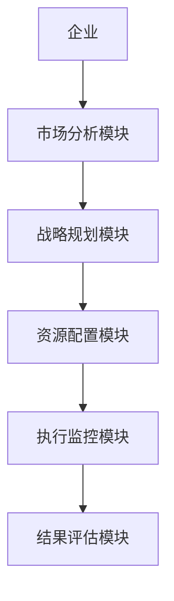
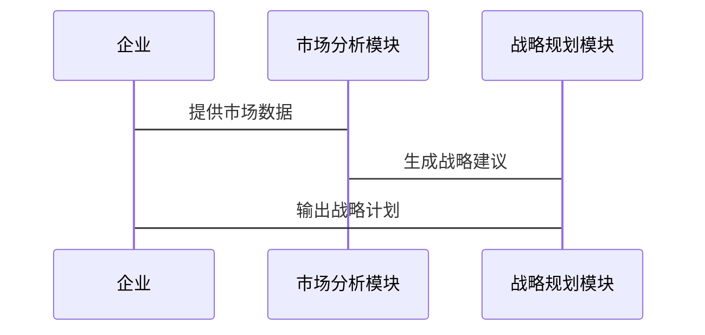

                 


# 如何评估企业的全球化战略执行力

> 关键词：全球化战略、执行力评估、战略管理、企业绩效、竞争力分析

> 摘要：在全球化背景下，企业需要制定并执行有效的全球化战略以提高市场竞争力。本文从全球化战略的核心概念、影响因素、评估方法等多方面展开分析，帮助企业更好地理解如何评估其全球化战略的执行力。通过详细阐述背景、核心概念、评估模型、系统架构设计、项目实战等内容，本文旨在为企业提供一套科学的全球化战略执行力评估体系，帮助企业在复杂的全球市场中实现战略目标。

---

## 第一部分: 全球化战略与执行力的背景与核心概念

### 第1章: 全球化战略的背景与意义

#### 1.1 全球化战略的背景与意义
- 1.1.1 全球化战略的定义与内涵  
  全球化战略是指企业在全球范围内配置资源、开拓市场、建立业务的过程。它强调企业在跨国经营中如何整合全球资源，优化配置，以实现更大的市场覆盖和竞争优势。

- 1.1.2 全球化战略对企业发展的核心作用  
  全球化战略能够帮助企业突破地域限制，进入更大的市场，获取更多的资源和客户，从而提高企业的竞争力和利润率。

- 1.1.3 全球化战略的演进与趋势  
  随着技术的进步和全球市场的日益一体化，全球化战略逐渐从简单的出口贸易扩展到跨国生产、研发、销售等全方位的国际化经营。

---

#### 1.2 执行力的定义与特点
- 1.2.1 执行力的定义与内涵  
  执行力是指企业将战略目标转化为具体行动并实现目标的能力。它涵盖了从战略制定到实施的整个过程，强调目标的实现和结果的达成。

- 1.2.2 执行力与企业绩效的关系  
  执行力是企业绩效的核心驱动力。高执行力的企业能够更快地响应市场变化，抓住机会，避免风险，从而实现更好的绩效。

- 1.2.3 全球化战略执行力的独特性  
  全球化战略执行力不仅需要企业具备国内市场的竞争力，还需要具备跨文化的适应能力、跨国运营的能力以及全球资源整合的能力。

---

### 第2章: 全球化战略执行力的核心概念与联系

#### 2.1 全球化战略的核心要素
- 2.1.1 战略目标  
  全球化战略的目标通常包括市场扩展、资源优化配置、品牌国际化等。

- 2.1.2 战略规划  
  战略规划是全球化战略的核心，包括市场进入策略、组织架构设计、资源配置计划等。

- 2.1.3 战略资源分配  
  全球化战略的成功依赖于资源的合理分配，包括资金、人才、技术等。

#### 2.2 执行力的关键影响因素
- 2.2.1 组织结构  
  企业的组织结构是否能够支持全球化战略的实施是影响执行力的重要因素。

- 2.2.2 人员能力  
  执行力的强弱很大程度上取决于员工的能力和素质，尤其是在跨国经营中，跨文化沟通和管理能力尤为重要。

- 2.2.3 文化与沟通  
  不同国家和地区的文化差异会影响企业内部的沟通与协调，进而影响执行力。

#### 2.3 全球化战略与执行力的关系
- 2.3.1 全球化战略的复杂性  
  全球化战略涉及多个国家和地区的市场，具有高度的复杂性和不确定性。

- 2.3.2 执行力在战略落地中的作用  
  执行力是将全球化战略从理念转化为现实的关键环节，决定了战略的成败。

- 2.3.3 两者之间的相互影响  
  全球化战略的复杂性要求执行力必须具备高度的灵活性和适应性，而执行力的强弱又直接影响全球化战略的实现效果。

---

### 第3章: 全球化战略执行力的评估模型

#### 3.1 评估模型的设计思路
- 3.1.1 模型的设计目标  
  本模型旨在为企业提供一个全面、科学的评估工具，帮助企业识别全球化战略执行中的关键问题。

- 3.1.2 模型的适用范围  
  该模型适用于跨国企业、跨国合资公司以及计划拓展全球市场的中小企业。

- 3.1.3 模型的创新点  
  结合全球化战略的特殊性，模型引入了跨文化适应性、跨国资源配置效率等独特指标。

#### 3.2 评估指标体系
- 3.2.1 战略目标达成度  
  包括市场扩展目标、利润目标等的实现程度。

- 3.2.2 资源配置效率  
  包括资金、人才、技术等资源的利用效率。

- 3.2.3 执行过程的可控性  
  包括执行过程中的风险控制、进度管理等。

#### 3.3 评估标准与评分体系
- 3.3.1 评分体系的设计  
  各指标按照权重进行评分，最终得出综合评分。

- 3.3.2 各指标权重的分配  
  根据全球化战略的特点，战略目标达成度占40%，资源配置效率占30%，执行过程的可控性占30%。

- 3.3.3 综合评分的计算方法  
  综合评分 = Σ(各指标得分 × 权重)

---

### 第4章: 全球化战略执行力的影响因素分析

#### 4.1 内部因素
- 4.1.1 企业组织结构  
  包括总部与海外分支机构的组织架构设计是否合理，是否能够快速响应市场需求。

- 4.1.2 人员能力与素质  
  包括员工的跨文化沟通能力、国际业务能力等。

- 4.1.3 内部沟通与协调  
  包括企业内部信息传递的效率、跨部门协作的能力等。

#### 4.2 外部因素
- 4.2.1 市场环境  
  包括目标市场的竞争状况、市场需求变化等。

- 4.2.2 政治法律环境  
  包括各国的法律法规、贸易政策等。

- 4.2.3 经济与文化环境  
  包括经济波动、文化差异对市场进入策略的影响等。

#### 4.3 综合影响分析
- 4.3.1 内部与外部因素的交互作用  
  内部因素和外部因素共同作用，决定了全球化战略执行的难度和效果。

- 4.3.2 关键因素的识别与优先级排序  
  根据具体企业的实际情况，识别影响执行力的关键因素，并进行优先级排序。

- 4.3.3 影响的动态变化与应对策略  
  全球化战略执行过程中，外部环境和内部条件可能发生变化，企业需要灵活调整策略。

---

### 第5章: 全球化战略执行力的评估方法与工具

#### 5.1 定性评估方法
- 5.1.1 SWOT分析法  
  通过分析企业的优势、劣势、机会和威胁，评估其全球化战略的执行力。

- 5.1.2 PEST分析法  
  从政治、经济、社会和技术四个维度分析外部环境对企业执行力的影响。

- 5.1.3 战略地图法  
  通过绘制战略地图，将全球化战略目标与执行过程中的关键因素联系起来。

#### 5.2 定量评估方法
- 5.2.1 KPI分析法  
  通过关键绩效指标（KPI）量化评估企业的执行力，例如市场份额增长率、利润率等。

- 5.2.2 指数评分法  
  根据预设的指标体系，对每个指标进行评分，最后计算综合指数。

- 5.2.3 数据分析法  
  利用大数据技术分析企业的执行数据，识别执行过程中的问题和瓶颈。

---

## 第二部分: 系统架构设计与项目实战

### 第6章: 系统架构设计

#### 6.1 问题场景介绍
- 全球化战略执行过程中，企业可能面临跨国经营的复杂性，例如文化差异、法律合规等问题。

#### 6.2 系统功能设计
- 6.2.1 领域模型设计  
  使用Mermaid绘制领域模型类图，展示全球化战略执行中的核心实体及其关系。



- 6.2.2 系统架构设计  
  使用Mermaid绘制系统架构图，展示全球化战略执行系统的模块组成及其交互。



- 6.2.3 系统接口设计  
  定义系统各个模块之间的接口，例如市场分析模块与战略规划模块之间的数据接口。

- 6.2.4 系统交互设计  
  使用Mermaid绘制序列图，展示全球化战略执行系统的交互流程。



---

### 第7章: 项目实战

#### 7.1 环境配置
- 安装必要的软件和工具，例如Mermaid、Python等。

#### 7.2 核心代码实现
- 使用Python编写全球化战略执行力评估系统的部分功能，例如数据采集、分析和可视化。

```python
# 示例代码：数据采集与分析
import pandas as pd
import matplotlib.pyplot as plt

# 数据采集
data = {
    '市场': ['A', 'B', 'C'],
    '份额': [25, 35, 40],
    '增长率': [10, 5, 8]
}
df = pd.DataFrame(data)

# 数据分析
df['总评分'] = df['份额'] * 0.4 + df['增长率'] * 0.6

# 数据可视化
plt.bar(df['市场'], df['总评分'])
plt.title('全球化战略执行力评估')
plt.show()
```

#### 7.3 案例分析
- 通过具体案例分析，展示如何应用上述方法和工具评估企业的全球化战略执行力。

#### 7.4 总结
- 项目实施的关键点、经验教训和未来改进方向。

---

## 第三部分: 总结与展望

### 第8章: 总结与展望

#### 8.1 本章小结
- 全球化战略执行力评估的核心要素、方法和工具。

#### 8.2 注意事项
- 在实际应用中，需要注意数据的准确性和模型的适应性。

#### 8.3 未来趋势
- 随着技术的发展，人工智能和大数据将在全球化战略执行力评估中发挥越来越重要的作用。

---

## 作者

作者：AI天才研究院/AI Genius Institute  
合作作者：禅与计算机程序设计艺术/Zen And The Art of Computer Programming

