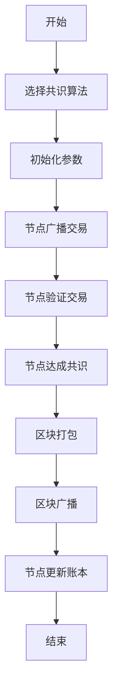
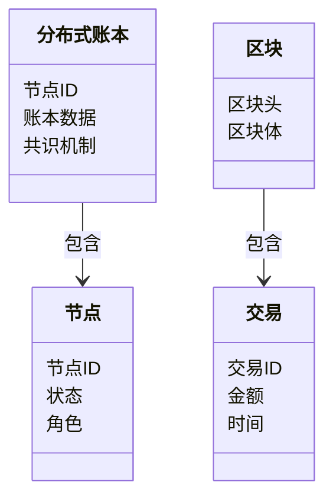
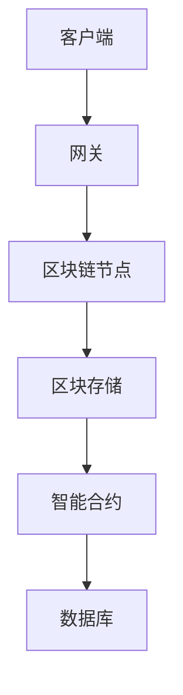
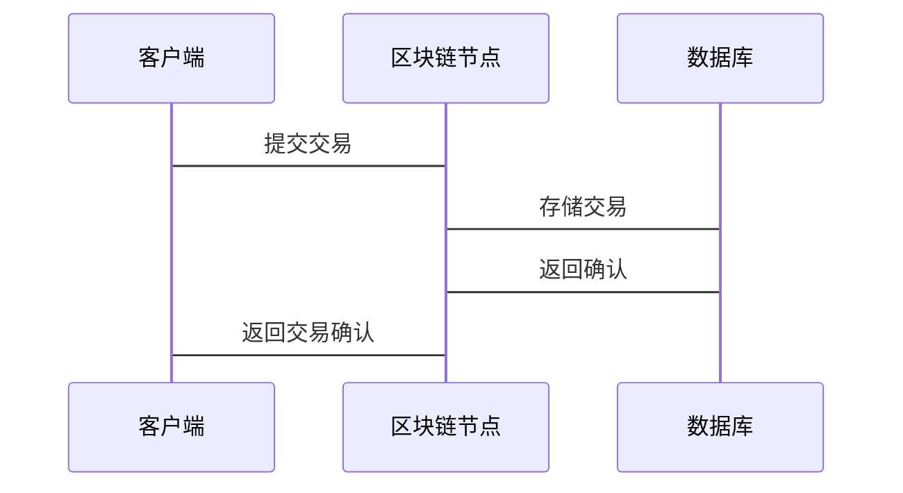

                 


# 如何评估企业的分布式账本技术应用

## 关键词：分布式账本技术、企业应用、技术评估、区块链、系统架构

## 摘要：  
随着区块链和分布式账本技术的快速发展，越来越多的企业开始探索如何将这些技术应用于实际业务中。然而，如何评估这些技术在企业中的应用效果，选择适合的分布式账本技术方案，并确保其安全性、可靠性和可扩展性，是企业在技术选型和实施过程中面临的重大挑战。本文将从背景介绍、核心概念、技术原理、系统架构、项目实战和最佳实践等多个维度，深入分析如何评估企业的分布式账本技术应用，为企业技术决策者和开发者提供系统化的指导和实践建议。

---

# 第一部分: 分布式账本技术的背景与核心概念

## 第1章: 分布式账本技术的背景与问题背景

### 1.1 分布式账本技术的起源与发展

#### 1.1.1 分布式账本技术的起源  
分布式账本技术（Distributed Ledger Technology，DLT）起源于区块链技术的创新。区块链作为一种去中心化的分布式账本，最初用于比特币的底层技术，随后逐渐扩展到金融、供应链、医疗等多个领域。分布式账本技术的核心思想是通过去中心化的方式，实现数据的安全存储和高效同步。

#### 1.1.2 分布式账本技术的核心概念  
分布式账本技术是一种通过多节点协作，利用区块链、密码学和共识机制等技术，实现数据一致性和可靠性的技术。它不同于传统的集中式账本，分布式账本技术能够确保数据在多个节点上同步，并通过去中心化的方式避免单点故障。

#### 1.1.3 分布式账本技术在企业中的应用现状  
目前，分布式账本技术已经在金融、供应链管理、医疗数据共享等领域得到了广泛应用。企业通过分布式账本技术可以实现数据的透明共享、高效协作和信任建立，从而提高业务效率并降低成本。

### 1.2 问题背景与问题描述

#### 1.2.1 传统账本技术的局限性  
传统的集中式账本技术存在单点故障、数据孤岛、信任缺失等问题。集中式账本的中心节点容易成为攻击目标，且数据孤岛导致不同系统之间的协作效率低下。

#### 1.2.2 分布式账本技术的出现与解决的问题  
分布式账本技术通过去中心化的方式，解决了传统账本技术的单点故障和信任缺失问题。它能够实现数据的分布式存储和同步，确保数据的透明性和一致性。

#### 1.2.3 分布式账本技术的边界与外延  
分布式账本技术的边界包括去中心化、数据一致性、共识机制等核心功能，而其外延则包括区块链、侧链、联盟链等多种实现方式。

### 1.3 分布式账本技术的核心要素

#### 1.3.1 分布式账本的定义与组成  
分布式账本是由多个节点共同维护的一份数据记录，每个节点都有一份完整的账本副本，并通过共识机制实现数据的同步和一致性。

#### 1.3.2 分布式账本的核心属性与特征  
- **去中心化**：无须依赖中心节点，多个节点共同维护数据。
- **数据一致性**：通过共识机制确保所有节点的数据一致。
- **不可篡改性**：数据一旦写入，难以被篡改。
- **透明性**：所有参与者都可以查看账本内容。

#### 1.3.3 分布式账本技术的结构与功能  
分布式账本技术的结构包括数据层、共识层、网络层和应用层。其功能包括数据存储、数据同步、共识验证和智能合约执行等。

---

## 第2章: 分布式账本技术的核心概念与原理

### 2.1 分布式账本技术的核心概念

#### 2.1.1 分布式账本的基本概念  
分布式账本是一种通过多节点协作，利用密码学和共识机制实现数据一致性的技术。它不同于区块链，区块链是分布式账本的一种实现方式。

#### 2.1.2 分布式账本的核心属性与特征  
- **一致性**：所有节点的数据保持一致。
- **可用性**：系统在节点故障或网络中断的情况下仍能提供服务。
- **安全性**：通过密码学和共识机制确保数据的安全性。

#### 2.1.3 分布式账本与区块链的关系  
区块链是分布式账本的一种实现方式，而分布式账本技术则是一个更广泛的概念，包括区块链、侧链、联盟链等多种实现方式。

### 2.2 分布式账本技术的核心原理

#### 2.2.1 分布式账本的共识机制  
共识机制是分布式账本技术的核心，常见的共识机制包括工作量证明（PoW）、权益证明（PoS）、实用拜占庭容错（PBFT）等。共识机制通过多个节点的协作，确保所有节点对数据的一致性达成共识。

#### 2.2.2 分布式账本的数据结构  
分布式账本的数据结构包括区块链、链表、树状结构等。其中，区块链是最常见的数据结构，由多个区块通过哈希指针连接而成。

#### 2.2.3 分布式账本的密码学基础  
密码学在分布式账本技术中起着至关重要的作用，包括哈希函数、数字签名、加密算法等。这些技术确保了数据的完整性和安全性。

### 2.3 分布式账本技术的核心概念对比表

| 概念 | 分布式账本 | 区块链 |
|------|------------|--------|
| 数据结构 | 链表、树状结构等 | 区块链 |
| 共识机制 | 工作量证明（PoW）、权益证明（PoS）、PBFT等 | PoW、PoS、PBFT等 |
| 数据一致性 | 通过共识机制确保一致 | 通过共识机制确保一致 |

### 2.4 分布式账本技术的ER实体关系图

```mermaid
erd
  entity 分布式账本节点 {
    <<节点ID>>
    <<节点状态>>
    <<节点角色>> // 可以是普通节点、验证节点等
  }
  entity 区块 {
    <<区块头>> // 包含哈希值、时间戳等
    <<区块体>> // 包含交易记录等
  }
  entity 交易 {
    <<交易ID>> 
    <<交易金额>> 
    <<交易时间>> 
  }
  分布式账本节点 --> 区块: 包含关系
  区块 --> 交易: 包含关系
```

### 2.5 本章小结  
本章通过分析分布式账本技术的核心概念和原理，明确了分布式账本技术的定义、核心要素和实现方式。同时，通过对比表和实体关系图，进一步细化了分布式账本技术的概念结构和实现细节。

---

## 第3章: 分布式账本技术的算法原理

### 3.1 分布式账本技术的核心算法

#### 3.1.1 共识算法的分类与对比  
共识算法主要分为工作量证明（PoW）、权益证明（PoS）、实用拜占庭容错（PBFT）等。每种算法都有其优缺点，适用于不同的场景。

#### 3.1.2 常见共识算法的实现原理  
- **工作量证明（PoW）**：通过计算哈希值来证明工作量，确保区块链的安全性。
- **权益证明（PoS）**：通过持有代币的数量来决定记账权，降低了能源消耗。
- **实用拜占庭容错（PBFT）**：通过多轮投票机制实现共识，适用于联盟链场景。

#### 3.1.3 共识算法的优缺点分析  
- **PoW**：安全性高，但能源消耗大。
- **PoS**：能源消耗低，但存在“ richness attack”风险。
- **PBFT**：效率高，但需要较高的网络信任度。

### 3.2 分布式账本技术的数学模型

#### 3.2.1 分布式账本的数学模型概述  
分布式账本的数学模型包括哈希函数、加密算法、共识机制等。这些模型通过数学公式确保数据的完整性和一致性。

#### 3.2.2 共识算法的数学公式  
以PBFT为例，其数学模型如下：

$$
f(n) = \begin{cases}
    \text{true}, & \text{如果超过半数节点达成共识} \\
    \text{false}, & \text{否则}
\end{cases}
$$

#### 3.2.3 数据结构的数学描述  
区块链的每个区块可以表示为一个数据结构，包含区块头和区块体：

$$
\text{区块头} = \{ \text{前一区块哈希}, \text{时间戳}, \text{默克尔根}, \text{nonce} \}
$$

### 3.3 分布式账本技术的算法流程图



### 3.4 本章小结  
本章详细分析了分布式账本技术的核心算法，包括共识机制和数据结构。通过数学公式和流程图，明确了算法的实现原理和应用场景。

---

## 第4章: 分布式账本技术的系统分析与架构设计

### 4.1 分布式账本技术的系统分析

#### 4.1.1 问题场景介绍  
企业需要选择适合的分布式账本技术方案，以实现数据的高效协作和信任建立。

#### 4.1.2 系统功能设计  
系统功能包括数据存储、数据同步、共识验证和智能合约执行等。

### 4.2 系统架构设计

#### 4.2.1 领域模型类图  


#### 4.2.2 系统架构图  


### 4.3 系统接口设计

#### 4.3.1 系统接口设计  
系统接口包括交易提交接口、区块查询接口、智能合约调用接口等。

#### 4.3.2 系统交互序列图  


### 4.4 本章小结  
本章通过系统分析和架构设计，明确了分布式账本技术在企业中的应用方式和实现方案。

---

## 第5章: 分布式账本技术的项目实战

### 5.1 环境搭建

#### 5.1.1 开发环境配置  
需要安装Java、Python、区块链框架（如Ethereum、Hyperledger）等。

#### 5.1.2 工具安装  
安装Git、Docker、区块链节点搭建工具等。

### 5.2 核心代码实现

#### 5.2.1 共识算法实现  
以PBFT为例，实现节点的共识机制。

```java
public class PBFT {
    public boolean reachConsensus(Transaction tx, List<Node> nodes) {
        int threshold = nodes.size() / 2;
        int count = 0;
        for (Node node : nodes) {
            if (node.vote(tx)) {
                count++;
            }
        }
        return count > threshold;
    }
}
```

#### 5.2.2 智能合约实现  
实现一个简单的转账合约。

```solidity
contract SimpleTransfer {
    function transfer(address from, address to, uint amount) {
        require(from != address(0), "Invalid from address");
        require(to != address(0), "Invalid to address");
        require(amount > 0, "Amount must be positive");
        from.transfer(to, amount);
    }
}
```

### 5.3 案例分析与项目总结

#### 5.3.1 案例分析  
以供应链金融为例，通过分布式账本技术实现供应链上的多方协作。

#### 5.3.2 项目总结  
通过项目实战，验证了分布式账本技术在企业中的可行性，同时也发现了实施过程中的挑战和改进空间。

### 5.4 本章小结  
本章通过实际项目案例，展示了分布式账本技术在企业中的应用和实现过程。

---

## 第6章: 分布式账本技术的最佳实践与小结

### 6.1 最佳实践

#### 6.1.1 技术选型建议  
根据企业需求选择适合的共识机制和数据结构。

#### 6.1.2 安全性保障  
通过密码学和共识机制确保数据的安全性。

#### 6.1.3 可扩展性优化  
通过分片、侧链等方式提高系统的可扩展性。

### 6.2 小结

#### 6.2.1 问题总结  
分布式账本技术在企业中的应用需要综合考虑技术选型、安全性、可扩展性等多个方面。

#### 6.2.2 方法论总结  
通过系统分析和项目实战，明确分布式账本技术在企业中的应用方式和实现方案。

#### 6.2.3 注意事项  
在实际应用中，需要注意数据隐私、网络延迟、节点性能等问题。

### 6.3 未来展望

#### 6.3.1 技术发展趋势  
分布式账本技术将与人工智能、物联网等技术结合，推动更多应用场景的发展。

#### 6.3.2 拓展阅读  
推荐阅读《区块链技术与应用》、《分布式系统》等书籍。

---

## 作者：AI天才研究院/AI Genius Institute & 禅与计算机程序设计艺术 /Zen And The Art of Computer Programming

---

以上为文章的完整目录结构和初步内容框架，涵盖了从背景介绍到项目实战的全过程，帮助企业在评估分布式账本技术应用时有一个系统化的参考。

