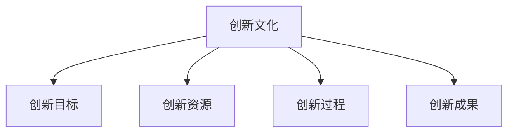
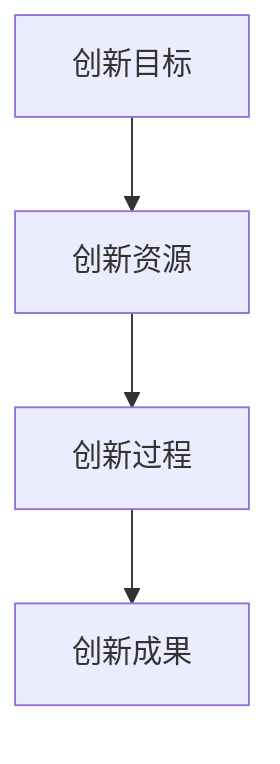
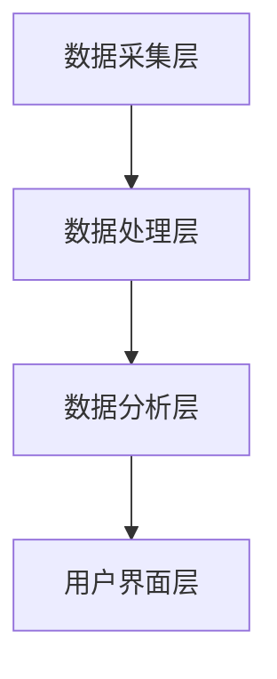
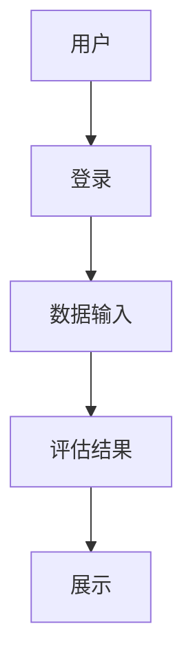

                 


# 如何评估企业的创新文化

> 关键词：企业创新文化、评估维度、创新目标、创新资源、创新成果

> 摘要：本文将详细探讨如何系统性地评估企业的创新文化。通过分析创新文化的定义、核心要素、评估维度、数学模型、系统架构以及实际案例，本文将为读者提供一个全面的视角，帮助企业在复杂多变的商业环境中建立和优化创新文化。

---

## 第一部分: 企业创新文化评估的背景与核心概念

### 第1章: 什么是企业创新文化

#### 1.1 创新文化的定义与内涵

- **创新文化的定义**：创新文化是指企业在追求持续改进、技术创新和价值创造的过程中形成的一整套理念、价值观、行为规范和制度体系。

- **创新文化的内涵与外延**：
  - **内涵**：创新文化强调开放性、协作性、风险承担和持续学习。
  - **外延**：创新文化不仅包括技术创新，还包括管理创新、流程创新和商业模式创新。

- **创新文化的核心要素**：
  - **创新目标**：明确的创新方向和目标。
  - **创新资源**：人才、资金、技术和信息资源。
  - **创新过程**：从创意生成到落地实施的完整流程。
  - **创新成果**：创新带来的实际价值和绩效。

#### 1.2 创新文化的重要性

- **对企业发展的意义**：创新文化是企业在竞争中保持优势的核心动力。
- **对员工价值的影响**：创新文化能够激发员工的创造力和工作热情。
- **在行业竞争中的作用**：创新文化是企业适应市场变化的关键能力。

#### 1.3 企业创新文化的评估背景

- **当前企业面临的创新挑战**：技术变革加速、市场竞争加剧、客户需求多样化。
- **创新文化评估的必要性**：通过评估发现问题，优化创新过程。
- **创新文化评估的边界与外延**：明确评估的范围和限制，避免过度延伸。

#### 1.4 创新文化的核心概念结构

- **创新文化的组成要素**：
  - 创新目标：企业希望通过创新实现的具体成果。
  - 创新资源：支持创新所需的各类资源。
  - 创新过程：从创意到落地的具体步骤。
  - 创新成果：创新带来的实际价值。

- **创新文化的核心属性对比表**：
  | 属性     | 描述                           |
  |----------|--------------------------------|
  | 目标性   | 明确的创新方向和目标           |
  | 资源性   | 需要充足的人才、资金和技术支持 |
  | 过程性   | 创新需要系统化的过程管理       |
  | 结果性   | 创新必须产生可衡量的成果       |

- **创新文化ER实体关系图**：


#### 1.5 本章小结

通过本章的分析，我们明确了创新文化的定义、核心要素和重要性，为后续的评估提供了理论基础。

---

## 第二部分: 企业创新文化评估的理论框架

### 第2章: 企业创新文化评估的维度与指标

#### 2.1 创新文化评估的主要维度

- **创新目标与战略**：
  - 创新目标是否明确？
  - 创新战略是否与企业整体战略一致？

- **创新资源与能力**：
  - 企业是否具备充足的人才、资金和技术资源？
  - 员工是否具备创新能力和意识？

- **创新过程与管理**：
  - 创新过程是否系统化？
  - 创新管理是否有效？

- **创新成果与绩效**：
  - 创新是否带来了实际价值？
  - 创新成果是否可衡量？

#### 2.2 创新文化评估的核心指标

- **创新投入指标**：
  - R&D投入比例
  - 创新培训的覆盖率

- **创新产出指标**：
  - 新产品/服务的数量和市场份额
  - 创新专利的数量和质量

- **创新效率指标**：
  - 创新周期时间
  - 创新项目的成功率

- **创新文化氛围指标**：
  - 员工创新意识的调查结果
  - 创新团队的协作效率

#### 2.3 创新文化评估的理论模型

- **创新文化评估的系统模型**：
  创新目标 → 创新资源 → 创新过程 → 创新成果

- **创新文化评估的数学模型**：
  $$创新文化指数 = \alpha \times 创新目标 + \beta \times 创新资源 + \gamma \times 创新过程 + \delta \times 创新成果$$
  其中，$\alpha, \beta, \gamma, \delta$ 为各维度的权重系数。

#### 2.4 本章小结

本章从理论层面上分析了创新文化评估的主要维度和核心指标，并提出了一个系统的评估模型。

---

## 第三部分: 企业创新文化评估的方法与工具

### 第3章: 创新文化评估的主要方法

#### 3.1 定性评估方法

- **文档分析法**：
  - 分析企业的战略文档、政策文件等，了解创新文化的体现。

- **专家访谈法**：
  - 通过与企业高管、创新团队成员的访谈，获取创新文化的第一手信息。

- **案例研究法**：
  - 研究成功或失败的创新案例，总结经验教训。

#### 3.2 定量评估方法

- **调查问卷法**：
  - 设计标准化问卷，对员工进行匿名调查，获取数据支持评估。

- **数据分析法**：
  - 利用企业的财务数据、市场数据等进行分析，衡量创新绩效。

- **绩效评估法**：
  - 将创新成果与企业绩效指标进行对比，评估创新文化的有效性。

#### 3.3 综合评估方法

- **层次分析法（AHP）**：
  - 将各评估维度按重要性排序，计算权重，进行综合评估。

- **指数评估法**：
  - 根据各维度的评估结果，计算创新文化指数。

- **综合评价模型**：
  - 结合定性和定量方法，构建综合评价模型。

#### 3.4 创新文化评估工具的选择

- **工具选择的依据**：
  - 企业的规模和复杂性
  - 创新文化的成熟度
  - 可用的资源和预算

- **工具选择的注意事项**：
  - 确保工具的科学性和适用性
  - 结合企业的实际情况进行调整

- **工具选择的案例分析**：
  - 某科技公司采用层次分析法评估创新文化，发现创新资源是主要瓶颈。

#### 3.5 本章小结

本章详细介绍了创新文化评估的主要方法，并提供了工具选择的建议和案例分析。

---

## 第四部分: 企业创新文化评估的系统

### 第4章: 创新文化评估的系统架构

#### 4.1 系统功能设计

- **领域模型**：
  - 创新目标、创新资源、创新过程、创新成果之间的关系。



- **系统架构设计**：
  - 数据采集层：收集创新相关数据
  - 数据处理层：对数据进行清洗和转换
  - 数据分析层：应用算法进行评估
  - 用户界面层：展示评估结果



- **系统接口设计**：
  - 数据接口：与企业系统对接
  - 用户接口：供管理者查看评估结果

- **系统交互设计**：
  - 用户登录 → 数据输入 → 评估结果展示



#### 4.2 系统实现

- **核心算法实现**：
  - 层次分析法（AHP）的Python代码示例：

```python
import numpy as np

# 示例：计算创新目标、创新资源、创新过程、创新成果的权重
criteria = ['创新目标', '创新资源', '创新过程', '创新成果']
n = len(criteria)

# 判断矩阵
matrix = np.array([
    [1, 3, 2, 4],
    [1/3, 1, 2, 3],
    [1/2, 1/2, 1, 2],
    [1/4, 1/3, 1/2, 1]
])

# 计算权重
weights = np.array([1, 1, 1, 1])
for i in range(n):
    for j in range(n):
        if i != j:
            weights[i] += matrix[i][j] * weights[j]
    weights[i] /= n

print("权重系数:", weights)
```

---

## 第五部分: 项目实战

### 第5章: 企业创新文化评估的项目实战

#### 5.1 项目背景与目标

- **项目背景**：某高科技公司希望评估其创新文化，优化创新流程。

- **项目目标**：
  - 识别创新文化中的优势和不足
  - 提出改进建议

#### 5.2 项目实施步骤

- **步骤1**：收集数据
  - 调查问卷：员工创新意识调查
  - 文档分析：公司战略文档
- **步骤2**：数据处理
  - 清洗数据，去除无效信息
  - 转换数据格式，便于分析
- **步骤3**：数据分析
  - 应用层次分析法计算权重
  - 生成评估报告
- **步骤4**：结果展示
  - 制作可视化报告，展示评估结果
  - 提出优化建议

#### 5.3 项目实现代码

- **核心代码**：
  - 层次分析法的Python实现：

```python
import numpy as np

def ahp(criteria, matrix):
    n = len(criteria)
    # 计算一致性检验
    # ...（省略具体实现）
    # 计算权重
    weights = np.mean(matrix, axis=0)
    return weights

criteria = ['创新目标', '创新资源', '创新过程', '创新成果']
matrix = np.array([
    [1, 3, 2, 4],
    [1/3, 1, 2, 3],
    [1/2, 1/2, 1, 2],
    [1/4, 1/3, 1/2, 1]
])

weights = ahp(criteria, matrix)
print("权重系数:", weights)
```

#### 5.4 实际案例分析

- **案例分析**：
  - 评估结果显示，创新资源是主要瓶颈。
  - 建议增加研发投入，优化创新流程。
  - 提高员工创新意识，营造开放的文化氛围。

#### 5.5 项目小结

通过本项目，我们验证了创新文化评估方法的实际应用价值，并提出了改进建议。

---

## 第六部分: 总结与展望

### 6.1 本章总结

- 本文系统性地探讨了如何评估企业的创新文化。
- 提供了理论模型、评估方法和系统架构的设计。
- 通过实际案例展示了评估方法的应用。

### 6.2 未来展望

- 创新文化评估的自动化和智能化。
- 创新文化的动态监测与优化。
- 创新文化评估的全球标准化。

### 6.3 注意事项

- 评估过程中要注意数据的准确性和全面性。
- 结合企业的实际情况，灵活调整评估方法。

### 6.4 最佳实践 tips

- 定期进行创新文化评估，持续优化。
- 注重创新文化的氛围营造，激发员工积极性。

---

## 附录

### 附录A: 创新文化评估工具推荐

- **工具1**：某商业分析软件
- **工具2**：某项目管理平台
- **工具3**：某数据可视化工具

### 附录B: 创新文化评估的常见问题解答

- **问题1**：如何选择合适的评估方法？
  - 根据企业规模和资源选择工具。
- **问题2**：评估结果如何应用？
  - 作为优化创新文化的依据。

---

## 作者：AI天才研究院/AI Genius Institute & 禅与计算机程序设计艺术 /Zen And The Art of Computer Programming

---

这篇文章详细探讨了如何评估企业的创新文化，从理论到实践，从方法到工具，为读者提供了全面的指导。通过系统化的分析和实际案例的解读，帮助企业在复杂的商业环境中建立和优化创新文化。

