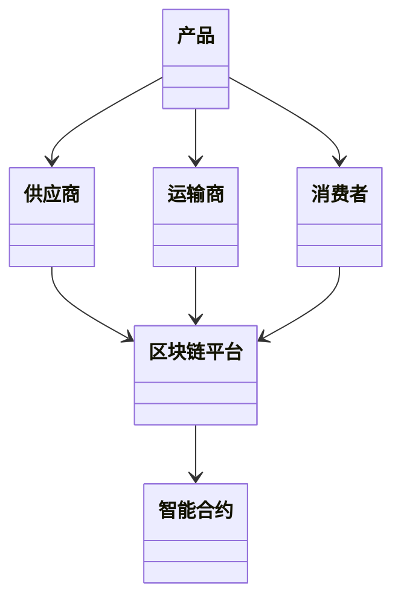
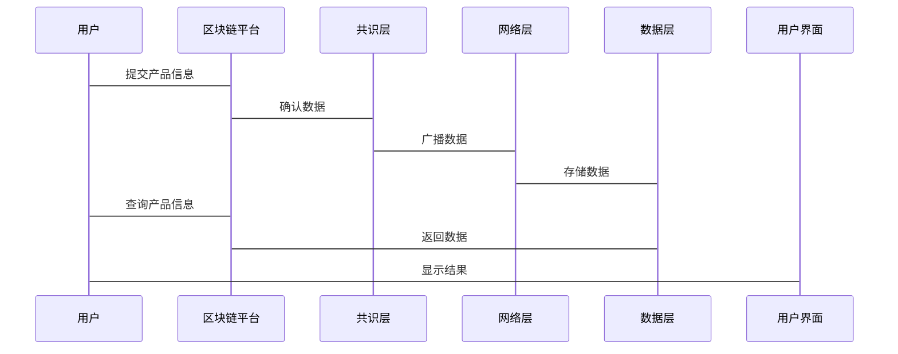

                 


# 如何评估企业的区块链供应链溯源平台

## 关键词
区块链、供应链、溯源、平台评估、分布式系统

## 摘要
在当今数字化时代，区块链技术在供应链管理中的应用越来越广泛，特别是在供应链溯源领域。本文将详细探讨如何评估企业中的区块链供应链溯源平台，涵盖从核心概念到系统架构、项目实战及最佳实践的各个方面。通过深入分析区块链技术的特点、算法原理、系统设计和实际应用，读者将能够全面了解如何评估并优化区块链供应链溯源平台，确保其高效、安全和可扩展。

## 目录

# 如何评估企业的区块链供应链溯源平台

## 关键词
区块链、供应链、溯源、平台评估、分布式系统

## 摘要
在当今数字化时代，区块链技术在供应链管理中的应用越来越广泛，特别是在供应链溯源领域。本文将详细探讨如何评估企业中的区块链供应链溯源平台，涵盖从核心概念到系统架构、项目实战及最佳实践的各个方面。通过深入分析区块链技术的特点、算法原理、系统设计和实际应用，读者将能够全面了解如何评估并优化区块链供应链溯源平台，确保其高效、安全和可扩展。

---

## 第三章：区块链供应链溯源平台的算法原理

### 3.1 区块链共识机制

#### 3.1.1 共识机制的基本概念
共识机制是区块链系统中确保所有节点达成一致的核心算法。常见的共识机制包括工作量证明（PoW）、权益证明（PoS）、 delegated proof of stake（DPOS）等。

#### 3.1.2 常见的共识算法
- **PoW（工作量证明）**：通过计算哈希值来验证区块的有效性，确保网络安全。
- **PoS（权益证明）**：根据节点持有的代币数量来分配记账权，节省能源消耗。
- **DPOS（ delegated proof of stake）**：节点通过投票方式选出记账人，提高效率。

#### 3.1.3 共识机制对溯源平台的影响
共识机制确保了区块链网络的安全性和一致性，直接影响到供应链数据的可靠性和溯源的准确性。

### 3.2 区块链哈希函数

#### 3.2.1 哈希函数的基本概念
哈希函数是一种将任意长度的数据映射为固定长度的字符串的函数，常用于数据完整性验证和区块链中的地址生成。

#### 3.2.2 常见哈希算法
- **SHA-256**：广泛应用于比特币等区块链系统。
- **RIPEMD-160**：用于生成比特币地址。

#### 3.2.3 哈希函数在供应链中的应用
通过哈希函数，可以确保每个数据块的唯一性和完整性，防止数据篡改。

### 3.3 区块链智能合约

#### 3.3.1 智能合约的基本概念
智能合约是区块链上的自动执行程序，用于定义和执行双方的协议。

#### 3.3.2 智能合约的实现
使用Solidity等编程语言编写智能合约，并部署在区块链上。

#### 3.3.3 智能合约在供应链中的应用
智能合约可以自动执行合同条款，如支付、货物交付等，确保供应链流程的透明和高效。

---

## 第四章：系统分析与架构设计方案

### 4.1 问题场景介绍

#### 4.1.1 传统供应链的痛点
- 数据孤岛：信息分散，难以共享。
- 信任缺失：各环节参与者之间的不信任导致效率低下。
- 数据篡改：数据容易被篡改，难以追溯。

#### 4.1.2 区块链供应链的解决方案
通过区块链技术实现数据的去中心化存储和共享，确保数据不可篡改，提升信任度。

### 4.2 系统功能设计

#### 4.2.1 领域模型图


#### 4.2.2 系统架构设计


#### 4.2.3 接口设计
- API接口：RESTful API用于数据查询和提交。
- 智能合约接口：用于执行和查询智能合约状态。

#### 4.2.4 交互序列图


### 4.3 项目实战

#### 4.3.1 环境安装
- 安装区块链开发环境，如 Ganache、Solidity 编译器、Node.js 等。

#### 4.3.2 核心代码实现

##### 4.3.2.1 智能合约实现
```solidity
// SPDX-License-Identifier: MIT
pragma solidity ^0.8.0;

contract ProductTraceability {
    struct Product {
        string id;
        string name;
        uint256 price;
        address supplier;
        uint256 timestamp;
    }

    event ProductCreated(address indexed supplier, string indexed id);
    
    function createProduct(string calldata _id, string calldata _name, uint256 _price, address _supplier) external {
        Product memory product = Product({
            id: _id,
            name: _name,
            price: _price,
            supplier: _supplier,
            timestamp: block.timestamp
        });
        emit ProductCreated(_supplier, _id);
    }
}
```

##### 4.3.2.2 后端实现
```python
from web3 import Web3
from web3.providers.rpc import HTTPProvider

# 初始化 Web3
w3 = Web3(HTTPProvider('http://localhost:8545'))

# 智能合约地址
contract_address = '0xYourContractAddress'

# 载入智能合约ABI
contract_abi = [
    # 合约ABI接口
]

contract = w3.eth.contract(contract_address, abi=contract_abi)

# 提交产品信息
def submit_product(product_id, product_name, product_price, supplier_address):
    tx_hash = contract.functions.createProduct(product_id, product_name, product_price, supplier_address).transact()
    receipt = w3.eth.waitForTransactionReceipt(tx_hash)
    return receipt

# 查询产品信息
def get_product(product_id):
    product_info = contract.functions.getProduct(product_id).call()
    return product_info
```

### 4.4 项目小结
通过实际项目，读者可以了解如何在企业中部署和实现区块链供应链溯源平台，包括环境配置、智能合约开发和后端接口实现。

---

## 第五章：区块链供应链溯源平台的最佳实践

### 5.1 评估指标

#### 5.1.1 技术指标
- 系统性能：tps（每秒交易数）、响应时间。
- 可扩展性：支持的节点数、数据量。
- 安全性：抗攻击能力、漏洞修复速度。

#### 5.1.2 业务指标
- 交易成本：链上操作的费用。
- 使用体验：用户界面的友好程度。
- 可用性：系统的稳定性和故障恢复能力。

### 5.2 实施注意事项

#### 5.2.1 数据隐私保护
- 数据加密：确保敏感数据的安全。
- 访问控制：基于角色的访问权限管理。

#### 5.2.2 系统维护
- 定期更新：修复漏洞、优化性能。
- 备份策略：防止数据丢失。

#### 5.2.3 成本控制
- 网络费用：根据共识机制选择合适的解决方案。
- 开发成本：平衡开发时间和预算。

### 5.3 未来趋势

#### 5.3.1 技术创新
- 更高效的共识机制：如Layer 2解决方案。
- 跨链技术：实现不同区块链平台之间的互操作性。

#### 5.3.2 行业应用
- 更多行业采用区块链技术，如医疗、金融等。

---

## 第六章：总结与展望

### 6.1 核心内容回顾
区块链供应链溯源平台的评估需要从技术、业务和安全等多个维度综合考虑，确保系统的高效性、安全性和可扩展性。

### 6.2 对未来发展的展望
随着技术的进步，区块链在供应链中的应用将更加广泛和深入，未来可能会出现更多创新的解决方案，如结合人工智能和物联网技术，进一步提升供应链管理的智能化水平。

---

## 作者

作者：AI天才研究院/AI Genius Institute & 禅与计算机程序设计艺术 /Zen And The Art of Computer Programming

---

以上是关于如何评估企业区块链供应链溯源平台的完整文章结构，涵盖了从基本概念到系统设计、项目实战及最佳实践的各个方面，帮助读者全面理解并掌握评估和优化区块链供应链平台的方法。

