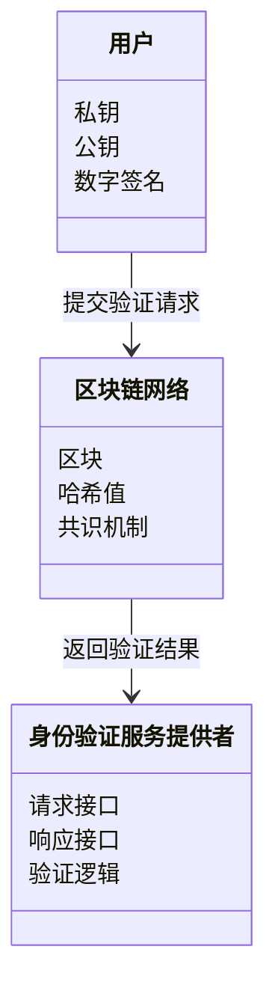
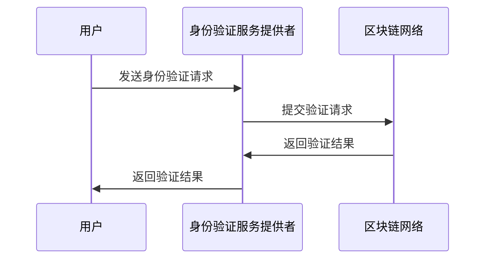

                 


# 如何评估企业的区块链去中心化身份验证平台

## 关键词：区块链，去中心化身份验证，分布式系统，安全性，身份验证平台，企业应用

## 摘要：  
区块链去中心化身份验证平台通过利用区块链技术实现安全、透明且不可篡改的身份验证机制，为企业提供了高效且可靠的身份管理解决方案。本文将从技术原理、系统架构、安全性评估等多个维度详细分析如何评估企业区块链去中心化身份验证平台，并通过实际案例和最佳实践提供深度洞察。

---

# 第一部分：区块链去中心化身份验证平台的背景与核心概念

## 第1章：区块链与去中心化身份验证概述

### 1.1 区块链的基本概念与特点  
区块链是一种去中心化的分布式账本技术，通过密码学和共识机制确保数据的安全性和不可篡改性。其核心特点包括：  
1. **去中心化**：没有单点控制，数据分布在多个节点上。  
2. **不可篡改**：通过链式结构和哈希指针确保数据完整性。  
3. **透明性**：所有交易对所有节点公开，但隐私性可以通过加密技术保护。  
4. **去信任化**：通过共识机制确保数据一致性，无需依赖中心信任机构。  

区块链在企业中的应用场景广泛，包括供应链管理、金融支付、版权保护等。

### 1.2 去中心化身份验证的基本概念  
去中心化身份验证（Decentralized Identity Verification，DIV）是一种基于区块链技术的身份验证方式，用户无需依赖中心机构即可完成身份验证。其核心特点包括：  
1. **用户控制权**：用户掌握自己的身份信息，无需依赖第三方平台。  
2. **隐私保护**：通过零知识证明等技术实现隐私保护，避免信息泄露。  
3. **不可篡改性**：身份信息存储在区块链上，确保数据的真实性和完整性。  

### 1.3 区块链去中心化身份验证平台的背景与意义  
随着企业数字化转型的推进，身份验证需求日益增长。传统的中心化身份验证方式存在以下问题：  
- **单点故障**：中心机构可能成为攻击目标，导致数据泄露。  
- **信任成本**：依赖第三方机构可能导致信任成本增加。  
- **数据孤岛**：不同系统之间的身份信息难以共享和验证。  

区块链去中心化身份验证平台通过解决上述问题，为企业提供了更加安全、高效的身份验证方案。

## 第2章：区块链去中心化身份验证的核心概念

### 2.1 区块链去中心化身份验证的核心要素  
1. **用户身份标识**：用户通过公钥或 DID（Decentralized Identifier）标识身份。  
2. **数字证书与签名**：用户通过数字签名验证身份信息的真实性。  
3. **区块链账本与存储**：身份信息和验证记录存储在区块链上，确保不可篡改。  

### 2.2 区块链去中心化身份验证的实体关系  
通过 Mermaid 实体关系图，我们可以清晰地看到用户、服务提供商和区块链网络之间的关系：

```mermaid
graph TD
    User--> ServiceProvider: 请求身份验证
    ServiceProvider--> Blockchain: 发送验证请求
    Blockchain--> User: 返回验证结果
```

### 2.3 区块链去中心化身份验证的核心原理  
1. **哈希函数与数字签名**：用户通过私钥对身份信息进行签名，服务提供者通过公钥验证签名。  
2. **区块链账本的不可篡改性**：所有验证记录都存储在区块链上，确保数据的真实性和完整性。  
3. **联合身份验证机制**：用户可以在多个区块链网络中进行身份验证，实现跨平台的身份管理。

---

# 第二部分：区块链去中心化身份验证平台的算法原理

## 第3章：区块链去中心化身份验证的算法与数学模型

### 3.1 区块链共识机制的算法原理  
共识机制是区块链的核心算法之一，常用的共识机制包括工作量证明（PoW）和权益证明（PoS）。  

#### 工作量证明（PoW）  
- **定义**：通过计算哈希碰撞来证明计算工作量。  
- **流程**：  
  1. 每个节点尝试计算一个满足特定条件的哈希值。  
  2. 最先找到满足条件的节点将区块添加到链中。  
- **优缺点**：安全性高，但资源消耗大。  

#### 权益证明（PoS）  
- **定义**：根据节点持有的代币数量分配记账权。  
- **流程**：  
  1. 节点根据持有的代币数量获得记账权。  
  2. 节点通过随机选举机制生成新区块。  
- **优缺点**：资源消耗低，但安全性依赖于代币分布。  

### 3.2 区块链智能合约的执行过程  
智能合约是区块链上的自动执行程序，用于实现特定的业务逻辑。  

#### 智能合约的生命周期  
1. **部署**：智能合约部署到区块链上。  
2. **触发**：外部事件触发智能合约的执行。  
3. **执行**：智能合约根据预设逻辑自动执行，并将结果写入区块链。  

#### 智能合约的编程模型  
智能合约通常基于图灵完备的编程语言（如Solidity）编写，运行在虚拟机（如EVM）上。  

### 3.3 区块链去中心化身份验证的数学模型  
身份验证过程可以通过以下数学模型描述：

$$
\text{验证结果} = f(\text{用户身份信息}, \text{数字签名}, \text{公钥})
$$

其中，$f$ 是验证函数，实现数字签名的验证。

---

# 第三部分：区块链去中心化身份验证平台的系统分析与架构设计

## 第4章：区块链去中心化身份验证平台的系统分析

### 4.1 系统功能设计  
通过 Mermaid 类图，我们可以清晰地看到系统的主要功能模块：



### 4.2 系统架构设计  
区块链去中心化身份验证平台的架构设计如下：

```mermaid
graph TD
    用户--> 身份验证服务提供者: 发送身份验证请求
    身份验证服务提供者--> 区块链网络: 提交验证请求
    区块链网络--> 身份验证服务提供者: 返回验证结果
    身份验证服务提供者--> 用户: 返回验证结果
```

### 4.3 系统接口设计  
系统接口设计主要包括以下内容：  
1. 用户接口：用户发起身份验证请求。  
2. 服务提供者接口：服务提供者接收请求并提交到区块链网络。  
3. 区块链网络接口：区块链网络处理验证请求并返回结果。  

### 4.4 系统交互设计  
通过 Mermaid 序列图，我们可以清晰地看到系统的交互过程：



---

# 第四部分：区块链去中心化身份验证平台的项目实战

## 第5章：区块链去中心化身份验证平台的项目实战

### 5.1 环境安装与配置  
1. **安装区块链平台**：如以太坊、fabric等。  
2. **安装开发工具**：如Geth、Remix等。  
3. **安装依赖库**：如Node.js、Python等。  

### 5.2 核心代码实现  
以下是区块链去中心化身份验证平台的核心代码实现：

```javascript
// 用户身份验证逻辑
function verifySignature(privateKey, message, signature) {
    // 使用椭圆曲线签名算法验证签名
    const signer = new Signer(privateKey);
    const messageHash = keccak256(message);
    return signer.verify(messageHash, signature);
}

// 区块链智能合约部署
contract IdentityVerification {
    function verifyUser(address user, bytes32 hash, bytes signature) public returns (bool) {
        // 验证用户身份
        if (!verifySignature(user.privateKey, hash, signature)) {
            revert("Invalid signature");
        }
        return true;
    }
}
```

### 5.3 代码应用解读与分析  
1. **用户身份验证**：通过私钥和数字签名验证用户身份信息。  
2. **区块链智能合约**：部署在区块链上的智能合约用于管理身份验证逻辑。  

### 5.4 实际案例分析  
假设我们有一个企业用户需要在区块链上进行身份验证，具体步骤如下：  
1. 用户生成身份信息和数字签名。  
2. 用户向身份验证服务提供者发起验证请求。  
3. 服务提供者将请求提交到区块链网络。  
4. 区块链网络处理验证请求并返回结果。  
5. 服务提供者将结果返回给用户。  

### 5.5 项目小结  
通过实际案例分析，我们可以看到区块链去中心化身份验证平台的强大功能和灵活性。企业可以根据自身需求定制化实现。

---

# 第五部分：总结与展望

## 第6章：总结与最佳实践

### 6.1 总结  
区块链去中心化身份验证平台通过区块链技术实现了安全、透明且不可篡改的身份验证机制，为企业提供了高效且可靠的身份管理解决方案。  

### 6.2 最佳实践  
1. **选择合适的区块链平台**：根据企业需求选择合适的区块链平台。  
2. **确保数据隐私**：通过零知识证明等技术保护用户隐私。  
3. **测试与优化**：进行全面的测试和优化，确保系统稳定性和性能。  

### 6.3 小结  
区块链去中心化身份验证平台的应用前景广阔，随着技术的不断进步，其应用将更加广泛和深入。

---

# 作者：AI天才研究院 & 禅与计算机程序设计艺术

---

**说明**：本文是关于如何评估企业区块链去中心化身份验证平台的深度技术博客文章，涵盖了从背景介绍到项目实战的各个方面，内容丰富且详细，适合技术专家和企业决策者阅读。

