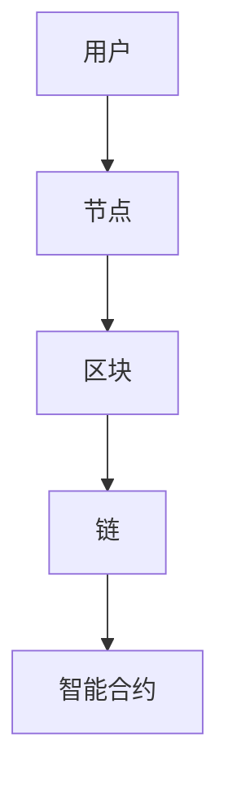
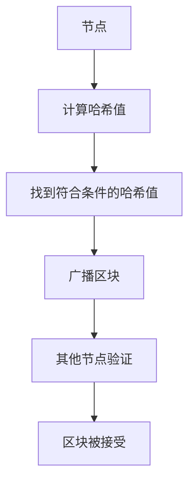
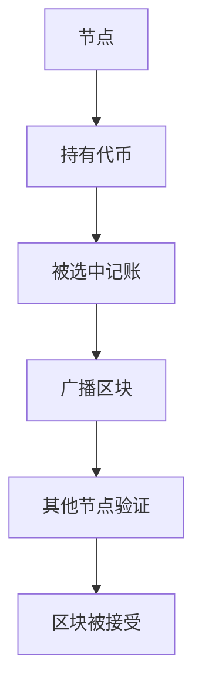
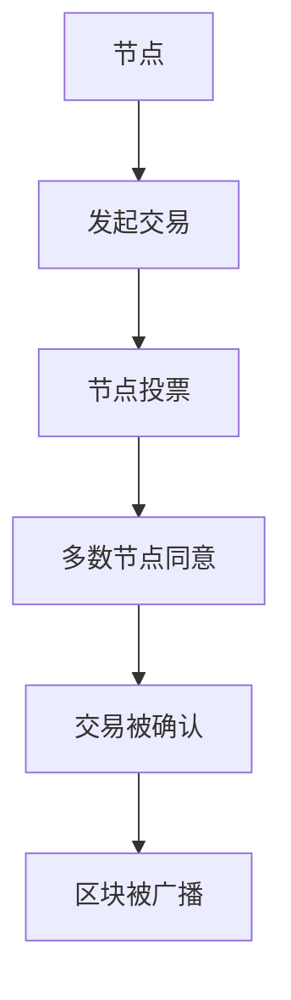
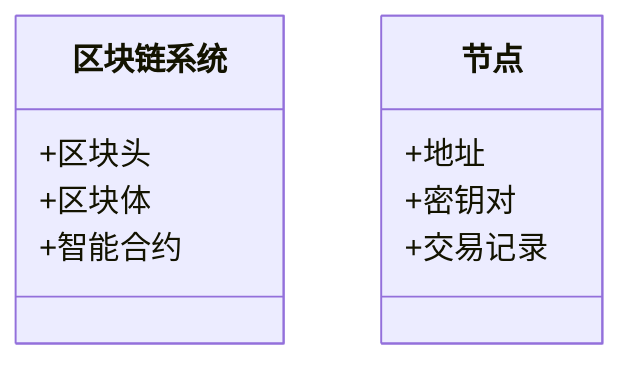

                 


# 如何评估企业的区块链应用能力

> 关键词：区块链技术，企业应用，共识机制，智能合约，去中心化，分布式账本

> 摘要：评估企业的区块链应用能力需要从技术、业务、安全等多维度进行分析。本文将详细讲解区块链的核心概念、算法原理、系统架构，并通过实际案例分析和最佳实践，帮助读者全面掌握如何评估企业的区块链应用能力。

---

## 第1章: 区块链技术与企业应用概述

### 1.1 区块链技术的基本概念

#### 1.1.1 区块链的定义与基本原理
区块链是一种去中心化的分布式账本技术，通过加密算法和共识机制确保数据的安全性和不可篡改性。每个区块包含数据和指向前一个区块的哈希值，形成一条不可逆的链式结构。区块链的去中心化特点使其在金融、供应链、医疗等领域具有广泛应用潜力。

#### 1.1.2 区块链的核心技术特点
- **去中心化**：没有单点控制，数据分布在多个节点上。
- **不可篡改性**：通过哈希值和共识机制确保数据的安全性。
- **透明性**：区块链上的交易对所有参与者可见。
- **智能合约**：自动执行预定义的合同条款，减少人为干预。

#### 1.1.3 区块链与企业应用的结合场景
企业可以通过区块链技术实现供应链管理、跨境支付、版权保护等场景。例如，在供应链管理中，区块链可以用于追踪产品来源，确保产品信息的真实性。

### 1.2 企业区块链应用的重要性

#### 1.2.1 区块链技术对企业业务的影响
区块链可以提高企业的透明度和效率，减少中间环节的成本。例如，在金融领域，区块链可以用于跨境支付，减少交易时间并降低成本。

#### 1.2.2 区块链在企业中的潜在价值
- **提高信任度**：通过去中心化和不可篡改性，区块链可以增强企业之间的信任。
- **降低成本**：减少中间环节，降低交易成本。
- **提高效率**：自动化处理和智能合约可以提高业务处理效率。

#### 1.2.3 区块链应用的常见误区
- **误区一**：认为区块链可以解决所有问题。实际上，区块链并不适合所有场景。
- **误区二**：认为区块链必须是去中心化的。在某些场景下，企业可能需要私有链或联盟链。

### 1.3 区块链应用能力评估的必要性

#### 1.3.1 企业为什么要评估区块链应用能力
评估区块链应用能力可以帮助企业识别适合区块链的场景，避免盲目应用。例如，某些企业可能适合采用区块链技术，而另一些企业可能更适合传统技术。

#### 1.3.2 区块链应用能力评估的目标
- **识别适合区块链的场景**：找到企业中适合区块链技术的应用场景。
- **评估技术可行性**：确定企业在技术、资源和能力上是否具备实施区块链的能力。
- **制定实施计划**：基于评估结果，制定合理的区块链实施计划。

#### 1.3.3 评估过程中的关键问题
- **技术可行性**：企业是否具备区块链开发和运维的能力。
- **业务需求**：区块链是否能够解决企业的实际问题。
- **合规性**：区块链应用是否符合相关法律法规。

---

## 第2章: 区块链技术的核心概念与联系

### 2.1 区块链技术的核心原理

#### 2.1.1 去中心化与分布式账本
去中心化意味着没有单一的控制点，数据分布在多个节点上。分布式账本确保所有节点的数据一致性，通过共识机制达成一致。

#### 2.1.2 共识机制的作用与类型
共识机制用于确保所有节点达成一致。常见的共识机制包括：
- **工作量证明（PoW）**：比特币采用的机制，通过计算哈希值来竞争记账权。
- **权益证明（PoS）**：以太坊2.0采用的机制，根据节点持有的代币数量分配记账权。
- **拜占庭容错（BFT）**：适用于联盟链，通过投票机制达成一致。

#### 2.1.3 智能合约的工作原理
智能合约是区块链上的自动执行程序，基于预定义的规则自动执行合同条款。智能合约可以通过区块链平台（如以太坊）进行部署和执行。

### 2.2 区块链技术的核心属性特征对比

#### 2.2.1 不同共识机制的对比分析

| 共识机制 | 优点                     | 缺点                       |
|----------|--------------------------|----------------------------|
| PoW     | 安全性高，去中心化        | 能耗高，效率低               |
| PoS     | 能耗低，效率高            | 安全性较低                   |
| BFT      | 适用于联盟链，效率高       | 去中心化程度较低             |

#### 2.2.2 区块链的安全性与可扩展性对比
- **安全性**：区块链通过密码学和共识机制确保数据安全。
- **可扩展性**：区块链的扩展性取决于共识机制和网络性能。例如，PoW的扩展性较差，而BFT的扩展性较好。

#### 2.2.3 区块链的透明性与隐私保护对比
- **透明性**：区块链上的数据对所有参与者可见，具有高度透明性。
- **隐私保护**：可以通过零知识证明等技术保护隐私，确保数据在区块链上的隐私性。

### 2.3 区块链系统的实体关系架构

#### 2.3.1 Mermaid流程图展示：区块链实体关系



---

## 第3章: 区块链共识机制的算法原理

### 3.1 共识机制的算法原理

#### 3.1.1 工作量证明（PoW）算法



工作量证明算法通过计算哈希值来竞争记账权。节点需要找到一个符合条件的哈希值，才能获得记账权。这种方法虽然安全性高，但能耗较高。

#### 3.1.2 权益证明（PoS）算法



权益证明算法通过节点持有的代币数量来决定记账权。这种方法能耗较低，但安全性相对较低。

#### 3.1.3 拜占庭容错（BFT）算法



拜占庭容错算法适用于联盟链，通过投票机制确保交易的合法性。这种方法效率较高，但去中心化程度较低。

### 3.2 共识机制的数学模型与公式

#### 3.2.1 工作量证明的数学模型

$$ H(x) = \text{Hash}(x) $$

节点需要找到一个 $x$，使得 $H(x)$ 满足特定条件（例如，前导零的数量）。这需要大量的计算资源。

#### 3.2.2 权益证明的数学模型

$$ \text{概率} = \frac{\text{代币数量}}{\text{总代币数量}} $$

节点获得记账权的概率与其持有的代币数量成正比。

---

## 第4章: 区块链系统的数学模型与公式

### 4.1 区块链系统的数学模型

#### 4.1.1 哈希函数

$$ H(x) = \text{Hash}(x) $$

哈希函数用于确保数据的完整性和一致性。区块链中的每个区块都包含一个哈希值，用于指向前一个区块。

#### 4.1.2 数字签名

$$ S = \text{Sign}(x, K) $$

数字签名用于验证数据的真实性和完整性。签名过程使用私钥，验证过程使用公钥。

---

## 第5章: 区块链系统的系统分析与架构设计

### 5.1 区块链系统的需求分析

#### 5.1.1 评估场景介绍
企业在选择区块链技术时，需要根据自身需求选择合适的区块链类型（公有链、私有链、联盟链）。

#### 5.1.2 系统功能设计
- **数据存储**：区块链节点存储数据和区块信息。
- **共识机制**：实现节点之间的共识机制。
- **智能合约**：实现自动化的合同执行。

### 5.2 区块链系统的架构设计

#### 5.2.1 类图展示：领域模型



#### 5.2.2 架构图展示：系统架构


---

## 第6章: 区块链应用能力评估的项目实战

### 6.1 项目实战：供应链管理

#### 6.1.1 环境安装
安装区块链平台（如Hyperledger Fabric），配置开发环境。

#### 6.1.2 核心代码实现

```python
class Block:
    def __init__(self, index, timestamp, transactions, previous_hash):
        self.index = index
        self.timestamp = timestamp
        self.transactions = transactions
        self.previous_hash = previous_hash
        self.hash = self.calculate_hash()

    def calculate_hash(self):
        return hash((self.index, self.timestamp, self.transactions))
```

#### 6.1.3 案例分析与代码解读
供应链管理中，区块链可以用于追踪产品来源。通过智能合约实现产品信息的自动记录和验证。

---

## 第7章: 区块链应用能力评估的最佳实践

### 7.1 最佳实践

#### 7.1.1 小结
企业需要根据自身需求选择合适的区块链技术，并进行全面的评估。

#### 7.1.2 注意事项
- **技术可行性**：确保企业具备实施区块链的能力。
- **合规性**：确保区块链应用符合相关法律法规。
- **安全性**：确保区块链系统的安全性，防止黑客攻击。

#### 7.1.3 拓展阅读
推荐阅读《区块链：技术开发与应用》和《深入理解比特币协议》。

---

## 结语

评估企业的区块链应用能力是一个复杂的过程，需要从技术、业务、安全等多方面进行分析。通过本文的讲解，读者可以系统地了解如何评估企业的区块链应用能力，并能够实际应用于企业的信息化建设中。

---

## 作者

作者：AI天才研究院/AI Genius Institute & 禅与计算机程序设计艺术 /Zen And The Art of Computer Programming

