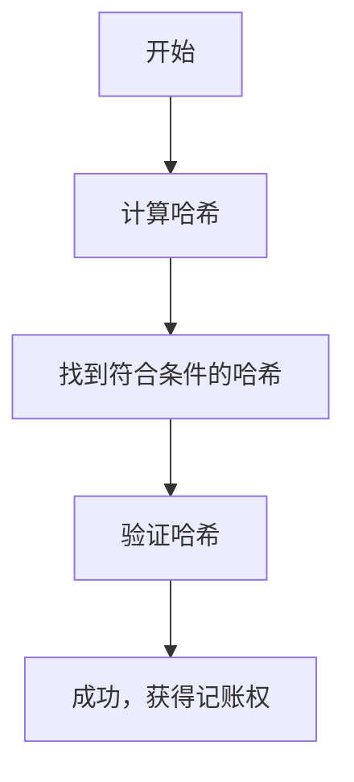

                 


```markdown
# 如何评估企业的区块链数字身份跨境认证应用

> 关键词：区块链，数字身份，跨境认证，身份认证，安全性，隐私保护，企业应用

> 摘要：区块链数字身份跨境认证是一种结合区块链技术与数字身份管理的创新应用，旨在解决传统身份认证中的信任问题和跨境场景下的技术挑战。本文将从技术原理、系统架构、安全性与隐私保护等多个维度，详细分析如何评估企业区块链数字身份跨境认证的应用，帮助读者理解其核心价值和实际应用场景。

---

## 第1章 区块链数字身份跨境认证的背景与挑战

### 1.1 区块链技术的基本概念

#### 1.1.1 区块链的定义与核心特点
区块链是一种去中心化的分布式账本技术，通过密码学算法确保数据的安全性和不可篡改性。其核心特点包括：
- **去中心化**：数据不由单一机构控制，而是分布在多个节点上。
- **不可篡改性**：通过加密哈希和链式结构，确保数据一旦写入无法被修改。
- **透明性**：区块链上的交易对所有参与者公开，但隐私信息仍可加密保护。

#### 1.1.2 区块链的演变与应用领域
区块链技术自比特币白皮书发布以来，逐步扩展到金融、医疗、供应链管理等多个领域。其在身份认证中的应用尤为突出，特别是在需要高安全性和信任的场景。

#### 1.1.3 区块链在身份认证中的作用
区块链通过去中心化和加密技术，为身份认证提供了更高的安全性和可信度。例如，在跨境认证中，区块链可以确保身份信息的唯一性和真实性。

### 1.2 数字身份的定义与特点

#### 1.2.1 数字身份的定义
数字身份是用户在数字世界中的唯一标识，通常包括用户名、密码、数字证书等。数字身份认证是验证用户身份真实性的过程。

#### 1.2.2 数字身份的核心要素
- **标识符**：唯一标识用户身份的字符串，如用户名或数字证书。
- **验证机制**：通过密码、生物特征等方式验证身份的真实性。
- **授权机制**：基于身份验证结果，授予用户特定权限。

#### 1.2.3 数字身份与传统身份认证的区别
传统的身份认证依赖于中心化机构（如银行、社交平台）来验证身份，而数字身份则强调去中心化和用户自主控制。

### 1.3 跨境认证的背景与挑战

#### 1.3.1 跨境认证的定义
跨境认证是指在不同国家或地区之间进行身份验证的过程，通常涉及多机构协作和数据跨境传输。

#### 1.3.2 跨境认证的主要挑战
- **信任问题**：不同国家的机构之间缺乏信任，导致身份信息难以互认。
- **数据隐私**：跨境数据传输涉及复杂的隐私保护问题。
- **技术兼容性**：不同国家可能采用不同的技术标准，导致系统兼容性问题。

#### 1.3.3 区块链在跨境认证中的优势
- **去中心化信任**：区块链通过共识机制建立信任，减少对中心机构的依赖。
- **数据不可篡改**：区块链上的身份信息难以被篡改，确保数据的真实性。
- **隐私保护**：通过零知识证明等技术，在不泄露敏感信息的情况下验证身份。

---

## 第2章 区块链数字身份的核心概念与联系

### 2.1 区块链的核心原理

#### 2.1.1 区块链的共识机制
共识机制是区块链的核心，用于确保所有节点达成一致。常见的共识机制包括：
- **工作量证明（PoW）**：通过计算哈希函数的难度来证明工作量。
- **权益证明（PoS）**：基于节点持有的代币数量来决定记账权。
- **拜占庭容错共识（BFT）**：适用于高性能区块链的快速共识机制。

#### 2.1.2 区块链的分布式账本
分布式账本是区块链的核心数据结构，由多个区块组成，每个区块包含交易信息和哈希指针。交易信息通过哈希函数加密，确保数据的完整性和不可篡改性。

#### 2.1.3 区块链的安全性与隐私保护
区块链的安全性依赖于密码学算法和去中心化结构。隐私保护可以通过零知识证明、同态加密等技术实现，确保敏感信息不被泄露。

### 2.2 数字身份的核心要素

#### 2.2.1 身份标识
身份标识是用户在区块链上的唯一标识符，通常由公钥或地址表示。公钥通过加密算法生成，确保其唯一性和不可篡改性。

#### 2.2.2 身份验证
身份验证是通过验证用户的私钥或生物特征来确认其身份真实性。常见的验证方法包括：
- **密码验证**：基于用户名和密码的验证。
- **数字签名**：通过数字签名验证交易的真实性。
- **生物特征验证**：基于指纹、面部识别等技术进行验证。

#### 2.2.3 身份授权
身份授权是根据用户的身份验证结果，授予其特定权限。例如，在区块链供应链管理中，供应商的身份授权决定了其数据访问权限。

### 2.3 区块链数字身份的实体关系图

```mermaid
erDiagram
    actor 用户 "User" {
        <- 用户ID : 文本
        <- 用户公钥 : 文本
        <- 用户私钥 : 文本
        <- 用户属性 : 文本
    }
    actor 机构 "Institution" {
        <- 机构ID : 文本
        <- 机构公钥 : 文本
        <- 机构私钥 : 文本
    }
    actor 区块链网络 "Blockchain Network" {
        <- 区块链节点 : 文本
    }
    用户 --> 用户公钥
    用户 --> 用户私钥
    用户 --> 用户属性
    用户 --> 机构
    用户 --> 区块链网络
    机构 --> 用户
    机构 --> 区块链网络
    区块链网络 --> 用户
    区块链网络 --> 机构
```

---

## 第3章 区块链数字身份的算法原理

### 3.1 区块链共识机制的算法原理

#### 3.1.1 工作量证明机制（PoW）


### 3.2 数字身份验证的算法原理

#### 3.2.1 数字签名
数字签名通过哈希函数和加密算法实现，确保数据的完整性和真实性。其流程如下：
1. 计算数据的哈希值。
2. 用私钥对哈希值进行加密，生成数字签名。
3. 验收方使用公钥解密签名，验证哈希值是否与原数据匹配。

#### 3.2.2 零知识证明
零知识证明是一种证明方式，能够在不泄露敏感信息的情况下验证身份。例如，通过零知识证明可以验证用户知道某个密钥，而不需要实际透露密钥内容。

### 3.3 区块链数字身份的数学模型

#### 3.3.1 哈希函数的数学模型
哈希函数将任意长度的输入数据映射为固定长度的输出值。例如，SHA-256哈希函数的数学表示为：
$$ H(x) = SHA-256(x) $$

#### 3.3.2 数字签名的数学公式
数字签名通过公钥加密算法实现，其数学模型可以表示为：
$$ S = Sign(SK, x) $$
其中，$ SK $是私钥，$ x $是需要签名的数据。

---

## 第4章 区块链数字身份的系统分析与架构设计

### 4.1 系统功能设计

#### 4.1.1 身份注册模块
用户通过提交基本信息和公钥，完成身份注册。注册信息需要经过区块链网络的验证和确认。

#### 4.1.2 身份认证模块
用户通过提供私钥或生物特征，完成身份验证。验证过程基于区块链上的公钥和哈希值进行。

#### 4.1.3 身份授权管理模块
根据用户的验证结果，授予其特定权限，例如访问特定数据或执行特定操作。

### 4.2 系统架构设计

#### 4.2.1 分层架构
系统架构分为数据层、业务逻辑层和应用层，确保系统的模块化和可扩展性。

#### 4.2.2 微服务架构
采用微服务架构，将系统功能分解为独立的服务模块，如身份验证服务、授权服务等。

#### 4.2.3 区块链节点分布架构
区块链节点分布在全球各地，确保系统的去中心化和抗审查性。

### 4.3 系统接口设计

#### 4.3.1 身份验证接口
接口用于接收用户的验证请求，并返回验证结果。例如：
- 输入：用户的私钥和交易信息。
- 输出：验证成功或失败的标志。

#### 4.3.2 身份授权接口
接口用于根据用户的验证结果，授予其特定权限。例如：
- 输入：用户的公钥和请求权限。
- 输出：权限授予结果。

---

## 第5章 区块链数字身份的项目实战

### 5.1 环境搭建

#### 5.1.1 安装区块链框架
选择合适的区块链框架，如Hyperledger Fabric或Ethereum。

#### 5.1.2 配置身份认证模块
安装必要的身份认证库，如JWT（JSON Web Token）库。

### 5.2 核心功能实现

#### 5.2.1 身份注册实现
编写代码实现用户的身份注册功能，包括公钥的生成和区块链上的注册记录。

#### 5.2.2 身份验证实现
编写代码实现用户的身份验证功能，包括私钥的验证和数字签名的生成。

#### 5.2.3 身份授权实现
编写代码实现基于身份验证结果的权限管理功能。

### 5.3 代码应用解读与分析

#### 5.3.1 身份注册代码
```python
import hashlib

def generate PublicKey():
    # 使用椭圆曲线加密生成公钥
    sk = os.urandom(32)
    pk = hashlib.sha256(sk).hexdigest()
    return pk

def register PublicKey():
    pk = generate PublicKey()
    blockchain.register(pk)
    return pk
```

#### 5.3.2 身份验证代码
```python
def verify Signature(signature, message, public_key):
    # 使用哈希函数和数字签名验证
    try:
        hashed = hashlib.sha256(message.encode()).hexdigest()
        # 验证签名
        if public_key == hashlib.sha256(signature.encode()).hexdigest():
            return True
        else:
            return False
    except Exception as e:
        return False
```

---

## 第6章 最佳实践与总结

### 6.1 最佳实践

#### 6.1.1 安全性与隐私保护
- 使用零知识证明技术，保护用户隐私。
- 定期进行安全审计，发现潜在漏洞。

#### 6.1.2 系统性能优化
- 优化区块链网络的共识机制，提高交易效率。
- 采用轻量级加密算法，减少计算开销。

### 6.2 小结

通过本文的分析，我们可以看到区块链数字身份跨境认证在企业应用中的巨大潜力。从技术原理到系统设计，再到实际应用，区块链数字身份认证为企业提供了更高的安全性和可信度。

### 6.3 注意事项

- 在实际应用中，需注意不同国家的法律法规差异，确保合规性。
- 加强用户教育，提高用户对区块链数字身份的认知和信任。

### 6.4 拓展阅读

- 推荐阅读《区块链技术与应用》（作者：XXX）。
- 关注区块链领域的最新研究和应用案例。

---

作者：AI天才研究院 & 禅与计算机程序设计艺术
```

