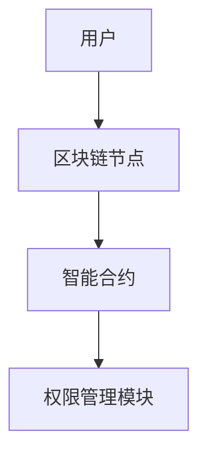
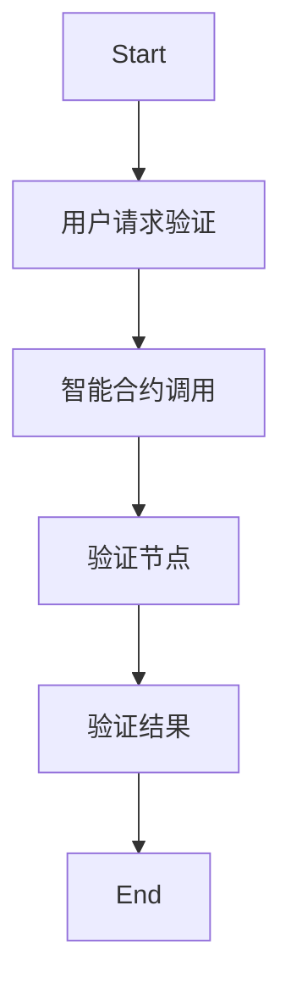
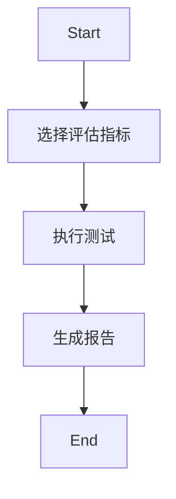
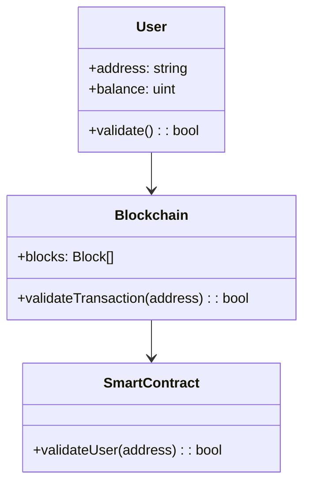

                 


# 如何评估企业的区块链身份验证应用

> 关键词：区块链，身份验证，企业安全，智能合约，分布式系统，加密算法

> 摘要：本文详细探讨了如何评估企业的区块链身份验证应用，从核心概念、技术原理、评估标准、系统架构到项目实战，层层剖析，为企业提供实用的评估方法和建议。

---

# 第1章 区块链身份验证应用的背景与核心概念

## 1.1 传统身份验证的局限性

传统身份验证方法，如密码验证和基于令牌的验证，存在以下问题：
- **安全性不足**：密码容易被猜测或破解，令牌易被截获。
- **中心化依赖**：依赖于中心化机构，存在单点故障风险。
- **效率低下**：在高并发场景下，验证速度受限。

## 1.2 区块链技术的兴起与应用需求

区块链的去中心化、不可篡改和透明性特点，使其成为身份验证的理想选择：
- **去中心化**：避免单点故障，降低安全风险。
- **不可篡改性**：数据一旦写入区块链，难以篡改。
- **透明性**：所有交易记录可追溯，便于审计。

## 1.3 区块链身份验证的核心概念与定义

区块链身份验证是一种基于区块链技术的身份确认方法，核心概念包括：
- **分布式账本**：记录所有交易和身份信息的去中心化账本。
- **智能合约**：自动执行预定义规则的区块链脚本。
- **身份标识**：唯一标识用户身份的数字凭证。

### 实体关系图


---

# 第2章 区块链身份验证的核心算法与数学模型

## 2.1 加密算法在身份验证中的应用

- **哈希函数**：用于生成唯一用户标识，如SHA-256。
- **数字签名**：确保数据完整性和真实性，使用RSA或椭圆曲线加密。

## 2.2 共识机制的选择与优化

- **工作量证明（PoW）**：安全性高，但效率低。
- **权益证明（PoS）**：效率高，但依赖持币者。
- **RAFT**：适合企业级应用，速度快，一致性好。

## 2.3 智能合约的执行流程



---

# 第3章 区块链身份验证的评估标准与方法

## 3.1 安全性评估指标

- **抗攻击性**：系统能否抵御常见攻击，如重放攻击、女巫攻击。
- **数据隐私**：确保敏感信息不被未授权访问。
- **身份唯一性**：确保每个用户身份唯一。

## 3.2 性能评估指标

- **交易吞吐量**：系统每秒处理的交易数量。
- **延迟**：从发起请求到完成验证的时间。
- **可扩展性**：系统能否随着用户增长扩展性能。

## 3.3 评估流程图



---

# 第4章 区块链身份验证的技术实现

## 4.1 分布式身份验证架构

- **节点角色**：包含用户节点、验证节点和管理节点。
- **通信机制**：通过区块链网络进行点对点通信。
- **数据存储**：分布式账本存储所有交易记录。

## 4.2 智能合约实现

```solidity
// SPDX-License-Identifier: MIT
pragma solidity ^0.8.0;

contract IdentityValidation {
    mapping(address => uint256) public userBalances;
    mapping(uint256 => address) public tokenIdToAddress;

    function register(uint256 tokenId) external payable {
        require(msg.value == 1 ether, "Invalid ether amount");
        userBalances[msg.sender] = tokenId;
        tokenIdToAddress[tokenId] = msg.sender;
    }

    function validate(address userAddress) external view returns (bool) {
        return userBalances[userAddress] != 0;
    }
}
```

## 4.3 系统架构设计



---

# 第5章 区块链身份验证的项目实战

## 5.1 环境配置

- **安装工具**：Ganache、Solidity编译器、Node.js、Web3.js。
- **区块链网络选择**：以太坊测试网、Polygon、Fantom。

## 5.2 核心代码实现

```javascript
const Web3 = require('web3');
const web3 = new Web3(new Web3.providers.HttpProvider('http://localhost:8545'));

async function validateUser(address) {
    const smartContract = new web3.eth.Contract(ABI, '0x1234...');
    const result = await smartContract.methods.validate(address).call();
    return result;
}
```

## 5.3 案例分析

假设企业需要验证用户购买资格，智能合约实现如下：
```solidity
function isEligible(address user) external view returns (bool) {
    return userBalances[user] >= eligibleTokenId;
}
```

---

# 第6章 最佳实践与注意事项

## 6.1 最佳实践

- **选择合适的共识机制**：根据需求选择PoW、PoS或RAFT。
- **数据隐私保护**：采用零知识证明确保隐私。
- **定期审计**：定期检查系统漏洞，确保安全性。

## 6.2 注意事项

- **性能优化**：避免过度优化导致安全漏洞。
- **兼容性问题**：确保不同区块链网络间的兼容性。
- **用户教育**：教育用户保护好私钥，防止丢失。

## 6.3 拓展阅读

- 《Blockchain Identity Management》
- 《Smart Contracts:dle contracts》
- 《Decentralized Identity: A New Paradigm》

---

# 作者

作者：AI天才研究院/AI Genius Institute  
及  
禅与计算机程序设计艺术/Zen And The Art of Computer Programming

---

**本文遵循 MIT 许可证，转载请注明出处。**

