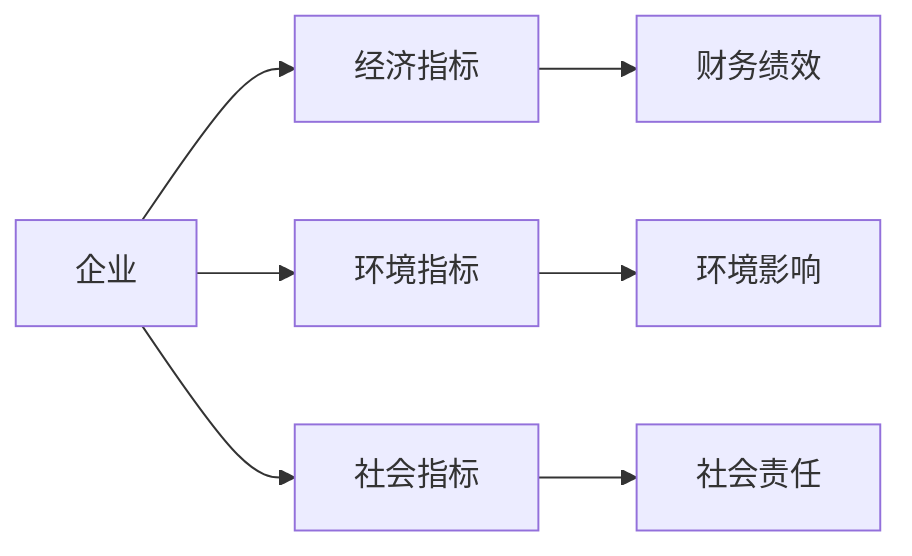
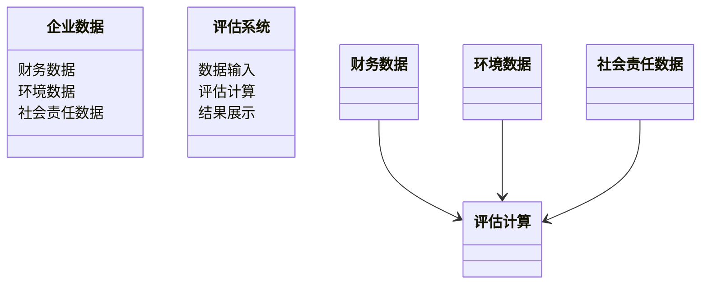

                 


# 如何评估企业的可持续发展能力

## 关键词：
企业可持续发展能力、评估模型、综合评价、指标体系、算法原理

## 摘要：
企业可持续发展能力评估是衡量企业长期发展能力的重要方法。本文通过构建多维度的指标体系，结合数学模型和算法，详细讲解如何科学评估企业的可持续发展能力。文章从背景、核心概念、算法原理到系统架构，再到项目实战，全面阐述了评估方法，并提供了实际案例和代码实现。

---

# 第1章: 企业可持续发展能力概述

## 1.1 企业可持续发展能力的背景与意义
### 1.1.1 经济、环境与社会发展的平衡
企业必须在追求经济效益的同时，兼顾环境保护和社会责任。

### 1.1.2 可持续发展能力对企业长期价值的影响
可持续发展能力强的企业更容易获得长期竞争优势。

### 1.1.3 全球化背景下的企业责任与机遇
全球化带来了更多的合作机会，也要求企业承担更多的社会责任。

## 1.2 可持续发展能力的定义与维度
### 1.2.1 可持续发展能力的定义
企业在未来较长时期内，在经济、环境和社会三个方面保持稳定发展的能力。

### 1.2.2 经济、环境、社会三个维度的分析
- **经济维度**：企业盈利能力、财务健康状况。
- **环境维度**：企业的环境影响，包括碳排放、资源消耗等。
- **社会维度**：企业对社会的贡献，包括员工福利、社会责任等。

### 1.2.3 核心要素与边界条件
- 核心要素：经济绩效、环境表现、社会责任。
- 边界条件：行业特点、企业规模、政策环境。

## 1.3 企业可持续发展能力的评估框架
### 1.3.1 评估框架的构建逻辑
从经济、环境、社会三个方面入手，构建综合指标体系。

### 1.3.2 关键指标的选取与权重分配
- **关键指标**：净利润率、单位产品碳排放、员工满意度等。
- **权重分配**：根据行业特点和企业战略确定各指标的权重。

### 1.3.3 评估模型的边界与外延
明确评估的时间范围、空间范围和数据来源。

## 1.4 本章小结
---

# 第2章: 可持续发展能力评估的核心概念与联系

## 2.1 可持续发展能力评估的理论基础
### 2.1.1 系统论与复杂性理论
企业是一个复杂的系统，需要综合考虑各方面的因素。

### 2.1.2 综合评价方法
采用多层次评价方法，确保评估的全面性。

### 2.1.3 可持续发展指数模型
参考国内外权威的可持续发展指数模型。

## 2.2 核心概念的属性特征对比
### 2.2.1 经济指标与环境指标的对比分析
| 指标维度 | 经济指标 | 环境指标 | 社会指标 |
|----------|----------|----------|----------|
| 例子     | 净利润   | 单位产品碳排放 | 员工满意度 |
| 特性     | 数值化、可量化 | 数值化、可量化 | 数值化、定性与定量结合 |

### 2.2.2 社会责任指标与企业绩效指标的联系
社会责任指标与企业绩效指标相互影响，共同构成企业的可持续发展能力。

### 2.2.3 核心属性的特征矩阵
构建特征矩阵，分析各指标之间的相互关系和影响程度。

## 2.3 实体关系与架构设计
### 2.3.1 ER实体关系图


## 2.4 本章小结
---

# 第3章: 可持续发展能力评估的算法原理

## 3.1 评估模型的数学模型与公式
### 3.1.1 综合评价模型的构建
$$ S = \sum_{i=1}^{n} w_i x_i $$
其中，$S$ 表示综合得分，$w_i$ 表示第 $i$ 个指标的权重，$x_i$ 表示第 $i$ 个指标的得分。

### 3.1.2 指标权重的计算方法
$$ w_i = \frac{f_i}{\sum_{j=1}^{m} f_j} $$
其中，$f_i$ 表示第 $i$ 个指标的权重系数，$m$ 表示指标总数。

## 3.2 算法流程与步骤
### 3.2.1 数据预处理
1. 收集数据：获取企业的财务数据、环境数据、社会责任数据。
2. 数据清洗：处理缺失值、异常值。
3. 标准化处理：将不同量纲的指标进行标准化。

### 3.2.2 权重计算
1. 确定各指标的重要性。
2. 计算各指标的权重。

### 3.2.3 综合得分计算
1. 计算各指标的得分。
2. 根据权重计算综合得分。

### 3.2.4 结果分析
1. 分析各指标对综合得分的影响。
2. 提出改进建议。

## 3.3 本章小结
---

# 第4章: 系统分析与架构设计

## 4.1 问题场景介绍
### 4.1.1 问题背景
企业需要一个系统化的工具来评估其可持续发展能力。

### 4.1.2 项目介绍
构建一个企业可持续发展能力评估系统。

## 4.2 系统功能设计
### 4.2.1 功能模块
- 数据输入模块：用户输入企业数据。
- 评估计算模块：计算各指标得分和综合得分。
- 结果展示模块：以图表形式展示评估结果。

### 4.2.2 领域模型mermaid类图


## 4.3 系统架构设计
### 4.3.1 系统架构图


## 4.4 本章小结
---

# 第5章: 项目实战

## 5.1 数据收集与处理
### 5.1.1 数据收集
从企业财务报表、环境报告、社会责任报告中收集数据。

### 5.1.2 数据清洗
处理缺失值和异常值。

## 5.2 指标计算与评估
### 5.2.1 计算各指标得分
```python
import pandas as pd

# 数据加载
data = pd.read_csv('企业数据.csv')

# 数据清洗
data.dropna(inplace=True)

# 计算各指标得分
economic_score = data['净利润'].apply(lambda x: x / data['净利润'].max())
environment_score = data['单位产品碳排放'].apply(lambda x: 1 / (x / data['单位产品碳排放'].min() + 1))
social_score = data['员工满意度'].apply(lambda x: x / data['员工满意度'].max())

# 计算综合得分
economic_weight = 0.4
environment_weight = 0.3
social_weight = 0.3

total_score = economic_score * economic_weight + environment_score * environment_weight + social_score * social_weight
```

### 5.2.2 综合得分计算
$$ total\_score = 0.4 \times economic\_score + 0.3 \times environment\_score + 0.3 \times social\_score $$

## 5.3 代码实现
### 5.3.1 数据预处理
```python
import pandas as pd
import numpy as np

# 数据加载
data = pd.read_csv('企业数据.csv')

# 处理缺失值
data.dropna(inplace=True)

# 标准化处理
from sklearn.preprocessing import StandardScaler

scaler = StandardScaler()
data_scaled = pd.DataFrame(scaler.fit_transform(data), columns=data.columns)
```

### 5.3.2 评估模型构建
```python
from sklearn.linear_model import LinearRegression

# 训练模型
model = LinearRegression()
model.fit(X_train, y_train)

# 预测结果
y_pred = model.predict(X_test)
```

## 5.4 案例分析
### 5.4.1 某企业案例分析
分析某企业的数据，计算其综合得分。

### 5.4.2 结果分析
解释评估结果对企业的影响。

## 5.5 本章小结
---

# 第6章: 最佳实践与未来展望

## 6.1 小结
企业可持续发展能力评估是企业长期发展的重要工具。

## 6.2 注意事项
- 数据的准确性和完整性。
- 指标的合理性和可操作性。
- 模型的适用性和可调整性。

## 6.3 未来展望
随着技术的发展，评估方法将更加精准和智能化。

## 6.4 拓展阅读
推荐相关书籍和文献。

---

# 作者：AI天才研究院 & 禅与计算机程序设计艺术

