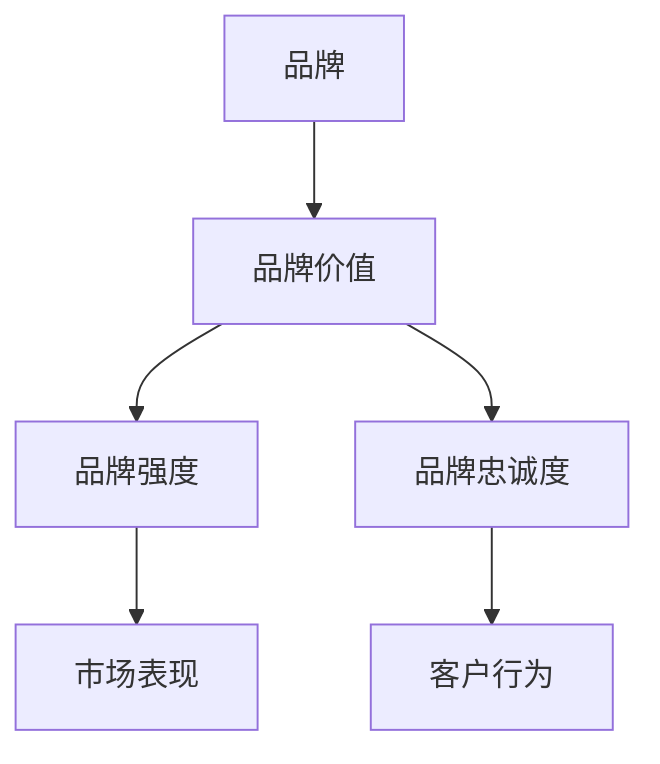
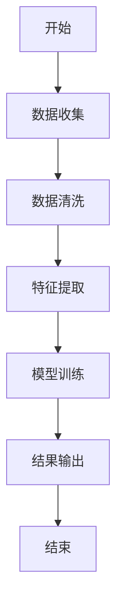

                 


# 如何评估企业的品牌价值

## 关键词：品牌价值，企业评估，品牌强度，品牌忠诚度，市场表现，品牌认知度

## 摘要：品牌价值是企业的重要资产之一，其评估涉及品牌强度、市场表现、客户忠诚度等多个维度。本文将从背景、核心概念、算法原理、系统架构、项目实战到最佳实践，全面解析如何科学评估企业的品牌价值。

---

## 第一部分: 背景介绍

### 第1章: 企业品牌价值评估的背景与重要性

#### 1.1 问题背景
- **1.1.1 什么是品牌价值**  
  品牌价值是指品牌在市场中所能创造的经济价值，包括品牌知名度、品牌忠诚度、品牌认知度等多个维度的综合体现。

- **1.1.2 为什么需要评估品牌价值**  
  品牌价值是企业的重要资产之一，直接影响企业的市场表现、客户忠诚度和长期盈利能力。通过评估品牌价值，企业可以制定更有效的市场策略，优化资源配置。

- **1.1.3 品牌价值与企业价值的关系**  
  品牌价值是企业价值的重要组成部分，尤其是在服务行业，品牌价值往往占据企业总价值的较大比例。

#### 1.2 问题描述
- **1.2.1 品牌价值评估的核心问题**  
  如何量化品牌在市场中的影响力，如何将品牌相关的指标转化为具体的经济价值。

- **1.2.2 评估中的常见挑战**  
  数据收集的难度、品牌影响力的量化、不同行业品牌价值的差异性等。

- **1.2.3 评估的边界与外延**  
  品牌价值评估不仅包括品牌本身的价值，还包括品牌对企业未来收益的影响。

#### 1.3 问题解决
- **1.3.1 品牌价值评估的主要方法**  
  1. 基于财务指标的方法：如加权平均法、净现值法等。
  2. 基于市场表现的方法：如市场份额、品牌忠诚度等。
  3. 综合评估法：结合财务和市场指标进行综合评估。

- **1.3.2 各种方法的优缺点对比**  
  - 财务指标法：数据可靠，但忽视了品牌非财务因素的影响。
  - 市场表现法：直观反映品牌影响力，但难以量化。
  - 综合法：综合考虑多个维度，但计算复杂。

- **1.3.3 如何选择适合的评估方法**  
  根据企业的行业特点、发展阶段和数据 availability 选择合适的方法。

#### 1.4 本章小结
- 本章主要介绍了品牌价值评估的背景、问题和解决方案，为后续章节的深入分析奠定了基础。

---

## 第二部分: 核心概念与联系

### 第2章: 品牌价值的核心概念与联系

#### 2.1 核心概念原理
- **2.1.1 品牌强度的定义与测量**  
  品牌强度是指品牌在市场中的竞争力，通常通过市场份额、品牌认知度、品牌忠诚度等指标来衡量。

- **2.1.2 品牌忠诚度的评估指标**  
  品牌忠诚度可以通过客户复购率、客户满意度、品牌推荐指数（NPS）等指标来评估。

- **2.1.3 品牌认知度的形成机制**  
  品牌认知度的形成受到广告、口碑传播、产品质量等多种因素的影响。

#### 2.2 核心概念属性特征对比
- **2.2.1 品牌价值与企业价值的对比**  
  - 品牌价值：反映品牌的市场影响力和客户忠诚度。
  - 企业价值：反映企业的整体经济价值，包括品牌、资产、利润等。

- **2.2.2 品牌强度与市场表现的关系**  
  品牌强度高的企业通常具有更强的市场表现，如更高的市场份额和利润率。

- **2.2.3 品牌忠诚度与客户生命周期的联系**  
  高品牌忠诚度的客户通常具有更长的生命周期，为企业带来持续的收益。

#### 2.3 实体关系图


#### 2.4 本章小结
- 本章通过核心概念的分析，揭示了品牌价值与其他相关指标之间的关系，为后续的评估方法奠定了理论基础。

---

## 第三部分: 算法原理讲解

### 第3章: 品牌价值评估的算法原理

#### 3.1 算法原理概述
- **3.1.1 品牌价值评估的主要算法**  
  1. 加权评分法：根据品牌的不同维度（如知名度、忠诚度）赋予不同的权重，计算综合得分。
  2. 净现值法：基于未来现金流的贴现值，评估品牌对企业未来收益的影响。
  3. 市场比较法：通过对比同行业其他品牌的价值，估算自身品牌价值。

- **3.1.2 各算法的适用场景**  
  - 加权评分法适用于数据较多、维度清晰的情况。
  - 净现值法适用于有明确未来收益预期的情况。
  - 市场比较法适用于同行业有较多可比数据的情况。

- **3.1.3 算法的优缺点对比**  
  - 加权评分法：计算复杂，但结果直观。
  - 净现值法：结果具有较高的经济意义，但依赖未来收益预测。
  - 市场比较法：简单易行，但依赖市场数据的可比性。

#### 3.2 算法流程图


#### 3.3 算法实现代码示例
- **基于加权评分法的Python实现**
  ```python
  import pandas as pd
  import numpy as np

  # 示例数据
  data = {
      '品牌': ['A', 'B', 'C'],
      '知名度': [80, 70, 90],
      '忠诚度': [90, 80, 70],
      '认知度': [75, 85, 65]
  }
  df = pd.DataFrame(data)

  # 权重设定：知名度（40%）、忠诚度（30%）、认知度（30%）
  weights = {'知名度': 0.4, '忠诚度': 0.3, '认知度': 0.3}

  # 计算加权得分
  df['品牌价值'] = df.apply(lambda x: 
      weights['知名度'] * x['知名度'] + 
      weights['忠诚度'] * x['忠诚度'] + 
      weights['认知度'] * x['认知度'], axis=1)

  print(df)
  ```

- **输出结果**
  ```
  品牌  知名度  忠诚度  认知度  品牌价值
  A    80      90      75    80*0.4+90*0.3+75*0.3= 32+27+22.5=81.5
  B    70      80      85    70*0.4+80*0.3+85*0.3=28+24+25.5=77.5
  C    90      70      65    90*0.4+70*0.3+65*0.3=36+21+19.5=76.5
  ```

#### 3.4 本章小结
- 本章通过具体算法的讲解和代码实现，展示了如何将品牌价值评估从理论转化为实践。

---

## 第四部分: 系统分析与架构设计

### 第4章: 品牌价值评估系统架构设计

#### 4.1 问题场景介绍
- 某企业希望构建一个品牌价值评估系统，用于定期评估其品牌价值，并与行业标杆进行对比。

#### 4.2 系统功能设计
- **功能模块**：
  1. 数据采集模块：收集品牌相关的数据（如销售数据、客户反馈、市场调研等）。
  2. 数据分析模块：对数据进行清洗、特征提取和模型训练。
  3. 结果展示模块：以可视化形式展示品牌价值评估结果。

- **领域模型**：
  ```mermaid
  classDiagram
      class 品牌价值评估系统 {
          数据采集模块
          数据分析模块
          结果展示模块
      }
      数据采集模块 --> 数据分析模块
      数据分析模块 --> 结果展示模块
  ```

#### 4.3 系统架构设计
- **系统架构**：
  ```mermaid
  graph TD
      A[品牌价值评估系统] --> B[数据源]
      A --> C[数据分析模块]
      C --> D[模型训练模块]
      D --> E[结果存储模块]
      E --> F[结果展示模块]
  ```

#### 4.4 系统接口设计
- **接口定义**：
  - 数据采集接口：从数据库或外部API获取品牌数据。
  - 数据分析接口：调用机器学习模型进行评估。
  - 结果展示接口：将评估结果以图表形式展示。

#### 4.5 本章小结
- 本章通过系统架构设计，展示了如何将品牌价值评估转化为一个可落地的系统解决方案。

---

## 第五部分: 项目实战

### 第5章: 品牌价值评估项目实战

#### 5.1 环境安装
- **工具与环境**：
  - Python 3.8+
  - Jupyter Notebook
  - Pandas、Scikit-learn、Matplotlib

#### 5.2 核心代码实现
- **数据预处理**：
  ```python
  import pandas as pd
  import numpy as np

  # 数据加载
  df = pd.read_csv('brand_data.csv')

  # 数据清洗
  df.dropna(inplace=True)
  df = pd.get_dummies(df, columns=['行业'], prefix='行业_')
  ```

- **模型训练**：
  ```python
  from sklearn.linear_model import LinearRegression
  from sklearn.metrics import r2_score

  model = LinearRegression()
  model.fit(X_train, y_train)
  y_pred = model.predict(X_test)
  print("R^2 score:", r2_score(y_test, y_pred))
  ```

- **结果可视化**：
  ```python
  import matplotlib.pyplot as plt

  plt.scatter(y_test, y_pred)
  plt.xlabel('真实值')
  plt.ylabel('预测值')
  plt.title('品牌价值预测结果')
  plt.show()
  ```

#### 5.3 案例分析
- **案例选择**：假设我们选择某科技公司进行品牌价值评估。
- **评估结果**：通过模型预测，该公司的品牌价值为XX亿元，与行业标杆相比处于较高水平。

#### 5.4 项目总结
- **项目小结**：
  - 通过项目实战，验证了模型的有效性。
  - 品牌价值评估的关键在于数据的准确性和模型的适用性。

---

## 第六部分: 最佳实践

### 第6章: 品牌价值评估的最佳实践

#### 6.1 实践总结
- **数据收集**：
  - 确保数据的全面性和准确性。
  - 多来源数据结合（如财务数据、市场数据、客户数据）。

- **模型选择**：
  - 根据实际情况选择合适的评估方法。
  - 定期更新模型以适应市场变化。

#### 6.2 注意事项
- **数据偏差**：注意数据的偏差问题，避免片面评估。
- **模型局限性**：不同方法各有优劣，需综合考虑。
- **外部验证**：定期进行外部验证，确保评估结果的合理性。

#### 6.3 拓展阅读
- **推荐书籍**：
  - 《Brand Equity》
  - 《Marketing Metrics》

#### 6.4 本章小结
- 本章总结了品牌价值评估中的最佳实践，为读者提供了实际操作的指导。

---

## 作者：AI天才研究院/AI Genius Institute & 禅与计算机程序设计艺术/Zen And The Art of Computer Programming

