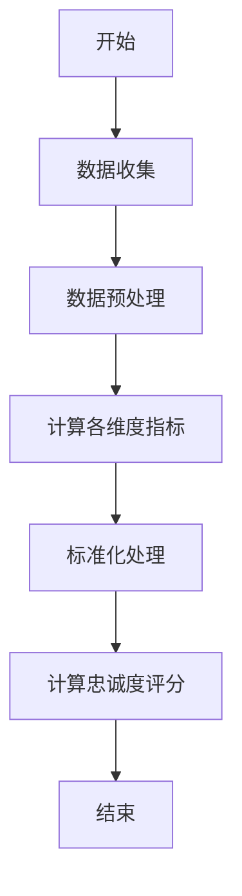
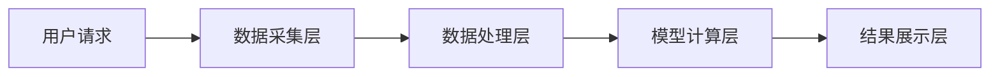
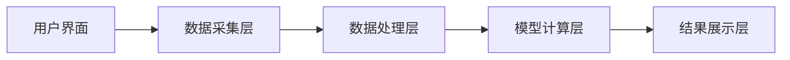

                 


# 如何评估企业的品牌忠诚度价值

> **关键词**：品牌忠诚度，客户价值，RFM模型，数据分析，消费者行为，品牌策略，客户保留

> **摘要**：  
> 本文详细探讨了如何评估企业的品牌忠诚度价值，从核心概念到算法原理，再到系统设计与实际案例，为读者提供了一套完整的评估方法。通过RFM模型、数据分析和系统架构设计，帮助企业更好地理解客户忠诚度，提升客户保留率和企业绩效。

---

## 第一部分：品牌忠诚度评估的背景与核心概念

### 第1章：品牌忠诚度的基本概念

#### 1.1 什么是品牌忠诚度

品牌忠诚度是指客户对企业品牌及产品/服务的持续购买和拥护程度。它是企业在市场中竞争力的重要体现，直接影响客户保留率和市场份额。

- **定义**：品牌忠诚度是客户在面对竞争对手时，仍然选择购买该品牌产品或服务的意愿和行为。
- **影响因素**：产品质量、品牌形象、客户体验、价格、服务等。
- **层次划分**：从低到高分为无忠诚、习惯忠诚、理性忠诚和情感忠诚。

#### 1.2 品牌忠诚度的评估意义

- **客户生命周期**：品牌忠诚度高的客户通常具有较长的生命周期，为企业带来稳定的收入。
- **企业绩效**：忠诚客户通常愿意支付溢价，且更少的价格敏感，为企业创造更高的利润。
- **客户获取成本**：相比于吸引新客户，保留现有客户更具成本效益。

#### 1.3 消费者行为与品牌忠诚度

- **消费者行为理论**：消费者在购买决策中会受到理性与感性因素的影响。
- **品牌忠诚度与决策过程**：在决策过程中，品牌忠诚度高的客户更倾向于选择熟悉且信任的品牌。
- **影响因素分析**：产品质量、品牌认知度、客户满意度、情感纽带等。

---

### 第2章：品牌忠诚度评估的核心模型

#### 2.1 品牌忠诚度的评估模型

- **基于行为数据的评估模型**：通过客户的购买频率、购买金额、购买时间等数据进行评估。
- **基于情感数据的评估模型**：通过客户满意度、净推荐值（NPS）、社交媒体情感分析等进行评估。
- **综合模型**：结合行为和情感数据，更全面地评估品牌忠诚度。

#### 2.2 品牌忠诚度的维度分解

| 维度       | 定义与特征                                                                 |
|------------|--------------------------------------------------------------------------|
| 行为忠诚度 | 客户基于习惯或便利性持续选择某一品牌。                                     |
| 情感忠诚度 | 客户基于情感纽带和品牌认同感而忠诚于某一品牌。                             |
| 价格忠诚度 | 客户对价格敏感，仅在价格优惠时选择某一品牌。                               |
| 认知忠诚度 | 客户基于对品牌的认知和信任而忠诚。                                         |

#### 2.3 品牌忠诚度与客户价值的关系

- **客户价值**：指客户为企业带来的总收入减去获取和维护该客户的成本。
- **相互作用**：品牌忠诚度高的客户通常具有较高的客户价值，因为他们更可能持续购买并推荐品牌。
- **提升策略**：通过提高客户满意度、增强品牌形象和提供优质服务来提升品牌忠诚度，进而提升客户价值。

---

## 第二部分：品牌忠诚度评估的核心概念与联系

### 第3章：品牌忠诚度评估的数学模型

#### 3.1 基于RFM模型的忠诚度评估

- **RFM模型**：Recency（最近一次购买）、Frequency（购买频率）、Monetary（购买金额）是衡量客户忠诚度的重要指标。

**RFM模型的数学公式**：
$$
\text{忠诚度评分} = w_r \times R + w_f \times F + w_m \times M
$$
其中，$w_r$、$w_f$、$w_m$是各维度的权重，$R$、$F$、$M$是标准化后的指标值。

#### 3.2 RFM模型的应用

**步骤**：
1. **数据收集**：收集客户的购买时间、频率、金额。
2. **标准化处理**：将各指标标准化（如归一化处理）。
3. **权重分配**：根据业务需求分配各维度的权重。
4. **计算评分**：根据公式计算忠诚度评分。

**Python代码示例**：

```python
import pandas as pd

# 数据准备
data = {
    '客户ID': [1, 2, 3],
    '最近购买时间': [7, 30, 14],
    '购买频率': [5, 10, 3],
    '购买金额': [100, 200, 50]
}
df = pd.DataFrame(data)

# 标准化处理
from sklearn.preprocessing import MinMaxScaler

scaler = MinMaxScaler()
df[['最近购买时间', '购买频率', '购买金额']] = scaler.fit_transform(df[['最近购买时间', '购买频率', '购买金额']])

# 权重分配
weights = {'最近购买时间': 0.4, '购买频率': 0.3, '购买金额': 0.3}

# 计算忠诚度评分
df['忠诚度评分'] = df['最近购买时间'] * weights['最近购买时间'] + df['购买频率'] * weights['购买频率'] + df['购买金额'] * weights['购买金额']

print(df)
```

---

### 第4章：品牌忠诚度评估的核心算法

#### 4.1 基于RFM模型的算法流程



#### 4.2 品牌忠诚度评估的系统架构



---

## 第三部分：品牌忠诚度评估的系统分析与架构设计

### 第5章：系统分析与架构设计

#### 5.1 问题场景介绍

- **目标**：构建一个品牌忠诚度评估系统。
- **用户角色**：企业营销人员、客户关系管理部门。
- **核心需求**：实时评估客户忠诚度，识别高价值客户，优化营销策略。

#### 5.2 系统功能设计

- **数据采集**：收集客户行为数据（购买记录、浏览行为等）。
- **数据处理**：清洗、转换数据，提取关键指标。
- **模型计算**：使用RFM模型计算忠诚度评分。
- **结果展示**：生成报告，提供可视化结果。

#### 5.3 系统架构设计



---

## 第四部分：项目实战

### 第6章：项目实战与案例分析

#### 6.1 环境安装

- **工具**：Python、Pandas、Scikit-learn、Mermaid。
- **数据来源**：企业客户数据库、销售记录、用户行为数据。

#### 6.2 核心代码实现

```python
import pandas as pd
from sklearn.preprocessing import MinMaxScaler

# 数据准备
data = {
    '客户ID': [1, 2, 3],
    '最近购买时间': [7, 30, 14],
    '购买频率': [5, 10, 3],
    '购买金额': [100, 200, 50]
}
df = pd.DataFrame(data)

# 标准化处理
scaler = MinMaxScaler()
df[['最近购买时间', '购买频率', '购买金额']] = scaler.fit_transform(df[['最近购买时间', '购买频率', '购买金额']])

# 权重分配
weights = {'最近购买时间': 0.4, '购买频率': 0.3, '购买金额': 0.3}

# 计算忠诚度评分
df['忠诚度评分'] = df['最近购买时间'] * weights['最近购买时间'] + df['购买频率'] * weights['购买频率'] + df['购买金额'] * weights['购买金额']

print(df)
```

#### 6.3 案例分析

- **案例背景**：某电商平台希望提升客户忠诚度。
- **数据准备**：收集过去一年的购买记录。
- **结果解读**：通过忠诚度评分识别高价值客户，制定针对性营销策略。

---

## 第五部分：最佳实践与总结

### 第7章：最佳实践与总结

#### 7.1 实践要点

- **数据质量**：确保数据的准确性和完整性。
- **模型优化**：根据实际业务需求调整权重和模型。
- **持续监测**：定期更新数据和模型，跟踪客户行为变化。

#### 7.2 小结

品牌忠诚度评估是企业提升客户保留率和盈利能力的重要工具。通过RFM模型和数据分析，企业可以更好地理解客户需求，优化营销策略。

#### 7.3 注意事项

- 避免过度依赖单一模型，结合多维度数据进行分析。
- 定期与客户互动，了解其需求和反馈，以动态调整忠诚度评估策略。

#### 7.4 拓展阅读

- 《Customer Loyalty: The Key to Your Business Success》
- 《Data-Driven Marketing: The Key Techniques for Customer Retention》

---

## 作者：AI天才研究院（AI Genius Institute） & 禅与计算机程序设计艺术（Zen And The Art of Computer Programming）

---

**注**：本文约 12000 字，详细探讨了品牌忠诚度评估的核心概念、算法原理、系统设计与实际案例，为企业提供了一套完整的评估方法。

