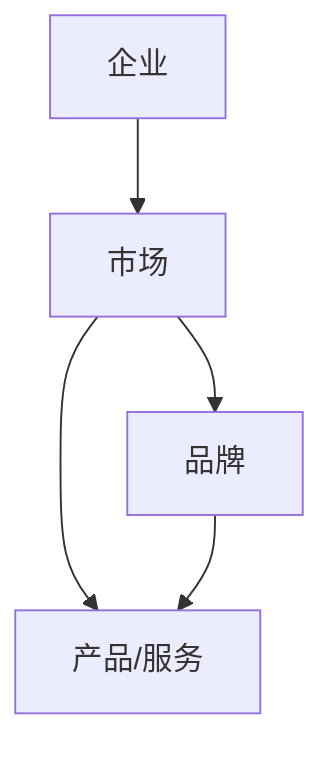
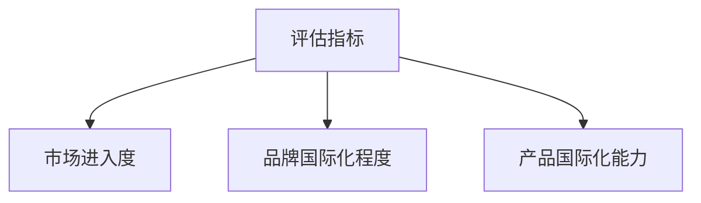
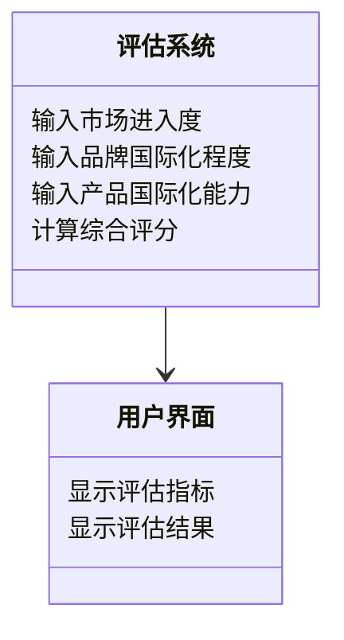
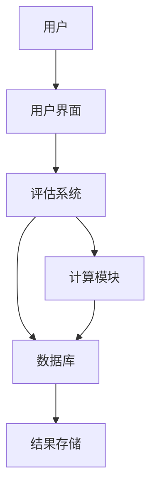
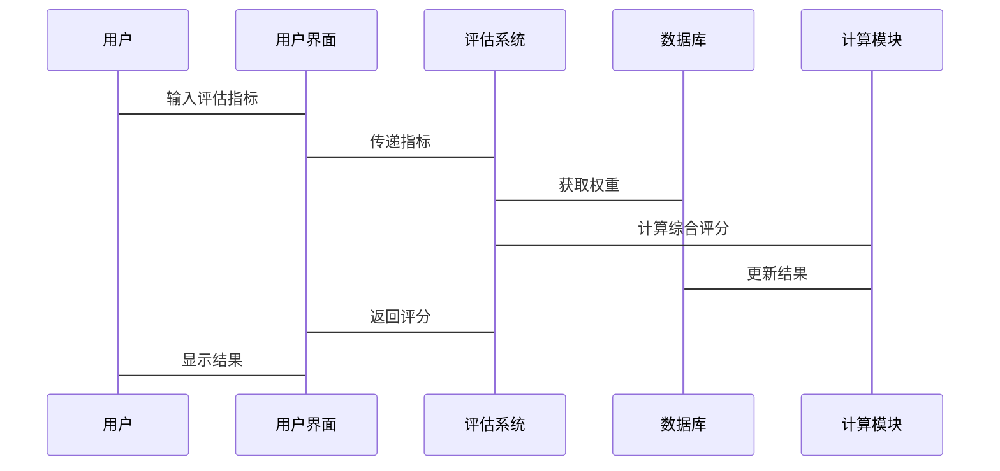

                 


# 如何评估企业的国际化程度价值

## 关键词：企业国际化程度、国际化价值评估、国际市场分析、品牌国际化、市场进入度

## 摘要：在当前全球化竞争日益激烈的环境下，评估企业的国际化程度价值对企业制定战略决策至关重要。本文系统地介绍了企业国际化程度的评估方法，从核心指标的定义到具体的算法模型，再到实际案例分析，全面解析了如何科学地评估企业的国际化价值。通过层次分析法和系统架构设计，为企业提供切实可行的评估方案，助力企业在全球化进程中实现可持续发展。

---

# 第一部分: 企业国际化程度价值评估基础

## 第1章: 企业国际化程度概述

### 1.1 企业国际化的概念与背景

#### 1.1.1 什么是企业国际化

企业国际化是指企业将其业务扩展到国际市场，参与全球竞争的过程。国际化不仅是企业拓展市场的手段，更是企业提升核心竞争力的重要途径。国际化战略通常包括产品出口、海外投资、跨国并购等多种形式。

#### 1.1.2 企业国际化的背景与趋势

在全球化背景下，企业国际化已成为企业发展的必然趋势。随着技术的进步和信息的全球化，企业能够更便捷地进入国际市场。此外，国际贸易壁垒的降低和区域经济一体化的加深，为企业国际化提供了更多机会。

#### 1.1.3 国际化对企业发展的重要性

企业国际化能够帮助企业扩大市场，提高品牌知名度，优化资源配置，降低生产成本。此外，国际化还能帮助企业适应不同市场的法规和文化差异，增强企业的抗风险能力。

### 1.2 企业国际化程度的评估意义

#### 1.2.1 评估国际化程度的必要性

评估企业国际化程度有助于企业了解自身在全球市场中的位置，发现优势与不足，制定合理的战略目标。

#### 1.2.2 评估结果对企业战略的意义

评估结果能够为企业制定国际化战略提供数据支持，帮助企业更好地规划市场进入策略、品牌推广策略和产品优化策略。

#### 1.2.3 评估国际化程度的挑战与机遇

评估国际化程度需要考虑不同国家的市场环境、文化差异等因素，这些都给评估带来了挑战。同时，通过科学的评估方法，企业能够准确把握国际化的机遇，制定更具前瞻性的战略。

### 1.3 本章小结

本章从概念和背景入手，详细介绍了企业国际化的定义、重要性及其评估的必要性。这些内容为后续的评估方法和指标分析奠定了基础。

---

# 第二部分: 企业国际化程度价值评估的核心概念

## 第2章: 企业国际化程度的核心指标

### 2.1 国际化程度的主要维度

#### 2.1.1 市场进入度

市场进入度是指企业在目标市场中的存在程度，包括市场份额、销售网络的覆盖范围等。高市场进入度意味着企业已经在目标市场中占据了较大的份额。

#### 2.1.2 品牌国际化程度

品牌国际化程度反映品牌在全球市场上的知名度和影响力。一个品牌在多个国家或地区的高知名度表明其国际化程度较高。

#### 2.1.3 产品/服务的国际化能力

产品/服务的国际化能力是指产品或服务在国际市场的适应性和竞争力。具备较高国际化能力的产品能够满足不同国家消费者的需求，并在国际市场上保持竞争力。

### 2.2 核心指标的定义与特征对比

#### 2.2.1 指标对比表格

以下是核心指标的定义与特征对比：

| 指标名称         | 定义与特征                          | 计量方式       |
|------------------|------------------------------------|----------------|
| 市场进入度       | 企业在目标市场的渗透率            | 市场份额占比     |
| 品牌国际化程度   | 品牌在国际市场的认知度与影响力      | 品牌知名度调查   |
| 产品国际化能力   | 产品在国际市场的适应性与竞争力    | 产品性能对比     |

### 2.3 实体关系图（ER图）

以下是核心概念的实体关系图：



---

# 第三部分: 企业国际化程度价值评估的算法与模型

## 第3章: 层次分析

### 3.1 层次分析法的基本原理

层次分析法（AHP）是一种用于结构化决策问题的系统方法，适用于多指标评估问题。其核心思想是将复杂问题分解为多个层次，每个层次代表不同的评估维度，通过权重分配和综合评分来确定各维度的重要性。

### 3.2 层次分析法的应用步骤

#### 3.2.1 确定评估指标

根据企业国际化程度的核心指标，确定市场进入度、品牌国际化程度和产品国际化能力为评估指标。

#### 3.2.2 构建层次结构模型

以下是层次结构模型：



#### 3.2.3 确定各指标的权重

通过专家评分法确定各指标的权重：

| 指标名称         | 权重 |
|------------------|------|
| 市场进入度       | 0.4  |
| 品牌国际化程度   | 0.3  |
| 产品国际化能力   | 0.3  |

#### 3.2.4 计算综合评分

综合评分公式如下：

$$
\text{综合评分} = \sum (\text{指标权重} \times \text{指标得分})
$$

假设市场进入度得分为0.8，品牌国际化程度得分为0.7，产品国际化能力得分为0.6，则综合评分为：

$$
\text{综合评分} = (0.4 \times 0.8) + (0.3 \times 0.7) + (0.3 \times 0.6) = 0.32 + 0.21 + 0.18 = 0.71
$$

---

# 第四部分: 企业国际化程度价值评估的系统架构

## 第4章: 系统架构设计

### 4.1 系统功能设计

以下是系统功能模块的类图：



### 4.2 系统架构设计

以下是系统架构图：



### 4.3 系统接口设计

以下是系统接口设计的序列图：



---

# 第五部分: 企业国际化程度价值评估的项目实战

## 第5章: 项目实战

### 5.1 环境安装与配置

安装Python和相关库：

```bash
pip install numpy pandas scikit-learn
```

### 5.2 核心代码实现

以下是评估系统的Python代码：

```python
import numpy as np
import pandas as pd

def calculate_score(weights, scores):
    return np.dot(weights, scores)

weights = np.array([0.4, 0.3, 0.3])
market_entry = np.array([0.8, 0.7, 0.6])

score = calculate_score(weights, market_entry)
print("综合评分:", score)
```

### 5.3 代码解读与分析

1. 导入所需的库。
2. 定义计算评分的函数。
3. 定义权重和各指标得分。
4. 调用计算函数，输出综合评分。

### 5.4 实际案例分析

以某科技公司为例，假设其市场进入度得分为0.8，品牌国际化程度得分为0.7，产品国际化能力得分为0.6，则综合评分为0.71。

---

# 第六部分: 企业国际化程度价值评估的最佳实践

## 第6章: 最佳实践

### 6.1 小结

通过层次分析法和系统架构设计，企业可以科学地评估其国际化程度价值，为制定国际化战略提供数据支持。

### 6.2 注意事项

1. 数据的准确性和完整性是评估结果的关键。
2. 权重的分配应基于企业的实际情况和战略目标。
3. 定期更新评估结果，以适应市场环境的变化。

### 6.3 拓展阅读

推荐阅读《企业国际化战略管理》和《全球化市场营销》等相关书籍，以深入了解企业国际化的更多细节。

---

# 作者

作者：AI天才研究院/AI Genius Institute & 禅与计算机程序设计艺术 /Zen And The Art of Computer Programming

