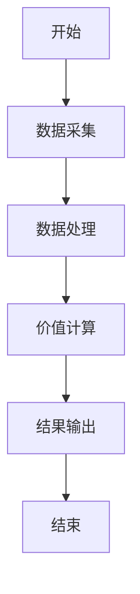
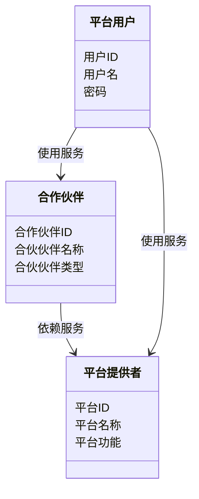
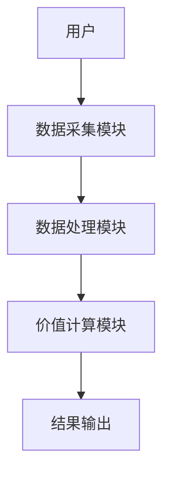
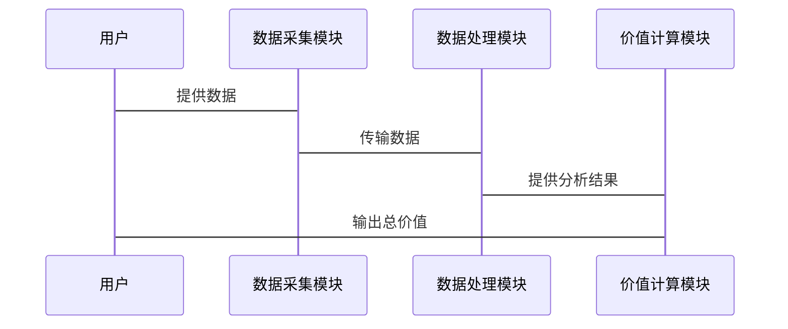

                 


好的，我将按照您的要求撰写《如何评估企业的平台战略价值》一文，我们先从文章的背景、核心概念、算法原理、系统分析与架构设计、项目实战等方面来展开。以下是完整的文章内容：

---

# 如何评估企业的平台战略价值

> **关键词**：企业平台战略、平台价值评估、战略价值、企业架构、系统设计

> **摘要**：  
本文将详细探讨如何评估企业的平台战略价值，从核心概念、算法原理、系统架构设计到项目实战，逐步分析并提供具体的实现方案。我们希望通过本文，帮助企业在数字化转型中更好地理解平台战略的重要性，并掌握评估和优化平台战略价值的方法。

---

## 第1章：企业平台战略价值评估背景

### 1.1 问题背景与描述

在数字化转型的浪潮中，企业平台战略的重要性日益凸显。平台战略不仅是企业实现业务创新和价值增长的关键手段，也是企业构建生态系统、提升竞争力的核心驱动力。然而，如何科学地评估平台战略的价值，仍然是许多企业在实践中面临的难题。

#### 1.1.1 平台战略的定义与核心要素

- **平台战略**：平台战略是指企业通过构建一个开放的平台，整合内外部资源，提供标准化的基础设施和工具，支持生态合作伙伴共同创造价值的一种战略模式。
- **核心要素**：平台战略的核心要素包括平台的开放性、生态系统构建能力、资源整合能力、用户参与度以及平台的可持续发展能力。

#### 1.1.2 企业平台战略的重要性

- 平台战略能够帮助企业实现业务模式的创新，降低运营成本，提升效率。
- 平台战略能够促进企业与生态合作伙伴的协同创新，形成多方共赢的生态系统。
- 平台战略能够增强企业的市场竞争力，为企业创造新的价值增长点。

#### 1.1.3 当前企业平台战略面临的挑战

- **技术挑战**：平台架构的设计与优化需要考虑高可用性、扩展性和安全性。
- **组织挑战**：平台战略的实施需要跨部门协作，组织结构和文化需要适应平台模式。
- **生态挑战**：平台生态的构建需要吸引足够多的合作伙伴，同时平衡各方利益。

### 1.2 平台战略与企业价值的关系

平台战略通过构建生态系统、整合资源、提升效率等方式，直接影响企业的核心竞争力和市场地位。以下是平台战略与企业价值关系的核心要点：

#### 1.2.1 平台战略对企业价值的影响

- 平台战略能够降低企业的边际成本，提升运营效率。
- 平台战略能够通过生态合作，扩大企业的市场影响力。
- 平台战略能够为企业创造新的收入来源，提升盈利能力。

#### 1.2.2 平台战略的边界与外延

- **边界**：平台战略的边界在于企业核心业务的数字化转型和生态系统的构建。
- **外延**：平台战略的外延包括技术、组织、生态等多个层面，涉及企业内外部的协同与合作。

#### 1.2.3 平台战略的核心要素组成

- **技术基础**：包括平台架构、数据存储、API接口等。
- **生态系统**：包括合作伙伴、用户、开发者等。
- **组织能力**：包括组织结构、文化、人才等。
- **商业模式**：包括收入模式、定价策略、价值传递等。

---

## 第2章：企业平台战略的核心概念与联系

### 2.1 平台战略的核心原理

#### 2.1.1 平台战略的理论基础

- **双边市场理论**：平台通过连接供需双方，降低交易成本，创造价值。
- **网络效应理论**：平台的价值随着用户数量的增加而指数级增长。

#### 2.1.2 平台战略的生态系统特征

- **开放性**：平台必须具备开放的接口和标准，吸引第三方开发者和合作伙伴。
- **可扩展性**：平台必须能够支持不同类型的业务和用户规模。
- **协同性**：平台需要支持生态合作伙伴之间的协同创新。

#### 2.1.3 平台战略与企业组织结构的关系

- 平台战略需要企业采用扁平化的组织结构，以支持快速的决策和协作。
- 平台战略需要企业在内部建立跨部门的协作机制，促进资源的共享与整合。

### 2.2 核心概念属性对比表格

以下是平台战略与其他相关概念的对比分析：

| 概念                | 定义                                                                 | 特性                     |
|---------------------|----------------------------------------------------------------------|--------------------------|
| 平台战略            | 通过构建开放平台，整合资源，支持生态系统建设                                   | 开放性、协同性、可扩展性 |
| 传统业务模式        | 通过内部资源整合，提供单一产品或服务                                           | 封闭性、单一性、固定性   |
| 企业创新            | 通过内部研发或外部合作，推动产品和服务的创新                                   | 创新性、灵活性、多样性   |
| 企业竞争优势        | 企业在市场中相对于竞争对手的核心优势                                         | 竞争力、差异化、可持续性 |

### 2.3 ER实体关系图架构

以下是平台战略与企业价值的实体关系图：

```mermaid
erDiagram
    actor 平台用户 {
        string 用户ID
        string 用户名
        string 密码
    }
    actor 合作伙伴 {
        string 合作伙伴ID
        string 合伙伙伴名称
        string 合伙伙伴类型
    }
    actor 平台提供者 {
        string 平台ID
        string 平台名称
        string 平台功能
    }
    平台用户 -|> 合作伙伴 : "使用合作伙伴的服务"
    合作伙伴 -|> 平台提供者 : "依赖平台提供者的服务"
    平台用户 -|> 平台提供者 : "使用平台提供的服务"
```

---

## 第3章：企业平台战略价值评估的算法原理

### 3.1 算法原理概述

平台战略价值评估的核心在于通过量化的方式，评估平台的经济价值、生态价值和战略价值。以下是算法的原理和流程：

#### 3.1.1 平台战略价值评估的基本原理

- **数据采集**：收集平台的用户数据、交易数据、合作伙伴数据等。
- **数据处理**：对数据进行清洗、整合和分析。
- **价值计算**：通过数学模型计算平台的经济价值和生态价值。

#### 3.1.2 平台战略价值评估的数学模型

以下是平台战略价值评估的数学模型：

$$ V = \alpha \cdot V_e + \beta \cdot V_e $$

其中：
- \( V \) 表示平台的总价值。
- \( V_e \) 表示平台的生态价值。
- \( V_m \) 表示平台的市场价值。
- \( \alpha \) 和 \( \beta \) 表示生态价值和市场价值的权重系数。

#### 3.1.3 平台战略价值评估的流程图



### 3.2 算法实现与代码

以下是平台战略价值评估的Python实现代码：

```python
import pandas as pd
import numpy as np

# 数据加载
data = pd.read_csv('platform_value.csv')

# 数据预处理
data = data.dropna()
data['value'] = data['value'].astype(float)

# 价值计算
alpha = 0.6
beta = 0.4
V_e = data['value'].mean()
V_m = data['market_value'].mean()
V = alpha * V_e + beta * V_m

print(f"平台总价值：{V}")
```

---

## 第4章：企业平台战略价值评估的系统分析与架构设计

### 4.1 问题场景介绍

平台战略价值评估的典型场景包括：

- **数据采集**：从企业内部系统和外部合作伙伴中获取数据。
- **数据处理**：清洗、整合和分析数据。
- **价值计算**：通过数学模型计算平台的总价值。

### 4.2 系统功能设计

以下是平台战略价值评估系统的功能模块和领域模型：

#### 4.2.1 功能模块

- 数据采集模块：负责采集平台的用户数据、交易数据和合作伙伴数据。
- 数据处理模块：对数据进行清洗、整合和分析。
- 价值计算模块：通过数学模型计算平台的总价值。

#### 4.2.2 领域模型



#### 4.2.3 系统架构图



### 4.3 系统接口设计

- **输入接口**：用户输入数据，如用户ID、合作伙伴ID等。
- **输出接口**：输出平台的总价值、生态价值和市场价值。

#### 4.3.3 交互流程图



---

## 第5章：企业平台战略价值评估的项目实战

### 5.1 项目环境安装与配置

- **系统环境要求**：需要安装Python、Pandas、NumPy等库。
- **工具安装**：使用pip安装所需的Python包。

### 5.2 项目核心实现

以下是平台战略价值评估的Python代码实现：

```python
import pandas as pd
import numpy as np

# 数据加载
data = pd.read_csv('platform_value.csv')

# 数据预处理
data = data.dropna()
data['value'] = data['value'].astype(float)

# 价值计算
alpha = 0.6
beta = 0.4
V_e = data['value'].mean()
V_m = data['market_value'].mean()
V = alpha * V_e + beta * V_m

print(f"平台总价值：{V}")
```

### 5.3 项目案例分析

以下是平台战略价值评估的实践案例：

- **案例背景**：某企业通过构建一个开放平台，吸引合作伙伴和用户，提升企业的市场影响力。
- **案例分析**：通过数据采集和分析，计算平台的总价值，并根据结果优化平台的运营策略。

---

## 第6章：总结与展望

### 6.1 本章总结

平台战略价值评估是企业在数字化转型中的一项重要工作。通过科学的评估方法和系统的实施，企业可以更好地理解平台战略的价值，并优化平台的运营策略。

### 6.2 未来展望

随着技术的发展和生态系统的不断完善，平台战略的价值评估将更加精准和智能化。未来，企业可以通过人工智能和大数据技术，进一步提升平台战略的价值评估能力。

---

**作者：AI天才研究院/AI Genius Institute & 禅与计算机程序设计艺术 /Zen And The Art of Computer Programming**

