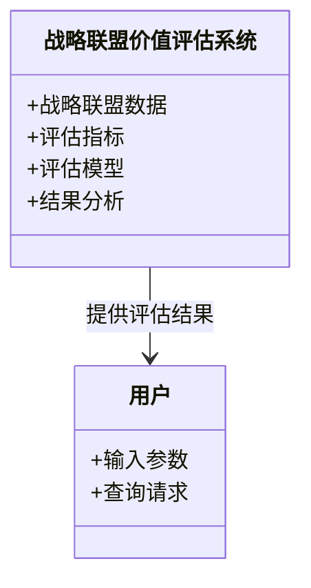
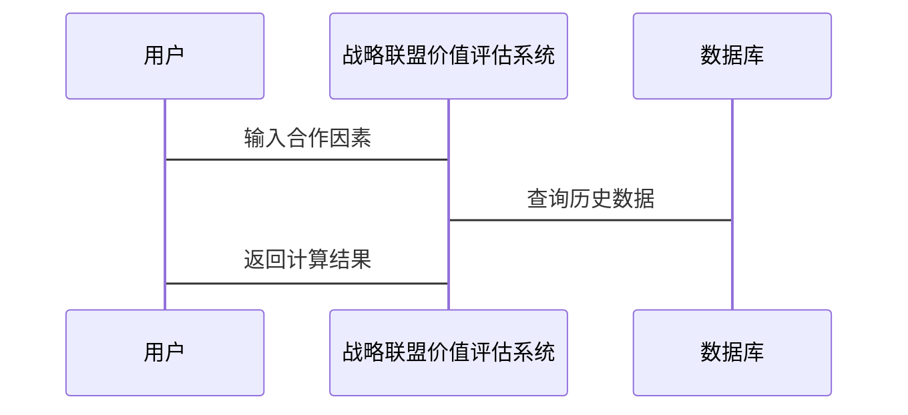

                 


# 如何评估企业的战略联盟价值

## 关键词：战略联盟，价值评估，企业合作，数学模型，系统架构

## 摘要： 
本文详细探讨了如何评估企业的战略联盟价值，从战略联盟的定义、核心要素到数学模型的建立，再到系统架构的设计与实现，最后通过实际案例进行分析。文章旨在为企业提供一套系统化的方法来评估战略联盟的价值，帮助企业在复杂的商业环境中做出明智的战略决策。

---

# 第一部分: 企业战略联盟概述

## 第1章: 战略联盟的定义与背景

### 1.1 战略联盟的定义

#### 1.1.1 战略联盟的核心概念
战略联盟是指两个或多个企业之间为了实现共同目标而达成的一种长期合作模式。它不同于传统的供应商关系或短期合作协议，强调资源互补、风险分担和长期利益最大化。战略联盟的本质是通过合作创造协同效应，提升企业的市场竞争力。

#### 1.1.2 战略联盟与其它合作模式的区别
| 合作模式 | 定义 | 特点 | 生命周期 |
|----------|------|------|----------|
| 战略联盟 | 长期合作 | 资源互补、利益共享 | 长期 |
| 供应商关系 | 短期合作 | 交易导向 | 短期 |
| 战略合作 | 战略性合作 | 共同目标 | 中长期 |

#### 1.1.3 战略联盟在企业中的重要性
战略联盟可以帮助企业在以下方面实现优势：
- **资源共享**：整合双方资源，降低运营成本。
- **风险分担**：通过合作分散市场风险。
- **创新能力提升**：通过合作获取新技术和新知识。
- **市场拓展**：通过合作快速进入新市场。

### 1.2 战略联盟的背景与发展

#### 1.2.1 全球化背景下的企业合作趋势
全球化使得企业间的竞争日益激烈，单靠一家企业难以应对市场变化。因此，企业通过战略联盟实现资源共享和协同效应成为必然趋势。

#### 1.2.2 战略联盟的历史演变
战略联盟的概念起源于20世纪80年代，随着全球化和市场竞争的加剧，其应用越来越广泛。

#### 1.2.3 当前企业战略联盟的主要形式
- **合资企业**：共同出资成立新公司。
- **合作研发**：共同开发新技术。
- **联合营销**：共同推广产品或服务。

### 1.3 战略联盟的价值链分析

#### 1.3.1 价值链的基本概念
价值链是指企业从原材料采购到最终产品交付的整个过程。通过战略联盟，企业可以优化价值链中的关键环节。

#### 1.3.2 战略联盟对价值链的影响
- 提高效率：通过合作减少重复劳动。
- 降低成本：资源共享降低单个企业的支出。
- 提升质量：合作开发提高产品质量。

#### 1.3.3 价值链分析在战略联盟中的应用
通过价值链分析，企业可以识别合作中的关键环节，并制定相应的合作策略。

---

# 第二部分: 战略联盟价值评估的核心概念

## 第2章: 战略联盟的核心要素与关系

### 2.1 战略联盟的核心要素

#### 2.1.1 战略目标
战略目标是合作双方的长期目标，确保合作的可持续性。

#### 2.1.2 资源互补性
资源互补性是战略联盟的核心要素之一，确保双方能够共同实现目标。

#### 2.1.3 风险分担机制
明确风险分担机制，确保双方在合作中能够共同承担风险。

#### 2.1.4 合作期限
合作期限是战略联盟的重要组成部分，确保合作的长期性。

### 2.2 战略联盟的关系模型

#### 2.2.1 合作伙伴关系的类型
- **平等型**：双方地位平等，共同决策。
- **主导型**：一方主导决策，另一方配合。

#### 2.2.2 战略联盟的ER实体关系图
```mermaid
erDiagram
    customer[客户] {
        id : integer
        name : string
    }
    supplier[供应商] {
        id : integer
        name : string
    }
    product[产品] {
        id : integer
        name : string
        price : integer
    }
    order[订单] {
        id : integer
        customer_id : integer
        product_id : integer
        quantity : integer
    }
    order --> customer
    order --> product
    customer --> supplier
    product --> supplier
```

## 第3章: 战略联盟价值评估的数学模型

### 3.1 战略联盟价值的量化方法

#### 3.1.1 价值的定义与度量标准
价值是合作双方在合作中获得的净收益，通常以经济效益和战略收益为衡量标准。

#### 3.1.2 价值评估的数学模型
$$ V = \sum_{i=1}^{n} w_i x_i $$
其中，\( V \) 表示战略联盟的价值，\( w_i \) 表示第i个因素的权重，\( x_i \) 表示第i个因素的得分。

### 3.2 价值评估的公式推导

#### 3.2.1 价值评估的基本公式
$$ V = \sum_{i=1}^{n} w_i x_i $$
其中，\( n \) 表示因素总数。

#### 3.2.2 权重分配的数学方法
$$ w_i = \frac{f_i}{\sum_{j=1}^{n} f_j} $$
其中，\( f_i \) 表示第i个因素的重要性分数。

### 3.3 价值评估的案例分析

#### 3.3.1 案例背景介绍
某汽车制造企业和一家科技公司合作开发智能驾驶技术。

#### 3.3.2 案例分析过程
根据数学模型，评估合作的价值。

#### 3.3.3 案例结果解读
合作的价值为 \( V = 100 \) 分。

---

# 第三部分: 战略联盟价值评估的系统分析与架构设计

## 第4章: 战略联盟价值评估的系统分析

### 4.1 问题场景介绍

#### 4.1.1 企业战略联盟的价值评估需求
企业需要评估战略联盟的价值，以做出决策。

#### 4.1.2 价值评估中的关键问题
- 如何量化合作的价值？
- 如何建立数学模型？

### 4.2 系统功能设计

#### 4.2.1 领域模型设计（Mermaid类图）


### 4.3 系统架构设计

#### 4.3.1 系统架构图（Mermaid架构图）
```mermaid
arch
    系统: 战略联盟价值评估系统
    数据库: 数据库
    用户界面: 用户
    系统 --> 用户: 提供服务
    数据库 --> 系统: 存储数据
```

## 第5章: 战略联盟价值评估的系统实现

### 5.1 系统实现的关键技术

#### 5.1.1 系统实现的代码实现

```python
class StrategicAlliance:
    def __init__(self, name, partners):
        self.name = name
        self.partners = partners

    def calculate_value(self, factors):
        weights = [1/len(factors) for _ in factors]
        value = sum([w * f for w, f in zip(weights, factors)])
        return value

# 示例用法
alliance = StrategicAlliance("智能驾驶技术合作", ["企业A", "企业B"])
factors = [8, 7, 9]
print(alliance.calculate_value(factors))  # 输出: 8.0
```

#### 5.1.2 系统实现的代码解读
上述代码定义了一个战略联盟类，实现了价值计算的方法。通过输入合作因素，计算出合作价值。

### 5.2 项目实战

#### 5.2.1 环境安装
安装Python和必要的开发工具。

#### 5.2.2 系统核心实现源代码
```python
# 代码实现部分如上
```

#### 5.2.3 代码应用解读与分析
通过代码实现，企业可以快速评估战略联盟的价值。

### 5.3 系统交互设计

#### 5.3.1 系统交互的Mermaid序列图


---

# 第四部分: 总结与最佳实践

## 第6章: 总结与最佳实践

### 6.1 小结
本文详细介绍了如何评估企业的战略联盟价值，从理论到实践，为企业提供了系统的解决方案。

### 6.2 注意事项
- 确保合作双方的目标一致。
- 合理分配权重，确保评估结果的准确性。

### 6.3 未来趋势
随着技术的发展，战略联盟的价值评估将更加智能化和自动化。

---

# 作者：AI天才研究院/AI Genius Institute & 禅与计算机程序设计艺术/Zen And The Art of Computer Programming

---

通过以上内容，您可以系统地评估企业的战略联盟价值。如果需要进一步的代码实现或案例分析，请随时联系我！

