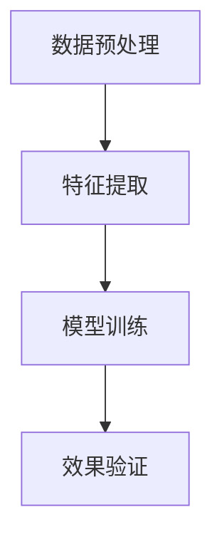
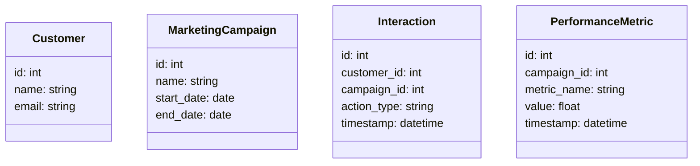
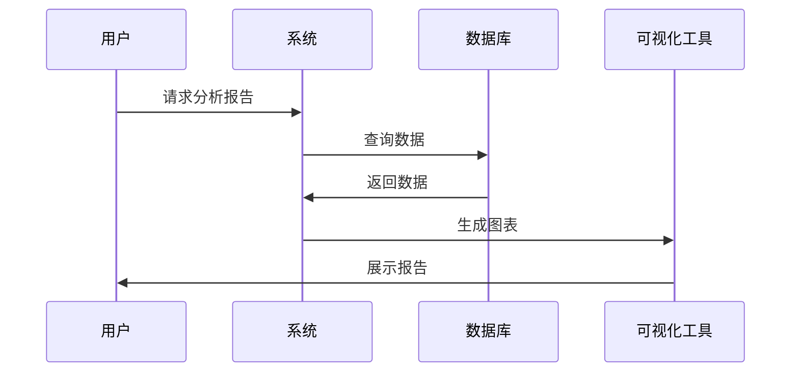

                 


# 如何评估企业的数字化营销效果

## 关键词：数字化营销、效果评估、数据分析、营销ROI、用户行为分析、A/B测试、数据可视化

## 摘要：  
在数字化营销时代，企业需要通过科学的方法评估营销活动的效果，以优化资源配置和提升投资回报率。本文从数字化营销的基本概念出发，分析了效果评估的核心指标、数据分析方法和工具，结合实际案例，详细讲解了评估模型的算法原理和数学模型，探讨了系统架构设计，并给出了项目实战和最佳实践建议。

---

## 正文

### 第一部分: 数字化营销效果评估的背景与核心概念

#### 第1章: 数字化营销效果评估的背景与意义

##### 1.1 数字化营销的定义与特点
- **1.1.1 数字化营销的核心概念**
  - 数字化营销是指通过数字技术（如网站、社交媒体、电子邮件等）进行产品推广、客户互动和销售的过程。
  - 其特点包括精准定位、数据驱动、实时互动和可衡量性。

- **1.1.2 数字化营销与传统营销的区别**
  - 传统营销依赖于广播式推广，而数字化营销注重个性化和精准定位。
  - 数字化营销可以通过数据追踪实时调整策略，而传统营销调整周期较长。

- **1.1.3 数字化营销的典型应用场景**
  - 在线广告投放、社交媒体推广、电子邮件营销、搜索引擎优化（SEO）、内容营销等。

##### 1.2 数字化营销效果评估的必要性
- **1.2.1 企业数字化转型的现状**
  - 当前，企业纷纷数字化转型，营销活动也逐渐从线下转移到线上。
  - 数字化营销已成为企业获取客户和提升竞争力的重要手段。

- **1.2.2 数字化营销对企业的价值**
  - 提高客户触达率和转化率。
  - 降低营销成本，优化资源配置。
  - 实现精准营销，提升客户满意度。

- **1.2.3 评估效果对企业决策的重要性**
  - 通过评估效果，企业可以了解哪些营销活动有效，哪些需要调整。
  - 优化营销策略，提升投资回报率（ROI）。

##### 1.3 数字化营销效果评估的挑战
- **1.3.1 数据获取的难度**
  - 数据分散在不同渠道，难以整合和分析。
  - 数据质量参差不齐，影响评估结果。

- **1.3.2 数据分析的复杂性**
  - 需要处理大量数据，分析方法复杂。
  - 数据维度多，难以找到关键影响因素。

- **1.3.3 效果评估的主观性**
  - 不同企业对效果的定义不同，评估标准可能存在偏差。
  - 一些间接效果（如品牌影响力提升）难以量化。

##### 1.4 本章小结
- 本章介绍了数字化营销的定义、特点及其应用场景，分析了评估效果的必要性和挑战，为后续章节的深入分析奠定了基础。

---

#### 第2章: 数字化营销效果评估的核心概念

##### 2.1 关键指标与评估维度
- **2.1.1 流量指标（PV、UV、IP）**
  - 页面浏览量（PV）：用户访问页面的次数。
  - 用户唯一识别（UV）：访问页面的独立用户数量。
  - 网络接口协议（IP）：访问来源的IP地址数量。

- **2.1.2 转化指标（转化率、点击率）**
  - 转化率：完成目标行为（如购买、注册）的用户比例。
  - 点击率（CTR）：广告或链接被点击的比例。

- **2.1.3 用户行为指标（跳出率、停留时间）**
  - 跳出率：用户访问页面后立即离开的比例。
  - 停留时间：用户在页面上的平均停留时间。

- **2.1.4 营销活动 ROI 计算**
  - ROI = (营销收入 - 营销成本) / 营销成本 × 100%

##### 2.2 数据分析方法与工具
- **2.2.1 数据可视化工具（Tableau、Power BI）**
  - Tableau：强大的数据可视化工具，支持多种数据源和交互式分析。
  - Power BI：微软的商业智能工具，支持数据建模和高级分析。

- **2.2.2 数据挖掘技术（聚类、回归分析）**
  - 聚类分析：将用户行为数据分为不同类别，识别潜在客户群体。
  - 回归分析：预测营销活动对销售的影响，优化资源配置。

- **2.2.3 A/B 测试与实验设计**
  - A/B 测试：将用户分成实验组和对照组，测试不同策略的效果差异。
  - 实验设计：设计合理的实验方案，确保数据的科学性和可比性。

##### 2.3 核心概念的 ER 实体关系图
```mermaid
er
    Customer: id, name, email
    Marketing Campaign: id, name, start_date, end_date
    Interaction: id, customer_id, campaign_id, action_type, timestamp
    Performance Metric: id, campaign_id, metric_name, value, timestamp
```

##### 2.4 核心概念对比分析表
| 指标类型 | 定义 | 计算公式 | 示例场景 |
|----------|------|----------|----------|
| 流量指标 | 页面浏览量 | PV = 页面访问次数 | 网站页面 PV 达到 10,000 次 |
| 转化指标 | 转化率 | 转化率 = 转化次数 / 总访问次数 | 广告点击率CTR=2.5%，转化率=1.2% |
| 用户行为指标 | 跳出率 | 跳出率 = 跳出次数 / PV | 首页跳出率为30% |
| 营销活动 ROI 计算 | ROI = (收入 - 成本) / 成本 × 100% | 营销活动 ROI 为15% |

---

### 第二部分: 算法原理与数学模型

#### 第3章: 评估模型的算法原理

##### 3.1 评估模型概述
- 数字化营销效果评估模型通常包括数据预处理、特征提取、模型训练和效果验证四个阶段。

##### 3.2 算法实现步骤


##### 3.3 评估模型的数学模型
- 使用线性回归模型预测营销活动的 ROI：
  $$ ROI = \beta_0 + \beta_1 \times 营销支出 + \beta_2 \times 用户点击率 + \epsilon $$
  - $\beta_0$：截距项
  - $\beta_1$ 和 $\beta_2$：回归系数，表示各自变量对 ROI 的影响程度
  - $\epsilon$：误差项

##### 3.4 核心代码实现
```python
import pandas as pd
import numpy as np
from sklearn.linear_model import LinearRegression
from sklearn.metrics import mean_squared_error

# 数据加载与预处理
data = pd.read_csv('marketing.csv')
X = data[['营销支出', '用户点击率']]
y = data['ROI']

# 模型训练
model = LinearRegression()
model.fit(X, y)

# 预测与评估
y_pred = model.predict(X)
 mse = mean_squared_error(y, y_pred)
 print('均方误差:', mse)
```

---

#### 第4章: 数学模型的深入分析

##### 4.1 回归分析模型
- 使用多元线性回归分析不同变量对 ROI 的影响：
  $$ ROI = \beta_0 + \beta_1 \times PV + \beta_2 \times CTR + \beta_3 \times 跳出率 + \epsilon $$

##### 4.2 模型的验证与优化
- 通过交叉验证评估模型的泛化能力。
- 使用正则化方法（如 Lasso 回归）优化模型，防止过拟合。

---

### 第三部分: 系统分析与架构设计

#### 第5章: 系统架构设计

##### 5.1 系统功能需求
- 数据采集：从不同渠道获取用户行为数据。
- 数据存储：使用数据库存储结构化数据。
- 数据分析：利用工具进行数据清洗和建模。
- 可视化展示：生成图表和报告，供决策者参考。

##### 5.2 系统功能设计（领域模型）


##### 5.3 系统架构设计（分层架构）


##### 5.4 系统接口设计
- API 接口：RESTful API 提供数据查询和分析结果。
- 数据接口：与第三方数据源（如 Google Analytics）对接。

##### 5.5 系统交互设计（序列图）


---

### 第四部分: 项目实战

#### 第6章: 实战分析与代码实现

##### 6.1 环境安装
- 安装 Python 和必要的库（如 pandas、numpy、scikit-learn、matplotlib）。

##### 6.2 核心代码实现
```python
import pandas as pd
import numpy as np
from sklearn.linear_model import LinearRegression
from sklearn.metrics import r2_score

# 数据加载
data = pd.read_csv('marketing.csv')

# 数据预处理
X = data[['广告支出', '用户点击率']]
y = data['ROI']

# 模型训练
model = LinearRegression()
model.fit(X, y)

# 预测与评估
y_pred = model.predict(X)
print('R² 分数:', r2_score(y, y_pred))
```

##### 6.3 案例分析
- 案例背景：某公司开展线上广告投放，希望通过评估广告效果优化预算分配。
- 数据分析：通过回归分析发现，广告支出和用户点击率是 ROI 的主要影响因素。
- 优化建议：增加广告支出，同时提升用户点击率。

##### 6.4 项目小结
- 本章通过实际案例展示了如何使用回归分析评估营销活动效果，并给出了优化建议。

---

### 第五部分: 最佳实践与总结

#### 第7章: 最佳实践与总结

##### 7.1 最佳实践
- **数据清洗**：确保数据质量，处理缺失值和异常值。
- **模型选择**：根据数据特点选择合适的算法，避免过度复杂。
- **持续优化**：定期评估模型效果，根据反馈调整策略。

##### 7.2 小结
- 本文从数字化营销的背景出发，详细讲解了效果评估的核心概念、算法原理和系统架构设计，并通过实战案例展示了如何应用这些方法优化营销策略。

##### 7.3 注意事项
- 数据隐私和安全问题需高度重视。
- 模型评估需结合业务场景，避免过度依赖技术指标。

##### 7.4 拓展阅读
- 建议阅读《Data Analytics Made Accessible》和《Python Machine Learning》深入学习数据分析和机器学习技术。

---

## 作者：AI天才研究院/AI Genius Institute & 禅与计算机程序设计艺术 /Zen And The Art of Computer Programming

---

以上是关于《如何评估企业的数字化营销效果》的完整目录和内容概要，您可以根据需要进一步扩展和详细阐述每个部分的内容。

