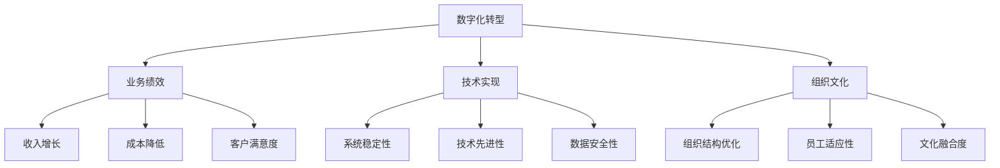

                 

# 如何评估企业的数字化转型成效

> 关键词：数字化转型评估、KPI、评估框架、业务绩效、技术实现、组织文化、数字化转型

> 摘要：  
数字化转型是企业适应新时代商业环境的关键战略，而评估其成效则是确保转型成功的重要环节。本文从数字化转型的背景与核心概念出发，详细探讨了如何构建评估模型、选择评估方法，并通过实际案例分析，为企业提供一套系统化的评估框架。文章内容涵盖评估背景、核心概念、模型设计、方法论、工具与技术、最佳实践以及总结与展望，旨在为企业提供全面且实用的评估策略。

---

# 第一部分: 数字化转型评估背景与核心概念

---

# 第1章: 数字化转型评估的背景与重要性

## 1.1 数字化转型的定义与内涵

### 1.1.1 数字化转型的基本概念  
数字化转型（Digital Transformation）是指企业利用数字技术（如大数据、人工智能、云计算、物联网等）对业务模式、流程、组织架构和文化进行全面变革的过程，旨在提升企业的竞争力和适应性。数字化转型不仅仅是技术的更新，更是对商业模式和业务流程的根本性重构。

### 1.1.2 数字化转型的核心特征  
- **数据驱动**：以数据为决策依据，而非传统经验驱动。  
- **技术赋能**：通过技术创新提升业务效率和客户体验。  
- **敏捷迭代**：快速响应市场变化，持续优化业务流程。  
- **组织变革**：从传统层级制向扁平化、协作型组织转变。  

### 1.1.3 数字化转型与企业发展的关系  
数字化转型是企业适应数字时代的核心战略，它不仅能够提高企业的运营效率，还能通过创新为客户提供更优质的服务，从而在激烈的市场竞争中占据优势。

---

## 1.2 数字化转型评估的必要性

### 1.2.1 企业数字化转型的现状分析  
当前，许多企业在数字化转型过程中面临以下问题：  
- **目标不明确**：转型目标模糊，缺乏清晰的路径规划。  
- **资源分配不合理**：技术、资金、人才等资源分配不当。  
- **文化阻碍**：传统组织文化与数字化转型的要求存在冲突。  
- **技术选型错误**：技术选型缺乏科学评估，导致项目失败。  

### 1.2.2 评估数字化转型的重要性  
评估数字化转型成效是确保转型成功的关键环节，具体包括以下几点：  
- **验证转型成果**：通过评估确认数字化转型是否达到了预期目标。  
- **发现问题并优化**：及时发现转型过程中存在的问题，并进行针对性优化。  
- **制定下一步战略**：基于评估结果制定下一阶段的转型计划。  

### 1.2.3 评估数字化转型的常见误区  
- **忽视业务价值**：过于关注技术实现而忽略业务价值的提升。  
- **指标选择不当**：评估指标与企业实际需求脱节。  
- **缺乏长期视角**：只关注短期效果而忽视长期价值。  

---

## 1.3 本章小结  
本章从数字化转型的定义、特征及其与企业发展的关系入手，强调了评估数字化转型的重要性和必要性，为后续章节的深入分析奠定了基础。

---

# 第2章: 数字化转型评估的核心概念

## 2.1 数字化转型评估的关键指标

### 2.1.1 业务绩效指标  
- **收入增长**：数字化转型是否带来了收入的提升。  
- **成本降低**：是否通过数字化手段实现了成本优化。  
- **客户满意度**：客户对数字化服务的满意度如何。  

### 2.1.2 技术实现指标  
- **系统稳定性**：数字化系统的运行是否稳定。  
- **技术先进性**：所采用的技术是否处于行业领先水平。  
- **数据安全性**：数据在存储和传输过程中是否安全。  

### 2.1.3 组织与文化指标  
- **组织结构优化**：组织架构是否更加扁平化和协作化。  
- **员工适应性**：员工是否适应了数字化转型带来的变化。  
- **文化融合度**：企业文化和数字化转型理念是否深度融合。  

---

## 2.2 数字化转型评估的框架体系

### 2.2.1 评估框架的设计原则  
- **全面性**：覆盖业务、技术和组织的各个方面。  
- **可操作性**：评估指标应具有可测量性和可操作性。  
- **动态性**：框架应能够根据企业实际情况进行调整。  

### 2.2.2 评估框架的组成要素  
- **目标设定**：明确数字化转型的目标和关键成功因素（KPI）。  
- **指标选择**：根据目标选择合适的评估指标。  
- **数据采集**：通过问卷调查、数据分析等方式获取数据。  
- **评估分析**：对数据进行分析并得出结论。  
- **优化建议**：根据评估结果提出改进建议。  

### 2.2.3 评估框架的适用范围  
- 适用于不同行业、不同规模的企业。  
- 可根据企业的具体情况灵活调整。  

---

## 2.3 核心概念与联系

### 2.3.1 核心概念原理  
数字化转型评估的核心在于通过科学的指标体系和框架，全面衡量数字化转型的成效。通过分析业务、技术和组织的多个维度，帮助企业发现问题并优化转型策略。

### 2.3.2 概念属性特征对比表格  
| 概念         | 属性1：可量化 | 属性2：可操作性 | 属性3：动态性 |
|--------------|---------------|------------------|--------------|
| 业务绩效指标 | 是            | 是               | 是           |
| 技术实现指标 | 是            | 是               | 是           |
| 组织文化指标 | 部分          | 部分             | 是           |

---

### 2.3.3 ER实体关系图  

---

## 2.4 本章小结  
本章从数字化转型评估的关键指标和框架体系入手，详细分析了核心概念及其相互关系，为后续章节的模型设计和方法论提供了理论基础。

---

# 第3章: 数字化转型评估模型的设计与实现

## 3.1 评估模型的设计原则

### 3.1.1 模型设计的目标  
- **科学性**：模型应基于理论和实践，具有科学性。  
- **实用性**：模型应能够为企业提供实际指导。  
- **可扩展性**：模型应能够根据企业需求进行扩展和调整。  

---

## 3.2 评估模型的构建过程

### 3.2.1 指标的选择与权重分配  
- **指标选择**：根据企业实际情况选择关键指标。  
- **权重分配**：根据指标的重要性赋予不同的权重。  

### 3.2.2 数据的收集与处理  
- **数据来源**：包括企业内部数据、客户反馈、行业报告等。  
- **数据清洗**：对数据进行清洗和预处理，确保数据的准确性。  

### 3.2.3 模型的验证与优化  
- **验证方法**：通过实际数据验证模型的有效性。  
- **优化调整**：根据验证结果对模型进行优化和调整。  

---

## 3.3 评估模型的实现方法

### 3.3.1 基于KPI的评估方法  
- **KPI选择**：选择与企业目标相关的KPI。  
- **数据收集**：收集相关数据并进行分析。  
- **结果呈现**：通过图表等方式展示评估结果。  

### 3.3.2 基于层次分析法的评估方法  
- **层次分析法（AHP）**：通过权重分配和层次结构分析，确定各指标的重要性。  
- **计算步骤**：  
  1. 构建层次结构模型。  
  2. 确定各层次的权重。  
  3. 计算综合得分。  

### 3.3.3 基于机器学习的评估方法  
- **机器学习模型**：利用机器学习算法对数据进行分析，预测数字化转型的成效。  
- **数学模型**：如线性回归、随机森林等。  

---

## 3.4 本章小结  
本章详细介绍了数字化转型评估模型的设计原则和构建过程，并探讨了基于KPI、层次分析法和机器学习的三种实现方法。

---

# 第4章: 数字化转型评估的方法论

## 4.1 评估方法的分类与选择

### 4.1.1 定性评估方法  
- **案例分析法**：通过分析实际案例，总结经验教训。  
- **专家访谈法**：通过与专家交流，获取专业意见。  

### 4.1.2 定量评估方法  
- **数据分析法**：通过统计分析数据，得出结论。  
- **问卷调查法**：通过问卷调查收集数据，进行分析。  

### 4.1.3 综合评估方法  
- **定性与定量结合**：综合运用定性与定量方法，全面评估数字化转型成效。  

---

## 4.2 评估方法的实施步骤

### 4.2.1 确定评估目标  
- 明确评估的目的和范围。  

### 4.2.2 设计评估方案  
- 根据目标选择合适的评估方法和工具。  

### 4.2.3 实施评估  
- 收集数据、分析数据并得出结论。  

### 4.2.4 输出评估报告  
- 将评估结果整理成报告，提出改进建议。  

---

## 4.3 本章小结  
本章从评估方法的分类与选择入手，详细探讨了数字化转型评估的实施步骤，为企业提供了全面的评估方法论。

---

# 第5章: 数字化转型评估的工具与技术

## 5.1 评估工具的选择

### 5.1.1 数据采集工具  
- **问卷星**：用于收集问卷数据。  
- **CRM系统**：用于收集客户数据。  

### 5.1.2 数据分析工具  
- **Excel**：基础的数据分析工具。  
- **Python**：高级数据分析工具，支持机器学习。  
- **SPSS**：专业的统计分析工具。  

---

## 5.2 数据分析与可视化技术

### 5.2.1 数据分析方法  
- **描述性分析**：对数据进行基本的统计分析。  
- **预测性分析**：利用机器学习模型预测未来趋势。  

### 5.2.2 数据可视化技术  
- **图表类型**：如柱状图、折线图、饼图等。  
- **可视化工具**：如Tableau、Power BI等。  

---

## 5.3 数字化转型评估的算法实现

### 5.3.1 基于KPI的评估算法  
- **计算步骤**：  
  1. 确定KPI权重。  
  2. 收集相关数据。  
  3. 计算综合得分。  

### 5.3.2 基于层次分析法的评估算法  
- **计算步骤**：  
  1. 构建层次结构模型。  
  2. 确定各层次的权重。  
  3. 计算综合得分。  

### 5.3.3 基于机器学习的评估算法  
- **算法选择**：如线性回归、随机森林等。  
- **计算步骤**：  
  1. 数据预处理。  
  2. 模型训练。  
  3. 模型验证。  
  4. 输出结果。  

---

## 5.4 本章小结  
本章从工具与技术的角度，详细介绍了数字化转型评估的实现方法，为企业提供了技术层面的支持。

---

# 第6章: 数字化转型评估的最佳实践与案例分析

## 6.1 最佳实践

### 6.1.1 明确评估目标  
- 在评估之前，明确目标和范围。  

### 6.1.2 选择合适的评估方法  
- 根据实际情况选择定性或定量评估方法。  

### 6.1.3 建立反馈机制  
- 定期评估并根据结果优化转型策略。  

---

## 6.2 案例分析

### 6.2.1 某制造企业的数字化转型评估  
- **背景**：某制造企业希望通过数字化转型提高生产效率。  
- **评估方法**：采用KPI评估法，重点分析生产效率、成本降低和客户满意度。  
- **评估结果**：生产效率提高了15%，成本降低了10%，客户满意度提升了20%。  

### 6.2.2 某零售企业的数字化转型评估  
- **背景**：某零售企业希望通过数字化转型提升客户体验。  
- **评估方法**：采用层次分析法，重点分析客户满意度、线上销售额和客户留存率。  
- **评估结果**：客户满意度提升了25%，线上销售额增长了30%，客户留存率提高了15%。  

---

## 6.3 本章小结  
本章通过实际案例分析，展示了数字化转型评估的最佳实践，为企业提供了可借鉴的经验。

---

# 第7章: 数字化转型评估的总结与未来展望

## 7.1 本章总结

### 7.1.1 数字化转型评估的核心要点  
- 明确评估目标。  
- 选择合适的评估方法。  
- 建立反馈机制。  

### 7.1.2 数字化转型评估的意义  
- 通过评估验证转型成果。  
- 发现问题并优化转型策略。  
- 制定下一步转型计划。  

---

## 7.2 未来展望

### 7.2.1 技术发展对评估的影响  
- 随着人工智能和大数据技术的进一步发展，数字化转型评估将更加智能化和自动化。  

### 7.2.2 评估方法的创新  
- 更多新兴评估方法的出现，将为企业提供更全面的评估视角。  

### 7.2.3 行业发展趋势  
- 数字化转型评估将从企业内部驱动转向行业协同。  

---

## 7.3 本章小结  
本章总结了数字化转型评估的核心要点和意义，并展望了未来的发展趋势，为企业提供了长期的指导意义。

---

# 作者：AI天才研究院/AI Genius Institute & 禅与计算机程序设计艺术 /Zen And The Art of Computer Programming

