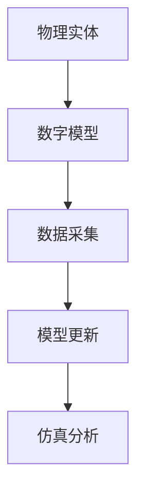
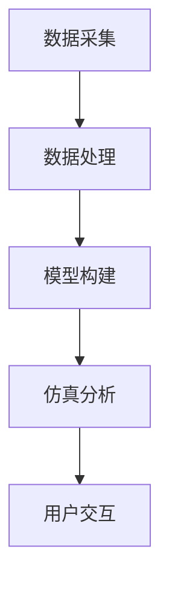

                 

# 如何评估企业的数字孪生技术应用

## 关键词：数字孪生、企业评估、技术应用、系统架构、仿真分析、数据建模、算法优化

## 摘要：  
数字孪生技术作为一种创新的数字化技术，正在被广泛应用于各个行业。本文将从数字孪生的基本概念出发，分析其核心技术和应用领域，详细探讨数字孪生技术在企业中的评估方法，包括模型准确性、数据更新频率、仿真预测精度等关键指标。同时，本文将结合实际项目案例，介绍数字孪生系统的架构设计和实现过程，帮助企业更好地理解和应用数字孪生技术。

---

# 第1章: 数字孪生技术概述

## 1.1 数字孪生的定义与背景

### 1.1.1 数字孪生的定义  
数字孪生（Digital Twin）是指通过数字化技术，将物理世界中的实体或系统映射到数字世界中，形成一个实时动态更新的虚拟模型。这种技术能够实现物理世界与数字世界的双向交互和同步。

### 1.1.2 数字孪生的发展背景  
随着物联网、大数据、人工智能等技术的快速发展，数字孪生技术逐渐成熟，并在制造业、城市管理、医疗健康等领域得到广泛应用。企业希望通过数字孪生技术实现对物理系统的实时监控、预测维护和优化管理。

### 1.1.3 数字孪生的核心特点  
- **实时性**：数字孪生模型能够实时反映物理系统的状态。  
- **动态性**：模型会根据物理系统的动态变化进行更新。  
- **交互性**：数字孪生支持用户与模型之间的交互操作。  
- **预测性**：通过仿真和分析，数字孪生可以预测物理系统的未来状态。

## 1.2 数字孪生的关键技术

### 1.2.1 数据采集与建模技术  
数据采集是数字孪生的基础，通过传感器、摄像头等设备获取物理系统的实时数据，并将其转化为数字模型。

### 1.2.2 数据融合与分析技术  
数据融合技术将来自不同来源的数据进行整合，消除冗余和冲突，提高数据的准确性和一致性。数据分析技术则通过对数据的处理和挖掘，提取有价值的信息。

### 1.2.3 仿真与预测技术  
仿真技术通过建立数学模型，模拟物理系统的运行过程，预测其未来状态。预测技术则基于历史数据和模型，提供更精准的预测结果。

## 1.3 数字孪生的应用领域

### 1.3.1 制造业中的数字孪生  
在制造业中，数字孪生可以用于设备维护、生产优化、质量控制等领域。通过数字孪生模型，企业可以实时监控设备状态，预测故障发生，从而减少停机时间。

### 1.3.2 城市规划与管理中的数字孪生  
数字孪生技术可以帮助城市规划者建立城市的数字模型，用于交通管理、资源分配、应急响应等场景。例如，通过数字孪生模型可以模拟交通流量，优化道路设计。

### 1.3.3 智慧交通中的数字孪生  
在智慧交通领域，数字孪生可以用于实时监控交通状况，预测交通拥堵，优化信号灯控制。通过数字孪生模型，可以实现对整个交通系统的智能化管理。

## 1.4 数字孪生的挑战与机遇

### 1.4.1 技术挑战  
- 数据量大：数字孪生需要处理海量数据，对计算能力和存储空间要求高。  
- 数据实时性：实时更新数据需要高效的通信和计算能力。  
- 模型复杂性：复杂的物理系统需要高度精细的数字模型，建模难度大。  

### 1.4.2 应用中的机遇  
- 提高效率：数字孪生可以帮助企业实现智能化管理，提高生产效率。  
- 降低成本：通过预测维护和优化操作，减少资源浪费，降低成本。  
- 创新应用：数字孪生为企业的创新提供了新的可能性，例如虚拟试错、数字化营销等。  

### 1.4.3 未来发展趋势  
- 技术融合：数字孪生将与人工智能、大数据、区块链等技术深度融合，形成更强大的数字化解决方案。  
- 行业扩展：数字孪生技术将从制造业扩展到更多领域，例如医疗、能源、农业等。  
- 标准化建设：数字孪生的标准化将逐步完善，推动技术的普及和应用。

## 1.5 本章小结  
本章介绍了数字孪生的基本概念、关键技术、应用领域以及面临的挑战和机遇。数字孪生技术作为数字化转型的重要工具，正在改变企业的管理和运营方式。

---

# 第2章: 数字孪生技术的核心概念与联系

## 2.1 数字孪生的核心概念

### 2.1.1 物理实体与数字模型的关系  
物理实体是现实世界中的物体或系统，数字模型是其在数字世界中的镜像。两者通过数据流实现实时互动，数字模型反映物理实体的状态和行为。

### 2.1.2 数据流与模型更新的机制  
数据流是连接物理实体和数字模型的桥梁，传感器等设备将物理实体的状态数据传输到数字模型，数字模型通过数据处理和分析，反向影响物理实体。

### 2.1.3 仿真与预测的逻辑  
仿真是通过数字模型模拟物理系统的运行过程，预测则是基于仿真结果，推断物理系统的未来状态。仿真和预测为决策提供了科学依据。

## 2.2 数字孪生的核心要素

### 2.2.1 数据采集系统  
数据采集系统负责从物理实体中获取实时数据，包括温度、压力、位置等。常见的数据采集设备有传感器、摄像头、RFID标签等。

### 2.2.2 数字模型构建  
数字模型是物理实体的数字化表示，可以通过CAD建模、参数化建模等方法构建。数字模型需要包含物理实体的几何结构、材料属性、功能逻辑等信息。

### 2.2.3 仿真与分析工具  
仿真与分析工具用于对数字模型进行模拟和分析，例如有限元分析、流体动力学仿真等。这些工具可以帮助企业优化设计、预测性能。

## 2.3 数字孪生的实体关系图

## 2.4 本章小结  
本章详细讲解了数字孪生的核心概念和核心要素，并通过实体关系图展示了数字孪生系统的整体架构。数字孪生的核心在于物理实体与数字模型的实时互动。

---

# 第3章: 数字孪生技术的评估方法

## 3.1 数字孪生评估的核心指标

### 3.1.1 模型准确性  
模型准确性是指数字模型与物理实体的相似程度。准确的模型能够更真实地反映物理系统的状态和行为。

### 3.1.2 数据更新频率  
数据更新频率是指数字模型中数据的实时更新速度。高频率的数据更新可以提高模型的实时性和准确性。

### 3.1.3 仿真预测精度  
仿真预测精度是指数字模型预测结果与实际物理系统结果的吻合程度。高精度的预测可以为决策提供更可靠的依据。

## 3.2 数字孪生评估的步骤

### 3.2.1 明确评估目标  
评估目标是评估的核心，需要根据企业的实际需求确定。例如，评估目标可能是优化设备维护效率或提高生产效率。

### 3.2.2 选择评估指标  
根据评估目标选择合适的指标，例如模型准确性、数据更新频率、仿真预测精度等。

### 3.2.3 收集与分析数据  
通过实验或实际运行数据，收集数字孪生系统的各项指标数据，并进行统计分析和对比。

### 3.2.4 评估结果与优化  
根据评估结果，发现问题并提出优化建议，例如优化模型参数、改进数据采集方式等。

## 3.3 数字孪生评估的数学模型

### 3.3.1 数据融合模型  
数据融合模型用于将多源数据进行整合，消除冗余和冲突，提高数据质量。常见的数据融合方法包括加权融合、概率融合等。

$$ y = \sum_{i=1}^{n} w_i x_i $$

其中，$y$ 是融合后的结果，$w_i$ 是第 $i$ 个数据的权重，$x_i$ 是第 $i$ 个数据。

### 3.3.2 仿真预测模型  
仿真预测模型通过建立数学模型，模拟物理系统的运行过程，预测其未来状态。常用的仿真方法包括蒙特卡罗模拟、有限元分析等。

$$ P(y|x) = \prod_{i=1}^{m} P(y_i|x_i) $$

其中，$P(y|x)$ 是在条件 $x$ 下的概率分布，$y_i$ 和 $x_i$ 是对应的变量。

## 3.4 本章小结  
本章介绍了数字孪生技术的评估方法，包括核心指标、评估步骤以及数学模型。通过科学的评估方法，企业可以更好地优化数字孪生系统，提高应用效果。

---

# 第4章: 数字孪生系统的架构设计

## 4.1 系统架构概述

### 4.1.1 分层架构  
分层架构将系统划分为数据采集层、模型构建层、仿真分析层和用户交互层。每一层负责不同的功能，层次分明，便于管理和维护。

### 4.1.2 微服务架构  
微服务架构将系统功能分解为多个独立的服务模块，每个模块负责特定的功能。这种架构具有高扩展性和灵活性，适合复杂的数字孪生系统。

### 4.1.3 数据驱动架构  
数据驱动架构以数据为核心，通过数据流驱动系统的运行。数据采集、处理、分析和应用的全过程都是围绕数据展开的。

## 4.2 系统功能设计

### 4.2.1 数据采集模块  
数据采集模块负责从物理实体中获取实时数据，包括传感器数据、图像数据等。数据采集模块需要支持多种数据格式和接口。

### 4.2.2 模型构建模块  
模型构建模块用于建立数字模型，包括几何建模、参数设置、功能定义等。模型构建模块需要与数据采集模块和仿真分析模块无缝对接。

### 4.2.3 仿真分析模块  
仿真分析模块通过对数字模型进行模拟，分析物理系统的运行状态，预测未来行为。仿真分析模块需要支持多种仿真算法和工具。

### 4.2.4 用户交互模块  
用户交互模块是系统与用户之间的接口，用户可以通过图形界面查看数字模型的实时状态，进行操作和管理。

## 4.3 系统架构图

## 4.4 本章小结  
本章详细讲解了数字孪生系统的架构设计，包括分层架构、微服务架构和数据驱动架构，并通过系统功能设计和架构图展示了系统的整体结构。

---

# 第5章: 数字孪生技术的项目实战

## 5.1 项目背景与目标

### 5.1.1 项目背景  
某制造企业希望利用数字孪生技术优化设备维护流程，减少设备故障停机时间，提高生产效率。

### 5.1.2 项目目标  
- 建立设备的数字孪生模型，实现设备状态的实时监控。  
- 预测设备故障风险，制定预防性维护计划。  
- 优化设备维护流程，降低维护成本。  

### 5.1.3 项目范围  
项目范围包括设备数据采集、模型构建、仿真分析和用户交互界面开发。

## 5.2 项目实施步骤

### 5.2.1 数据采集与建模  
- 安装传感器，采集设备的运行数据，包括温度、振动、压力等。  
- 使用建模工具建立设备的数字模型，包括几何结构和功能逻辑。

### 5.2.2 仿真与分析  
- 通过仿真工具模拟设备的运行状态，分析设备的性能参数。  
- 预测设备故障风险，制定预防性维护计划。

### 5.2.3 系统集成与测试  
- 将数据采集、模型构建、仿真分析等模块集成到统一的系统中。  
- 进行系统测试，确保各模块协同工作，功能正常。

### 5.2.4 用户培训与部署  
- 对企业员工进行系统使用培训，确保用户能够熟练操作系统。  
- 部署系统到生产环境，开始实际应用。

## 5.3 项目成果与分析

### 5.3.1 项目成果  
- 实现了设备的实时监控和预测维护，减少了设备故障停机时间。  
- 提高了设备维护效率，降低了维护成本。  
- 建立了数字孪生系统，为企业的数字化转型提供了基础。

### 5.3.2 成果分析  
通过数字孪生技术的应用，企业设备的平均故障停机时间减少了30%，维护成本降低了20%。数字孪生系统在提高生产效率和降低成本方面取得了显著成效。

## 5.4 本章小结  
本章通过一个实际项目案例，展示了数字孪生技术的应用过程和成果。项目实施步骤详细，成果显著，为企业应用数字孪生技术提供了参考。

---

# 第6章: 数字孪生技术的未来发展趋势与挑战

## 6.1 未来发展趋势

### 6.1.1 技术融合  
数字孪生将与人工智能、大数据、区块链等技术深度融合，形成更强大的数字化解决方案。

### 6.1.2 行业扩展  
数字孪生技术将从制造业扩展到更多领域，例如医疗、能源、农业等。在医疗领域，数字孪生可以用于患者个体化治疗方案的制定；在能源领域，可以用于优化能源分配和管理。

### 6.1.3 标准化建设  
数字孪生的标准化将逐步完善，推动技术的普及和应用。国际和国内的相关标准组织将推动数字孪生技术的标准化发展。

## 6.2 数字孪生技术的挑战

### 6.2.1 数据隐私与安全  
数字孪生系统涉及大量数据的采集和传输，数据隐私和安全问题需要高度重视。

### 6.2.2 技术复杂性  
数字孪生技术的实现涉及多学科知识，技术复杂性较高，需要专业团队的支持。

### 6.2.3 成本问题  
数字孪生系统的建设和维护成本较高，尤其是对于中小企业来说，资金和技术门槛较高。

## 6.3 应对挑战的策略

### 6.3.1 加强数据安全保护  
通过加密技术、访问控制等手段，确保数字孪生系统中的数据安全。

### 6.3.2 提高技术标准  
推动数字孪生技术的标准化建设，降低技术复杂性，简化实施过程。

### 6.3.3 降低成本  
通过技术优化和资源共享，降低数字孪生系统的建设和维护成本。

## 6.4 本章小结  
本章分析了数字孪生技术的未来发展趋势和面临的挑战，并提出了应对挑战的策略。数字孪生技术的发展需要企业、政府和学术界的共同努力。

---

# 作者：AI天才研究院/AI Genius Institute & 禅与计算机程序设计艺术 /Zen And The Art of Computer Programming

---

本文通过详细讲解数字孪生技术的基本概念、评估方法、系统架构和项目实战，帮助企业全面理解数字孪生技术的应用价值和实现过程。希望本文能够为企业在数字孪生技术的评估和应用中提供有价值的参考和指导。

