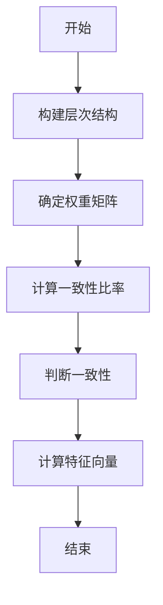
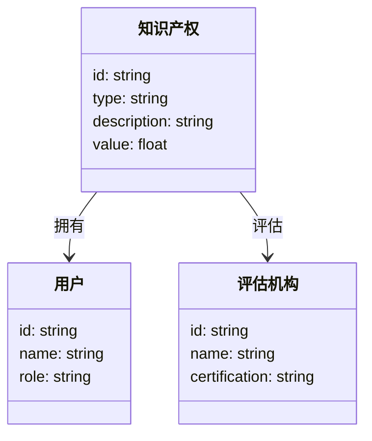
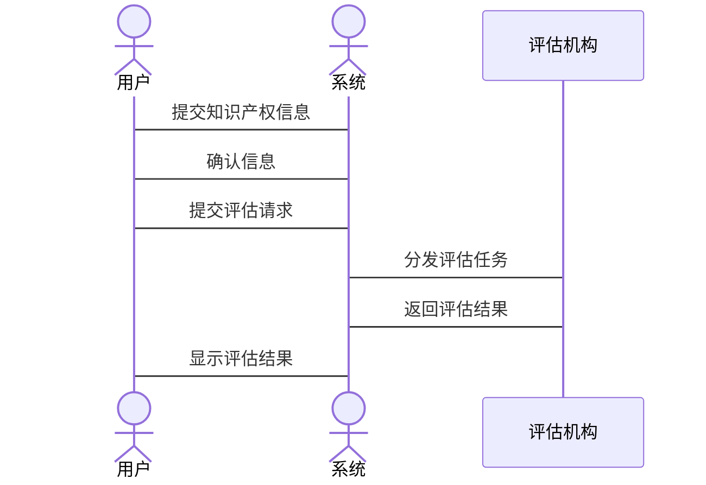

                 


# 如何评估企业的知识产权价值

> 关键词：知识产权评估、企业价值、专利评估、商标评估、知识产权价值、知识产权管理、企业估值

> 摘要：  
本文将深入探讨如何系统地评估企业的知识产权价值。通过分析知识产权的核心概念、评估方法、算法原理、系统设计与项目实战，本文将为企业提供一套全面的知识产权价值评估框架。从背景介绍到实际应用，从理论分析到代码实现，本文旨在帮助企业更好地理解和管理知识产权的价值。

---

# 第一部分: 企业知识产权价值评估的背景与核心概念

## 第1章: 知识产权价值评估的背景与问题描述

### 1.1 知识产权在企业中的重要性

#### 1.1.1 知识产权的基本概念与分类

- 知识产权的定义
- 知识产权的主要类型：
  - 专利权
  - 商标权
  - 著作权
  - 商业秘密

#### 1.1.2 知识产权在企业经营中的作用

- 知识产权作为企业核心资产
- 知识产权在市场竞争中的优势
- 知识产权对企业创新的保护作用

#### 1.1.3 知识产权价值评估的必要性

- 知识产权的价值发现
- 知识产权的交易与变现
- 知识产权的法律保护与风险防范

### 1.2 企业知识产权价值评估的背景

#### 1.2.1 当前企业面临的知识产权挑战

- 全球化竞争下的知识产权布局
- 技术创新对企业知识产权的依赖
- 知识产权侵权与被侵权的风险

#### 1.2.2 知识产权价值评估的市场需求

- 企业并购中的知识产权评估
- 投资决策中的知识产权价值考量
- 知识产权质押融资的需求

#### 1.2.3 全球化背景下的知识产权竞争

- 国际知识产权保护的差异
- 知识产权全球化布局的策略
- 知识产权风险的跨国转移

### 1.3 知识产权价值评估的核心问题

#### 1.3.1 什么是知识产权价值

- 知识产权的经济价值
- 知识产权的市场价值
- 知识产权的法律价值

#### 1.3.2 知识产权价值的影响因素

- 技术先进性与市场前景
- 知识产权的法律状态
- 知识产权的实施难度

#### 1.3.3 企业知识产权价值评估的目标与边界

- 评估目标：确定知识产权的经济价值
- 评估边界：知识产权的法律有效性、市场可行性
- 评估范围：专利、商标、著作权等不同类型知识产权的评估

## 第2章: 知识产权价值评估的核心概念与联系

### 2.1 知识产权核心概念的定义与属性

#### 2.1.1 知识产权的法律属性

- 知识产权的独占性
- 知识产权的地域性
- 知识产权的时间性

#### 2.1.2 知识产权的经济属性

- 知识产权的可量化性
- 知识产权的可交易性
- 知识产权的收益性

#### 2.1.3 知识产权的市场属性

- 知识产权的市场供需关系
- 知识产权的市场竞争性
- 知识产权的市场定价机制

### 2.2 知识产权类型与价值评估维度

#### 2.2.1 专利的定义与价值特征

- 专利的类型：发明、实用新型、外观设计
- 专利的评估维度：
  - 技术先进性
  - 市场应用前景
  - 法律有效性

#### 2.2.2 商标的价值评估维度

- 商标的法律保护范围
- 商标的市场知名度
- 商标的经济价值

#### 2.2.3 著作权的评估要点

- 著作权的保护范围
- 著作权的经济收益
- 著作权的市场认可度

#### 2.2.4 商业秘密的价值评估

- 商业秘密的法律保护
- 商业秘密的经济价值
- 商业秘密的风险评估

### 2.3 知识产权价值评估的关联概念

#### 2.3.1 知识产权与企业资产的关系

- 知识产权作为无形资产
- 知识产权与其他资产的关系
- 知识产权的资产化过程

#### 2.3.2 知识产权与企业竞争力的关系

- 知识产权对核心竞争力的影响
- 知识产权对市场地位的支撑
- 知识产权对企业创新的促进作用

#### 2.3.3 知识产权与企业估值的关系

- 知识产权在企业估值中的权重
- 知识产权对企业市值的影响
- 知识产权对企业融资的作用

### 2.4 知识产权价值评估的ER实体关系图

```mermaid
erDiagram
    actor 顾客 {
        key string id
        string name
        string email
    }
    actor 企业 {
        key string id
        string name
        string industry
    }
    actor 知识产权 {
        key string id
        string type
        string description
    }
    actor 评估机构 {
        key string id
        string name
        string certification
    }
    顾客 --> 知识产权 : 拥有
    企业 --> 知识产权 : 拥有
    知识产权 --> 评估机构 : 评估
    评估机构 --> 顾客 : 提供评估结果
    评估机构 --> 企业 : 提供评估结果
```

---

# 第二部分: 知识产权价值评估的方法与算法

## 第3章: 知识产权价值评估的方法

### 3.1 定性评估方法

#### 3.1.1 知识产权的法律评估

- 知识产权的法律有效性
- 知识产权的权属清晰度
- 知识产权的法律风险

#### 3.1.2 知识产权的市场评估

- 知识产权的市场认可度
- 知识产权的市场需求量
- 知识产权的市场竞争情况

#### 3.1.3 知识产权的技术评估

- 知识产权的技术先进性
- 知识产权的技术成熟度
- 知识产权的技术适用性

### 3.2 定量评估方法

#### 3.2.1 市场法

- 知识产权的市场交易价格
- 知识产权的市场可比性
- 知识产权的市场价值评估模型

#### 3.2.2 收益法

- 知识产权的预期收益
- 知识产权的收益分配
- 知识产权的折现率计算

#### 3.2.3 成本法

- 知识产权的开发成本
- 知识产权的维护成本
- 知识产权的重置成本

### 3.3 综合评估方法

#### 3.3.1 德尔菲法

- 德尔菲法的定义
- 德尔菲法的实施步骤
- 德尔菲法的应用场景

#### 3.3.2 层次分析法

- 层次分析法的基本原理
- 层次分析法的实施步骤
- 层次分析法的应用优势

#### 3.3.3 指数法

- 指数法的定义
- 指数法的计算方法
- 指数法的适用场景

## 第4章: 知识产权价值评估的算法原理

### 4.1 层次分析法的数学模型

- 层次分析法的基本步骤
- 层次分析法的数学公式
- 层次分析法的权重计算

### 4.2 层次分析法的实现代码

```python
def ahp(weight_matrix, alternatives):
    n = len(weight_matrix)
    # 计算一致性检查
    consistency = (n - 1) * sum(weight_matrix[i][i] for i in range(n))
    # 计算特征向量
    eigenvector = [sum(weight_matrix[i] / weight_matrix[i][i] for i in range(n)) for _ in range(n)]
    # 计算一致性比率
    cr = (max(eigenvector) - min(eigenvector)) / sum(eigenvector)
    return cr

# 示例：权重矩阵
weight_matrix = [
    [1, 2, 3],
    [2, 1, 1],
    [1, 3, 1]
]
cr = ahp(weight_matrix, ['A', 'B', 'C'])
print(f"一致性比率：{cr}")
```

### 4.3 层次分析法的流程图



---

# 第三部分: 知识产权价值评估的系统设计与实现

## 第5章: 知识产权价值评估系统的设计

### 5.1 问题场景介绍

- 知识产权评估的需求背景
- 系统设计的目标
- 系统设计的范围

### 5.2 系统功能设计

#### 5.2.1 领域模型设计



#### 5.2.2 系统架构设计


### 5.3 系统接口设计

#### 5.3.1 系统输入接口

- 用户输入接口
- 数据接口
- API 接口

#### 5.3.2 系统输出接口

- 评估结果输出
- 报告输出
- 图表输出

### 5.4 系统交互设计

#### 5.4.1 用户与系统的交互流程



---

## 第6章: 项目实战——知识产权价值评估案例分析

### 6.1 环境配置与数据准备

- 环境安装
- 数据收集
- 数据清洗

### 6.2 系统核心实现

#### 6.2.1 算法实现

```python
def calculate_value(patents, trademarks, copyrights):
    value = 0
    for patent in patents:
        value += patent.value * 0.7
    for trademark in trademarks:
        value += trademark.value * 0.2
    for copyright in copyrights:
        value += copyright.value * 0.1
    return value

# 示例
patents = [{'value': 100}, {'value': 200}]
trademarks = [{'value': 50}]
copyrights = [{'value': 30}]
total_value = calculate_value(patents, trademarks, copyrights)
print(f"总价值：{total_value}")
```

#### 6.2.2 系统实现

- 系统功能实现
- 系统测试
- 系统优化

### 6.3 案例分析与结果解读

#### 6.3.1 案例背景

- 某科技企业的专利组合评估
- 知识产权的法律状态
- 知识产权的市场前景

#### 6.3.2 数据分析

- 专利的经济价值评估
- 商标的市场价值评估
- 著作权的收益评估

#### 6.3.3 结果解读

- 知识产权的总价值
- 知识产权的结构分布
- 知识产权的优化建议

---

# 第四部分: 知识产权价值评估的最佳实践与总结

## 第7章: 最佳实践与注意事项

### 7.1 知识产权价值评估的注意事项

- 数据的准确性和完整性
- 评估方法的适用性
- 评估结果的合理性和可解释性

### 7.2 知识产权管理的最佳实践

- 知识产权的分类管理
- 知识产权的动态评估
- 知识产权的保护与运用结合

### 7.3 知识产权价值评估的未来发展

- 知识产权评估的数字化趋势
- 人工智能在知识产权评估中的应用
- 全球化背景下的知识产权评估创新

## 第8章: 小结与总结

### 8.1 本文的核心内容总结

- 知识产权价值评估的背景与重要性
- 知识产权价值评估的方法与算法
- 知识产权价值评估的系统设计与实现
- 知识产权价值评估的案例分析

### 8.2 未来研究方向

- 知识产权评估的智能化发展
- 知识产权评估的国际化研究
- 知识产权评估的行业应用拓展

---

# 作者：AI天才研究院/AI Genius Institute & 禅与计算机程序设计艺术/Zen And The Art of Computer Programming

