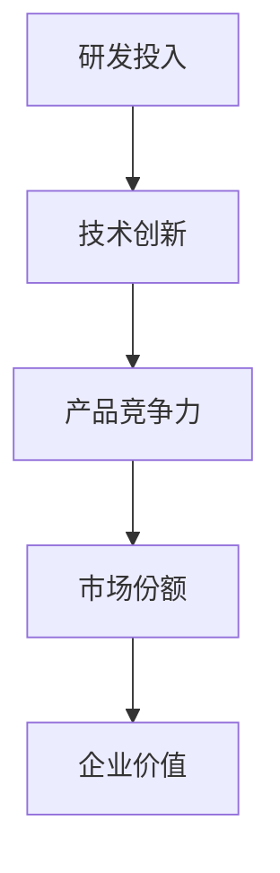
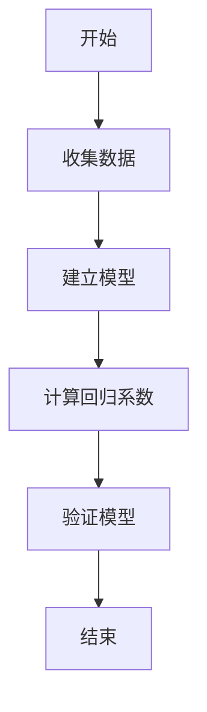

                 


# 如何评估企业的研发投入价值

> 关键词：企业研发投入价值、研发投入评估模型、技术创新、企业价值、研发投入周期、投资回报率

> 摘要：本文将系统地探讨如何评估企业的研发投入价值。通过分析研发投入与企业价值的关系，构建数学模型，设计系统架构，并通过实战案例，提供一套科学的评估方法。文章从背景、核心概念、算法原理、系统设计、项目实战到最佳实践，全面解析企业研发投入价值评估的关键点。

---

## 第1章：企业研发投入价值评估的背景与问题背景

### 1.1 企业研发投入的重要性

#### 1.1.1 研发投入的定义与范围

研发投入（R&D expenditure）是企业在研究与开发活动中的资金投入，主要用于新产品开发、技术改进和创新。研发投入的范围包括：

- **基础研究**：探索未知领域的研究，如新材料、新工艺。
- **应用研究**：针对具体问题的解决方案研究，如优化生产流程。
- **产品开发**：从原型设计到量产的全过程投入。

#### 1.1.2 研发投入在企业战略中的地位

研发投入是企业长期发展的核心驱动力，直接影响企业的技术竞争力和市场地位。它是企业技术创新的源泉，决定了企业的未来发展方向。

#### 1.1.3 研发投入对企业长期价值的影响

长期来看，合理的研发投入能够提升企业的核心竞争力，增强市场抗风险能力，并为企业带来持续的利润增长。

### 1.2 研发投入价值评估的必要性

#### 1.2.1 企业为什么要评估研发投入价值

- 优化资源配置：通过评估，企业可以识别哪些研发项目真正创造了价值。
- 战略决策支持：为投资决策提供数据支持，确保研发投入的回报最大化。
- 提高透明度：向投资者展示企业的研发效率和价值创造能力。

#### 1.2.2 研发投入对企业财务表现的影响

研发投入通常计入企业的费用，短期内可能影响企业利润，但长期来看，高质量的研发投入能够提升企业的收入和利润率。

#### 1.2.3 研发投入与企业创新能力和竞争力的关系

研发投入是创新能力的直接体现。通过评估研发投入价值，企业可以衡量其技术创新能力，从而在市场竞争中占据优势。

---

## 第2章：企业研发投入价值评估的核心概念与联系

### 2.1 核心概念原理

#### 2.1.1 研发投入的分类与属性特征对比

| 分类维度       | 特征描述                       |
|----------------|--------------------------------|
| 时间维度       | 短期投入、中期投入、长期投入 |
| 预算维度       | 低预算、中预算、高预算         |
| 技术维度       | 基础研究、应用研究、产品开发 |

#### 2.1.2 研发投入与企业价值的关系

研发投入与企业价值之间存在正相关关系。通过构建数学模型，可以量化这种关系，帮助企业更好地进行价值评估。

#### 2.1.3 研发投入的周期性与回报周期分析

研发投入的回报通常具有滞后性，需要考虑时间因素对回报周期的影响。

### 2.2 研发投入与企业价值的ER实体关系图

```mermaid
er
  entity 研发投入 {
    key 研发项目编号
    研发投入金额
    投入时间
    研发团队规模
  }
  entity 企业价值 {
    key 企业价值编号
    营业收入
    净利润
    市场价值
  }
  研发投入 -> 企业价值 : 影响
```

### 2.3 研发投入与企业价值的关系流程图



---

## 第3章：企业研发投入价值评估的数学模型与算法原理

### 3.1 研发投入与企业价值的数学模型

#### 3.1.1 线性回归模型

$$ \text{企业价值} = \beta_0 + \beta_1 \times \text{研发投入} + \epsilon $$

其中，$\beta_0$ 是截距，$\beta_1$ 是研发投入的回归系数，$\epsilon$ 是误差项。

#### 3.1.2 投资回报率模型

$$ ROI = \frac{\text{净收益}}{\text{研发投入}} $$

### 3.2 算法原理与流程图



---

## 第4章：企业研发投入价值评估的系统分析与架构设计

### 4.1 系统功能设计

#### 4.1.1 数据采集模块

- 负责收集企业的研发投入数据和相关财务数据。

#### 4.1.2 数据分析模块

- 对收集到的数据进行清洗、预处理和建模分析。

#### 4.1.3 价值评估模块

- 根据分析结果，生成研发投入的价值评估报告。

### 4.2 系统架构设计


---

## 第5章：企业研发投入价值评估的项目实战

### 5.1 环境安装与数据准备

#### 5.1.1 安装Python与相关库

```bash
pip install numpy pandas scikit-learn
```

#### 5.1.2 数据清洗与预处理

```python
import pandas as pd

# 加载数据
data = pd.read_csv('研发投入.csv')

# 数据清洗
data.dropna(inplace=True)
```

### 5.2 核心代码实现

#### 5.2.1 线性回归模型实现

```python
from sklearn.linear_model import LinearRegression

# 建立模型
model = LinearRegression()

# 训练模型
model.fit(data[['研发投入']], data['企业价值'])
```

#### 5.2.2 模型评估

```python
import sklearn.metrics as metrics

# 预测值
y_pred = model.predict(data[['研发投入']])

# 计算R平方值
print('R平方值:', metrics.r2_score(data['企业价值'], y_pred))
```

### 5.3 案例分析与解读

以某科技公司为例，假设其研发投入为1000万元，通过模型预测，其企业价值可能增加2000万元。

### 5.4 项目小结

通过实战案例，验证了模型的有效性，证明了科学评估研发投入价值的重要性。

---

## 第6章：企业研发投入价值评估的最佳实践

### 6.1 小结

本文系统地介绍了企业研发投入价值评估的方法和流程，从理论到实践，全面解析了如何科学评估研发投入的价值。

### 6.2 注意事项

- 数据质量是评估结果的关键，需确保数据的准确性和完整性。
- 模型的选择需结合企业的实际情况，避免过度复杂化。

### 6.3 拓展阅读

- 《创新者的窘境》——创新对企业价值的影响。
- 《企业研发管理》——研发项目管理的策略与方法。

---

## 作者

作者：AI天才研究院/AI Genius Institute & 禅与计算机程序设计艺术 /Zen And The Art of Computer Programming

