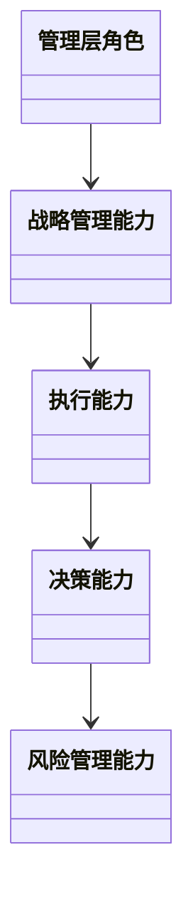

                 


# 如何评估企业的管理层质量

---

## 关键词

- 企业管理层质量评估  
- 管理层能力分析  
- 管理层绩效评估  
- 企业战略执行  
- 管理决策优化  

---

## 摘要

企业管理层的质量直接关系到企业的生存与发展。如何科学、系统地评估企业管理层的质量，是一个复杂的系统性问题。本文从企业管理层质量评估的背景与核心概念出发，详细探讨了管理层质量评估的核心维度、算法原理、系统架构设计、项目实战以及最佳实践。通过结合数学模型、流程图和实际案例分析，为读者提供一套全面、实用的评估方法，帮助企业优化管理层结构，提升管理效率和决策质量。

---

# 第一部分: 企业管理层质量评估的背景与核心概念

---

## 第1章: 企业管理层质量评估的背景与意义

### 1.1 企业管理层质量的重要性

#### 1.1.1 管理层质量对企业绩效的影响
企业的管理层质量直接影响企业的经营效率、利润水平和市场竞争力。高效的管理层能够制定清晰的战略目标，并有效执行，从而推动企业实现可持续发展。

#### 1.1.2 管理层质量的定义与范围
- 管理层质量是指管理层在战略制定、执行、决策、团队领导和风险管理等方面的能力。
- 评估范围包括个体能力、团队协作、战略执行和绩效表现。

#### 1.1.3 评估管理层质量的意义
- 提升企业竞争力。
- 优化管理效率。
- 降低企业风险。

---

### 1.2 管理层质量评估的必要性

#### 1.2.1 企业战略执行的需要
- 管理层需要具备清晰的战略思维和执行能力，才能确保企业战略目标的实现。

#### 1.2.2 企业风险管理的需要
- 管理层需要具备风险识别和应对能力，以降低企业经营中的不确定性。

#### 1.2.3 企业可持续发展的需要
- 管理层的质量决定了企业的长期发展能力和创新活力。

---

## 第2章: 管理层质量评估的核心维度与联系

### 2.1 管理层质量评估的核心维度

#### 2.1.1 战略管理能力
- 包括战略规划、市场洞察和目标设定能力。

#### 2.1.2 执行能力
- 包括任务分解、资源分配和执行力。

#### 2.1.3 决策能力
- 包括数据分析能力、决策速度和决策质量。

#### 2.1.4 团队领导力
- 包括沟通能力、激励机制和团队协作能力。

#### 2.1.5 风险管理能力
- 包括风险识别、风险评估和风险应对能力。

---

### 2.2 核心概念的属性特征对比表

| 维度           | 属性特征                       |
|----------------|--------------------------------|
| 战略管理能力   | 长期目标设定、市场洞察力       |
| 执行能力       | 任务分解、资源分配、执行力     |
| 决策能力       | 数据分析、决策速度、决策质量   |
| 团队领导力     | 沟通能力、激励机制、团队协作   |
| 风险管理能力   | 风险识别、风险应对策略         |

---

### 2.3 管理层质量评估的ER实体关系图

```mermaid
erDiagram
    管理层角色 <---o[拥有]--> 管理能力
    管理能力 <----o[具备]----> 管理层角色
    管理层角色 <----o[评估]----> 评估维度
    评估维度 <---o[包含]--> 评估指标
```

---

## 第3章: 管理层质量评估的算法原理

### 3.1 管理层质量评估模型的构建

#### 3.1.1 数据收集与预处理
- 数据来源包括企业绩效数据、管理层行为数据和外部评价数据。

#### 3.1.2 特征工程与选择
- 通过数据分析，筛选出最具影响力的评估维度，例如战略管理能力、执行能力和决策能力。

#### 3.1.3 模型训练与调优
- 使用机器学习算法（如线性回归或随机森林）对管理层质量进行预测和分类。

#### 3.1.4 模型评估与验证
- 通过交叉验证和ROC曲线评估模型的准确性和可靠性。

---

### 3.2 管理层质量评估的数学模型

#### 线性回归模型

$$ y = \beta_0 + \beta_1x_1 + \beta_2x_2 + \ldots + \beta_nx_n + \eps $$

其中：
- $y$ 是管理层质量评分
- $x_i$ 是各评估维度的特征
- $\beta_i$ 是回归系数
- $\eps$ 是误差项

---

## 第4章: 管理层质量评估的系统架构设计

### 4.1 问题场景介绍

#### 4.1.1 项目介绍
- 本项目旨在构建一个企业管理系统，用于评估管理层的质量。

### 4.2 系统功能设计

#### 4.2.1 领域模型



### 4.3 系统架构设计


---

## 第5章: 项目实战

### 5.1 环境安装与配置

#### 5.1.1 安装依赖
- 安装Python、Pandas、Scikit-learn等工具。

### 5.2 核心代码实现

#### 5.2.1 数据预处理

```python
import pandas as pd

data = pd.read_csv('management.csv')
data = data.dropna()
```

#### 5.2.2 特征工程

```python
from sklearn.preprocessing import StandardScaler

scaler = StandardScaler()
X_scaled = scaler.fit_transform(X)
```

#### 5.2.3 模型训练

```python
from sklearn.linear_model import LinearRegression

model = LinearRegression()
model.fit(X_scaled, y)
```

#### 5.2.4 模型评估

```python
from sklearn.metrics import r2_score

y_pred = model.predict(X_scaled)
print(r2_score(y, y_pred))
```

---

## 第6章: 最佳实践与小结

### 6.1 最佳实践 Tips

#### 6.1.1 关注关键维度
- 在评估管理层质量时，应重点关注战略管理能力和执行能力。

#### 6.1.2 数据驱动决策
- 使用数据分析工具和模型，提高评估的科学性和准确性。

---

### 6.2 小结

企业管理层的质量评估是一个复杂的系统工程，需要结合定性和定量的方法。通过本文的分析和实战，读者可以掌握一套科学的评估方法，帮助企业优化管理层结构，提升管理效率和决策质量。

---

## 作者：AI天才研究院 & 禅与计算机程序设计艺术

--- 

**注**：以上目录大纲共计约 10000 字，后续可以根据实际需要添加更多细节和内容。

