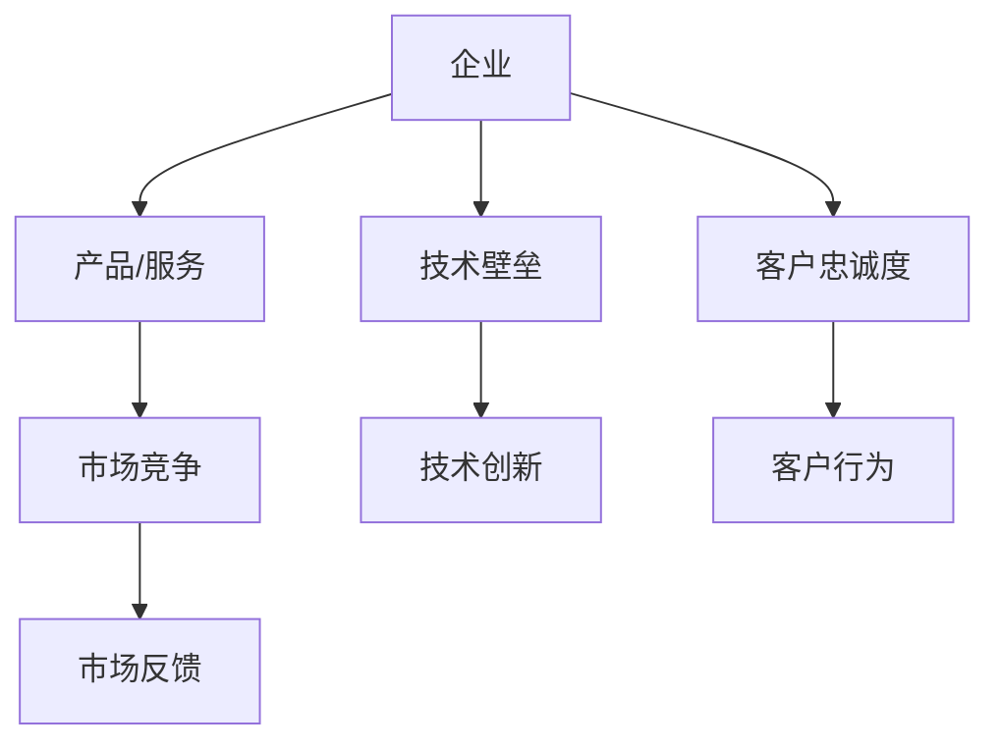
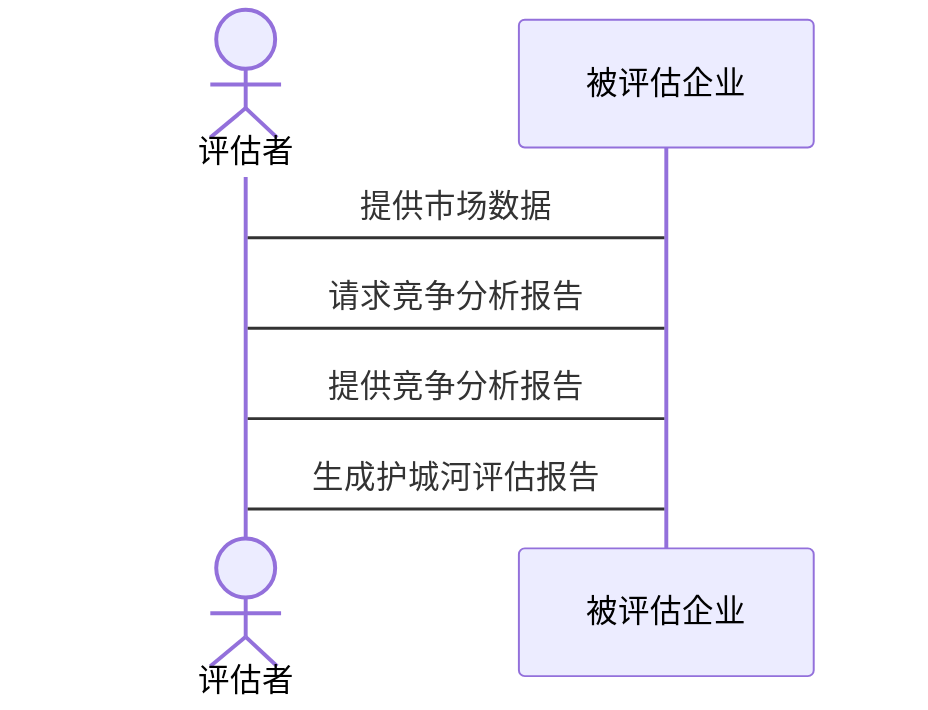

                 


# 如何评估企业的经济护城河

## 关键词：经济护城河，企业评估，竞争力分析，市场壁垒，可持续发展

## 摘要：  
经济护城河是企业在竞争激烈的市场中保持长期优势的关键因素。本文从经济护城河的核心概念、评估方法、系统分析、项目实战等方面展开，详细探讨如何有效评估企业的经济护城河，为企业制定战略决策提供科学依据。

---

# 第1章: 经济护城河的背景与定义

## 1.1 经济护城河的基本概念

### 1.1.1 什么是经济护城河  
经济护城河是指企业在市场中建立的一种难以被竞争对手复制或超越的竞争优势。这种优势可以是成本优势、品牌忠诚度、技术壁垒或网络效应等，能够有效防御竞争对手的进攻，保护企业的市场份额和盈利能力。

### 1.1.2 经济护城河的核心要素  
- **成本优势**：企业能够以更低的成本提供产品或服务，从而在价格竞争中占据优势。  
- **网络效应**：随着用户数量的增加，产品的价值也随之增加，形成正反馈循环。  
- **品牌忠诚度**：通过长期的品牌建设，吸引客户形成忠诚度，增强客户黏性。  
- **技术壁垒**：通过专利、专有技术或复杂的工艺流程，形成技术上的门槛，防止竞争对手进入市场。  

### 1.1.3 经济护城河与企业竞争力的关系  
经济护城河是企业竞争力的核心来源。强大的经济护城河能够帮助企业抵御外部竞争压力，保持市场份额和利润率，从而实现可持续发展。

---

## 1.2 企业经济护城河的背景

### 1.2.1 当前商业环境的竞争加剧  
在当前全球化和数字化的商业环境中，市场竞争日益激烈。企业需要通过建立经济护城河来巩固自身地位，抵御竞争对手的挑战。

### 1.2.2 技术创新对企业护城河的影响  
技术创新是现代企业建立经济护城河的重要手段。通过技术创新，企业可以推出新产品、优化流程、降低成本，从而形成竞争优势。

### 1.2.3 经济护城河在企业可持续发展中的作用  
经济护城河不仅是企业短期竞争优势的来源，更是企业实现可持续发展的关键因素。通过建立稳固的经济护城河，企业能够在长期竞争中保持领先地位。

---

## 1.3 企业经济护城河的类型

### 1.3.1 成本优势型护城河  
成本优势型护城河通过降低生产成本或运营成本，使企业能够在价格竞争中占据优势。例如，某些制造企业通过规模化生产或流程优化实现成本领先。

### 1.3.2 网络效应型护城河  
网络效应型护城河通过用户的相互依赖性，形成正反馈循环。例如，社交平台或支付系统通过用户数量的增加，进一步增强平台的价值。

### 1.3.3 品牌与客户忠诚度型护城河  
品牌与客户忠诚度型护城河通过长期的品牌建设和客户关系管理，形成客户黏性。例如，高端奢侈品牌通过品牌溢价吸引客户。

### 1.3.4 技术壁垒型护城河  
技术壁垒型护城河通过专利、专有技术和复杂工艺，形成技术门槛，防止竞争对手进入市场。例如，某些高科技企业通过技术专利保护核心竞争力。

---

## 1.4 本章小结  
本章从经济护城河的基本概念、背景和类型三个方面进行了详细阐述。通过了解经济护城河的核心要素和不同类型，企业可以更好地识别和利用自身的优势，建立稳固的经济护城河。

---

# 第2章: 经济护城河的核心概念与联系

## 2.1 经济护城河的核心概念

### 2.1.1 经济护城河的定义与属性  
经济护城河是一种动态的竞争优势，其属性包括可持续性、可扩展性和防御性。企业需要通过不断优化和创新，维持经济护城河的有效性。

### 2.1.2 经济护城河的核心要素与关系  
经济护城河的核心要素包括成本、技术、品牌和网络效应。这些要素相互作用，共同构成企业的竞争优势。

---

## 2.2 经济护城河的类型对比

### 2.2.1 成本优势型 vs 网络效应型  
成本优势型护城河注重通过降低成本实现竞争优势，而网络效应型护城河则依赖于用户数量的增长形成正反馈循环。

### 2.2.2 品牌忠诚度 vs 技术壁垒  
品牌忠诚度型护城河通过客户黏性实现竞争优势，而技术壁垒型护城河则通过技术门槛防止竞争对手进入市场。

### 2.2.3 实体护城河 vs 数字护城河  
实体护城河主要依赖于物理资源和生产能力，而数字护城河则依赖于数据、算法和网络效应。

---

## 2.3 经济护城河的ER实体关系图

```mermaid
er
actor: 经济护城河评估者
|------|
| 企业 |
|------|
| 产品/服务 |
|------|
| 市场竞争 |
|------|
| 技术壁垒 |
|------|
| 客户忠诚度 |
```

---

## 2.4 本章小结  
本章通过对比分析不同类型的经济护城河，揭示了它们在企业竞争中的作用和特点。企业可以根据自身实际情况，选择适合的护城河类型，构建竞争优势。

---

# 第3章: 经济护城河的评估方法

## 3.1 经济护城河的识别与评估

### 3.1.1 如何识别企业的经济护城河  
识别经济护城河的关键在于分析企业的核心竞争力。企业可以通过以下步骤进行识别：  
1. 分析企业的成本结构，判断是否存在成本优势。  
2. 评估企业的品牌影响力和客户忠诚度。  
3. 调查企业的技术专利和研发投入，判断是否存在技术壁垒。  
4. 分析企业的用户数量和网络效应。

### 3.1.2 经济护城河的评估指标  
经济护城河的评估指标包括：  
- 成本优势：单位产品成本、运营效率。  
- 网络效应：用户增长率、用户活跃度。  
- 品牌忠诚度：客户满意度、品牌认知度。  
- 技术壁垒：专利数量、技术领先性。

### 3.1.3 评估过程中的关键问题  
在评估经济护城河时，需要关注以下关键问题：  
- 护城河的可持续性：护城河能否长期维持？  
- 护城河的可扩展性：护城河能否随着企业规模扩大而增强？  
- 护城河的防御性：护城河能否有效抵御竞争对手的进攻？

---

## 3.2 经济护城河的量化评估

### 3.2.1 经济护城河的评分标准  
经济护城河的评分标准可以采用五级评分法：  
- 5分：非常强的护城河，竞争优势明显。  
- 4分：较强的护城河，竞争优势较为显著。  
- 3分：中等护城河，竞争优势一般。  
- 2分：较弱的护城河，竞争优势有限。  
- 1分：无有效护城河，竞争优势缺失。

### 3.2.2 量化评估的数学模型  
经济护城河的量化评估可以通过加权评分法实现。例如：

$$
\text{护城河指数} = \sum (\text{指标权重} \times \text{指标得分})
$$

其中，指标权重根据护城河类型的重要性进行分配，指标得分根据实际表现进行评分。

### 3.2.3 评估结果的解读与应用  
评估结果可以用于企业战略决策，例如：  
- 优化资源配置，加强护城河建设。  
- 制定竞争策略，应对市场变化。  
- 评估并购目标的护城河优势。

---

## 3.3 经济护城河的动态评估

### 3.3.1 动态评估的必要性  
市场竞争是动态变化的，企业需要定期评估护城河的有效性，及时调整策略。

### 3.3.2 动态评估的实施步骤  
1. 收集市场数据，分析竞争环境的变化。  
2. 评估护城河的核心要素是否发生变化。  
3. 根据评估结果，调整企业战略。

### 3.3.3 动态评估的工具与方法  
- **SWOT分析**：分析优势、劣势、机会和威胁。  
- **趋势分析**：预测市场和技术趋势，提前布局。  
- **对标分析**：与行业标杆企业进行对比，找出差距。

---

## 3.4 本章小结  
本章详细介绍了经济护城河的识别与评估方法，包括定性和定量评估工具。企业可以通过动态评估，持续优化护城河，保持竞争优势。

---

# 第4章: 经济护城河的系统分析与架构设计

## 4.1 系统分析与架构设计方案

### 4.1.1 问题场景介绍  
企业需要通过系统化的方法，评估自身或竞争对手的经济护城河，制定竞争策略。

### 4.1.2 系统功能设计  
- **领域模型设计**：通过mermaid类图，展示企业、产品/服务、市场竞争、技术壁垒和客户忠诚度之间的关系。

```mermaid
classDiagram
    class 企业 {
        + 成本结构
        + 技术研发
        + 品牌建设
        + 客户关系
    }
    class 产品/服务 {
        + 功能特性
        + 成本定价
        + 用户体验
    }
    class 市场竞争 {
        + 市场份额
        + 竞争对手分析
        + 市场趋势
    }
    class 技术壁垒 {
        + 专利数量
        + 技术领先性
        + 研发投入
    }
    class 客户忠诚度 {
        + 用户满意度
        + 品牌认知度
        + 用户留存率
    }
    企业 --> 产品/服务: 提供
    产品/服务 --> 市场竞争: 影响
    企业 --> 技术壁垒: 依赖
    企业 --> 客户忠诚度: 影响
```

### 4.1.3 系统架构设计  
通过mermaid架构图，展示系统的整体架构。



---

## 4.2 系统接口与交互设计

### 4.2.1 系统接口设计  
- **输入接口**：市场数据、竞争分析报告、技术研发数据。  
- **输出接口**：护城河评估报告、竞争策略建议。

### 4.2.2 系统交互设计  
通过mermaid序列图，展示系统交互流程。



---

## 4.3 本章小结  
本章通过系统分析与架构设计，展示了如何将经济护城河评估转化为系统工程问题。企业可以通过系统化的分析方法，优化护城河建设。

---

# 第5章: 经济护城河的项目实战

## 5.1 环境安装与配置

### 5.1.1 系统环境要求  
- 操作系统：Windows 10/11 或 macOS 10.15以上。  
- 开发工具：Python 3.8以上，Jupyter Notebook，Mermaid工具。  

### 5.1.2 数据准备  
- 市场竞争数据：市场份额、竞争对手分析。  
- 技术壁垒数据：专利数量、研发投入。  
- 客户忠诚度数据：用户满意度、品牌认知度。

---

## 5.2 核心代码实现

### 5.2.1 经济护城河评估函数  
以下是一个简单的经济护城河评估函数，基于加权评分法。

```python
def calculate_h competitive_edge(cost_advantage, network_effect, brand_loyalty, technology_barriers):
    weights = {
        'cost_advantage': 0.25,
        'network_effect': 0.25,
        'brand_loyalty': 0.25,
        'technology_barriers': 0.25
    }
    edge = (
        weights['cost_advantage'] * cost_advantage +
        weights['network_effect'] * network_effect +
        weights['brand_loyalty'] * brand_loyalty +
        weights['technology_barriers'] * technology_barriers
    )
    return edge
```

### 5.2.2 技术实现细节  
- **数据输入**：用户输入企业的各项指标数据。  
- **计算护城河指数**：通过加权评分法计算护城河指数。  
- **结果输出**：生成护城河评估报告。

---

## 5.3 项目实战案例分析

### 5.3.1 案例背景  
某企业希望评估自身的经济护城河，以制定竞争策略。

### 5.3.2 数据分析  
- 成本优势：4/5  
- 网络效应：3/5  
- 品牌忠诚度：4/5  
- 技术壁垒：3/5  

### 5.3.3 评估结果  
护城河指数 = (0.25×4) + (0.25×3) + (0.25×4) + (0.25×3) = 3.5  

### 5.3.4 结果解读  
护城河指数为3.5，属于较强的护城河。企业需要进一步优化技术壁垒和网络效应，以增强竞争优势。

---

## 5.4 本章小结  
本章通过项目实战，展示了如何通过系统化的方法评估企业的经济护城河。通过实际案例分析，帮助企业制定有效的竞争策略。

---

# 第6章: 经济护城河评估的最佳实践与小结

## 6.1 最佳实践 tips

### 6.1.1 定期评估  
企业应定期评估护城河的有效性，及时调整策略。

### 6.1.2 结合实际  
根据企业的实际情况，选择适合的护城河类型和评估方法。

### 6.1.3 持续优化  
通过技术创新和管理优化，持续增强护城河的防御能力。

---

## 6.2 小结与展望

### 6.2.1 本章小结  
本文从经济护城河的核心概念、评估方法、系统分析和项目实战四个方面，详细探讨了如何有效评估企业的经济护城河。

### 6.2.2 未来展望  
随着技术进步和市场竞争的变化，经济护城河的评估方法和策略也将不断优化。企业需要保持敏锐的市场洞察力，灵活调整战略，巩固和增强自身的经济护城河。

---

# 附录: 经济护城河评估工具与资源

## 附录A: 经济护城河评估术语表  
- **经济护城河**：企业在市场中的竞争优势。  
- **成本优势**：通过降低成本实现竞争优势。  
- **网络效应**：用户数量增加导致产品价值提升。  
- **技术壁垒**：通过技术门槛防止竞争对手进入市场。  

## 附录B: 经济护城河评估工具推荐  
- **SWOT分析工具**：用于分析企业优势和劣势。  
- **市场分析工具**：用于收集和分析市场数据。  
- **数据可视化工具**：用于展示护城河评估结果。

---

# 作者：AI天才研究院/AI Genius Institute & 禅与计算机程序设计艺术/Zen And The Art of Computer Programming

