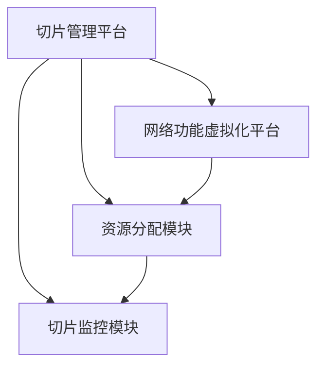

                 


# 如何评估企业的网络切片技术应用

## 关键词：
网络切片技术、5G网络、资源分配、应用场景、系统架构、算法原理、项目实战

## 摘要：
网络切片技术作为5G网络中的关键技术，通过将网络资源按需分配给不同的用户或应用，能够满足企业多样化的网络需求。本文从网络切片技术的核心概念、算法原理、系统架构设计、项目实战等方面，详细讲解如何评估企业中网络切片技术的应用。文章内容涵盖网络切片技术的背景介绍、核心概念、资源分配算法、系统架构设计、项目实战以及未来发展趋势，为读者提供全面的技术评估方法。

---

## 第一部分：网络切片技术背景与概述

### 第1章：网络切片技术的定义与背景

#### 1.1 网络切片技术的定义
- **网络切片技术**是一种将物理网络分割成多个虚拟网络的技术，每个虚拟网络（即切片）可以独立配置和管理，以满足不同应用场景的需求。
- 切片可以按需分配网络资源（如带宽、时延、可靠性等），为企业提供定制化的网络服务。

#### 1.2 网络切片技术的技术优势
- **灵活资源分配**：根据不同的应用场景，动态调整网络资源分配，提高网络资源利用率。
- **多应用场景支持**：在同一物理网络上，可以同时支持多个不同的应用场景（如工业互联网、智慧城市等）。
- **可定制化网络性能**：企业可以根据自身需求，定制网络性能参数（如时延、带宽等）。

#### 1.3 网络切片技术的应用场景
- **工业互联网**：工业设备需要低时延和高可靠性的网络连接，网络切片技术可以为工业设备提供定制化的网络服务。
- **智慧城市**：在智慧城市中，网络切片技术可以为智能交通、智能安防等系统提供高效的网络资源。
- **5G网络**：5G网络中，网络切片技术可以为不同用户提供差异化服务，例如为视频流提供更高的带宽，为物联网设备提供更低的时延。

#### 1.4 网络切片技术的挑战与解决方案
- **技术实现难点**：网络切片的实现需要复杂的网络管理和资源分配算法，技术实现较为复杂。
- **管理复杂性**：网络切片的管理需要协调多个切片之间的资源分配，管理复杂性较高。
- **安全性问题**：不同切片之间的资源隔离和安全性保障是网络切片技术实施中的重要挑战。

#### 1.5 网络切片技术的发展现状与未来趋势
- **当前发展现状**：网络切片技术已经在5G网络中得到了广泛应用，但仍然存在一些技术瓶颈，例如资源分配的动态优化和切片管理的效率问题。
- **未来发展趋势**：随着人工智能和大数据技术的发展，网络切片技术将更加智能化，能够实现自动化的资源分配和动态优化。

---

## 第二部分：网络切片技术的核心概念与原理

### 第2章：网络切片技术的核心概念

#### 2.1 网络切片技术的核心要素
- **网络功能虚拟化（NFV）**：通过虚拟化技术将网络功能（如路由器、防火墙等）部署在通用硬件上，实现网络功能的灵活部署和扩展。
- **网络切片管理平台**：负责切片的创建、配置、监控和管理，是网络切片技术的核心管理模块。
- **切片资源分配机制**：根据用户的网络需求，动态分配网络资源（如带宽、时延等），确保每个切片的网络性能满足用户需求。

#### 2.2 网络切片技术的实体关系分析
- **切片管理平台与网络功能的关系**：切片管理平台通过与网络功能虚拟化平台的交互，实现切片的创建和资源分配。
- **切片用户与切片资源的关系**：每个切片用户对应一组网络资源，资源分配根据用户的网络需求进行动态调整。
- **切片监控与资源分配的关系**：切片监控模块实时监控切片的网络性能，并根据监控结果动态调整资源分配策略。

#### 2.3 网络切片技术的原理分析
- **网络切片的创建过程**：
  1. 用户提交网络需求，包括所需的网络性能参数（如带宽、时延等）。
  2. 切片管理平台根据用户需求，创建对应的网络切片。
  3. 网络功能虚拟化平台根据切片管理平台的指令，分配相应的网络资源。
- **切片资源的分配机制**：根据用户的网络需求和网络资源的可用性，动态分配网络资源，确保每个切片的网络性能满足用户需求。
- **切片的动态调整与优化**：根据网络环境的变化和用户需求的动态调整，实时优化切片的资源分配策略，确保网络性能最优。

---

## 第三部分：网络切片技术的算法原理

### 第3章：网络切片技术的资源分配算法

#### 3.1 资源分配算法的核心思想
- 资源分配算法的目标是根据用户的网络需求和网络资源的可用性，动态分配网络资源，实现网络性能的最优。
- 算法需要考虑的因素包括：用户的网络需求、网络资源的可用性、其他切片的资源占用情况等。

#### 3.2 资源分配算法的数学模型
- 假设用户的需求为：带宽需求 $b_i$，时延需求 $d_i$，可靠性需求 $r_i$。
- 网络资源的可用性为：总带宽 $B$，总时延 $D$，总可靠性 $R$。
- 资源分配的目标是最大化网络性能，同时满足所有用户的网络需求。

$$ \text{目标函数：} \max \sum_{i=1}^{n} (b_i + d_i + r_i) $$
$$ \text{约束条件：} \sum_{i=1}^{n} b_i \leq B $$
$$ \sum_{i=1}^{n} d_i \leq D $$
$$ \sum_{i=1}^{n} r_i \leq R $$

#### 3.3 资源分配算法的实现步骤
1. 用户提交网络需求，包括带宽需求、时延需求、可靠性需求等。
2. 网络切片管理平台根据用户的网络需求，计算所需的网络资源。
3. 网络功能虚拟化平台根据计算结果，分配相应的网络资源。
4. 切片监控模块实时监控切片的网络性能，根据监控结果动态调整资源分配策略。

#### 3.4 资源分配算法的优化方法
- **多目标优化**：在资源分配过程中，需要同时优化多个目标（如带宽、时延、可靠性等），可以通过加权平均的方法进行优化。
- **动态调整**：根据网络环境的变化和用户需求的动态调整，实时优化资源分配策略。
- **负载均衡**：通过负载均衡技术，确保网络资源的充分利用，避免资源浪费。

---

## 第四部分：网络切片技术的系统架构设计

### 第4章：网络切片技术的系统架构设计

#### 4.1 系统架构设计概述
- 网络切片系统的整体架构包括：切片管理平台、网络功能虚拟化平台、切片监控模块、资源分配模块等。

#### 4.2 系统功能设计
- **切片管理平台**：负责切片的创建、配置、监控和管理。
- **网络功能虚拟化平台**：通过虚拟化技术，实现网络功能的灵活部署和扩展。
- **资源分配模块**：根据用户的网络需求，动态分配网络资源。
- **切片监控模块**：实时监控切片的网络性能，动态调整资源分配策略。

#### 4.3 系统架构图（Mermaid图）


#### 4.4 系统交互流程
1. 用户提交网络需求，包括带宽、时延、可靠性等。
2. 切片管理平台根据用户的网络需求，创建对应的网络切片。
3. 网络功能虚拟化平台根据切片管理平台的指令，分配相应的网络资源。
4. 切片监控模块实时监控切片的网络性能，根据监控结果动态调整资源分配策略。

---

## 第五部分：网络切片技术的项目实战

### 第5章：网络切片技术的项目实战

#### 5.1 项目背景与目标
- 项目目标：为企业提供定制化的网络服务，提升企业的网络性能和资源利用率。

#### 5.2 项目实施步骤
1. **环境搭建**：搭建网络切片管理平台、网络功能虚拟化平台、资源分配模块和切片监控模块。
2. **核心代码实现**：实现资源分配算法、切片创建和管理功能。
3. **系统测试**：测试网络切片的性能，确保网络资源的动态分配和优化。
4. **案例分析**：通过具体案例，分析网络切片技术在企业中的应用效果。

#### 5.3 核心代码实现
```python
class SliceManager:
    def __init__(self):
        self.slices = []
    
    def create_slice(self, user_demand):
        # 根据用户需求创建切片
        pass
    
    def allocate_resources(self, slice_id):
        # 根据切片ID分配资源
        pass

class ResourceAllocator:
    def __init__(self, total_bandwidth, total_delay, total_reliability):
        self.total_bandwidth = total_bandwidth
        self.total_delay = total_delay
        self.total_reliability = total_reliability
        self.used_bandwidth = 0
        self.used_delay = 0
        self.used_reliability = 0
    
    def allocate(self, slice_demand):
        # 根据切片需求分配资源
        pass
```

#### 5.4 系统测试与优化
- **测试指标**：带宽利用率、时延性能、可靠性等。
- **测试结果**：通过测试，验证网络切片技术的应用效果，确保网络性能满足用户需求。

#### 5.5 案例分析
- **案例1**：工业互联网中的应用，通过网络切片技术实现工业设备的低时延和高可靠性网络连接。
- **案例2**：智慧城市中的应用，通过网络切片技术为智能交通系统提供高效的网络资源。

---

## 第六部分：网络切片技术的最佳实践与挑战

### 第6章：网络切片技术的最佳实践

#### 6.1 实施中的注意事项
- **资源隔离**：确保不同切片之间的资源隔离，避免资源抢占和冲突。
- **安全性保障**：加强切片之间的安全性隔离，防止网络攻击和数据泄露。
- **动态调整**：根据网络环境的变化和用户需求的动态调整，实时优化资源分配策略。

#### 6.2 未来发展趋势
- **智能化切片管理**：通过人工智能技术，实现切片管理的智能化和自动化。
- **跨领域应用**：网络切片技术将不仅仅应用于5G网络，还将在工业互联网、智慧城市等领域得到广泛应用。

#### 6.3 拓展阅读
- 推荐阅读相关技术书籍和论文，深入了解网络切片技术的最新研究成果和应用案例。

---

## 第七部分：总结与展望

### 第7章：总结与展望

#### 7.1 总结
网络切片技术作为一种灵活的网络资源分配技术，能够为企业提供定制化的网络服务，满足多样化的网络需求。本文从网络切片技术的核心概念、算法原理、系统架构设计、项目实战等方面，详细讲解了如何评估企业中网络切片技术的应用。

#### 7.2 展望
随着5G网络的不断发展和人工智能技术的进步，网络切片技术将变得更加智能化和自动化。未来，网络切片技术将在更多领域得到广泛应用，为企业创造更大的价值。

---

## 作者信息

作者：AI天才研究院/AI Genius Institute & 禅与计算机程序设计艺术 /Zen And The Art of Computer Programming

