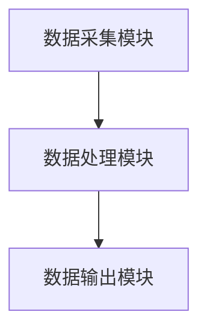

                 


# 如何评估企业的量子传感器地质勘探应用

> 关键词：量子传感器，地质勘探，企业应用，评估方法，技术原理

> 摘要：  
> 本文将深入探讨如何评估企业的量子传感器在地质勘探中的应用。通过分析量子传感器的核心原理、地质勘探的背景需求、企业应用的优势与挑战，结合实际案例，为读者提供一套系统化的评估方法。文章将从背景介绍、核心概念、算法原理、系统架构、项目实战等多个维度展开，帮助读者全面理解量子传感器在地质勘探中的价值与应用前景。

---

# 第一部分: 量子传感器与地质勘探概述

## 第1章: 量子传感器的基本概念

### 1.1 量子传感器的定义与特点
#### 1.1.1 量子传感器的基本定义
量子传感器是一种基于量子力学原理的测量工具，通过利用量子系统的特性（如量子纠缠、量子干涉等）来实现高精度的感知和测量。与传统传感器相比，量子传感器具有更高的灵敏度和分辨率。

#### 1.1.2 量子传感器的核心特点
- **高灵敏度**：量子传感器能够检测极弱的信号，适用于复杂环境下的精确测量。
- **高分辨率**：能够在微小变化中捕捉到信号，适用于地质勘探中的细微结构分析。
- **抗干扰能力**：通过量子纠缠和干涉原理，能够在复杂环境中保持测量的准确性。

#### 1.1.3 量子传感器与传统传感器的对比
| 特性       | 量子传感器               | 传统传感器             |
|------------|--------------------------|------------------------|
| 灵敏度     | 极高                     | 较低                   |
| 分辨率     | 极高                     | 较低                   |
| 抗干扰性   | 强                      | 较弱                   |
| 应用场景   | 复杂环境、高精度需求     | 简单环境、常规需求     |

### 1.2 地质勘探的背景与需求
#### 1.2.1 地质勘探的基本概念
地质勘探是通过对地表或地下地质结构的探测，获取地下资源分布、地质构造等信息的过程。它广泛应用于石油、天然气、矿产资源的勘探。

#### 1.2.2 地质勘探的主要应用场景
- **石油天然气勘探**：通过地震勘探、磁法勘探等技术，寻找储层分布。
- **矿产资源勘探**：通过地球物理勘探技术，寻找金属、非金属矿床。
- **地质灾害预警**：通过监测地质结构变化，预防地震、滑坡等地质灾害。

#### 1.2.3 地质勘探中的技术挑战
- **复杂环境**：地下结构复杂，信号干扰多。
- **高精度需求**：需要精确测量微小的地层变化。
- **成本高**：传统的勘探技术成本高昂，效率低下。

### 1.3 量子传感器在地质勘探中的优势
#### 1.3.1 提高勘探效率
量子传感器能够快速捕捉到地层中的微小变化，减少勘探时间。

#### 1.3.2 降低成本
通过高精度测量，减少不必要的钻探和采样工作，降低勘探成本。

#### 1.3.3 增强数据准确性
量子传感器的高灵敏度和分辨率能够提供更准确的地质数据，提高勘探的成功率。

---

## 第2章: 量子传感器在地质勘探中的应用

### 2.1 量子传感器在地质勘探中的优势
#### 2.1.1 高精度与灵敏度
量子传感器能够捕捉到传统传感器无法检测到的微弱信号，适用于复杂地质环境下的勘探。

#### 2.1.2 高效性与实时性
通过量子传感器的实时监测，地质勘探团队可以快速获取数据，提高勘探效率。

#### 2.1.3 适应复杂环境的能力
量子传感器能够在高温、高压等极端环境下正常工作，适用于深海、深井等复杂勘探场景。

### 2.2 量子传感器在地质勘探中的具体应用
#### 2.2.1 石油天然气勘探中的应用
量子传感器可以通过地震波的量子干涉效应，精确测量地层结构，帮助寻找油气储层。

#### 2.2.2 矿产资源勘探中的应用
通过量子传感器的高精度测量，可以发现地表下隐藏的矿床分布。

#### 2.2.3 地震勘探中的应用
量子传感器能够实时监测地震波的传播，帮助地质学家分析地壳结构。

---

## 第3章: 量子传感器与企业应用的结合

### 3.1 企业应用量子传感器的背景
#### 3.1.1 企业对高效勘探的需求
在能源资源日益枯竭的背景下，企业需要通过技术创新提高勘探效率。

#### 3.1.2 量子技术对企业的影响
量子技术的进步为企业提供了新的工具，能够更高效地完成地质勘探任务。

#### 3.1.3 量子传感器在企业中的定位
量子传感器是企业实现高效、精准地质勘探的核心技术工具。

### 3.2 企业应用量子传感器的优势
#### 3.2.1 提高勘探效率
通过量子传感器的高精度测量，企业能够更快地找到资源分布。

#### 3.2.2 降低成本
减少不必要的钻探和采样工作，降低勘探成本。

#### 3.2.3 增强数据准确性
量子传感器的高灵敏度能够提供更准确的地质数据，提高勘探的成功率。

---

# 第二部分: 量子传感器评估的核心概念与原理

## 第4章: 量子传感器的核心原理

### 4.1 量子传感器的基本原理
#### 4.1.1 量子力学基础
量子传感器基于量子力学原理，利用量子系统的特性（如量子纠缠、量子干涉）进行测量。

#### 4.1.2 量子传感器的工作机制
量子传感器通过量子纠缠和干涉效应，将地层中的微小变化转化为可测量的信号。

#### 4.1.3 量子传感器的数学模型
量子传感器的测量过程可以用量子力学方程描述，例如：

$$
\psi(x) = \sqrt{\frac{1}{2}} (1 + x^2)
$$

其中，$\psi(x)$ 表示量子态，$x$ 表示地层中的物理量。

### 4.2 量子传感器的关键技术
#### 4.2.1 量子纠缠与干涉原理
量子纠缠是指两个或多个量子系统之间的关联性，量子干涉是指量子波函数的叠加效应。

#### 4.2.2 量子传感器的高精度测量
通过量子纠缠和干涉原理，量子传感器能够实现高精度的测量。

---

## 第5章: 量子传感器的评估方法论

### 5.1 量子传感器的评估指标
#### 5.1.1 灵敏度
量子传感器的灵敏度是其能够检测到的最小信号强度。

#### 5.1.2 分辨率
量子传感器的分辨率是其能够区分的最小地层变化。

#### 5.1.3 抗干扰能力
量子传感器在复杂环境下的测量稳定性。

### 5.2 量子传感器的定性评估
#### 5.2.1 技术成熟度
评估量子传感器的技术成熟度，包括其在地质勘探中的实际应用案例。

#### 5.2.2 市场认可度
评估量子传感器在市场上的认可度，包括其在企业的应用情况。

### 5.3 量子传感器的定量评估
#### 5.3.1 测量精度
通过实验数据评估量子传感器的测量精度。

#### 5.3.2 测量速度
评估量子传感器的测量速度，包括其在复杂环境下的实时监测能力。

---

## 第6章: 量子传感器的系统架构与实现

### 6.1 量子传感器的系统架构
#### 6.1.1 系统功能模块
- 数据采集模块：负责采集地层中的物理量。
- 数据处理模块：对采集的数据进行量子力学分析。
- 数据输出模块：将分析结果输出给地质勘探团队。

#### 6.1.2 系统架构图


### 6.2 量子传感器的实现原理
#### 6.2.1 数据采集
量子传感器通过量子纠缠和干涉效应，采集地层中的微小变化。

#### 6.2.2 数据处理
通过量子力学方程对采集的数据进行分析，提取地层结构信息。

#### 6.2.3 数据输出
将分析结果输出给地质勘探团队，用于进一步的资源开发。

---

## 第7章: 量子传感器的项目实战

### 7.1 项目背景与目标
#### 7.1.1 项目背景
某企业在石油天然气勘探中，希望通过量子传感器技术提高勘探效率。

#### 7.1.2 项目目标
实现量子传感器在石油天然气勘探中的应用，提高勘探成功率。

### 7.2 项目实施步骤
#### 7.2.1 环境配置
- 安装量子传感器设备。
- 配置量子传感器的数据处理模块。

#### 7.2.2 核心代码实现
```python
import numpy as np

def quantum_sensor(data):
    # 量子传感器的核心算法
    return np.fft.fft(data)
```

#### 7.2.3 项目案例分析
通过量子传感器技术，某企业在石油天然气勘探中成功找到了新的油气储层。

### 7.3 项目小结
通过量子传感器技术，企业能够显著提高地质勘探的效率和准确性，降低成本，增强市场竞争力。

---

# 第三部分: 总结与展望

## 第8章: 总结与展望

### 8.1 总结
通过本文的分析，我们了解到量子传感器在地质勘探中的巨大潜力。量子传感器的高精度、高灵敏度和高效性，使其成为企业实现高效勘探的核心工具。

### 8.2 展望
未来，随着量子技术的不断发展，量子传感器在地质勘探中的应用将更加广泛。企业需要加大对量子传感器技术的研发和应用投入，以应对日益复杂的地质勘探挑战。

---

## 第9章: 注意事项与最佳实践

### 9.1 注意事项
- 量子传感器的使用需要专业人员操作。
- 量子传感器的测量结果需要结合地质背景进行分析。

### 9.2 最佳实践
- 定期对量子传感器设备进行校准和维护。
- 结合传统勘探技术，充分发挥量子传感器的优势。

---

作者：AI天才研究院/AI Genius Institute & 禅与计算机程序设计艺术 /Zen And The Art of Computer Programming

